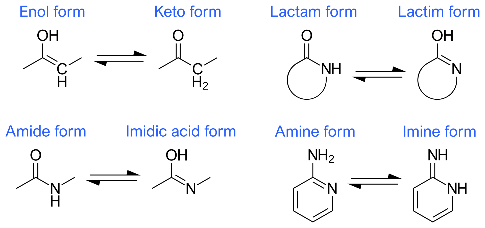

.. toctree::
   :maxdepth: 3

   isolde_restrain
   isolde_remote

The ISOLDE Command Line
-----------------------

While the primary mode of control of ISOLDE is via :ref:`isolde_gui`, if you
prefer you can also perform many tasks via the command line, such as launching
the GUI (:ref:`start`), starting, stopping and pausing simulations (:ref:`sim`),
and performing basic manipulations (:ref:`pepflip` and :ref:`cisflip`). Some
functions are currently available *only* through the command line - in
particular, :ref:`adaptive_restraint_schemes`.

.. _tutorial:

isolde tutorial
===============

Brings up the ISOLDE :ref:`isolde-tutorials` help page, providing interactive
case studies for working on models in ISOLDE.

.. _demo:

isolde demo
===========

Syntax: isolde demo *demoName* [**modelOnly** *true/false*] [**startIsolde** *true/false*]

Primarily intended for use with the ISOLDE tutorials. Loads saved atomic
coordinates for use in rebuilding.

*demoName*: either "cryo_em" or "crystal"

*modelOnly*: if true, load only the model and not the electron density map

*startIsolde*: if true, the ISOLDE GUI will be started.

.. _start:

isolde start
============

Brings up :ref:`isolde_gui`. The first model in the list of open models will be
automatically prepared with ISOLDE's default visualisation mode. This also sets
the display camera to orthographic projection and lighting to simple. It is
strongly recommended that you do not change these settings during your ISOLDE
session.

.. _set:

isolde set
==========

Syntax: isolde set [**timeStepsPerGuiUpdate** *integer*]
[**temperature** *number*] [**gpuDeviceIndex** *integer*]

Change various ISOLDE global settings.

isolde reset forcefield
=======================

Delete cached forcefield files to reset to the as-installed state.

.. _report:

isolde report
=============

Sytax: isolde report [**true|false** (true)]
[**interval** *integer* (20)]

Start/stop reporting information on simulation performance (time per coordinate
update and timesteps per second) to the status bar. The optional
*interval* argument sets the number of coordinate updates to average over
before reporting. Only valid while a simulation is running, and automatically
terminates once that simulation stops.

.. _select:

isolde select
=============

Syntax: isolde select *model*

Set the specified model as ISOLDE's current selected model. If the target model 
has not already been initialised for control by Clipper to provide ISOLDE's 
standard view, this command will cause that to happen.

.. _sim:

isolde sim
==========

Syntax: isolde sim *cmd* [*atoms*] [**discardTo** *discardTo*]

Start, stop or pause an interactive simulation.

isolde sim start [*atoms*]
~~~~~~~~~~~~~~~~~~~~~~~~~~

Launches the ISOLDE GUI if not already running, and starts a simulation. If no
atoms are specified, the simulation will encompass the entirety of the current
selected model (or the first open model if ISOLDE is not already running). If
*atoms* is specified, the selected atoms must come from a single model
(if this is not the current selected model, ISOLDE will automatically switch).

isolde sim stop [**discardTo** *discardTo*]
~~~~~~~~~~~~~~~~~~~~~~~~~~~~~~~~~~~~~~~~~~~

*discardTo*: one of "checkpoint" or "start"

Stop the currently running simulation, and optionally discard the results. If
*discardTo* is not specified, the current state of the model will be kept.
Otherwise, the atomic positions and states of all restraints will be reverted
either to the starting state or the last saved checkpoint.

isolde sim pause
~~~~~~~~~~~~~~~~

Pauses the current simulation.

isolde sim resume
~~~~~~~~~~~~~~~~~

Resumes a paused simulation.

.. _pepflip:

isolde pepflip
==============

Syntax: isolde pepflip *atoms*

Attempt to flip the peptide bond N-terminal to each selected residue, starting a
suitable simulation if none is currently running. Requires ISOLDE to already be
initialised. Residues outside the model currently selected for ISOLDE (or
outside the mobile selection if a simulation is running) will not be flipped.

.. _cisflip:

isolde cisflip
==============

Syntax: isolde cisflip *atoms*

Attempt to flip the peptide bond N-terminal to each selected residue from *cis*
to *trans* or vice versa, starting a suitable simulation if none is currently
running. Requires ISOLDE to already be initialised. Residues outside the model
currently selected for ISOLDE (or outside the mobile selection if a simulation
is running) will not be flipped.

.. _ignore:

isolde ignore
=============

Syntax: isolde ignore *residues*

Tell ISOLDE to ignore a selection of residues in future simulations. This will
not take effect until the next simulation is started. Ignored residues will
still be used for structure factor calculations, but do not take part in
simulations in any way. Atoms directly bonded to an ignored residue will be
fixed in space. This command is most useful in dealing with severe clashes that
are otherwise intractable (e.g. docked homology models with intertwined loops):

* select one of the clashing chains
* *isolde ignore sel* to ignore it
* start a simulation and remodel its counterpart into density
* stop the simulation, then *isolde ~ignore* to clear the list of ignored
  residues
* if necessary, ignore the selection you just remodelled and run a
  simulation to fix the other side of the problem area
* stop any running simulation, *isolde ~ignore*, then run a final simulation
  with everything included to resolve any remaining clashes.

..
  Sphinx does not know what to do with the '~' character and converts .. _`~ignore` to a generic span id.

.. raw:: html

  

.. _`~ignore`:

isolde ~ignore
==============

Syntax: isolde ~ignore *residues*

Tell ISOLDE to stop ignoring a selection of residues for simulation purposes.
This will not take effect until the next new simulation is started.

.. _`stepto`:

isolde stepto
=============

Syntax: isolde stepto [*residue or {next|prev}*] [**viewDistance** *number*]
[**interpolateFrames** *integer*] [**polymericOnly** {*TRUE|false*}]

Focus the camera on the specified residue, or the next/previous residue in the
chain if no residue is specified. *isolde stepto next* will move the camera to
the next residue in the model, while *isolde stepto prev* will move back to the
previous one. The stepper will remember the last specified direction, so
repeated calls of "isolde stepto" without arguments will keep moving along the
chain in the same direction. Providing the *viewDistance* argument will cause
the camera to zoom in/out to the specified distance; this distance will be
maintained for future calls. If the current camera position is close, the view
will slide smoothly to the new position over *interpolateFrames* frames, otherwise
it will jump directly there. If *polymericOnly* is true (default), any residues
not part of a protein or nucleic acid chain will be skipped. As for the other
arguments, this will be remembered for all future calls.

Each loaded model is given its own independent residue stepper - the settings
you make for one will not be carried over to others.

.. _`jumpto`:

isolde jumpto
=============

Syntax: isolde jumpto [*next|prev*]

Jump the residue stepper to the first residue of the next chain, or last residue
of the previous chain.

.. _`add aa`:

isolde add aa
==============

Syntax: isolde add aa *3-character resname* [*residue*] [**addDirection** *C|N*]
[**structure** *model ID*] [**chainID** *string*] [**number** *integer*]
[**addBFactor** *float*] [**occupancy** *float (1.0)*]
[**approxConformation** *helix|strand (strand)*]

Add an amino acid either to an existing terminal residue, or as a new chain or chain fragment.
At its simplest, with a single terminal residue selected "isolde add aa ALA sel" will add 
an alanine residue to the terminus. By default, the B-factors of the new atoms will be the 
average B-factor of the backbone and CB atoms of the residue it attaches to; this can be 
adjusted up or down using the *addBfactor* argument. The *approxConformation* argument 
seeds the *phi* and *psi* angles for the new residue to alpha-helical or beta-strand 
geometry; as the name suggests the result is very approximate and *will* need energy 
minimisation.

The *addDirection* argument is only required if the target existing residue is unbonded
on both the N and C atoms.

If *residue* is not specified, then *structure*, *chainID* and *number* must all be provided.
The new residue will be placed at the current centre of rotation.

.. _`add ligand`:

isolde add ligand
=================

Syntax: isolde add ligand *{residue ID}* [*model*]
[**position** *list of three floats*] [**bfactor** *number*] [**chain** *string*]
[**distanceCutoff** *number*] [**simSettle** {*true|FALSE*}]
[**useMdTemplate** {*TRUE|false*}] [**mdTemplateName** *string*]

*NOTE: when placing ligands using this command, ISOLDE does not currently make
any attempt at a preliminary fit prior to starting simulations - it will simply
place the "ideal" coordinates specified in the template file. When adding large,
flexible ligands this will almost always lead to severe clashes with the
surroundings. In such cases, it is advisable to use* **isolde ignore ~sel** *to
exclude everything but the ligand from simulations, perform an initial fit to
the density using tugging and/or position restraints on key atoms, then use
* **isolde ~ignore** *to reinstate the rest of the model for simulations and
continue on.*

Add a ligand based on its template in the Chemical Components Dictionary. The
residue ID must match the 3-letter code for the ligand (if you don't know this,
you can search for it at http://ligand-expo.rcsb.org/). If ISOLDE is started,
then the *model* argument is optional (if not provided, the ligand will be added
to ISOLDE's currently selected model). Otherwise, you will need to explicitly
specify the model to add to. By default, the ligand will be added at the current
centre of rotation; you may, however, specify an alternative location by
providing coordinates as a comma-separated list after the *position* keyword.

By default, the b-factor and chain assigned to the residue will be determined
based on the closest atoms within *distanceCutoff* (default: 8 Angstroms) to the
site of addition, but you may explicitly specify these if you wish. If
*simSettle* is true, a local simulation will automatically be started - this is
only advisable for small, rigid molecules for which severe clashes with the
surroundings are unlikely.

If *useMdTemplate* is true, the added residue will be checked against the
corresponding molecular dynamics template (if present), and atoms will be added
or removed as needed to match (templates provided by the CCD are often not in
the protonation states most common under biological conditions). You should not
usually need to use the *mdTemplateName* argument: if you have loaded a custom
template, it will be found and used as long as its name matches the residue
name.

.. _`add water`:

isolde add water
================

Syntax: isolde add water [*model*] [**position** *list of three floats*]
[**bfactor** *number*] [**chain** *string*]
[**distanceCutoff** *number*] [**simSettle** {*TRUE|false*}]

Essentially a special case of *isolde add ligand*. The primary difference is
that *simSettle* defaults to true (that is, adding a water will automatically
start a local simulation to settle it). In addition, the default value for
*distanceCutoff* is reduced from 8.0 to 3.0 Angstroms, on the basis that it is
rarely a good idea to add a water outside of hydrogen bonding distance from the
nearest existing atom(s).

.. _`replace ligand`:

isolde replace ligand
=====================

Syntax: isolde replace ligand *residue* *newResidueName*

*(EXPERIMENTAL)*

Replace one ligand with a related one, keeping as many atoms common to both as
possible. Matching of common atoms is performed by graph matching based on
bonding between elements. Use with caution: the current implementation is not
aware of bond order nor of chirality, so attempting to replace (for example) a
D-sugar with its L-enantiomer will simply rename the residue while retaining the
D coordinates. This will be improved upon in a future release.

.. _`adjust bfactors`:

isolde adjust bfactors
======================

Syntax: isolde adjust bfactors *float* [*atoms*]

Increase/decrease B-factors of a set of atoms by the chosen amount. If no atoms are 
specified, the change will be applied to all currently-selected atoms. Will raise a 
UserError if the change would reduce any B-factor below zero.

.. _`modify his`:

isolde modify his
=================

Syntax: isolde modify his *residues* *{ND|NE|both}*

Modify one or more histidine residues to place the hydrogen on the 
specified atom. Should not be used while a simulation is running.

.. _`parameterise`:

isolde parameterise
===================

Syntax: isolde parameterise *residues* [**override** *true|FALSE*]
[**netCharge** *integer*] [**alwaysRaiseErrors** *TRUE|false*]

Parameterise one or more ligands for ISOLDE with the AMBER GAFF2 
force field using ANTECHAMBER. Limitations:

* Only applicable to molecules with no covalent bonds to other ligands/residues
* Only supports molecules made up of the elements C, N, O, S, P, H, F, Cl, Br, or I
* Hydrogens **must** be present and correct (it is up to you to ensure this)
* For ligands with multiple possible protonation states, only one protonation state 
  is currently supported per residue name.
* Unless you know what you're doing, the ligand should be complete (if you do truncate 
  it, all instances of ligands with the same residue name will need to be truncated in 
  the same way)

Note that the time taken by ANTECHAMBER scales with (number of atoms)^3 - while for small 
molecules with less than a dozen or so heavy atoms it will typically complete in under a minute, for 
larger molecules such as phospholipids it can easily take over an hour.

The resulting parameters will be written into files, one for each residue type, called
{resname}.xml. If ISOLDE is already running these will be automatically added to its 
forcefield so those ligands should "just work" for the remainder of the session; for 
future sessions use the "Load residue MD definition(s)" button to add them.

By default, if parameters for a residue with the same name already exist they will not 
be recalculated; this can be changed by setting *override* to true. 

In almost all cases the net charge on the molecule is estimated correctly by ChimeraX;
if ANTECHAMBER fails with an error message in the Log mentioning an odd number of electrons,
the most likely explanations are:

1. There is something wrong with your molecule (too many/too few hydrogens). Double-check 
   or, if necessary, load a trusted exemplar and parameterise against that. Pay particular 
   attention to ionisable groups and potential H-bonds with surrounding molecules. Note 
   that some groups are capable of `tautomerisation`_:|tautomers|
   Distinguishing between these should be done with great care and the application of 
   chemical knowledge - in most such cases one tautomer is strongly preferred so alternatives
   should be considered only in the presence of strong stabilisation by surrounding 
   interactions.
2. ChimeraX incorrectly guessed the charge. If you know what it *should* be, you can 
   specify it with the *netCharge* argument.
3. Your molecule is actually some form of stable radical. These are not supported by 
   ANTECHAMBER - you will need to turn to some more in-depth QM method to parameterise 
   it.
  
.. _`tautomerisation`: https://en.wikipedia.org/wiki/Tautomer

If *alwaysRaiseErrors* is true, then a failure to parameterise any given residue will 
raise a UserError halting the pipeline at that point. If it is false then any errors 
will be printed as warnings to the log, and parameterisation will still be attempted for 
any remaining residues. 

.. _`shorthand`:

isolde shorthand
================

Syntax: isolde shorthand

Enables a set of shorthand aliases to commonly-used ISOLDE commands, and prints a summary
to the log. *Note: you can permanently enable this by going to Favorites/Settings on the 
ChimeraX menu, choosing the "Startup" tab and adding "isolde shorthand" to the box labelled
"Execute these commands at startup".*

The current list of shorthand commands is as follows:

=====  ===================================================
Alias  Equivalent full command
=====  ===================================================
st     isolde step {arguments}
aw     isolde add water {arguments}
awsf   isolde add water {arguments} sim false
al     isolde add ligand {arguments}
aa     isolde add aa $1 sel {arguments}
ht     isolde mod his sel {arguments}
so     setattr sel atoms occupancy {arguments}
ab     isolde adjust bfactors {arguments}
ss     isolde sim start sel
rt     isolde release torsions sel {arguments}
rd     isolde release distances sel {arguments}
ra     rd; rt
pf     isolde pepflip sel
cf     isolde cisflip sel
cbb    color bfactor {arguments}
cbo    color byattr occupancy {arguments}
cbc    color {arguments} bychain; color {arguments} byhet
cs     clipper set contourSensitivity {arguments}
=====  ===================================================

..
  Because Sphinx makes all anchors lowercase whereas the links in the ChimeraX log are camelCase.
  Also, to provide a generic link to "isolde write"

.. raw:: html

  
  

.. _`write phenixRefineInput`:

isolde write phenixRefineInput
==============================

Syntax: isolde write phenixRefineInput *model ID* 
[**modelFileName** *filename*] [**paramFileName** *filename*]
[**includeHydrogens** *true|FALSE*] [**numProcessors** *integer (1)*] 
[**numMacrocycles** *integer (6)*] [**nqhFlips** *true|FALSE*]
[**scatteringType** *xray|electron|neutron (xray)*]

**(IMPORTANT NOTE: This command will only work correctly for crystallographic datasets - for 
cryoEM models use the "isolde write phenixRsrInput" command)**

*(NOTE: ISOLDE does not provide Phenix-compatible restraints for non-standard residues and 
ligands. If you have any )*

Writes a model file defined by *modelFileName* (default: {model name}_for_phenix.cif),
a reflections file ({model name}_for_phenix.mtz) and a parameter file defined by 
*paramFileName* (default: refine.eff) with settings pre-defined to those that typically
work best for models coming from ISOLDE. To use the result you will need to have 
Phenix installed; navigate to the working directory in a terminal window and run:

phenix.refine {parameter file}.eff

(instructions for this will be written to the log.) 

Specifically, the model is used as its own reference for torsion restraints, and
rotamer, Ramachandran and secondary structure restraints are disabled.
Additionally, automatic weighting of X-ray/XYZ and X-ray/adp terms is enabled.
The aim is to limit the refinement to only subtle movements, primarily
tightening the bond and angle distributions while maintaining the overall
geometry of your model. Note that Phenix's approach to automatic
weighting involves running a number of refinements (typically 12) at each step
and choosing the best result. In Unix environments the *numProcessors* argument
allows these to run in parallel. By default, hydrogens are *not* passed to
Phenix; you can change this by setting *includeHydrogens* to *true*, but this
may on occasion fail in Phenix due to incorrectly-named hydrogens on some
non-standard residues. This will be addressed in a future version.

..
  Because Sphinx makes all anchors lowercase whereas the links in the ChimeraX log are camelCase.

.. raw:: html

  

.. _`write phenixRsrInput`:

isolde write phenixRsrInput
===========================

Syntax: isolde write phenixRsrInput *model ID* *resolution* *map ID*
[**modelFileName** *filename*] [**paramFileName** *filename*]
[**restrainPositions** *true|FALSE*] [**includeHydrogens** *true|FALSE*]

**(IMPORTANT NOTE: This command will only work correctly for cryo-EM maps - for 
crystallographic datasets use the "isolde write phenixRefineInput" command)**

Writes a model file defined by *modelFileName* (default: {model
name}_for_phenix.cif) and a parameter file defined by *paramFileName* (default:
refine.eff) with settings pre-defined to those that typically work best for
models coming from ISOLDE. To use the result you will need to have Phenix installed;
navigate to the working directory in a terminal window and run:

phenix.real_space_refine {parameter file}.eff

(instructions for this will be written to the log.) 

Specifically, the model is used as its own reference
for torsion restraints, and rotamer, Ramachandran and secondary structure
restraints are disabled. Additionally, the refinement strategy is limited to 
global minimisation and B-factor (ADP) refinement - most importantly, grid 
searching (i.e. automated searching of different side-chain conformations) 
is disabled. The aim is to limit the refinement to only subtle
movements, primarily tightening the bond and angle distributions while
maintaining the overall geometry of your model.

The *map ID* argument should correspond to a map loaded from a file, not one 
generated by ChimeraX (e.g. via the "volume gaussian" command). Usually, this 
will be a map associated with the model via Clipper, but that is not a necessity.
If you have only a single map associated with your model you can specify it with 
just the top-level identifier (e.g. "#1"); if you have multiple maps associated 
you will need to burrow down in the Models viewer to identify the correct one 
(should be #\ *x*\ .1.1.\ *y* where *x* is your top-level model identifier and *y*
is the actual map you want). 

The *resolution* should correspond to the nominal resolution of the map (i.e. as 
reported in the wwPDB or EMDB entry, or the 0.143 FSC level if you're working on 
a new dataset). Unfortunately this isn't stored in any reliable way in existing 
formats, so ChimeraX doesn't automatically know what it is. The value you specify
will affect some of the weighting decisions made by *phenix.real_space_refine*.

Setting the *restrainPositions* argument to *true* instructs *phenix.real_space_refine*
to restrain all heavy atoms to their starting positions using top-out restraints,
on top of the default torsion restraints. This can be useful where your model includes
domains fitted into very weak or fuzzy density.

By default, hydrogens are *not* passed to
Phenix; you can change this by setting *includeHydrogens* to *true*, but this
may on occasion fail in Phenix due to incorrectly-named hydrogens on some
non-standard residues. This will be addressed in a future version.

..
  Because Sphinx makes all anchors lowercase whereas the links in the ChimeraX log are camelCase.

.. raw:: html

  

.. _`write refmacRestraints`:

isolde write refmacRestraints
=============================

Syntax: isolde write refmacRestraints *model ID* [**distanceCutoff** *number (4.5)*]
[**includeWaters** *true|FALSE*] [**fileName** *filename (RESTRAINTS.txt)*] 

Writes a REFMAC input file similar to one generated by ProSMART to restrain heavy atom interatomic 
distances to their current values. Note that this does *not* write the model itself - you 
should save that separately. The resulting file can be used via the CCP-EM GUI, or at the 
command line via:

refmac5 {all other command-line arguments} \< *filename*

The *distanceCutoff* argument specifies the maximum distance between atoms to be restrained. 
The default value is the same as that used by ProSMART. Note that the total number of restraints
blows out **extremely** rapidly with increasing *distanceCutoff*, so increasing this value 
substantially would be inadvisable.

.. _`reset forcefield`:

isolde reset forcefield
=======================

Syntax: isolde reset forcefield

Reload ISOLDE's forcefield from scratch. This removes the cached version (stored as a pickle file
for faster startup) and reloads everything from the original ffXML files. Any custom ligand 
definitions loaded in this session will need to be re-loaded if you wish to continue using them.
This command exists mostly for developer/debugging use and is primarily used when testing 
modifications/additions to the core force field.

.. _`benchmark`:

isolde benchmark
================

Syntax: isolde benchmark [**maxSize** *(small|medium|large|huge)*] 
[**outputFile** *(filename|browse)*] [**warningDialog** *(TRUE|false)*]
[**maxCoordUpdates** *number (120)*] [**minCoordUpdates** *number (10)*]
[**maxSimTime** *number (300)*]

Runs a series of predefined simulations on selected models from the wwPDB and generates a performance 
report. This is designed to run non-interactively and can take a while to run (particularly for the 
first time, since the models and their maps/structure factors are downloaded from the wwPDB). For each 
model, ISOLDE will first run a simulation of the entire structure, followed by a simulation seeded from 
a single selected atom near the model centre (more representative of day-to-day use).

Running 
statistics are printed to the ChimeraX log, and written as text to the file defined by *outputFile* (if 
*outputFile* is not specified, the file will be written to *isolde_benchmark.log* in the current working 
directory). As for most other ChimeraX commands involving filenames, the argument *outputFile browse* 
will open a system file browser allowing you to choose a directory and filename.

*maxSize* defines the largest set of models to benchmark against. Particularly on slower machines/connections it 
is advisable to avoid the *huge* benchmarks, since the time needed for these models is almost as much as the 
others put together. The benchmarks that will actually be run are:

======== ======== ================================== ======== ========= ==================================
Size     Crystal benchmark                           Cryo-EM benchmark                                    
-------- ------------------------------------------- -----------------------------------------------------
   .     PDB ID   Details                            PDB ID   EMDB ID   Details
======== ======== ================================== ======== ========= ==================================
small    3io0     229 residues, 3.0 Å                7rzq     24774     322 residues, 2.09 Å 
medium   6nak     1383 residues, 3.14 Å              8ehg     28147     1372 residues, 2.24 Å
large    8cjh     2892 residues, 2.98 Å              7nhs     12339     4176 residues, 2.30 Å
huge     5zju     11290 residues, 2.80 Å             7oyb     13112     15830 residues, 2.40 Å
======== ======== ================================== ======== ========= ==================================

By default, executing this command brings up a warning dialog asking you not to interact with ChimeraX while
the benchmarks are running. To skip this, use the argument *warningDialog false*.

For each benchmark simulation, a timer will start at the moment of initialisation (the equivalent of a user 
pressing the "play" button). Once energy minimisation is complete, the simulation will continue until at 
least *minCoordUpdates* equilibration steps have occurred. If the elapsed time is still less than *maxSimTime*
the simulation will continue until either *maxCoordUpdates* or *maxSimTime* is reached. 

An example of the output file format is below:

::

  OpenGL version: 3.3.0 NVIDIA 528.24
  OpenGL renderer: NVIDIA GeForce RTX 3070 Laptop GPU/PCIe/SSE2
  OpenGL vendor: NVIDIA Corporation

  Manufacturer: HP
  Model: HP ZBook Studio 15.6 inch G8 Mobile Workstation PC
  OS: Microsoft Windows 11 Pro (Build 22621)
  Memory: 34,007,068,672
  MaxProcessMemory: 137,438,953,344
  CPU: 16 11th Gen Intel(R) Core(TM) i7-11800H @ 2.30GHz
  OSLanguage: en-GB

  Simulation timesteps per coordinate update: 50
  Nonbonded cutoff distance: 1.7 nm
  Using implicit solvent: True
  Implicit solvent cutoff distance: 2.0 nm
  PDB ID:	3io0
  ====================
  Selection string:	#1.2
  Simulated atom count:	3351
  Platform:	CUDA
  Time to first coord update:	2.1929705142974854
  Minimization time:	0.8542594909667969
  Time per coord update (mean):	0.04789997107230577
  Time per coord update (std):	0.021273512718791954
  Time per x-ray map recalculation (mean):	0.5596075739179339
  Time per x-ray map recalculation (std):	0.2632701705724466
  Time per graphics update (mean):	0.04160166902151721
  Time per graphics update (std):	0.022757995120602312
  Time per graphics update (slowest):	0.27135753631591797
  ----------
  Selection string:	#1.2/A:126
  Simulated atom count:	2707
  Platform:	CUDA
  Time to first coord update:	1.8390088081359863
  Minimization time:	0.09216737747192383
  Time per coord update (mean):	0.04065220307983808
  Time per coord update (std):	0.011054394755417534
  Time per x-ray map recalculation (mean):	0.6834243403540717
  Time per x-ray map recalculation (std):	0.4560358955934349
  Time per graphics update (mean):	0.03488120729523587
  Time per graphics update (std):	0.013481108798147958
  Time per graphics update (slowest):	0.09042668342590332
  ----------
  PDB ID:	7rzq
  ====================
  Selection string:	#1.2
  Simulated atom count:	4913
  Platform:	CUDA
  Time to first coord update:	2.601433038711548
  Minimization time:	1.1442956924438477
  Time per coord update (mean):	0.048584105984476586
  Time per coord update (std):	0.004660827155869477
  Time per graphics update (mean):	0.018363032763517355
  Time per graphics update (std):	0.006425427330208577
  Time per graphics update (slowest):	0.04839634895324707
  ----------
  Selection string:	#1.2/C:959
  Simulated atom count:	1946
  Platform:	CUDA
  Time to first coord update:	1.6841599941253662
  Minimization time:	0.11556077003479004
  Time per coord update (mean):	0.03128157526054638
  Time per coord update (std):	0.0032794936655442634
  Time per graphics update (mean):	0.017639152119668683
  Time per graphics update (std):	0.004657657000208569
  Time per graphics update (slowest):	0.04112887382507324
  ----------

.. _`restrain distances`:

isolde restrain distances
=========================

See :ref:`adaptive_restraint_schemes`

.. _`release distances`:

isolde release distances
========================

See :ref:`adaptive_restraint_schemes`

.. _`adjust distances`:

isolde adjust distances
=======================

See :ref:`adaptive_restraint_schemes`

.. _`restrain torsions`:

isolde restrain torsions
========================

See :ref:`adaptive_dihedral_restraint_cmd`

.. _`adjust torsions`:

isolde adjust torsions
======================

See :ref:`adaptive_dihedral_restraint_cmd`

.. _`release torsions`:

isolde release torsions
=======================

See :ref:`adaptive_dihedral_restraint_cmd`

.. _`remote xmlrpc`:

.. _`remote rest start`:

isolde remote rest start
========================

See :ref:`remote_control_cmd`

.. _`remote rest stop`:

isolde remote rest stop
=======================

See :ref:`remote_control_cmd`

.. _`remote rest info`:

isolde remote rest info
=======================

See :ref:`remote_control_cmd`

isolde remote xmlrpc
====================

See :ref:`remote_control_cmd`

