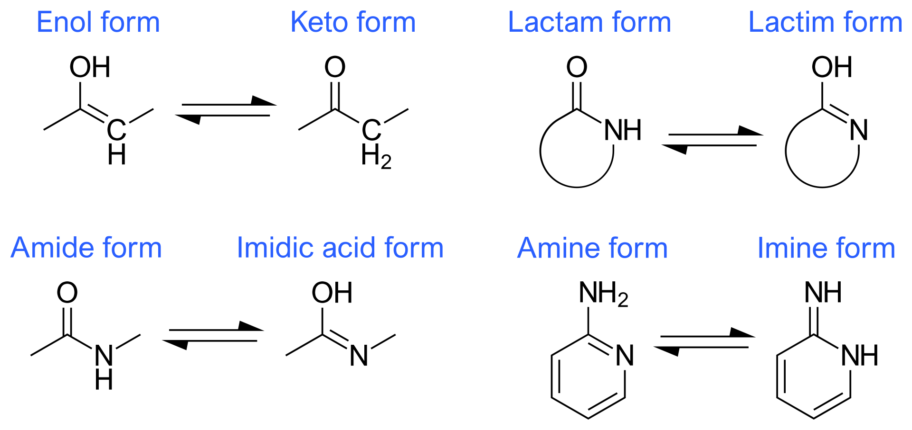

.. toctree::
   :maxdepth: 3

   isolde_restrain
   isolde_remote

The ISOLDE Command Line
-----------------------

While the primary mode of control of ISOLDE is via :ref:`isolde_gui`, if you
prefer you can also perform many tasks via the command line, such as launching
the GUI (:ref:`start`), starting, stopping and pausing simulations (:ref:`sim`),
and performing basic manipulations (:ref:`pepflip` and :ref:`cisflip`). Some
functions are currently available *only* through the command line - in
particular, :ref:`adaptive_restraint_schemes`.

.. _tutorial:

isolde tutorial
===============

Brings up the ISOLDE :ref:`isolde-tutorials` help page, providing interactive
case studies for working on models in ISOLDE.

.. _demo:

isolde demo
===========

Syntax: isolde demo *demoName* [**modelOnly** *true/false*] [**startIsolde** *true/false*]

Primarily intended for use with the ISOLDE tutorials. Loads saved atomic
coordinates for use in rebuilding.

*demoName*: either "cryo_em" or "crystal"

*modelOnly*: if true, load only the model and not the electron density map

*startIsolde*: if true, the ISOLDE GUI will be started.

.. _start:

isolde start
============

Brings up :ref:`isolde_gui`. The first model in the list of open models will be
automatically prepared with ISOLDE's default visualisation mode. This also sets
the display camera to orthographic projection and lighting to simple. It is
strongly recommended that you do not change these settings during your ISOLDE
session.

.. _set:

isolde set
==========

Syntax: isolde set [**timeStepsPerGuiUpdate** *integer*]
[**temperature** *number*] [**gpuDeviceIndex** *integer*]

Change various ISOLDE global settings.

isolde reset forcefield
=======================

Delete cached forcefield files to reset to the as-installed state.

.. _report:

isolde report
=============

Sytax: isolde report [**true|false** (true)]
[**interval** *integer* (20)]

Start/stop reporting information on simulation performance (time per coordinate
update and timesteps per second) to the status bar. The optional
*interval* argument sets the number of coordinate updates to average over
before reporting. Only valid while a simulation is running, and automatically
terminates once that simulation stops.

.. _select:

isolde select
=============

Syntax: isolde select *model*

Set the specified model as ISOLDE's current selected model. If the target model 
has not already been initialised for control by Clipper to provide ISOLDE's 
standard view, this command will cause that to happen.

.. _status:

isolde status
=============

Syntax: isolde status

Report ISOLDE's current state without modifying anything. Logs a one-line
summary identifying the currently selected model (if any) along with the
active forcefield and whether a simulation is running, and returns a
dictionary with the same information for programmatic use. Safe to call at
any time, including before ``isolde start``. Useful for confirming that an
``isolde select`` command actually took effect before running preflight
checks or starting a simulation.

.. _preflight:

isolde preflight
================

Read-only checks that ask "is this model ready for an ISOLDE simulation?"
without starting one. These are MD-readiness preflight checks, conceptually
distinct from ISOLDE's classical model validation (Ramachandran, rotamer,
geometry, fit-to-data) under the ISOLDE GUI's **Validate** tab. They never
construct an OpenMM ``Context``, never raise on missing parameters, and
never modify the model — safe to call at any time once a model is selected.

The ``disulfides`` and ``altlocs`` preflights additionally *acknowledge* the
situation they report: calling either one stamps a per-model flag that
suppresses the corresponding one-time GUI popup (the "create disulfides?" and
"remove alt locs?" dialogs that otherwise fire the first time a model is
selected in ISOLDE). This lets an agent resolve the question through a chat
round-trip — running the preflight, then the matching fix command if desired —
instead of being blocked by a dialog.

isolde preflight hydrogens
~~~~~~~~~~~~~~~~~~~~~~~~~~

Syntax: isolde preflight hydrogens [*model*]

Check whether *model* (or ISOLDE's currently selected model) appears to have
a complete set of hydrogens, using the same heuristics ISOLDE's
"Unparametrised residues" panel applies before launching a simulation. Logs
a one-line summary and returns a dictionary with the hydrogen / heavy-atom
counts, the H/heavy ratio, water statistics, an overall ``status``
(``ok``, ``missing``, ``low`` or ``waters_missing``), and a
``recommend_addh`` flag indicating whether the agent or user should run the
ChimeraX ``addh`` command before proceeding.

isolde preflight parameters
~~~~~~~~~~~~~~~~~~~~~~~~~~~

Syntax: isolde preflight parameters [*model*] [**forcefield** *name*]
[**ignoreExternalBonds** *true|FALSE*]

Run ISOLDE's MD-template assignment over *model* (or ISOLDE's currently
selected model) without starting a simulation, and report any residues that
are unparametrised or ambiguous. This is the same dry-run that the
"Unparametrised residues" panel performs — it does not call the OpenMM
``Context`` constructor and so cannot raise the cryptic errors that arise
from a real simulation start.

Returns a dictionary including total / matched / ambiguous / unmatched
residue counts, a ``ready_for_simulation`` boolean, and per-residue details
for any unmatched residues (with suggested candidate templates by name and
by topology) and any ambiguous residues (with the list of candidate
templates).

The *forcefield* keyword defaults to ISOLDE's currently configured
forcefield (e.g. ``amber14``); pass it explicitly to preflight against a
different one. *ignoreExternalBonds* defaults to ``true`` to match the
behaviour of the GUI panel.

isolde preflight disulfides
~~~~~~~~~~~~~~~~~~~~~~~~~~~~~

Syntax: isolde preflight disulfides [*model*]

Report cysteine pairs in *model* (or ISOLDE's currently selected model) whose
SG atoms are close enough to be disulfide-bonded. This is the same geometric
check that fires the "create disulfides?" GUI popup the first time a model is
selected in ISOLDE, using a 2.3 Angstrom SG-SG cutoff. It creates no bonds —
pair it with :ref:`isolde add disulfides auto <add disulfides auto>` to act on
the result.

Returns a dictionary with three residue lists — ``current`` (pairs already
disulfide-bonded), ``possible`` (unbonded pairs within the cutoff), and
``ambiguous`` (clusters of three or more cysteines too close to assign
automatically) — along with the matching ``n_current`` / ``n_possible`` /
``n_ambiguous`` counts and a ``recommend_create`` flag. As noted above, calling
this command suppresses the one-time GUI disulfide popup for the model.

isolde preflight altlocs
~~~~~~~~~~~~~~~~~~~~~~~~~~

Syntax: isolde preflight altlocs [*model*]

Report whether *model* (or ISOLDE's currently selected model) contains atoms
with alternate conformations. ISOLDE cannot see alt locs during a simulation
but carries them through to the output, so in most refinement workflows they
should be removed first. This is the situation behind the "remove alt locs?"
GUI popup; it removes nothing — pair it with
:ref:`isolde clear altlocs <clear altlocs>` to act on the result.

Returns a dictionary with ``atoms_with_altlocs`` (the atom count), a
``residues`` list of the affected residues, ``n_residues``, and a
``recommend_clear`` flag. As noted above, calling this command suppresses the
one-time GUI alt-loc popup for the model.

.. _validate:

isolde validate
===============

Read-only commands that run the same scoring/validators as the subpanels
of ISOLDE's GUI **Validate** tab, returning structured results suitable
for programmatic use (e.g. by an agent driving the MCP server) without
opening the GUI. They never modify the model and never start a
simulation. The unparametrised-residues panel is intentionally omitted
here - that check is covered by :ref:`preflight` (``isolde preflight
parameters``).

Each subcommand returns a dictionary with summary counts plus a
``items`` list, and shares three output keywords:

- *log* (boolean, default ``false``) - dump the full per-item table to
  the ChimeraX HTML log wrapped in ``<pre>...</pre>``, matching the
  pattern used by the ChimeraX ``clashes`` and ``hbonds`` commands.
- *saveFile* (path, default unset) - write the full table to disk.
  Paths ending in ``.json`` get a structured JSON dump (the full
  unclipped item list with the summary); any other extension gets a
  plain UTF-8 text table.
- *limit* (integer, default unset / 200 for ``clashes``) - cap the
  ``items`` list returned inline so a giant structure doesn't blow up
  the agent's context window. The ``saveFile`` output ignores this and
  always contains the full list; the returned dict carries
  ``truncated``, ``returned_count`` and ``total_count`` when clipped.

isolde validate peptidebonds
~~~~~~~~~~~~~~~~~~~~~~~~~~~~

Syntax: isolde validate peptidebonds [*model*]
[**saveFile** *path*] [**log** *true|FALSE*] [**limit** *integer*]

Report cis and twisted peptide bonds in *model* (or ISOLDE's currently
selected model), using the same omega-dihedral classification that
ISOLDE's "Peptide Bond Validation" panel applies
(``CIS_PEPTIDE_BOND_CUTOFF`` and ``TWISTED_PEPTIDE_BOND_DELTA``,
defaulting to 30 degrees each). Cis-prolines are valid and are reported
separately from cis non-proline bonds.

Returns a dictionary with summary counts (``n_residues``,
``n_cis_nonpro``, ``n_cis_pro``, ``n_twisted``, ``n_iffy``) and a
per-bond ``items`` list. Each item carries the chain, both residues,
the omega angle in degrees, the ``conformation`` (``cis`` or
``twisted``), and an ``is_proline`` flag for the C-terminal residue.

isolde validate rama
~~~~~~~~~~~~~~~~~~~~

Syntax: isolde validate rama [*model*]
[**include** *outliers|allowed|all*] [**saveFile** *path*]
[**log** *true|FALSE*] [**limit** *integer*]

Report Ramachandran scoring for protein residues in *model* (or
ISOLDE's currently selected model), using the same MolProbity contours
and bin cutoffs as ISOLDE's Ramachandran plot. *include* selects which
residues appear in the per-residue list: ``outliers`` (default),
``allowed`` (outliers + allowed) or ``all`` (favored too). Summary
counts always cover the full model regardless of *include*.

Returns a dictionary with summary counts (``n_scorable``,
``n_favored``, ``n_allowed``, ``n_outlier``) and a per-residue
``items`` list giving the phi and psi angles in degrees, the
MolProbity ``score``, the ``classification`` (favored / allowed /
outlier) and the Ramachandran ``case`` (``general``, ``Gly``,
``trans-Pro``, etc.).

This is a pure validation command - to toggle ISOLDE's live 3D
Ramachandran annotators see the existing ``rama`` command instead.

isolde validate rotamers
~~~~~~~~~~~~~~~~~~~~~~~~

Syntax: isolde validate rotamers [*model*]
[**include** *outliers|nonfavored|all*] [**saveFile** *path*]
[**log** *true|FALSE*] [**limit** *integer*]

Report rotamer scoring for sidechain-bearing residues in *model* (or
ISOLDE's currently selected model), using the same MolProbity contours
and P-value cutoffs as ISOLDE's "Rotamer Validation" panel. *include*
selects which residues appear in the per-residue list: ``nonfavored``
(default; outliers + allowed), ``outliers`` or ``all``. Summary counts
always cover all rotameric residues.

Returns a dictionary with summary counts (``n_rotameric``,
``n_favored``, ``n_allowed``, ``n_outlier``), the current
``cutoff_allowed`` and ``cutoff_outlier`` P-values, and a per-residue
``items`` list giving the P-value ``score`` and ``classification``.

This is a pure validation command - to toggle ISOLDE's live 3D
rotamer annotators see the existing ``rota`` command instead.

isolde validate clashes
~~~~~~~~~~~~~~~~~~~~~~~

Syntax: isolde validate clashes [*model*] [**saveFile** *path*]
[**log** *true|FALSE*] [**limit** *integer*]

Report steric clashes in *model* (or ISOLDE's currently selected
model), using ISOLDE's ``unique_clashes`` wrapper around the ChimeraX
``clashes`` machinery. Each clash carries both atoms, the van der
Waals overlap in Angstroms, and a ``severity`` of either ``strict``
(overlap above ``STRICT_CUTOFF``, default 0.4 A) or ``severe``
(overlap above ``SEVERE_CUTOFF``, default 0.6 A).

Returns a dictionary with summary counts (``n_total``, ``n_severe``,
``n_strict``) and a per-clash ``items`` list sorted by descending
overlap. *limit* defaults to 200 for this command since the inline
list dwarfs the other validators on real-world structures; widen with
*limit* or capture everything with *saveFile*.

.. _sim:

isolde sim
==========

Syntax: isolde sim *cmd* [*atoms*] [**discardTo** *discardTo*] [**decouple** *atoms*] [**lambdaDecouple** *number*]

Start, stop or pause an interactive simulation.

isolde sim start [*atoms*] [**decouple** *atoms*] [**lambdaDecouple** *number*]
~~~~~~~~~~~~~~~~~~~~~~~~~~~~~~~~~~~~~~~~~~~~~~~~~~~~~~~~~~~~~~~~~~~~~~~~~~~~~~~~~~

Launches the ISOLDE GUI if not already running, and starts a simulation. If no
atoms are specified, the simulation will encompass the entirety of the current
selected model (or the first open model if ISOLDE is not already running). If
*atoms* is specified, the selected atoms must come from a single model
(if this is not the current selected model, ISOLDE will automatically switch).

*decouple* (optional): an atomic selection to immediately **soften (decouple)**
against the rest of the simulation, once it is running, using ISOLDE's per-group
soft-core coupling (see :ref:`decouple`). This is the clean way to start a
simulation with an initially poorly-fitted ligand or fragment: decoupled, it can
slide through clashes and relax into density without exploding, while the rest of
the model keeps its full-strength force field. The **lambdaDecouple** keyword
(abbreviates to **lambda**) sets the coupling strength, in ``[0.01, 1]`` — ``0.01``
(the default) is ghost-like (near-transparent), ``0.1`` is moderately decoupled, and
``1`` is full; larger values give a gentler push-in. The decoupled selection **must be a subset of the mobile region**
— decoupling a fixed or shell atom is meaningless and is rejected, so widen the
simulation selection (or narrow *decouple*) if needed. The decoupling is transient:
it is forgotten when the simulation stops, and can be cleared or adjusted mid-run
with :ref:`decouple` (``isolde decouple sel off`` / ``... on lambdaDecouple`` *value*).

isolde sim stop [**discardTo** *discardTo*]
~~~~~~~~~~~~~~~~~~~~~~~~~~~~~~~~~~~~~~~~~~~

*discardTo*: one of "checkpoint" or "start"

Stop the currently running simulation, and optionally discard the results. If
*discardTo* is not specified, the current state of the model will be kept.
Otherwise, the atomic positions and states of all restraints will be reverted
either to the starting state or the last saved checkpoint.

isolde sim pause
~~~~~~~~~~~~~~~~

Pauses the current simulation.

isolde sim resume
~~~~~~~~~~~~~~~~~

Resumes a paused simulation.

.. _pepflip:

isolde pepflip
==============

Syntax: isolde pepflip *atoms*

Attempt to flip the peptide bond N-terminal to each selected residue, starting a
suitable simulation if none is currently running. Requires ISOLDE to already be
initialised. Residues outside the model currently selected for ISOLDE (or
outside the mobile selection if a simulation is running) will not be flipped.

.. _cisflip:

isolde cisflip
==============

Syntax: isolde cisflip *atoms*

Attempt to flip the peptide bond N-terminal to each selected residue from *cis*
to *trans* or vice versa, starting a suitable simulation if none is currently
running. Requires ISOLDE to already be initialised. Residues outside the model
currently selected for ISOLDE (or outside the mobile selection if a simulation
is running) will not be flipped.

.. _ignore:

isolde ignore
=============

Syntax: isolde ignore *residues*

Tell ISOLDE to ignore a selection of residues in future simulations. This will
not take effect until the next simulation is started. Ignored residues will
still be used for structure factor calculations, but do not take part in
simulations in any way. Atoms directly bonded to an ignored residue will be
fixed in space. This command is most useful in dealing with severe clashes that
are otherwise intractable (e.g. docked homology models with intertwined loops):

* select one of the clashing chains
* *isolde ignore sel* to ignore it
* start a simulation and remodel its counterpart into density
* stop the simulation, then *isolde ~ignore* to clear the list of ignored
  residues
* if necessary, ignore the selection you just remodelled and run a
  simulation to fix the other side of the problem area
* stop any running simulation, *isolde ~ignore*, then run a final simulation
  with everything included to resolve any remaining clashes.

..
  Sphinx does not know what to do with the '~' character and converts .. _`~ignore` to a generic span id.

.. raw:: html

  

.. _`~ignore`:

isolde ~ignore
==============

Syntax: isolde ~ignore *residues*

Tell ISOLDE to stop ignoring a selection of residues for simulation purposes.
This will not take effect until the next new simulation is started.

.. _`stepto`:

isolde stepto
=============

Syntax: isolde stepto [*residue or {next|prev}*] [**viewDistance** *number*]
[**interpolateFrames** *integer*] [**polymericOnly** {*TRUE|false*}]

Focus the camera on the specified residue, or the next/previous residue in the
chain if no residue is specified. *isolde stepto next* will move the camera to
the next residue in the model, while *isolde stepto prev* will move back to the
previous one. The stepper will remember the last specified direction, so
repeated calls of "isolde stepto" without arguments will keep moving along the
chain in the same direction. Providing the *viewDistance* argument will cause
the camera to zoom in/out to the specified distance; this distance will be
maintained for future calls. If the current camera position is close, the view
will slide smoothly to the new position over *interpolateFrames* frames, otherwise
it will jump directly there. If *polymericOnly* is true (default), any residues
not part of a protein or nucleic acid chain will be skipped. As for the other
arguments, this will be remembered for all future calls.

Each loaded model is given its own independent residue stepper - the settings
you make for one will not be carried over to others.

.. _`jumpto`:

isolde jumpto
=============

Syntax: isolde jumpto [*next|prev*]

Jump the residue stepper to the first residue of the next chain, or last residue
of the previous chain.

.. _`add aa`:

isolde add aa
==============

Syntax: isolde add aa *3-character resname* [*residue*] [**addDirection** *C|N*]
[**structure** *model ID*] [**chainID** *string*] [**number** *integer*]
[**addBFactor** *float*] [**occupancy** *float (1.0)*]
[**approxConformation** *helix|strand (strand)*]

Add an amino acid either to an existing terminal residue, or as a new chain or chain fragment.
At its simplest, with a single terminal residue selected "isolde add aa ALA sel" will add 
an alanine residue to the terminus. By default, the B-factors of the new atoms will be the 
average B-factor of the backbone and CB atoms of the residue it attaches to; this can be 
adjusted up or down using the *addBfactor* argument. The *approxConformation* argument 
seeds the *phi* and *psi* angles for the new residue to alpha-helical or beta-strand 
geometry; as the name suggests the result is very approximate and *will* need energy 
minimisation.

The *addDirection* argument is only required if the target existing residue is unbonded
on both the N and C atoms.

If *residue* is not specified, then *structure*, *chainID* and *number* must all be provided.
The new residue will be placed at the current centre of rotation.

.. _`add ligand`:

isolde add ligand
=================

Syntax: isolde add ligand *{residue ID}* [*model*]
[**position** *list of three floats*] [**bfactor** *number*] [**chain** *string*]
[**distanceCutoff** *number*] [**simSettle** {*true|FALSE*}]
[**useMdTemplate** {*TRUE|false*}] [**mdTemplateName** *string*]

*NOTE: when placing ligands using this command, ISOLDE does not currently make
any attempt at a preliminary fit prior to starting simulations - it will simply
place the "ideal" coordinates specified in the template file. When adding large,
flexible ligands this will almost always lead to severe clashes with the
surroundings. In such cases, it is advisable to use* **isolde ignore ~sel** *to
exclude everything but the ligand from simulations, perform an initial fit to
the density using tugging and/or position restraints on key atoms, then use
* **isolde ~ignore** *to reinstate the rest of the model for simulations and
continue on.*

Add a ligand based on its template in the Chemical Components Dictionary. The
residue ID must match the 3-letter code for the ligand (if you don't know this,
you can search for it at http://ligand-expo.rcsb.org/). If ISOLDE is started,
then the *model* argument is optional (if not provided, the ligand will be added
to ISOLDE's currently selected model). Otherwise, you will need to explicitly
specify the model to add to. By default, the ligand will be added at the current
centre of rotation; you may, however, specify an alternative location by
providing coordinates as a comma-separated list after the *position* keyword.

By default, the b-factor and chain assigned to the residue will be determined
based on the closest atoms within *distanceCutoff* (default: 8 Angstroms) to the
site of addition, but you may explicitly specify these if you wish. If
*simSettle* is true, a local simulation will automatically be started - this is
only advisable for small, rigid molecules for which severe clashes with the
surroundings are unlikely.

If *useMdTemplate* is true, the added residue will be checked against the
corresponding molecular dynamics template (if present), and atoms will be added
or removed as needed to match (templates provided by the CCD are often not in
the protonation states most common under biological conditions). You should not
usually need to use the *mdTemplateName* argument: if you have loaded a custom
template, it will be found and used as long as its name matches the residue
name.

.. _`add water`:

isolde add water
================

Syntax: isolde add water [*model*] [**position** *list of three floats*]
[**bfactor** *number*] [**chain** *string*]
[**distanceCutoff** *number*] [**simSettle** {*TRUE|false*}]

Essentially a special case of *isolde add ligand*. The primary difference is
that *simSettle* defaults to true (that is, adding a water will automatically
start a local simulation to settle it). In addition, the default value for
*distanceCutoff* is reduced from 8.0 to 3.0 Angstroms, on the basis that it is
rarely a good idea to add a water outside of hydrogen bonding distance from the
nearest existing atom(s).

.. _`replace ligand`:

isolde replace ligand
=====================

Syntax: isolde replace ligand *residue* *newResidueName*

*(EXPERIMENTAL)*

Replace one ligand with a related one, keeping as many atoms common to both as
possible. Matching of common atoms is performed by graph matching based on
bonding between elements. Use with caution: the current implementation is not
aware of bond order nor of chirality, so attempting to replace (for example) a
D-sugar with its L-enantiomer will simply rename the residue while retaining the
D coordinates. This will be improved upon in a future release.

.. _`add disulfides auto`:

isolde add disulfides auto
==========================

Syntax: isolde add disulfides auto [*model*]

Create disulfide bonds for every pair of cysteines in *model* (or ISOLDE's
currently selected model) whose SG atoms are within 2.3 Angstroms of each other
but not already bonded — the ``possible`` set reported by
:ref:`isolde preflight disulfides <preflight>`. Clusters of three or more
cysteines packed too close to assign unambiguously are left untouched and
reported as a warning for manual triage. Cannot be run while a simulation is
running.

Returns a dictionary with the ``model`` spec, the number of bonds ``created``,
and the number of ``ambiguous`` clusters skipped. Like the preflight command,
this suppresses the one-time GUI disulfide popup for the model.

.. _`clear altlocs`:

isolde clear altlocs
====================

Syntax: isolde clear altlocs [*model*]

Drop all alternate conformations from *model* (or ISOLDE's currently selected
model) and reset the affected atoms' occupancies to 1.0, keeping the
highest-occupancy conformer. This mirrors the action offered by the "remove alt
locs?" popup and by :ref:`isolde preflight altlocs <preflight>`. Cannot be run
while a simulation is running.

Returns a dictionary with the ``model`` spec and ``atoms_cleared`` (the number
of atoms that had alternate conformers). Like the preflight command, this
suppresses the one-time GUI alt-loc popup for the model.

.. _`adjust bfactors`:

isolde adjust bfactors
======================

Syntax: isolde adjust bfactors *float* [*atoms*]

Increase/decrease B-factors of a set of atoms by the chosen amount. If no atoms are 
specified, the change will be applied to all currently-selected atoms. Will raise a 
UserError if the change would reduce any B-factor below zero.

.. _`modify his`:

isolde modify his
=================

Syntax: isolde modify his *residues* *{ND|NE|both}*

Modify one or more histidine residues to place the hydrogen on the 
specified atom. Should not be used while a simulation is running.

.. _`parameterise`:

isolde parameterise
===================

Syntax: isolde parameterise *residues* [**override** *true|FALSE*]
[**netCharge** *integer*] [**alwaysRaiseErrors** *TRUE|false*]

Parameterise one or more ligands for ISOLDE with the AMBER GAFF2 
force field using ANTECHAMBER. Limitations:

* Only applicable to molecules with no covalent bonds to other ligands/residues
* Only supports molecules made up of the elements C, N, O, S, P, H, F, Cl, Br, or I
* Hydrogens **must** be present and correct (it is up to you to ensure this)
* For ligands with multiple possible protonation states, only one protonation state 
  is currently supported per residue name.
* Unless you know what you're doing, the ligand should be complete (if you do truncate 
  it, all instances of ligands with the same residue name will need to be truncated in 
  the same way)

Note that the time taken by ANTECHAMBER scales with (number of atoms)^3 - while for small 
molecules with less than a dozen or so heavy atoms it will typically complete in under a minute, for 
larger molecules such as phospholipids it can easily take over an hour.

The resulting parameters will be written into files, one for each residue type, called
{resname}.xml. If ISOLDE is already running these will be automatically added to its 
forcefield so those ligands should "just work" for the remainder of the session; for 
future sessions use the "Load residue MD definition(s)" button to add them.

By default, if parameters for a residue with the same name already exist they will not 
be recalculated; this can be changed by setting *override* to true. 

In almost all cases the net charge on the molecule is estimated correctly by ChimeraX;
if ANTECHAMBER fails with an error message in the Log mentioning an odd number of electrons,
the most likely explanations are:

1. There is something wrong with your molecule (too many/too few hydrogens). Double-check 
   or, if necessary, load a trusted exemplar and parameterise against that. Pay particular 
   attention to ionisable groups and potential H-bonds with surrounding molecules. Note 
   that some groups are capable of `tautomerisation`_:|tautomers|
   Distinguishing between these should be done with great care and the application of 
   chemical knowledge - in most such cases one tautomer is strongly preferred so alternatives
   should be considered only in the presence of strong stabilisation by surrounding 
   interactions.
2. ChimeraX incorrectly guessed the charge. If you know what it *should* be, you can 
   specify it with the *netCharge* argument.
3. Your molecule is actually some form of stable radical. These are not supported by 
   ANTECHAMBER - you will need to turn to some more in-depth QM method to parameterise 
   it.
  
.. _`tautomerisation`: https://en.wikipedia.org/wiki/Tautomer

If *alwaysRaiseErrors* is true, then a failure to parameterise any given residue will 
raise a UserError halting the pipeline at that point. If it is false then any errors 
will be printed as warnings to the log, and parameterisation will still be attempted for 
any remaining residues. 

.. _`shorthand`:

isolde shorthand
================

Syntax: isolde shorthand

Enables a set of shorthand aliases to commonly-used ISOLDE commands, and prints a summary
to the log. *Note: you can permanently enable this by going to Favorites/Settings on the 
ChimeraX menu, choosing the "Startup" tab and adding "isolde shorthand" to the box labelled
"Execute these commands at startup".*

The current list of shorthand commands is as follows:

=====  ===================================================
Alias  Equivalent full command
=====  ===================================================
st     isolde step {arguments}
aw     isolde add water {arguments}
awsf   isolde add water {arguments} sim false
al     isolde add ligand {arguments}
aa     isolde add aa $1 sel {arguments}
ht     isolde mod his sel {arguments}
so     setattr sel atoms occupancy {arguments}
ab     isolde adjust bfactors {arguments}
ss     isolde sim start sel
rt     isolde release torsions sel {arguments}
rd     isolde release distances sel {arguments}
ra     rd; rt
pf     isolde pepflip sel
cf     isolde cisflip sel
cbb    color bfactor {arguments}
cbo    color byattr occupancy {arguments}
cbc    color {arguments} bychain; color {arguments} byhet
cs     clipper set contourSensitivity {arguments}
=====  ===================================================

..
  Because Sphinx makes all anchors lowercase whereas the links in the ChimeraX log are camelCase.
  Also, to provide a generic link to "isolde write"

.. raw:: html

  
  

.. _`write phenixRefineInput`:

isolde write phenixRefineInput
==============================

Syntax: isolde write phenixRefineInput *model ID* 
[**modelFileName** *filename*] [**paramFileName** *filename*]
[**includeHydrogens** *true|FALSE*] [**numProcessors** *integer (1)*] 
[**numMacrocycles** *integer (6)*] [**nqhFlips** *true|FALSE*]
[**scatteringType** *xray|electron|neutron (xray)*]

**(IMPORTANT NOTE: This command will only work correctly for crystallographic datasets - for 
cryoEM models use the "isolde write phenixRsrInput" command)**

*(NOTE: ISOLDE does not provide Phenix-compatible restraints for non-standard residues and 
ligands. If you have any )*

Writes a model file defined by *modelFileName* (default: {model name}_for_phenix.cif),
a reflections file ({model name}_for_phenix.mtz) and a parameter file defined by 
*paramFileName* (default: refine.eff) with settings pre-defined to those that typically
work best for models coming from ISOLDE. To use the result you will need to have 
Phenix installed; navigate to the working directory in a terminal window and run:

phenix.refine {parameter file}.eff

(instructions for this will be written to the log.) 

Specifically, the model is used as its own reference for torsion restraints, and
rotamer, Ramachandran and secondary structure restraints are disabled.
Additionally, automatic weighting of X-ray/XYZ and X-ray/adp terms is enabled.
The aim is to limit the refinement to only subtle movements, primarily
tightening the bond and angle distributions while maintaining the overall
geometry of your model. Note that Phenix's approach to automatic
weighting involves running a number of refinements (typically 12) at each step
and choosing the best result. In Unix environments the *numProcessors* argument
allows these to run in parallel. By default, hydrogens are *not* passed to
Phenix; you can change this by setting *includeHydrogens* to *true*, but this
may on occasion fail in Phenix due to incorrectly-named hydrogens on some
non-standard residues. This will be addressed in a future version.

..
  Because Sphinx makes all anchors lowercase whereas the links in the ChimeraX log are camelCase.

.. raw:: html

  

.. _`write phenixRsrInput`:

isolde write phenixRsrInput
===========================

Syntax: isolde write phenixRsrInput *model ID* *resolution* *map ID*
[**modelFileName** *filename*] [**paramFileName** *filename*]
[**restrainPositions** *true|FALSE*] [**includeHydrogens** *true|FALSE*]

**(IMPORTANT NOTE: This command will only work correctly for cryo-EM maps - for 
crystallographic datasets use the "isolde write phenixRefineInput" command)**

Writes a model file defined by *modelFileName* (default: {model
name}_for_phenix.cif) and a parameter file defined by *paramFileName* (default:
refine.eff) with settings pre-defined to those that typically work best for
models coming from ISOLDE. To use the result you will need to have Phenix installed;
navigate to the working directory in a terminal window and run:

phenix.real_space_refine {parameter file}.eff

(instructions for this will be written to the log.) 

Specifically, the model is used as its own reference
for torsion restraints, and rotamer, Ramachandran and secondary structure
restraints are disabled. Additionally, the refinement strategy is limited to 
global minimisation and B-factor (ADP) refinement - most importantly, grid 
searching (i.e. automated searching of different side-chain conformations) 
is disabled. The aim is to limit the refinement to only subtle
movements, primarily tightening the bond and angle distributions while
maintaining the overall geometry of your model.

The *map ID* argument should correspond to a map loaded from a file, not one 
generated by ChimeraX (e.g. via the "volume gaussian" command). Usually, this 
will be a map associated with the model via Clipper, but that is not a necessity.
If you have only a single map associated with your model you can specify it with 
just the top-level identifier (e.g. "#1"); if you have multiple maps associated 
you will need to burrow down in the Models viewer to identify the correct one 
(should be #\ *x*\ .1.1.\ *y* where *x* is your top-level model identifier and *y*
is the actual map you want). 

The *resolution* should correspond to the nominal resolution of the map (i.e. as 
reported in the wwPDB or EMDB entry, or the 0.143 FSC level if you're working on 
a new dataset). Unfortunately this isn't stored in any reliable way in existing 
formats, so ChimeraX doesn't automatically know what it is. The value you specify
will affect some of the weighting decisions made by *phenix.real_space_refine*.

Setting the *restrainPositions* argument to *true* instructs *phenix.real_space_refine*
to restrain all heavy atoms to their starting positions using top-out restraints,
on top of the default torsion restraints. This can be useful where your model includes
domains fitted into very weak or fuzzy density.

By default, hydrogens are *not* passed to
Phenix; you can change this by setting *includeHydrogens* to *true*, but this
may on occasion fail in Phenix due to incorrectly-named hydrogens on some
non-standard residues. This will be addressed in a future version.

..
  Because Sphinx makes all anchors lowercase whereas the links in the ChimeraX log are camelCase.

.. raw:: html

  

.. _`write refmacRestraints`:

isolde write refmacRestraints
=============================

Syntax: isolde write refmacRestraints *model ID* [**distanceCutoff** *number (4.5)*]
[**includeWaters** *true|FALSE*] [**fileName** *filename (RESTRAINTS.txt)*] 

Writes a REFMAC input file similar to one generated by ProSMART to restrain heavy atom interatomic 
distances to their current values. Note that this does *not* write the model itself - you 
should save that separately. The resulting file can be used via the CCP-EM GUI, or at the 
command line via:

refmac5 {all other command-line arguments} \< *filename*

The *distanceCutoff* argument specifies the maximum distance between atoms to be restrained. 
The default value is the same as that used by ProSMART. Note that the total number of restraints
blows out **extremely** rapidly with increasing *distanceCutoff*, so increasing this value 
substantially would be inadvisable.

.. _`reset forcefield`:

isolde reset forcefield
=======================

Syntax: isolde reset forcefield

Reload ISOLDE's forcefield from scratch. This removes the cached version (stored as a pickle file
for faster startup) and reloads everything from the original ffXML files. Any custom ligand 
definitions loaded in this session will need to be re-loaded if you wish to continue using them.
This command exists mostly for developer/debugging use and is primarily used when testing 
modifications/additions to the core force field.

.. _`benchmark`:

isolde benchmark
================

Syntax: isolde benchmark [**maxSize** *(small|medium|large|huge)*] 
[**outputFile** *(filename|browse)*] [**warningDialog** *(TRUE|false)*]
[**maxCoordUpdates** *number (120)*] [**minCoordUpdates** *number (10)*]
[**maxSimTime** *number (300)*]

Runs a series of predefined simulations on selected models from the wwPDB and generates a performance 
report. This is designed to run non-interactively and can take a while to run (particularly for the 
first time, since the models and their maps/structure factors are downloaded from the wwPDB). For each 
model, ISOLDE will first run a simulation of the entire structure, followed by a simulation seeded from 
a single selected atom near the model centre (more representative of day-to-day use).

Running 
statistics are printed to the ChimeraX log, and written as text to the file defined by *outputFile* (if 
*outputFile* is not specified, the file will be written to *isolde_benchmark.log* in the current working 
directory). As for most other ChimeraX commands involving filenames, the argument *outputFile browse* 
will open a system file browser allowing you to choose a directory and filename.

*maxSize* defines the largest set of models to benchmark against. Particularly on slower machines/connections it 
is advisable to avoid the *huge* benchmarks, since the time needed for these models is almost as much as the 
others put together. The benchmarks that will actually be run are:

======== ======== ================================== ======== ========= ==================================
Size     Crystal benchmark                           Cryo-EM benchmark                                    
-------- ------------------------------------------- -----------------------------------------------------
   .     PDB ID   Details                            PDB ID   EMDB ID   Details
======== ======== ================================== ======== ========= ==================================
small    3io0     229 residues, 3.0 Å                7rzq     24774     322 residues, 2.09 Å 
medium   6nak     1383 residues, 3.14 Å              8ehg     28147     1372 residues, 2.24 Å
large    8cjh     2892 residues, 2.98 Å              7nhs     12339     4176 residues, 2.30 Å
huge     5zju     11290 residues, 2.80 Å             7oyb     13112     15830 residues, 2.40 Å
======== ======== ================================== ======== ========= ==================================

By default, executing this command brings up a warning dialog asking you not to interact with ChimeraX while
the benchmarks are running. To skip this, use the argument *warningDialog false*.

For each benchmark simulation, a timer will start at the moment of initialisation (the equivalent of a user 
pressing the "play" button). Once energy minimisation is complete, the simulation will continue until at 
least *minCoordUpdates* equilibration steps have occurred. If the elapsed time is still less than *maxSimTime*
the simulation will continue until either *maxCoordUpdates* or *maxSimTime* is reached. 

An example of the output file format is below:

::

  OpenGL version: 3.3.0 NVIDIA 528.24
  OpenGL renderer: NVIDIA GeForce RTX 3070 Laptop GPU/PCIe/SSE2
  OpenGL vendor: NVIDIA Corporation

  Manufacturer: HP
  Model: HP ZBook Studio 15.6 inch G8 Mobile Workstation PC
  OS: Microsoft Windows 11 Pro (Build 22621)
  Memory: 34,007,068,672
  MaxProcessMemory: 137,438,953,344
  CPU: 16 11th Gen Intel(R) Core(TM) i7-11800H @ 2.30GHz
  OSLanguage: en-GB

  Simulation timesteps per coordinate update: 50
  Nonbonded cutoff distance: 1.7 nm
  Using implicit solvent: True
  Implicit solvent cutoff distance: 2.0 nm
  PDB ID:	3io0
  ====================
  Selection string:	#1.2
  Simulated atom count:	3351
  Platform:	CUDA
  Time to first coord update:	2.1929705142974854
  Minimization time:	0.8542594909667969
  Time per coord update (mean):	0.04789997107230577
  Time per coord update (std):	0.021273512718791954
  Time per x-ray map recalculation (mean):	0.5596075739179339
  Time per x-ray map recalculation (std):	0.2632701705724466
  Time per graphics update (mean):	0.04160166902151721
  Time per graphics update (std):	0.022757995120602312
  Time per graphics update (slowest):	0.27135753631591797
  ----------
  Selection string:	#1.2/A:126
  Simulated atom count:	2707
  Platform:	CUDA
  Time to first coord update:	1.8390088081359863
  Minimization time:	0.09216737747192383
  Time per coord update (mean):	0.04065220307983808
  Time per coord update (std):	0.011054394755417534
  Time per x-ray map recalculation (mean):	0.6834243403540717
  Time per x-ray map recalculation (std):	0.4560358955934349
  Time per graphics update (mean):	0.03488120729523587
  Time per graphics update (std):	0.013481108798147958
  Time per graphics update (slowest):	0.09042668342590332
  ----------
  PDB ID:	7rzq
  ====================
  Selection string:	#1.2
  Simulated atom count:	4913
  Platform:	CUDA
  Time to first coord update:	2.601433038711548
  Minimization time:	1.1442956924438477
  Time per coord update (mean):	0.048584105984476586
  Time per coord update (std):	0.004660827155869477
  Time per graphics update (mean):	0.018363032763517355
  Time per graphics update (std):	0.006425427330208577
  Time per graphics update (slowest):	0.04839634895324707
  ----------
  Selection string:	#1.2/C:959
  Simulated atom count:	1946
  Platform:	CUDA
  Time to first coord update:	1.6841599941253662
  Minimization time:	0.11556077003479004
  Time per coord update (mean):	0.03128157526054638
  Time per coord update (std):	0.0032794936655442634
  Time per graphics update (mean):	0.017639152119668683
  Time per graphics update (std):	0.004657657000208569
  Time per graphics update (slowest):	0.04112887382507324
  ----------

.. _`restrain distances`:

isolde restrain distances
=========================

See :ref:`adaptive_restraint_schemes`

.. _`release distances`:

isolde release distances
========================

See :ref:`adaptive_restraint_schemes`

.. _`adjust distances`:

isolde adjust distances
=======================

See :ref:`adaptive_restraint_schemes`

.. _`restrain torsions`:

isolde restrain torsions
========================

See :ref:`adaptive_dihedral_restraint_cmd`

.. _`adjust torsions`:

isolde adjust torsions
======================

See :ref:`adaptive_dihedral_restraint_cmd`

.. _`release torsions`:

isolde release torsions
=======================

See :ref:`adaptive_dihedral_restraint_cmd`

.. _`remote xmlrpc`:

.. _`remote rest start`:

isolde remote rest start
========================

See :ref:`remote_control_cmd`

.. _`remote rest stop`:

isolde remote rest stop
=======================

See :ref:`remote_control_cmd`

.. _`remote rest info`:

isolde remote rest info
=======================

See :ref:`remote_control_cmd`

isolde remote xmlrpc
====================

See :ref:`remote_control_cmd`

.. _brefine:

isolde brefine
==============

Syntax: isolde brefine [*model*]
[**refineB** *true/false* (true)]
[**maxCycles** *N* (50)]
[**bMinFactor** *number* (2.0)]
[**bMax** *number* (200.0)]
[**nThreads** *N*]
[**logLevel** *none/info/debug* (info)]
[**rfreeTolerance** *number/none* (0.02)]
[**gapTolerance** *number/none* (0.07)]
[**autoTolerances** *true/false* (true)]
[**deltaToleranceFactor** *number* (1.0)]
[**epsilonToleranceFactor** *number* (1.0)]
[**ignoreHydrogens** *true/false* (true)]
[**wInternal** *number* (1.0)]
[**wLocal** *number* (1.0)]
[**cLocal** *number* (4.0)]
[**alpha** *number/auto* (1.0)]

Refine the isotropic B-factors (and, optionally, occupancies) of all atoms
in the model against the crystallographic structure factors loaded with
``clipper open``.  Refinement is performed using the Agarwal (1978) real-space
gradient approach with a self-consistent crystallographic target: at each
L-BFGS-B step the scale factor *k* and driving density are recomputed from the
current Fc, so the optimiser always descends a fixed, well-defined objective.

If *model* is not specified and only one Clipper session is open, that session
is used automatically.

**refineB** — whether to refine B-factors.  Default *true*.

**maxCycles** — maximum number of L-BFGS-B iterations.  Default 50.

**bMinFactor** — scale factor for the resolution-dependent B-factor floor.
The floor is ``bMinFactor × d_min²`` (Ų).  Default 2.0.

**bMax** — upper bound on B-factors (Ų).  Default 200.0.  Setting this
prevents poorly-fitted atoms from drifting to extreme values.

**nThreads** — number of threads for the gradient calculation.  Defaults to
the number of available CPU cores.

**logLevel** — verbosity: *none* suppresses all output; *info* (default) logs
a one-line completion message and the before/after R-factors; *debug* adds
timing and full configuration details.

**rfreeTolerance** — overfitting guard.  If R-free rises by more than this amount
between the pre- and post-refinement parameters, the result is discarded without
modifying the model.  Default 0.02.  Set to *none* to disable this guard.

**gapTolerance** — overfitting guard.  The maximum acceptable R-free − R-work gap
(an absolute ceiling, not a per-run change).  A result is discarded only if it
pushes the gap above this ceiling *and* widens it relative to the starting model —
so a model that already has a wide gap is not penalised unless refinement makes it
worse.  A widening gap (R-work falling while R-free rises) is the direct signal of
overfitting.  Default 0.07.  Set to *none* to disable this guard.

.. note::
   R-work is deliberately **not** a rejection criterion: a small R-work rise
   accompanied by an R-free fall is a *good* outcome.  At low data-to-parameter
   ratio (incomplete models, low resolution) unrestrained per-atom B-factors
   overfit, so these guards may correctly reject a run — the remedy is stronger
   B-factor restraints (raise *wInternal* / *wLocal*, or use *alpha* **auto**),
   which curb the overfitting so the result passes and is applied.

**autoTolerances** — if *true* (default), L-BFGS-B convergence thresholds are
scaled to the atom count (√N) and data resolution (d_min²) automatically.

**deltaToleranceFactor** — multiplier on the auto-scaled *lbfgs_delta*
threshold.  Values < 1 tighten convergence; values > 1 loosen it.
Abbreviated to **d** on the command line.

**epsilonToleranceFactor** — multiplier on the auto-scaled *lbfgs_epsilon*
threshold.  Same semantics.  Abbreviated to **e** on the command line.

**ignoreHydrogens** — exclude hydrogen atoms from the refinement.
Default *true*.

**wInternal** — weight for two-sided pairwise restraints tying the
B-factors of covalently-bonded atoms together.  The weight is **automatically
normalized to the data** (it is a relative emphasis, not an absolute scale), so a
given value behaves comparably across resolutions/datasets.  Default 1.0 (on at
the calibrated sweet spot); set to 0 to disable.

**wLocal** — weight for two-sided pairwise restraints between
spatially-close *non-bonded* atoms, **including crystallographic symmetry
contacts**, encouraging atoms in close contact to share similar B-factors.  The
per-pair weight is scaled by separation (closer contacts weighted more strongly)
and normalized by coordination number and the data scale (as above).  Default 1.0
(on) — at the resolutions ISOLDE is typically used at, the local network is almost
always needed.  Set to 0 to disable.

**cLocal** — distance (Å) within which a non-bonded contact
contributes a local restraint.  Default 4.0.

**alpha** — shape of the robust loss used by the B-factor restraints (Barron's
general robust loss). A number selects a fixed shape applied to every restraint:
**2** = harmonic (squared error, never saturates), **1** = Charbonnier /
pseudo-Huber (quadratic core with a saturating linear tail; the **default**),
**0** = Cauchy, **−2** = Geman-McClure (redescends toward zero influence for
large deviations). Lower values are more tolerant of a restrained pair drifting
apart. The scale of the quadratic core is unchanged and still set by *cLocal* (and
the per-type internal scale). Alternatively, **auto** chooses a *per-restraint*
shape from local chemistry: bonds in rings or between non-rotatable
(sp²/aromatic) atoms, the bonds within rigid coordination centres (the S–O / P–O
bonds of sulfate, phosphate and sulfonyl groups), and atoms in solid van der Waals
contact, are kept stiff (α ≈ 1) — so a central S/P atom cannot drift to a higher
B-factor than its oxygens — while flexible rotamer tips (e.g. lysine Cε–Nζ, serine
Cβ–Oγ) and loose non-contacts are relaxed toward Geman-McClure (α ≈ −2) so their
B-factors may legitimately diverge from their neighbours'. Default 1.0.

.. _`brefine_optimiseparams`:

isolde brefine optimiseparams
=============================

Syntax: isolde brefine optimiseparams [*model*]
[**strategy** *weight/weightAlpha/coarseFine* (weight)]
[**gapWeight** *number* (1.0)]
[**weightMin** *number* (0.25)]
[**weightMax** *number* (8.0)]
[**nSteps** *N* (6)]
[**apply** *true/false* (false)]
[**maxCycles** *N* (50)]
[**bMinFactor** *number* (2.0)]
[**bMax** *number* (200.0)]
[**nThreads** *N*]
[**ignoreHydrogens** *true/false* (true)]
[**wInternal** *number* (1.0)]
[**wLocal** *number* (1.0)]
[**cLocal** *number* (4.0)]

Search for the B-factor restraint strength that best fits *this* model against the
crystallographic data, then report it.  The command runs a series of `isolde
brefine`_ refinements in the background at different restraint weights (and,
optionally, *alpha* shapes), scoring each by R-free and the R-free − R-work gap,
and prints a table plus the recommended settings.  Each trial is **evaluation
only** — it measures R-factors but does **not** change the model — so the search
is non-destructive and does not block ChimeraX.

.. warning::
   The search runs on the model **as it stands when the command is issued**, and
   reads the live structure as each trial proceeds.  Do **not** modify the model
   while it is running — moving, adding or removing atoms, starting a simulation,
   or editing B-factors/occupancies — or the search will abort with a warning (it
   leaves the model unchanged either way).

**strategy** — which settings to scan.  *weight* (default) scales *wInternal* and
*wLocal* together over a geometric range, with *alpha* = **auto**.  *weightAlpha*
crosses that weight scan with *alpha* ∈ {auto, 1.0}.  *coarseFine* runs a coarse
weight scan, then a finer scan bracketing the best coarse value.

**gapWeight** — weighting of the overfitting penalty in the score
``R_free + gapWeight·(R_free − R_work)`` (lower is better).  Higher values favour
a narrower R-free − R-work gap (more conservative against overfitting) at the
expense of slightly higher R-free.  Default 1.0.

**weightMin**, **weightMax**, **nSteps** — the geometric range and number of
weight multipliers for the scan.  Defaults 0.25, 8.0, 6.

**apply** — if *true*, run one final ordinary (model-modifying) `isolde brefine`_
with the winning settings once the search completes.  Default *false* (report
only; the recommended command is printed for you to run).

The remaining arguments (**maxCycles**, **bMinFactor**, **bMax**, **nThreads**,
**ignoreHydrogens**, **wInternal**, **wLocal**, **cLocal**) are passed through to
each trial as in `isolde brefine`_; *wInternal*/*wLocal* are the **base** weights
that the scan multiplier scales.  Convergence tolerances are auto-scaled
(*autoTolerances*) for speed.

*Requires a build of ChimeraX-Clipper with evaluation-only refinement support; an
older version raises an error asking you to update.*

.. _brsr:

isolde brsr
===========

Syntax: isolde brsr [*atoms*]
[**map** *map-handler*]
[**contextRange** *number* (5.0)]
[**wBoundary** *number* (1.0)]
[**cBoundary** *number* (4.0)]
[**wInternal** *number* (1.0)]
[**alpha** *number/auto* (1.0)]
[**wholeMap** *true/false* (false)]
[**padding** *number* (6.0)]
[**taperWidth** *number* (3.0)]
[**maxCycles** *N* (50)]
[**bMinFactor** *number* (2.0)]
[**bMax** *number* (200.0)]
[**nThreads** *N*]
[**logLevel** *none/info/debug* (info)]
[**resolution** *number*]
[**autoTolerances** *true/false* (true)]
[**deltaToleranceFactor** *number* (1.0)]
[**epsilonToleranceFactor** *number* (1.0)]
[**ignoreHydrogens** *true/false* (true)]

Refine the isotropic B-factors of the specified atoms against a fixed
real-space target density.  A subregion of the target map is extracted,
cosine-tapered at the edges to suppress periodic wrap-around artefacts, and
copied into a Clipper P1 Xmap.  B-factors are then optimised so that the
calculated density best matches the target, using a per-iteration least-squares
scale factor to make the result independent of the map's absolute normalisation.

This command is suitable for both cryo-EM maps and local real-space refinement
against a crystallographic difference map.

If *atoms* is not specified, all atoms of the single available Clipper model
are refined.  If *map* is not specified, the command looks for the single
available Clipper map handler in the session.

**atoms** — the atoms to refine.  Must all belong to a single structure that
is associated with a Clipper session.  Atoms from the same structure that are
not in this selection but lie within *contextRange* of it will contribute to
the calculated density without being refined themselves.

**map** — the target map handler.  Must be a Clipper map handler
(crystallographic or non-crystallographic).

**contextRange** — radius (Å) around the refined atoms within which
neighbouring atoms contribute to the calculated density.  Default 5.0.

**wBoundary** — weight on the one-sided restraints that pull each
refined atom's B-factor toward a fixed target derived from its surrounding
context atoms.  The target is the **distance-weighted mean** of the (fixed)
B-factors of the context atoms within *cBoundary* — closer
neighbours count more strongly — and the search is **symmetry-aware**, so a
crystallographic symmetry mate packing against the fragment contributes just as
a directly-adjacent atom would.  These suppress the tendency of a freshly-fitted
fragment's B-factors to drift away from those of its surroundings.  The weight is
**automatically normalized to the data** (a relative emphasis, not an absolute
scale), so a given value behaves comparably across resolutions.  Default 1.0.
Set to 0 to disable boundary restraints.

**cBoundary** — distance (Å) within which a context atom (or its
symmetry image) contributes to a refined atom's boundary target.  Should be ≤
*contextRange*.  Default 4.0.

**wInternal** — weight on the pairwise restraints between bonded
atoms *within* the refined set.  Boundary restraints only anchor atoms adjacent
to the context; the internal network propagates that information into the
fragment interior, where atoms would otherwise be unconstrained.  Like
*wBoundary*, this weight is automatically normalized to the data.
Default 1.0.  Set to 0 to disable internal restraints; setting both restraint
weights to 0 reproduces the old unrestrained behaviour.

**alpha** — shape of the robust loss used by both the boundary and internal
B-factor restraints (Barron's general robust loss). A number selects a fixed
shape for every restraint: **2** = harmonic, **1** = Charbonnier (quadratic core
with a saturating tail; the **default**), **0** = Cauchy, **−2** = Geman-McClure
(redescends for large deviations). Lower values tolerate a restrained pair drifting
apart; the quadratic-core scale is unchanged (still set by *cBoundary* and the
internal scale). Alternatively, **auto** picks a *per-restraint* shape from local
chemistry — rigid bonds, rigid coordination centres (sulfate/phosphate/sulfonyl
S–O / P–O bonds), and atoms in solid contact stay stiff (α ≈ 1), while flexible
rotamer tips and loose contacts relax toward Geman-McClure (α ≈ −2). Default 1.0.

**wholeMap** — if *true*, refine against the full extent of the map without
cropping to the atom bounding box.  Only valid for non-crystallographic
(cryo-EM) maps; crystallographic live maps only hold data within the current
spotlight box.  Default *false*.

**padding** — extra space (Å) on all sides of the atom bounding box when
extracting the target density subregion.  Default 6.0.

**taperWidth** — width (Å) of the cosine taper applied to the edges of the
extracted subregion.  Default 3.0.

**maxCycles** — maximum number of L-BFGS-B iterations.  Default 50.

**bMinFactor** — scale factor for the resolution-dependent B-factor floor.
Default 2.0.

**bMax** — upper bound on B-factors (Ų).  Default 200.0.

**nThreads** — number of threads.  Defaults to available CPU cores.

**logLevel** — verbosity level: *none*, *info* (default), or *debug*.

**resolution** — nominal resolution of the target map (Å), used to set the
L-BFGS-B convergence thresholds when *autoTolerances* is *true*.  If not
given, the resolution is first sought from the session's symmetry manager
(appropriate when the target is a crystallographic map), then estimated as
3 × max(voxel_step).

**autoTolerances** — auto-scale convergence thresholds.  Default *true*.

**deltaToleranceFactor** — multiplier on *lbfgs_delta*.  Abbreviated **d**.

**epsilonToleranceFactor** — multiplier on *lbfgs_epsilon*.  Abbreviated **e**.

**ignoreHydrogens** — exclude hydrogen atoms.  Default *true*.

.. _rotafit:

isolde rotafit
==============

Syntax: isolde rotafit [*residues*] [**temperature** *number*] [**settleSteps** *integer*] [**polishSteps** *integer*] [**polishTop** *integer*] [**rampIncrements** *integer*] [**acceptMargin** *number*] [**settleLambda** *number*] [**minimize** *true/false*] [**scoreLambda** *number*] [**scoreMode** *local+diff/local/classic*] [**allowMultiple** *true/false*] [**apply** *true/false*] [**debug** *true/false*]

Automate rotamer selection for the selected residue by *settling*, using the
interactive simulation. If no simulation is running, one is started automatically
around the target using ISOLDE's standard sim-start selection (its normal padding and
soft-shell — the buffer gives the local environment room to relax around a re-fitted
rotamer, which some fixes need). For the residue it enumerates the library rotamers
(the same conformations the preview buttons cycle through) plus the residue's
*current* conformation, culls any rotamer with severe overlaps against its
surroundings, *settles* each survivor in the full force field by briefly stepping the
paused simulation at low temperature, and ranks them by how well the settled residue
itself fits (see **Scoring** below). The best is committed.

The motivation is that pre-settle previews are misleading — a rigid rotation about
the fixed CA-CB bond can put even the *correct* rotamer well out of the map, and
long lists (e.g. arginine) are sorted by prevalence rather than similarity, so
comparing them by eye is hard. Because the full force field reliably relaxes into
the correct conformation once a rotamer is placed in the right basin, the *settled*
fit is a far more honest arbiter than the pre-settle appearance.

The settle runs in two phases. A **soft search** (``settleLambda``, default 0.6)
weakens ISOLDE's soft-core van der Waals term so a rotamer seeded into an overlap
slides apart instead of exploding, and reliably drops each candidate into its basin.
The leading candidate(s) are then **polished** up to the simulation's full stiffness so
the committed pose is tight. Rather than jumping straight to full stiffness (which can
jolt atoms in a soft overlap that abruptly becomes a hard wall), the polish **ramps**
the soft-core lambda up over ``rampIncrements`` stages so the system stiffens
adiabatically.

**Softening the target, not the environment.** The target residue is softened against
its surroundings using ISOLDE's *per-group* soft-core coupling: its atoms (and, in a
crystallographic simulation, their symmetry copies) are placed in their own nonbonded
group and only their coupling to the rest of the model is weakened, so a clashy seed
relaxes while **the environment keeps its full-strength force field and holds its own
shape — no position restraints are used**. This lets ``settleLambda`` go low to free a
badly stuck rotamer without distorting the shell, and lets the surroundings genuinely
accommodate the new rotamer where that is needed. The coupling is restored to full
strength before the simulation resumes.

**Scoring (``scoreMode``, default ``local+diff``).** The candidate is judged by the
fit of the **target residue itself**, not by the whole-construct energy — the latter is
dominated by the surrounding thousands of atoms, whose energy drifts from pose to pose
and swamps the single-residue signal. The primary criterion is the residue's *own* MDFF
map fit, isolated so the environment's contribution cancels out. For a crystallographic
map that is *phase-biased* toward the current model, this can still be fooled by a wrong
rotamer that parks atoms on already-modelled density; ``local+diff`` breaks such ties
using the **mFo-DFc difference map** — sampled (not recomputed) at the residue's atoms —
which marks density the current model fails to explain, defeating model bias. The map's
influence is ISOLDE's own MDFF coupling — there is no separate map weight to set.

**"First, do no harm":** the residue's current conformation always competes as a
candidate, and a rotamer replaces it only if it wins by a real margin (``acceptMargin``;
in ``local+diff`` a tied challenger must additionally explain meaningfully more
difference density). This stops an already-correct fit from being flipped out by
settling noise on repeat calls.

The best candidate is auto-committed, but the **simulation is left running**: if the
result is poor, ``isolde sim revert`` returns to the checkpoint taken at the start
of the command, and continuing the live simulation refines the committed result
further (ISOLDE updates the map as the R-factors improve). By default a single
summary line is logged; ``debug true`` reports the full ranked shortlist, the per-signal
breakdown, the polish / do-no-harm decisions and per-phase timings.

Options:

* ``temperature`` (default 0): temperature (K) for the settle. 0 K makes it a pure,
  deterministic downhill relaxation (the Langevin random force vanishes at 0 K).
* ``settleSteps`` (default 100): 0 K dynamics steps per rotamer during the soft search.
  With ISOLDE's soft-core van der Waals potential, stepping converges faster than a
  minimiser. If a badly-placed rotamer seats short, raise this (it is far cheaper than
  enabling ``minimize``).
* ``polishSteps`` (default 150): extra steps applied while ramping to full stiffness for
  each polished candidate. Set to 0 to skip the polish phase entirely.
* ``polishTop`` (default 1): how many of the top soft-search candidates to polish at
  full stiffness and re-rank. ``1`` polishes the winner only; a larger value guards
  against a soft-search tie committing the wrong basin; ``0`` (or negative) polishes
  every survivor. (In ``local+diff`` the poses tied with the best on the main map — the
  difference-density contenders — are polished regardless, so the tiebreak is decided at
  full stiffness.)
* ``rampIncrements`` (default 5): number of stages over which the polish ramps the
  soft-core lambda from ``settleLambda`` up to full stiffness (``polishSteps`` is split
  across them). ``1`` jumps straight to full stiffness in a single stage.
* ``acceptMargin`` (default 1): the do-no-harm threshold, as a **multiple of ISOLDE's
  MDFF coupling constant** (not an absolute energy). A rotamer must beat the current
  conformation by at least ``acceptMargin × coupling`` to replace it. Because the
  coupling is sigma-normalised, this threshold tracks the map automatically across
  resolutions and between X-ray and cryo-EM. ``0`` accepts any improvement; larger
  values are stickier to the current pose. (When the simulation has no map, it is
  treated as an absolute kJ/mol value.)
* ``settleLambda`` (default 0.6): soft-core van der Waals lambda for the target during
  the search phase. Lower is more forgiving of overlaps but distorts geometry below
  ~0.5. Because only the target is softened (the environment stays at full strength),
  lowering it does not risk deforming the shell.
* ``minimize`` (default false): after the 0 K dynamics settle, also run
  ``minimizeEnergy()`` on each candidate. Off by default — 0 K damped dynamics already
  settles deterministically toward the minimum, and the minimiser is the dominant cost
  while rarely changing the outcome once scoring is localised. Enable it only to rescue
  a genuinely high-energy start; otherwise prefer more ``settleSteps``.
* ``scoreLambda`` (default 0 = score at the settle lambda): if set, evaluate the ranking
  at this soft-core lambda regardless of the lambda the pose was settled at.
* ``scoreMode`` (default ``local+diff``): how candidates are ranked.
  ``local`` ranks by the target residue's own MDFF (2mFo-DFc) map fit only.
  ``local+diff`` adds the mFo-DFc **difference-density tiebreaker** for candidates that
  the main map cannot separate — the recommended default for crystallographic data;
  where no difference map exists (cryo-EM, apo) it falls back to ``local`` automatically.
  ``classic`` restores the legacy whole-construct energy ranking and is provided for
  comparison only — it is susceptible to the environment-noise problem the localised
  modes were built to fix.
* ``allowMultiple`` (default false): each residue is settled individually and takes about
  a second, so by default only a single residue may be targeted — a guard against an
  accidental whole-model run. Set true to fit every residue in the selection.
* ``apply`` (default true): commit the best candidate to the model. If false, the
  ranking is reported (use with ``debug true``) but nothing is changed.
* ``debug`` (default false): log the full per-rotamer ranking, the per-signal breakdown,
  polish and do-no-harm detail and per-phase timings instead of the single-line summary.

.. _decouple:

isolde decouple
===============

Syntax: isolde decouple *atoms* [**on** | **off**] [**lambdaDecouple** *number*]

Interactively **soften (decouple)** the nonbonded interactions between a selection and
the rest of the running simulation, using ISOLDE's per-group soft-core coupling. This is
a hands-on aid for exploring and verifying the same mechanism that :ref:`rotafit` and the
automated placement engines drive internally: it lets you watch a fragment go soft
against its surroundings (so it can slide through clashes and relax into density) while
the rest of the model keeps its full-strength force field.

``isolde decouple`` *atoms* (``on`` is the default, so it may be omitted) places the
selection in its own nonbonded group (and, in a crystallographic-symmetry simulation,
its symmetry copies in a second group) and
softens **every** interaction that touches it — against the environment *and* against its
own crystal image — down to ``lambdaDecouple``, while leaving the environment and the
selection's **own internal geometry** at full strength. So the selection can move freely
through its surroundings without the surroundings deforming and without the selection
itself falling apart. ``lambdaDecouple`` (abbreviates to ``lambda``) runs from ``0.01``
(ghost-like — its default; the selection barely feels its surroundings) through ``0.1``
(moderately decoupled) to ``1`` (normal full coupling); larger values firm the interaction
up gradually.

``isolde decouple`` *atoms* ``off`` restores full coupling everywhere. Only **one**
selection is decoupled at a time — each ``on`` first clears any previous decoupling, so
the effect is always "this selection, soft against everything else" — and ``off`` simply
clears it (the *atoms* argument is required for consistency but not otherwise used by
``off``).

**Transient and simulation-scoped.** The decoupling exists **only for the currently
running simulation** and is **forgotten the moment that simulation stops**: the per-group
state lives on the simulation's force objects, which are rebuilt fully coupled at the next
``isolde sim start``. Nothing is written to the session, and the command has no effect
(and reports an error) when no simulation is running. This makes it safe to experiment
with — a fresh simulation always starts fully coupled.

Requires the soft-core nonbonded potential and at least three provisioned nonbonded-group
slots (``SimParams.nb_groups_max`` — the default of 4 provides them), which every
simulation has by default. It is intended for interactive testing, not as part of a
model-building protocol.

Options:

* ``on`` | ``off`` (optional, default ``on``): ``on`` (or omitted) decouples the
  selection; ``off`` restores full coupling everywhere. Accepts any boolean
  (``on``/``off``/``true``/``false``).
* ``lambdaDecouple`` (abbreviates to ``lambda``; default 0.01): the soft-core coupling of
  the selection to everything else, in ``[0.01, 1]`` — ``0.01`` ghost-like (near-
  transparent), ``0.1`` moderately decoupled, ``1`` full strength. Only used with ``on``.
