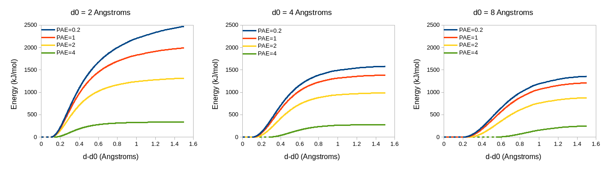

.. _adaptive_restraint_schemes:

Adaptive Restraint Schemes
--------------------------

.. contents::
    :local:

.. _isolde_restrain_distances_cmd:

isolde restrain distances
=========================

Syntax: isolde restrain distances *atoms* [**templateAtoms** *atoms*]
[**protein** *true/false* (true)]
[**nucleic** *true/false* (true)]
[**customAtomNames** *list of names*]
[**perChain** *true/false* (true)]
[**distanceCutoff** *number* (8.0)]
[**alignmentCutoff** *number* (5.0)]
[**wellHalfWidth** *number* (0.1)]
[**kappa** *number* (10.0)]
[**tolerance** *number* (0.025)]
[**fallOff** *number* (2.0)]
[**useCoordinateAlignment** *true/false* (true)]
[**adjustForConfidence** *true/false* (false)]
[**groupName** *string* ("Reference Distance Restraints")]

Creates a "web" of adaptive distance restraints between nearby atoms,
restraining them either to their current geometry or to that of a template.
The *atoms* and *templateAtoms* arguments will be promoted to complete residues.
If *templateAtoms* is not specified, the template is the model itself.

If no template is specified, then *atoms* may simply be any selection from your
model. **(NOTE: if the selection string includes commas, it will need to be
quoted - e.g. isolde restrain distances "#1/A,B")**. If a template *is*
specified, then *atoms* and *templateAtoms* should be matched comma-separated
lists of selections, where the residues within each selection come from a
single chain, e.g. **isolde restrain distances #1/A,#1,B,#1/C:1-50
templateAtoms #2/A,#2/B,#2/C**. The individual chain selections need not have
the same number of residues, but they should of course specify closely related
sequences.

The algorithm ISOLDE uses to determine which atoms to restrain is as follows:

1. The set of atom names to use for restraints is constructed from the
   *protein*, *nucleic* and *customAtomNames* arguments. If *protein* is
   true, the following atom names are added to the list of candidates:
   - CA, CB, CG, CG1, OG, OG1

   If *nucleic* is true, these atoms are added:
   - OP1, OP2, C4', C2', O2, O4, N4, N2, O6, N1, N6

   You may, if you wish, further extend these defaults with a comma-separated
   list of other (non-hydrogen) atom names with the customAtomNames argument,
   but this should rarely be necessary.

If *templateAtoms* is provided and *useCoordinateAlignment* is True, steps 2-6
are performed. Otherwise, steps 4-6 are omitted. If *perChain* is true, only the
**intra** chain distances will be restrained, with no restraints between chains.

2. A sequence alignment is performed for each pair of chains, yielding lists
   of corresponding residues.
3. All residue pairs found in the sequence alignment are merged into a single
   "super-alignment"
4. The largest rigid-body alignment of these residues' "principal atoms"
   (CA for amino acids, C4' for nucleotides) is found for which no principal
   atom is more than *alignmentCutoff* from its counterpart.
5. Within the aligned residues, matching lists are created consisting of
   atoms with allowed names present in both model and template. For each
   atom in the "template" list, all other atoms in the "template" list
   within *distanceCutoff* of the atom (excluding atoms from the same
   residue) are used to set the target distance for a restraint between
   the corresponding atoms in the "model" list.
6. Steps 4 and 5 are repeated on the residues left over from the previous
   round, until no further alignments of at least 3 residues are found.

The remaining arguments relate to the form of the restraint scheme, which
requires some explanation. The functional form is as follows:

.. math::
    E = \kappa *
    \begin{cases}
        0, & \text{if}\ enabled < 0.5 \text{ or}\ |r-r_0| < \tau \\
        1/2 (\frac{\rho}{c})^2, & \text{if}\ \alpha = 2 \\
        ln(\frac{1}{2} (\frac{\rho}{c})^2 + 1), & \text{if}\ \alpha = 0 \\
        \frac{|2-\alpha|}{\alpha} ((\frac{ (\frac{\rho}{c})^2 }{|2-\alpha|} + 1)^\frac{\alpha}{2} - 1), & \text{otherwise}
    \end{cases}

where

.. math::
    \rho =
    \begin{cases}
        |r-r_0|-\tau, & \text{if}\ |r-r_0| > \tau \\
        0, & \text{otherwise}
    \end{cases}

... leading to energy potentials that look like this:

.. figure:: images/adaptive_energy_function.png

If *adjustForConfidence* is True, the template is expected to be a predicted
model with an associated predicted aligned error (PAE) matrix. If the template
was fetched from the AlphaFold database (e.g. using the *alphafold match*
command) then the PAE matrix will be fetched automatically; otherwise you will
have to provide it - you can do so using ISOLDE's "Reference Models" widget, the
ChimeraX "AlphaFold Error Plot" tool (*Tools/Structure Prediction/AlphaFold
Error Plot*), or the ``alphafold pae`` command. Values in the PAE matrix will be
used to adjust the parameters for each individual distance restraint. Pairs with
"perfect" confidence (PAE=0.2) will be assigned the restraint parameters
specified in the command arguments; lower-confidence restraints will be made
both weaker and "fuzzier". Atom pairs with a mutual PAE greater than 4 Angstroms
will not be restrained. The adjustment scheme looks like this:

To interpret this, keep in mind that the force applied to a given atom is
proportional to the *derivative* (that is, the slope) of the energy with
respect to distance. In effect, for a pair of atoms that is close to the target
distance the restraint will act as a simple harmonic spring (with a
"flat-bottom" range defined by *tolerance* over which no force is applied).
Once the interatomic distance deviates from the target by more than
(*wellHalfWidth* + *tolerance*) * target_distance the energy profile begins to
flatten out at a rate specified by :math:`\alpha`.

The value of :math:`\alpha` for a given restraint is determined by the
combination of *fallOff* and the target distance, based on the idea that larger
distances are inherently less certain. Specifically,
:math:`\alpha = 1 -\text{fallOff} ln(\text{target})`. Small (or negative
- **not** generally recommended) values of *fallOff* will cause the restraints
to stay quite strong with increasing distances (like a ball rolling into a
funnel), whereas large values cause them to quickly flatten off (like a golf
ball rolling into its cup - only falling into place when *very* close to the
target).

The parameter *kappa* sets the overall strength of the restraints.
The effective spring constant for a given restraint within its "harmonic" range
is :math:`k=\frac{\kappa}{(\text{wellHalfWidth}*\text{(target distance)})^2}`
:math:`kJ mol^{-1} nm^{-2}`.

The *groupName* argument allows you to, if you wish, create multiple independent
groups of adaptive distance restraints by specifying a unique name for each group. 

isolde restrain single distance
===============================

Syntax: isolde restrain single distance *atoms* *minDist* *maxDist*
[**strength** *number* (20)]
[**wellHalfWidth** *number* ((*minDist*+*maxDist*)/10)]
[**confidence** *number* (-2)]
[**groupName** *string* ("Reference Distance Restraints")]

Restrain the distance between a single pair of atoms. The arguments *minDist*
and *maxDist* specify the range of distances between which no force will be
applied. In other words, the target distance becomes (*minDist*+*maxDist*)/2,
and the tolerance becomes (*maxDist*-*minDist*)/2.

* *strength*: Corresponds directly to :math:`\kappa` in the energy formula.
* *wellHalfWidth*: Corresponds directly to *c* (the half-width of the harmonic
  region) in the energy formula. If not specifies, it defaults to 1/5 of the
  target distance.
* *confidence*: Corresponds to :math:`\alpha` in the energy formula.
* *groupName*: Restraint group to add this restraint to. 

isolde release distances
========================

Syntax: isolde release distances *atoms* [**to** *atoms*]
[**internalOnly** *true/false* (false)]
[**externalOnly** *true/false* (false)] [**longerThan** *number*]
[**strainedOnly** *true/false* (false)] [**stretchLimit** *number* (1.2)]
[**compressionLimit** *number* (0.8)]
[**groupName** *string* ("Reference Distance Restraints")]

Release a selection of adaptive distance restraints. *(NOTE: released restraints
cannot currently be reinstated, but may be re-created using the "isolde restrain
distances" command)*

Calling *isolde restrain distances <selection>* with no other arguments will
simply release all restraints involving any of the specified atoms (including
restraints to atoms outside the selection). The remaining arguments allow fine-
tuning of the selection to release:

* *to* (**incompatible with internalOnly and externalOnly**): if provided, 
  only those restraints between the *to* selection and the main selection 
  will be released.
* *internalOnly* (**incompatible with externalOnly**): if true, only those
  restraints for which both atoms are within the selection will be
  released.
* *externalOnly* (**incompatible with internalOnly**): if true, only those
  restraints connecting atoms within the selection to those outside will be
  released.
* *longerThan*: a value in Angstroms. If specified, only restraints with
  target distances larger than this value will be released.
* *strainedOnly*: if true, only restraints with (length/target) larger than
  *stretchLimit* or smaller than *compressionLimit* will be released.
* *stretchLimit* (**ignored unless strainedOnly is true**): ratio of current
  distance to target distance above which restraints will be released.
* *compressionLimit* (**ignored unless strainedOnly is true**): ratio of
  current distance to target distance below which restraints will be
  released.
* *groupName*: restraint group to which the command will be applied.

isolde adjust distances
=======================

Syntax: isolde adjust distances *atoms* [**internalOnly** *true/false* (false)]
[**externalOnly** *true/false* (false)] [**kappa** *number*]
[**wellHalfWidth** *number*] [**tolerance** *number*] [**fallOff** *number*]
[**displayThreshold** *number*] [**groupName** *string* ("Reference Distance Restraints")]

Adjust the strength and/or display properties of a set of adaptive distance
restraints.

* *internalOnly* (**incompatible with externalOnly**): if true, only those
  restraints for which both atoms are within the selection will be
  released.
* *externalOnly* (**incompatible with internalOnly**): if true, only those
  restraints connecting atoms within the selection to those outside will be
  released.
* *kappa*: see :ref:`isolde_restrain_distances_cmd`
* *wellHalfWidth*: see :ref:`isolde_restrain_distances_cmd`
* *tolerance*: see :ref:`isolde_restrain_distances_cmd`
* *fallOff*: see :ref:`isolde_restrain_distances_cmd`
* *displayThreshold*: deviation from target distance (expressed as a fraction
  of the target distance) below which a given restraint will not be shown. For
  example, to only show restraints deviating more than 10% from their targets,
  set *displayThreshold* to 0.1. To show all restraints, set displayThreshold to
  0.
* *groupName*: restraint group to which the command will be applied.

.. _adaptive_dihedral_restraint_cmd:

isolde restrain torsions
========================

Syntax: isolde restrain torsions *residues*
[**templateResidues** *residues*]
[**backbone** *true/false* (true)] [**sidechains** *true/false* (true)]
[**angleRange** *number* (60.0)] [**alpha** *number* (0.2)]
[**springConstant** *number* (250.0)]
[**identicalSidechainsOnly** *true/false* (true)]
[**adjustForConfidence** *true/false* (true)]

Analogous to :ref:`isolde_restrain_distances_cmd`, this command restrains
dihedral angles **(currently protein only)** to match either their current
values or those of a template, using an adaptive energy function that "gives
up" once the deviation becomes too large. The energy function has a similar
functional form to the von Mises distribution, but is normalised such that the
maximum applied force is independent of the range of angles over which a
restraining force is applied.

The mathematical form of the energy function is:

.. math::

    E_{core} &=
    \begin{cases}
        0, & \text{if}\ enabled < 0.5 \\
        1-\frac{ \sqrt{2} e^{\frac{-1}{2}\sqrt{4\kappa^2+1}-\kappa+\frac{1}{2}}
        e^{\kappa(\cos{(\theta-\theta_0)}+1)-1)}}
        {\sqrt{\sqrt{4\kappa^2+1}-1}}, & \text{if}\ \kappa>0 \\
        -\cos{(\theta-\theta_0)}, & \text{if}\ \kappa=0
    \end{cases} \\
    E_{final} &= k (E_{core} + \alpha*(e^{\sqrt{\alpha}*(E_{core}-1)}(1-\cos{\theta-\theta_0}) )

... which looks like this:

.. figure:: images/adaptive_torsion_energy_function.png

   Adaptive energy function. (a) angleRange=60 (equivalent to kappa=3.46). (b)
   angleRange=120 (equivalent to kappa=0.67)

* *templateResidues*: if supplied, the template will first be sequence-aligned
  to the model, and matching residues will be used to set the target angles.
  Otherwise, the model will simply be restrained to its current conformation.
* *backbone*: if true, backbone *phi* and *psi* angles will be restrained using
  adaptive restraints. The *omega* dihedrals will also be restrained to the
  target using standard non-adaptive dihedral restraints.
* *sidechains*: if true, sidechain *chi* angles will also be restrained.
* *angleRange*: the size of the angle difference allowed before the applied
  force drops away. In practice, this is defined as twice the angle at which the
  applied force reaches a maximum, and is related to *kappa* by:

  .. math::

      \kappa = \frac{1-\tan^{4}(\frac{\text{angle\_range}}{4})}{4\tan^{2}(\frac{\text{angle\_range}}{4})}

  Values of *kappa* less than 0.001 are automatically set to zero to avoid
  numerical instability.
* *springConstant*: effective strength of each restraint when close to the
  target angle, in :math:`kJ mol^{-1} rad^{-2}`
* *identicalSidechainsOnly*: only applicable if *templateResidues* is supplied
  and *sidechains* is true. If true, only sidechains of residues with the same
  identity in model and template will be restrained.
* *adjustForConfidence*: **(only use if the template is an AlphaFold model or 
  similar with pLDDT values in the B-factor column)** Uses the per-residue 
  confidence values to adjust the *angleRange*, *springConstant* and 
  *alpha* values for each restraint. If *angleRange* and *alpha* are left
  blank, their default values are adjusted to 150 and 0.5 respectively; 
  otherwise the user-supplied values become the limiting values applied 
  to residues with pLDDT=100. With default arguments the resulting restraint 
  profile distribution looks like the following. Residues where the template 
  pLDDT is less than 50 will not be restrained.

.. figure:: images/torsion_restraint_plddt_adjustments.png

isolde adjust torsions
======================

Syntax: isolde adjust torsions *residues* [**backbone** *true/false* (true)]
[**sidechains** *true/false* (true)] [**angleRange** *number*]
[**springConstant** *number*]

Adjust the strength or range of restraints previously created by
:ref:`adaptive_dihedral_restraint_cmd` for the selected residues.

* *backbone*: adjust the restraints on backbone torsions?
* *sidechains*: adjust the restraints on sidechain torsions?
* *angleRange*: set the range over which the restraints apply to a new value.
* *springConstant*: set the strength of the restraints to a new value.

isolde release torsions
=======================

Syntax: isolde release torsions *residues* [**backbone** *true/false* (true)]
[**sidechains** *true/false* (true)]

Release restraints previously created by :ref:`adaptive_dihedral_restraint_cmd`
for the selected residues.

* *backbone*: release backbone restraints?
* *sidechains*: release sidechain restraints?
