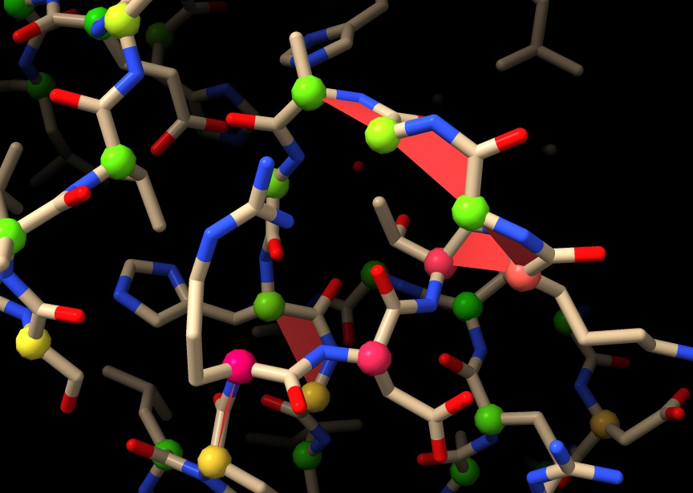

Live Ramachandran validation
============================

The conformation of a protein backbone can be characterised at each residue by
the combination of three torsion angles: *phi* (leading "into" the residue),
*psi* (leading "out") and *omega* (defining the conformation of the peptide
bond plane). While *omega* is restricted to angles near 0 and 180 degrees, *phi*
and *psi* have a larger and more interesting range of possible values.
Analysis of a very large number of high-resolution models has led to the
development of the *Ramachandran plot*, which describes the two-dimensional
probability of finding a residue for any given *phi* and *psi*. While the
original Ramachandran plot was a single catch-all covering all residue types,
modern versions break this down further due to the observations that different
residue types have very different ranges of allowed conformations - with proline
as the most restricted and glycine as the most flexible.

While traditional Ramachandran plots are available via the ISOLDE GUI the  live
Ramachandran markup available via this command does away with these, instead
working directly with the underlying data to provide a real-time  visualisation
of each residue's current conformation via a marker placed on its C-alpha atom.
The marker is coloured according to probability: green indicates  favoured (>2%
prevalence), shading through yellow to hot pink for lower- probability
conformations. Additionally, any peptide bond found in the *cis* conformation or
twisted severely away from the natural planar state is marked with a pseudo-
planar surface (red = *cis* non-proline, green = *cis* proline, yellow =
twisted). The result looks like this:

These indicators automatically update with every change in coordinates.

Syntax: rama [*structures*] [**showFavored** *true/false* (true)]
[**report** *true/false* (false)]

*structures*: if provided, a validator will be added to each of the specified
structures. Otherwise, one will be added to each structure in the ChimeraX
session.

*showFavored*: if true, a markup sphere will be drawn on every residue which
has both *phi* and *psi*. If false, spheres will only be drawn on those
residues with conformations outside of the favoured regions (that is, with
prior probabilities less than 2%).

*report*: if true, a report listing all Ramachandran outliers and *cis*/twisted
peptide bonds will be printed to the log.

.. _`stop`:

rama stop
---------

Syntax: rama stop [*structures*]
Alias: ~rama [*structures*]

Remove any live Ramachandran validators from the specified structures. If
*structures* is not specified, all Ramachandran validators will be removed from
the current ChimeraX session. This command is precisely equivalent to simply
closing the "Ramachandran Validation" model in the Models panel.
