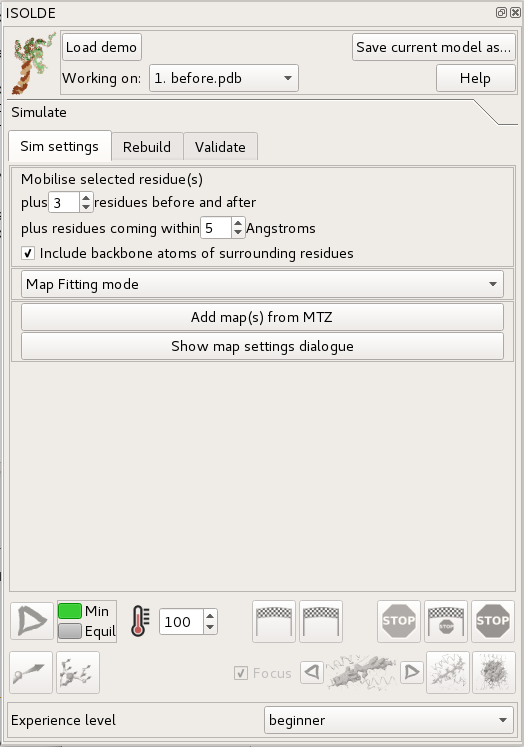
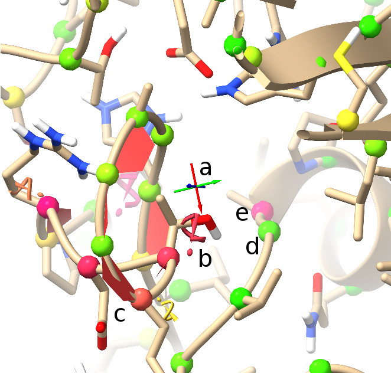

Getting Started
===============

.. contents::
    :local:

Starting ISOLDE
---------------

Assuming you already have ISOLDE installed (if not, you can do so via
*Tools/More Tools...* in the ChimeraX menu), then you can start it up via
*Tools/General/ISOLDE*. This should yield a new floating panel looking something
like this:

*(NOTE: the ISOLDE panel is designed to be similar in size to the ChimeraX Log
panel on most machines, and will "dock" there if dragged onto it. If working
with a single display I recommend doing this.)*
If you already have a model loaded, you'll probably notice that it's gained a
few (but hopefully not **too** many) new features like those in the image below.
If not, go ahead and load a model using the standard ChimeraX interface. If you
have multiple models open, you can choose the one you want to work on using the
"Working on:" drop-down menu at the top-left of the ISOLDE panel.

    Basics of ISOLDE validation markup (*sans* map)

    +---+--------------------------------------------------------------+
    | a | Crosshairs denoting the pivot point of the display. Red,     |
    |   | green and blue point along the x, y and z axes respectively. |
    +---+--------------------------------------------------------------+
    | b | This exclamation mark/spiral motif denotes a rotamer outlier |
    |   | (that is, a sidechain in an unlikely conformation). The more |
    |   | unlikely the conformation, the larger and redder the         |
    |   | indicator becomes. Below and to the left you can see a less  |
    |   | severe "iffy" rotamer.                                       |
    +---+--------------------------------------------------------------+
    | c | The red trapezoids you see here are highlighting non-proline |
    |   | *cis* peptide bonds (where the amide hydrogen and carbonyl   |
    |   | oxygen are pointing in the same direction). In the real world|
    |   | these are vanishingly rare (around 3 per 10,000 amino acid   |
    |   | residues), and real ones tend to be heavily stabilised by    |
    |   | surrounding packing/H-bond interactions (and hence are       |
    |   | usually among the better-resolved sites in the molecule). A  |
    |   | string of non-proline *cis* bonds on a flexible loop as seen |
    |   | here is essentially impossible. When all atoms are shown, the|
    |   | trapezoids can be seen to fill in the "cup" formed by the    |
    |   | C, O, N and CA atoms. The less-rare proline *cis* bonds are  |
    |   | similarly shown in green, and peptide bonds twisted more than|
    |   | 30 degrees from planar in yellow.                            |
    +---+--------------------------------------------------------------+
    |d,e| The protein backbone is not infinitely free to move, but has |
    |   | clearly preferred conformations that have been well          |
    |   | characterised by studying high-resolution structures. The    |
    |   | best-established method for characterising backbone          |
    |   | conformation is via the Ramachandran plot, a plot of the phi |
    |   | (C-N-CA-C) and psi (N-CA-C-N) dihedral angles against each   |
    |   | other. The probabilities of finding different (phi, psi)     |
    |   | combinations have been mapped out in high detail for         |
    |   | various groups of amino acids [MolProbity]_. While ISOLDE    |
    |   | also provides a Ramachandran plot, the current probability   |
    |   | score for each protein residue is mapped in real time to the |
    |   | colour of its alpha carbon (CA) atom as shown. Green denotes |
    |   | a "happy" residue, yellow is marginal (possible, but somewhat|
    |   | strained), and red is a serious outlier (still possible, but |
    |   | needs very strong support to justify it).                    |
    +---+--------------------------------------------------------------+

Preparing a model for simulation
--------------------------------

*(Note: if you just want to load up a model and maps ready to play with, just
click the "Load demo" button in the top left of the ISOLDE panel)*

While getting a clear picture of potential problems in a model is already
somewhat useful, what ISOLDE is really all about is *fixing* them. To do that,
it needs to be able to run molecular dynamics (MD) simulations. This in turn
imposes a few requirements:

  1.  It must consist of residues that the MD engine knows about

      That is, each residue must have a corresponding definition in the MD
      *forcefield* dictating all the details of bond lengths, angles, charges,
      atomic radii etc. At present, simulations are limited to what is provided
      in the built-in AMBER14 forcefield packaged with OpenMM (basically protein,
      nucleic acids, water and metal ions). Support for a wider range of species
      will be added in the near-term future, along with the ability to add
      your own definitions for novel compounds.

  2.  Each individual residue must be complete, including all hydrogens

      (Yes, even water). In MD every atom plays a role - the engine needs every
      atom present to determine what sort of residue it's dealing with.
      Nevertheless, in keeping with the fact that ISOLDE is about model building
      and refinement rather than traditional equilibrium MD, a few artificial
      arrangements are allowed. In particular, it is *not* necessary to "cap"
      dangling N- and C-termini (or 5' and 3' termini in nucleic acids) at chain
      breaks:

      .. figure:: images/nterm.png
        :alt: Dangling N-terminal residue

        This dangling N-terminus is fine

      .. figure:: images/cterm.png
        :alt: Dangling C-terminal residue

        \.. as is this dangling C-terminus

      The most convenient way to add hydrogens (in a manner that follows the
      above rules) is by using the ChimeraX `addh` command. Type "usage addh"
      in the ChimeraX command line for instructions.

      Addition of missing heavy atoms to incomplete residues is a feature that
      is not yet available in ChimeraX/ISOLDE, so for now you'll have to do that
      in another package. Stay tuned!

  3.  Alternative conformations (altlocs - that is, the same atom in two or more
      different places) are not supported. This is usually not a problem, since
      at the resolutions ISOLDE can help the most with altlocs aren't generally
      resolvable in the data anyway!

Adding maps
-----------

ISOLDE is currently optimised for working with maps derived from structure
factors - that is, the set of amplitides and phases describing the Fourier
transform of a real-space map. This is the typical format used for
crystallographic data (which is naturally suited to description in Fourier
space). Map data should be provided as a MTZ file containing amplitudes and
phases for at least one map. These will need to be generated using some external
package - I recommend the PHENIX suite. For crystallographic data you can use
`phenix.maps`. If your resolution is about 3Å or worse I recommend generating
three maps:

  - a standard 2mFo-DFc map;
  - a 2mFo-DFc map with a suitable amount of B-factor sharpening applied; and
  - a mFo-DFc difference map.

If your map is better than ~2Å I would advise replacing the sharpened map with a
smoothed map instead, by providing a negative value for the
`sharpening_b_factor` parameter). This becomes particularly important at very
high resolutions, since MDFF works best when the density has smooth gradients
(as opposed to abrupt "walls") for the atoms to fall down.

Note that for crystallographic maps, inclusion of free reflections when
generating any map that the atoms will "feel" is equivalent to including them
during refinement. In other words, "free" reflections included in the maps will
no longer be truly free, making |Rfree| no longer reliable as a measure
of your model's fit to the data. Therefore, it is strongly advised to leave the
free set out of the map calculations. The input template below  will give you a
suitable set of maps for ISOLDE when used together with *phenix.maps*. Just copy
it into a file  (e.g. *maps.params*) in the same directory as your model and
data files, edit  it where indicated, and run *phenix.maps maps.params*.

.. |Rfree| replace:: R\ :sub:`free`\

If working with a real-space map, it can be conveniently converted to the
correct format using the PHENIX command-line tool
*phenix.map_to_structure_factors* - or, even better, *phenix.auto_sharpen*,
which as the name implies automatically optimises the level of sharpening of
the map as well.

Map files generated as above should "just work" with ISOLDE. If you choose to
use some other tools, be aware that ISOLDE uses some extremely simple name-based
heuristics to decide which data columns belong together, and which maps should
be treated as difference maps. In brief, the name of the phase column should be
identical to the name of the associated amplitude column plus **either** a
prefix or suffix. Amplitude/phase column pairs where the amplitudes are named
"F" or "FWT" or where the name contains "2" will be treated as standard maps;
everything else will be assumed to be a difference map.

To add your map(s), click the "Add map(s) from MTZ" button on the ISOLDE panel.
Then click "Map MTZ:", and navigate to/select your MTZ file in the browser that
opens. Finally, click "Initialise" to add your maps. Note that addition of
multiple MTZ files to the same model is not currently supported.

Template `phenix.maps` input for generation of suitable crystallographic maps:

.. literalinclude:: maps.params
  :language: python

.. [MolProbity] https://doi.org/10.1107/S0907444909042073
