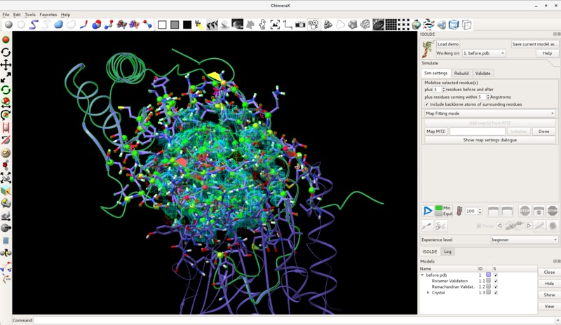
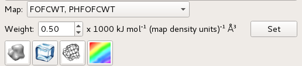
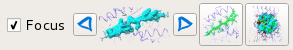
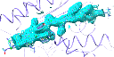
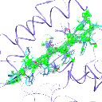
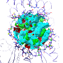

Visualisation and Navigation
============================

.. toctree::
    :maxdepth: 2

.. contents::
    :local:

*(General note: if you open a large model in ChimeraX it will often
automatically switch to its high-quality rendering mode with full shadows and
ambient occlusion. While beautiful, this is sadly too slow to work with ISOLDE.
You can switch back to simple lighting by clicking the yellow spotlight button
in ChimeraX's top panel, or entering "lighting simple" in the ChimeraX command
line)*

General layout
--------------

After loading a model and map (see :ref:`preparing-a-model`) or simply clicking
"Load demo", your ChimeraX display should look something like the screenshot
below (you may need to use the standard ChimeraX atom display controls to set
the atom display styles to your liking first).

    A typical ISOLDE scene. The default background colour in ChimeraX is black
    like in this image, but personally I prefer white and will be using it for
    most of this tutorial. You can change background colour to black, white or
    grey using the square buttons near the middle of the ChimeraX display
    toolbar (top of the ChimeraX window), or ``set bgColor <color>`` in the
    ChimeraX command line if you're feeling adventurous.

*(Helpful hint: display of hydrogen atoms can be adjusted to your preference at
any time using the* ``show`` *and* ``hide`` *commands. For example,*
``show H`` *will show all hydrogens, and* ``hide HC`` *will hide only non-polar
hydrogens.)*

First, let's talk about what's changed in the model itself. Perhaps most
immediately obvious is the change in the appearance of the cartoon: it's now
much thinner than you're probably used to seeing. This is to ensure that it
doesn't get in the way of seeing the atoms themselves, while still providing
valuable information about overall topology and secondary structure.

Next (if you're working with a crystal structure) you might notice that your
model has been joined by one or more darker copies of itself. These are the
symmetry contacts in the crystal lattice. The symmetry atoms are non-interactive
"ghosts" - while they will update instantly when the "real" atoms change, you
cannot select or move them, and they won't contribute to simulations. Hovering
your mouse over one, however, will give you a popup telling you its name and
symmetry operator:

.. figure:: images/symmetry_tooltip.png
    :alt: Symmetry tooltip

    Symmetry atoms know who they are

You'll also note that you can no longer see all of the atoms (nor all of the
map). By default atom display is restricted to residues approaching within 15Å
of the central pivot point, while the map is restricted to a 12Å sphere. You can
adjust the display radius at any time (or simply return to this display mode)
using the ``clipper spotlight`` command. Other display options suited to
isolating issues in low-resolution maps will be discussed  below.

Zooming and Panning
-------------------

*(NOTE: Some ChimeraX functions may change the behaviour of the centre of
rotation to a mode incompatible with the behaviour described below. If you
find things not behaving as they should (e.g. the pivot indicator no longer
remains in the centre of the screen), type ``cofr center showpivot true`` in the
ChimeraX command line or just click the ISOLDE Spotlight Mode button)*

If you've spent some time using ChimeraX before, you've probably already tried
to zoom in using the scroll wheel. That won't work in ISOLDE: since model
building requires regular adjustment of map contours, the scroll wheel is
co-opted to perform that all-important function. A special zoom mode (designed
to bring you inside the model while fading out background details) has instead
been mapped to **shift-right-click-and-drag**. You can adjust the relative
thickness of the slab you view (that is, the distance between front and back
clipping planes) using **shift-scroll**. Panning (that is, translating the
display up-down and left-right) is the ChimeraX standard
**middle-click-and-drag**.

Adjusting the maps
------------------

Adjusting map contour levels is done using **mouse scroll**. The current contour
level along with the map being adjusted will appear in the status bar:

.. image:: images/map_scroll_status.png
    :alt: Status bar on map contour adjustment

To choose which map is re-contoured by scrolling, use **ctrl-scroll**. This will
cycle through the available maps, selecting (i.e. highlighting in green) the
current choice in the GUI window and showing its name in the status bar:

.. image:: images/map_contour_select.png
    :alt: Selecting which map is affected by scrolling

The last chosen map will be remembered for contouring purposes until the next
use of **ctrl-scroll**.

Options for visualisation of individual maps are available via the  *Show map
settings* button on ISOLDE's *Sim settings* tab. That should give you something
like this:

    Control panel for individual map settings

    +------------+-------------------------------------------------------------+
    | *Top left* | Drop-down menu to choose the map to adjust                  |
    +------------+-------------------------------------------------------------+
    | *Top*      | Choose whether or not this map should behave as a MDFF      |
    | *right*    | potential (disabled for live x-ray maps)                    |
    +------------+-------------------------------------------------------------+
    | *Middle*   | How strongly this map "pulls" on atoms. This will be        |
    |            | important later.                                            |
    +------------+-------------------------------------------------------------+
    | |surf|     | Switch to an opaque surface representation                  |
    +------------+-------------------------------------------------------------+
    | |trans|    | Switch to a transparent surface representation              |
    +------------+-------------------------------------------------------------+
    | |mesh|     | Switch to a mesh representation                             |
    +------------+-------------------------------------------------------------+
    | |color|    | Set (a) custom colour(s) (single colour for standard maps,  |
    |            | or two colours for difference maps)                         |
    +------------+-------------------------------------------------------------+

    Personally, I like to display the smoothest of my loaded maps in mesh
    representation at a low contour, and the sharpest in transparent surface
    representation at a higher contour - but this is a matter of individual
    preference.

.. |surf| image:: ../../../src/resources/mapsurf.png
.. |trans| image:: ../../../src/resources/icecube.png
.. |mesh| image:: ../../../src/resources/mesh.png

Selecting atoms
---------------

While ISOLDE is running, it makes a few changes to how mouse-based selection
works. Specifically, only atoms in the currently selected model will be
selectable. Further, while a simulation is running only the mobile atoms will
be selectable. Other than that, behaviour is quite similar to standard ChimeraX:

    * **ctrl-click (and drag)**: select an atom (group of atoms), discarding any
                                 previous selection. Modifiers:

        - **shift** : next selection adds to any existing selection
        - **alt**   : next selection is subtracted from any existing selection.

A very useful built-in ChimeraX feature allows you to grow and shrink your
selection using the keyboard. With some atoms selected, **up arrow** will expand
it first to whole residues, then to whole secondary structure elements, then
whole chains, then the whole model. **Down arrow** will progressively roll back
previous **up arrow** presses. I highly recommend familiarising yourself with
how this works.

Masking the maps
----------------

While the default Spotlight Mode is useful for general "browsing" through your
model, it does not lend itself well to systematic exploration and evaluation /
diagnosis of errors. As the model gets larger and the resolution gets lower, it
gets easier and easier to get lost. Not only that, but it is fairly common for
systematic errors in lower resolution models to span anywhere up to dozens of
residues - trying to evaluate these using the spherical map view can easily
become a frustrating exercise in trying to see the forest through the trees!

This is where the map masking toolbar found at the bottom right of the ISOLDE
panel becomes useful:

    Useful buttons for map/model visualisation

    +---------------+------------------------------------------------------+
    | *Focus*       | If checked, stepping or masking will re-focus the    |
    |               | main view on the atomic selection.                   |
    +---------------+------------------------------------------------------+
    | |stepper|     | Clicking the right (left) arrow button will step     |
    |               | forward (back) through the structure in overlapping  |
    |               | steps of two secondary structure elements at a time  |
    |               | (plus flanking unstructured loops/turns). At each    |
    |               | step the maps are masked to cover the resulting      |
    |               | selection with some surrounding context, while       |
    |               | distant atoms are hidden. If the focus checkbox is   |
    |               | checked, the view will be re-focused on the first    |
    |               | residue in the selection (taking into account the    |
    |               | direction of the step).                              |
    +---------------+------------------------------------------------------+
    | |mask|        | Displays all currently selected atoms plus immediate |
    |               | surrounds and masks the maps to the selection. All   |
    |               | atoms distant to the selection will be hidden.       |
    +---------------+------------------------------------------------------+
    | |spot|        | Returns to spotlight (scrolling sphere) mode.        |
    +---------------+------------------------------------------------------+

You may also isolate any arbitrary selection of atoms using the ``clipper
isolate`` command.

Now that you know your way around, it's time to move on to
:ref:`starting-a-simulation`.
