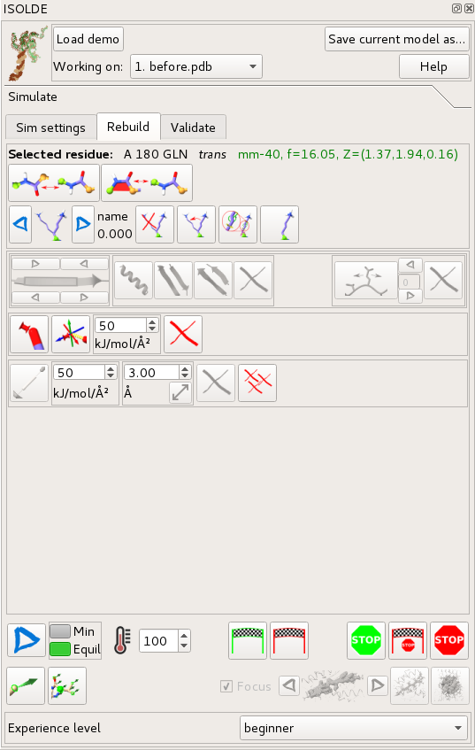
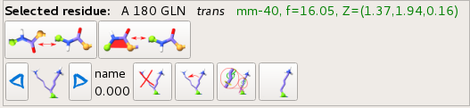
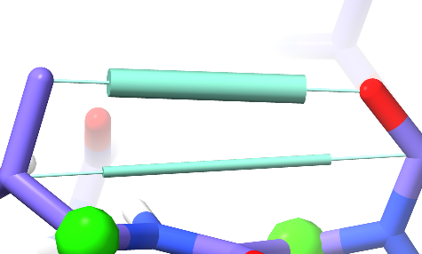

Manipulating your model
=======================

.. toctree::
   :maxdepth: 2

.. contents::
   :local:

Overview
--------

In most cases, most of your time spent with ISOLDE will be on the *Rebuild* tab:

    Where the magic happens.

The buttons on this tab are enabled/disabled depending whether a simulation is
running, and whether the current selection of atoms is suitable for their use.
For example, when the above screenshot was taken a simulation was running, and
a single atom (from Gln180 on chain A) was selected.

There's a lot happening on this tab, so let's break it down bit by bit.

The residue rebuilding toolbar
------------------------------

    This toolbar is only active when all selected atoms come from a single
    protein residue.

    +-----------------+--------------------------------------------------------+
    | Top line        | Basic information about the selected residue: chain ID,|
    |                 | residue number, residue name, peptide bond conformation|
    |                 | (if applicable), rotamer (if applicable). The rotamer  |
    |                 | information provides the name of the nearest named     |
    |                 | rotamer, its frequency of occurrence in the `Top8000   |
    |                 | database`_, and an estimated Z score for each *chi*    |
    |                 | (χ) This information updates with every coordinate     |
    |                 | update, and changes colour according to the rotamer    |
    |                 | probability (favoured=green, allowed=yellow,           |
    |                 | outlier=red).                                          |
    +-----------------+--------------------------------------------------------+
    | |pep_flip|      | Attempt to flip the peptide bond *N*-terminal to the   |
    |                 | selected residue by 180°. This is achieved by applying |
    |                 | temporary dihedral restraints to the φ and ψ dihedrals |
    |                 | flanking the target bond. These will be automatically  |
    |                 | removed when satisfied, or if unable to be satisfied   |
    |                 | after a few dozen simulation updates.                  |
    +-----------------+--------------------------------------------------------+
    | |cis_trans|     | Flip a peptide bond from *cis* to *trans* or           |
    |                 | vice-versa. By design this is the **only** way to      |
    |                 | perform this particular flip: all peptide bonds are    |
    |                 | restrained to the nearest planar configuration at the  |
    |                 | start of each simulation, to avoid accidental          |
    |                 | introduction of flips while aggressively tugging atoms.|
    +-----------------+--------------------------------------------------------+
    | |rot_i|         | Clicking the left and right arrows flanking this icon  |
    |                 | cycles through previews of alternative rotamer         |
    |                 | configurations for the selected residue, sorted in     |
    |                 | order of prevalence. The following buttons act on the  |
    |                 | current preview. (*NOTE: when selecting a rotamer, pay |
    |                 | more attention to how well its shape matches the       |
    |                 | shape of the density than whether it is actually IN    |
    |                 | the density. Often some adjustment of the backbone     |
    |                 | needs to happen to settle it into place - this will    |
    |                 | happen after you make your choice*)                    |
    +-----------------+--------------------------------------------------------+
    | |rot_d|         | Clear and discard the preview.                         |
    +-----------------+--------------------------------------------------------+
    | |rot_c|         | Commit the rotamer directly (set the atoms to the new  |
    |                 | coordinates). **(IMPORTANT: Don't do this if there is  |
    |                 | any sign of a serious clash between the new coordinates|
    |                 | and surrounding atoms. Use the following option        |
    |                 | instead.)**                                            |
    +-----------------+--------------------------------------------------------+
    | |rot_t|         | Push the sidechain towards the desired rotamer using   |
    |                 | restraints on each χ dihedral. This approach avoids any|
    |                 | chance of introducing destabilising clashes. The       |
    |                 | restraint on each dihedral cuts off at two times the   |
    |                 | estimated standard deviation of its angle for the given|
    |                 | target, allowing the residue to relax within its       |
    |                 | natural range of motion. In most cases where your      |
    |                 | map density is reasonable, you can and should release  |
    |                 | the restraints once the sidechain has settled to the   |
    |                 | new configuration.                                     |
    +-----------------+--------------------------------------------------------+
    | |rot_r|         | Release all χ dihedral restraints on this sidechain.   |
    +-----------------+--------------------------------------------------------+
    | |brb|           | Attempt to auto-fit the sidechain to the density using |
    |                 | the `backrub algorithm`_. If multiple MDFF potentials  |
    |                 | are loaded, you can choose which one to use for this   |
    |                 | using the drop-down menu on the right.                 |
    +-----------------+--------------------------------------------------------+

    .. _Top8000 database: http://kinemage.biochem.duke.edu/databases/top8000.php
    .. _backrub algorithm: https://academic.oup.com/bioinformatics/article/24/13/i196/233217
    .. |pep_flip| image:: ../../../src/resources/pep-flip-icon.png
    .. |cis_trans| image:: ../../../src/resources/cis-trans-icon.png
    .. |rot_i| image:: ../../../src/resources/rotamer-preview-icon.png
    .. |rot_d| image:: ../../../src/resources/rotamer-clear-icon.png
    .. |rot_c| image:: ../../../src/resources/rotamer-commit-icon.png
    .. |rot_t| image:: ../../../src/resources/rotamer-set-target-icon.png
    .. |rot_r| image:: ../../../src/resources/rotamer-release-icon.png
    .. |brb| image:: images/backrub_button.png

All user-applied dihedral restraints (other than the always-on restraints on the
peptide bonds) are displayed on the model using a ring-and-post motif as shown
for this lysine rotamer:

.. figure:: images/dihedral_restraints.png
    :alt: Dihedral restraint visualisation

    The difference between the current dihedral angle and the target is
    indicated by the angle between the posts, and the level of satisfaction of
    the restraints is further indicated by colour. The thickness of each
    indicator is proportional to the strength of the restraint.

Fine-tuning your selection
--------------------------

.. figure:: images/extend_or_shrink_selection.png
    :alt: Extend or shrink a selection along a chain

    This toolbar is available if:

        * the current selection encompasses a single residue; or
        * the current selection covers a single continuous chain of amino acid
          residues.

    The blue (red) arrow on the top row shrinks the selection by one residue at
    a time from the *N-* (*C-*) terminus. The arrows on the bottom row grow the
    selection by one residue at a time.

Secondary Structure Toolbar
---------------------------

    This toolbar is only available when the current selection encompasses a
    continuous stretch of amino acid residues. Secondary structure restraints
    are implemented as dihedral restraints on φ and ψ dihedrals, as well as
    distance restraints on CA\ :sub:`n` - CA\ :sub:`n+2` and O\ :sub:`n` -
    N\ :sub:`n+4`.

    +-----------------+--------------------------------------------------------+
    | |sec_helix|     | Restrain the selected residues to α-helix.             |
    +-----------------+--------------------------------------------------------+
    | |sec_anti|      | Restrain the selected residues to anti-parallel        |
    |                 | β-strand.                                              |
    +-----------------+--------------------------------------------------------+
    | |sec_par|       | Restrain the selected residues to parallel β-strand.   |
    +-----------------+--------------------------------------------------------+
    | |red_x|         | Clear secondary structure restraints for the selection.|
    +-----------------+--------------------------------------------------------+

    .. |sec_helix| image:: ../../../src/resources/helix-icon.png
    .. |sec_anti| image:: ../../../src/resources/antiparallel-beta-icon.png
    .. |sec_par| image:: ../../../src/resources/parallel-beta-icon.png
    .. |red_x| image:: ../../../src/resources/red-x-icon.png

When applied, secondary structure restraints appear similar to the example
below (for an α-helix).

.. figure:: images/helix_restraints.png
    :alt: α-helical secondary structure restraints

Register Shifter
----------------

.. figure:: images/register_shift_toolbar.png
    :alt: The register shifting toolbar

    This tool is only available when a simulation is running **and** your
    current selection is a continuous chain of amino acid residues.

    When building into low-resolution density, it is not unusual to come across
    a situation where you discover that you (or your automatic building
    software) have gotten out of step with the density - that is, where some
    stretch of your peptide chain turns out to be one or more positions forward
    or back along the sequence from where it should be. Such stretches are said
    to be "out of register", and can be a real pain to fix by traditional
    methods.

    The residue shifting tool activated by the above toolbar can help with that.
    Make a selection encompassing the stretch in question, dial up the number of
    residues you wish to move by (where a negative number indicates a shift
    towards the *N*-terminus), and hit the button on the left. *(NOTE: this is
    a rather aggressive change you're about to make. Might be a good idea to hit
    the* :ref:`checkpoint button <general-sim-controls>` *first.)*

    The register shifter first releases all existing custom restraints on the
    stretch in question, then applies a set of moving position restraints to the
    N, CA, CB and C atoms. These restraints move smoothly along the path of the
    peptide chain, dragging the atoms along as they go. Once they reach their
    destination the restraints will remain active until you press the red "X" on
    the right, allowing you to check and perform any necessary small cleanups
    before releasing. Pay particular attention to the bulkier sidechains - these
    often need a little human help getting past obstacles.

    While the register shifter is in play, checkpointing is disabled - if you
    decide it was a mistake, clicking the red "X" will re-enable the checkpoint
    buttons allowing you to revert to the last saved checkpoint.

    While in principle any length of peptide chain can be shifted by the
    register shifter, in most cases it's preferable to break the task down into
    manageable chunks of 1-2 secondary structure elements at a time (making sure
    your selection ends at flexible loops to give the shifted residues space to
    move into). In the vast majority of cases this will be enough to cover the
    whole error anyway.

    It is up to you to ensure that there is nothing fundamentally making the
    shift impossible. If the selection you want to shift ends near a fixed
    residue or contains a disulphide bond, for example, the register shifter
    will dutifully attempt to do your bidding anyway - but results will be
    somewhat unpredictable.

Position Restraint Toolbar
--------------------------

.. figure:: images/position_restraint_toolbar.png
    :alt: The position restraint toolbar

    Position restraint addition is only available when a single atom is
    selected. Removal is available when at least one atom is selected.

    +--------------+-----------------------------------------------------------+
    | |pr_cur|     | Restrain the selected atom to its current position with   |
    |              | the given spring constant.                                |
    +--------------+-----------------------------------------------------------+
    | |pr_cen|     | Restrain to the current origin of the pivot indicator with|
    |              | the given spring constant.                                |
    +--------------+-----------------------------------------------------------+
    | |red_x|      | Disable all position restraints for the selected atoms.   |
    +--------------+-----------------------------------------------------------+

    .. |pr_cur| image:: ../../../src/resources/pin-to-current-icon.png
    .. |pr_cen| image:: ../../../src/resources/pin-to-pivot-icon.png

Distance Restraint Toolbar
--------------------------

.. figure:: images/distance_restraint_toolbar.png
    :alt: The distance restraint toolbar

    All but the rightmost button are only available when exactly two atoms are
    selected. The rightmost button is available when at least one atom is
    selected.

    +---------------+----------------------------------------------------------+
    | |dr_set|      | Add a distance restraint between the selected atoms with |
    |               | the given spring constant and target distance.           |
    +---------------+----------------------------------------------------------+
    | |dr_dist|     | Set the target distance to the current distance between  |
    |               | the selected atoms.                                      |
    +---------------+----------------------------------------------------------+
    | |red_x|       | Disable the distance restraint (if present) between the  |
    |               | selected atoms.                                          |
    +---------------+----------------------------------------------------------+
    | |multi_x|     | Remove all distance restraints involving any of the      |
    |               | selected atoms (including restraints to atoms outside the|
    |               | selection).                                              |
    +---------------+----------------------------------------------------------+

    .. |dr_set| image:: ../../../src/resources/distance-restraint-icon.png
    .. |dr_dist| image:: ../../../src/resources/diagonal-arrows.png
    .. |multi_x| image:: ../../../src/resources/multi-x.png

Distance restraints appear in the model as double-ended pistons:

    The length of the central cylinder indicates the target distance, while its
    thickness indicates the strength of the restraint.
