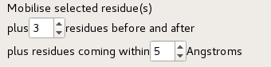
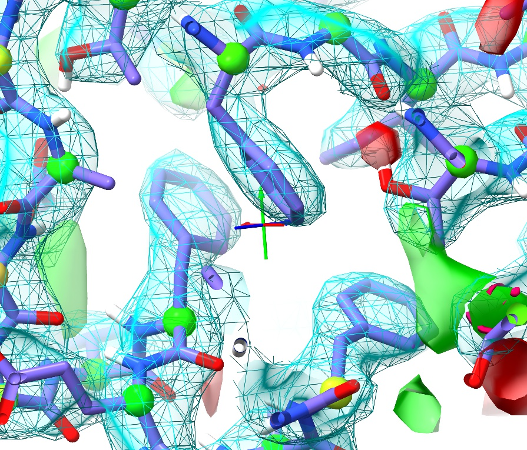
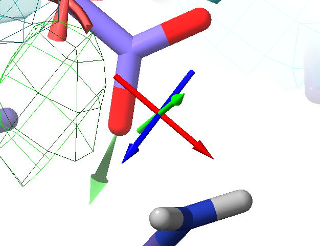
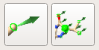
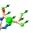

Basic simulation controls
=========================

.. toctree::
    :maxdepth: 2

.. contents::
    :local:

.. _starting-a-simulation:

Starting a simulation
---------------------

Assuming your model meets the reuqirements (that is, all residues are complete
with hydrogens and known to the MD forcefield), then starting a simulation is as
simple as making a selection of atoms in the main ChimeraX window and clicking
the play button in the bottom left of the ISOLDE panel (see below). Your
selection may be anything from a single atom to all atoms in the model, but for
the sake of performance should be as small as necessary to achieve the desired
goal. Of course, the larger the selection the slower the simulation.

The selection size you can make while still achieving reasonably interactive
performance is primarily dependent on your GPU (which does essentially all of
the hard work of running the simulation). As a general reference, my "big"
laptop (a gaming model with Intel Core i7 CPU and a NVidia GTX1070 GPU)
manages about 15-20 coordinate updates per second when simulating all 229
residues of the demonstration model, and maintains reasonably interactive
performance for up to a few thousand residues. Note that *graphics* performance
(that is, responsiveness of the display when rotating, translating, zooming
etc.) is only weakly affected by simulation size, and remains above 30 fps
under most circumstances. My (much) smaller MacBook Air still manages
surprisingly well. Not that I'd actually suggest seriously using such a small
machine for an entire job, but it gives usably interactive performance for a
few dozen residues at a time (sufficient for tweaking rotamers, loops etc.).

The maximum sized model that will successfully run **non** interactively is a
limit I have yet to find, but will typically be limited by the amount of RAM on
your GPU. I can tell you that simulations of the 3,792-residue 3ja8 with its
3.8Å map run successfully on both of the above machines. While in most cases
simulation of the entire model will be far too slow to use interactively, it is
nevertheless often necessary to run it for a few minutes prior to running any
interactive simulations on smaller selections, to ensure any bad clashes and
other very-high-energy states are relaxed out. *(NOTE: for very large models
and/or low-end hardware, initial minimisation of the entire model can take
anywhere up to tens of  minutes. Please be patient - once you see the atoms
start moving it is safe to  stop the simulation and continue working with more
manageable selections)*

Before we go ahead and start a simulation, let's talk briefly about what happens
to your initial selection when you press that play button. That's controlled by
this dialogue on the *Sim settings* tab:

The first spinbox controls how the selection will be extended *along* the
chain(s), while the second controls how the resulting selection will be expanded
*outwards*. The steps taken are:

    1. The initial selection is expanded to complete residues (for any residue
       in which *one* atom was selected, *all* are selected);
    2. For all residues in linear chains (i.e. protein or nucleic acid), each
       contiguous selection is extended forward and backward by the number of
       residues given in the first spinbox, stopping at chain breaks.
    3. Any residue for which any atom comes within the distance given in the
       second spinbox from any atom in the selection defined by (2) is added to
       the selection.
    4. The selection defined by (3) contains all the residues that will be
       mobile in the simulation. In addition, a shell of rigidly-fixed atoms
       is added surrounding the mobile selection, to make sure all mobile atoms
       maintain their physical context in the wider model.
    5. If a distance restraint involves a mobile atom and a second atom which
       *isn't* in the mobile or fixed selections, the residue containing the
       second atom is added to the fixed selection.

The default values are fine for most purposes, but feel free to play. Just keep
in mind that *very* small simulations with only a few mobile residues
surrounded by fixed atoms tend to be somewhat unstable, since they often have
no freedom to relax bad (high-energy) interactions.

Dealing with unrecognised residues
----------------------------------

If ISOLDE encounters a residue it does not recognise while preparing a
simulation, a dialog box like the following will appear:

.. figure:: images/unrecognised_residue_error.png
    :alt: Unrecognised residue error dialog box

Click *Exclude residue from simulations and retry* if you're quite sure that the
residue is a non-standard one without AMBER parameters. The offending residue
will then be ignored for the purposes of all further simulations (but will still
be used for map calculations if working with live x-ray maps). If it is bonded
to any parameterised residues, they will be fixed in space to ensure the ignored
portion remains in context. *(NOTE: you will need to take particular care - e.g.
by using position  restraints - to ensure that surrounding mobile residues are
not pulled into the  density associated with ignored residues.)*

If the residue is one that you think *should* be recognised by the force field,
try using the *Add hydrogens and retry* button. If you're not sure, click
*Abort*. The view will be focused on the offending residue, allowing you to
inspect and diagnose the issue. *(NOTE:* ``addh`` *will occasionally add
spurious hydrogens to terminal residues - particularly N-terminal prolines
and 5' nucleotides. In such cases, you can select the offending hydrogen with*
**ctrl-click** *and then use the command* ``delete sel`` *to remove it.)*

.. _dealing-with-clashes:

Dealing with severe clashes
---------------------------

In a molecular dynamics forcefield, a severe clash (that is, a large overlap of
the van der Waals radii of two non-bonded atoms) can easily yield energies in
the tens of millions of kilojoules per mole. Simply starting a dynamic
simulation with such a clash will yield nothing but a cloud of atoms flying off
to infinity in every direction. For this reason, ISOLDE runs an energy
minimisation at the start of every simulation. While the minimiser is generally
very good at resolving clashes, it can still fail in particularly severe cases
where sidechains are effectively "tangled". If this happens, you will see the
following warning:

.. figure:: images/clash_warning.png
    :alt: Unresolvable clash warning dialog

Clicking *OK* will open the *Clashes* widget on the *Validate* tag, giving you
a list of atoms experiencing particularly large net forces. Clicking on an
entry will take you to the offending residue. Note that the simulation is still
initialised - in many cases the clash can be resolved by adjusting rotamers
via the *Rebuild* tab, at which point you can try continuing the simulation.
In this case, the culprit is a (somewhat artificial) stack of clashing Phe
residues:

.. figure:: images/clashing_phes.jpg
    :alt: badly clashing sidechains

After adjusting the offending sidechains back into density, the simulation
successfully continues:

For more complex cases (in particular, anything that requires deletion of
atoms), you'll need to stop the simulation (see below). One possible remedy is
to temporarily truncate one or more sidechains to alanine (e.g. for
residue 208 on chain A of model 1: ``delete #1/A:208&sideonly&~@CB``). Don't
forget to run ``addh`` after doing this! Remember that you can always add the
sidechains back once you have the backbone geometry under control (see
:ref:`preparing-a-model`). A more extreme solution is to delete one or more
entire residues (``delete #1/A:208``). In this case you'll need to use some
external package to add them back later.

.. _general-sim-controls:

General simulation controls
---------------------------

If you're working with the demo model and you have the whole model selected,
you shouldn't run into any of the above problems. Just go ahead and click the
play button, and let's go through the rest of the buttons in this toolbar:

.. figure:: images/simulation_controls.png
    :alt: Simulation control toolbar

    General simulation controls

    +----------------+---------------------------------------------------------+
    | |play| |pause| | If no simulation is running, starts one. If a simulation|
    |                | *is* running, controls pause/resume.                    |
    +----------------+---------------------------------------------------------+
    | Min/Equil      | Switch the simulation between energy minimisation and   |
    |                | equilibration modes. (*NOTE: due to the way minimsation |
    |                | works under the hood, minimisation is not very          |
    |                | interactive. A quite effective "interactive             |
    |                | minimisation" can be achieved by simply setting the     |
    |                | temperature to 0 Kelvin in equilibration mode*)         |
    +----------------+---------------------------------------------------------+
    | |temp|         | Set the simulation temperature in Kelvin. The default   |
    |                | 100K provides enough thermal motion to help "jiggle"    |
    |                | atoms into more favourable conformations, without moving|
    |                | so fast as to be hard to control. The temperature can   |
    |                | be adjusted to any value between 0 and 500K.            |
    +----------------+---------------------------------------------------------+
    | |cpg|          | Set a "checkpoint" for the current simulation.          |
    |                | A checkpoint is simply a snapshot of the current        |
    |                | simulation, including the atomic coordinates and the    |
    |                | states of all interactive restraints. You should        |
    |                | consider saving a checkpoint whenever you're about to   |
    |                | embark on a tricky or tentative manipulation of your    |
    |                | model. Note that the checkpoint becomes invalid once    |
    |                | the simulation is stopped.                              |
    +----------------+---------------------------------------------------------+
    | |cpr|          | Return to the checkpoint you last saved, discarding all |
    |                | subsequent changes. If you have not saved a checkpoint  |
    |                | yet, this will revert you to the start of the           |
    |                | simulation.                                             |
    +----------------+---------------------------------------------------------+
    | |stopg|        | Stop the simulation, keeping the current state.         |
    +----------------+---------------------------------------------------------+
    | |cps|          | Stop the simulation and revert to the last checkpoint.  |
    +----------------+---------------------------------------------------------+
    | |stopr|        | Abort the simulation, discarding all chainges (this will|
    |                | raise an "are you sure?" warning).                      |
    +----------------+---------------------------------------------------------+

.. |pause| image:: ../../../src/resources/pause_icon.png

.. |cps| image:: ../../../src/resources/checkpoint_stop_red.png

Basic interaction
-----------------

With your simulation running, **right-click-and-drag** on any heavy atom and
you should see it follow your mouse cursor, with a 3D green arrow showing the
direction of pull:

    Interactive tugging forces are shown like this green arrow

This mouse mode is set every time the simulation starts. You can still use the
buttons on the ChimeraX mouse modes toolbar to make the right mouse button do
other things (just avoid anything that actually adds or removes atoms while your
simulation is running), and come back to tugging using the ISOLDE tugging mouse
modes toolbar (at the bottom left of the ISOLDE panel):

    Available tugging modes

    +-------------+------------------------------------------------------------+
    | |tuga|      | **right-click-and-drag** tugs on a single non-hydrogen     |
    |             | atom.                                                      |
    +-------------+------------------------------------------------------------+
    | |tugr|      | **right-click-and-drag** tugs on all heavy atoms in a      |
    |             | residue. The total applied force is the same as when       |
    |             | tugging on a single atom, but is distributed across all    |
    |             | atoms in proportion to their mass.                         |
    +-------------+------------------------------------------------------------+

Adjusting map weightings
------------------------

When any qualifying map is associated with the currently selected model, ISOLDE
automatically prepares it for MDFF and calculates a suitable weighting constant
(see :ref:`adding-maps`). The default weighting is determined as follows:

    1. The map is masked to within 3Å of the model atoms

    2. For each voxel within the mask, the linear gradient of the map density is
       calculated.

    3. The coupling constant is chosen such that (coupling constant) *
       (80th percentile gradient) = (a heuristically determined scaling
       constant).

The default weighting tends to work well for models that are still quite
imperfect, giving the atoms freedom to move while still maintaining control. If
you wish to adjust the weighting, you can do so for any given map using the
tools available under the *Show map settings dialog* button on the *Sim
settings* tab. In particular, as the model improves it often makes sense to
increase the weighting to more tightly optimise the fit. Keep an eye on your
model validation, however - overly-strong map weights will tend to introduce
unphysical distortions to the model as it strives to fit every last bit of
noise.

Trajectory smoothing
--------------------

Molecular dynamics simulations are designed to closely replicate real-world
behaviour of molecules, including random thermal motion. While this is often
quite helpful in that it helps the model "rattle" into the map, the
high frequency frame-to-frame random jitters can become distracting to watch.
By default, ISOLDE therefore provides a smoothed visualisation of the evolving
trajectory, which can be turned on/off and/or adjusted using the button and dial
found at the middle bottom of the ISOLDE widget:

.. figure:: images/trajectory_smoothing.png
    :alt: Trajectory smoothing controls

**(IMPORTANT NOTE: Smoothing has no effect whatsoever on the simulation itself,
just on how you see it.)**
