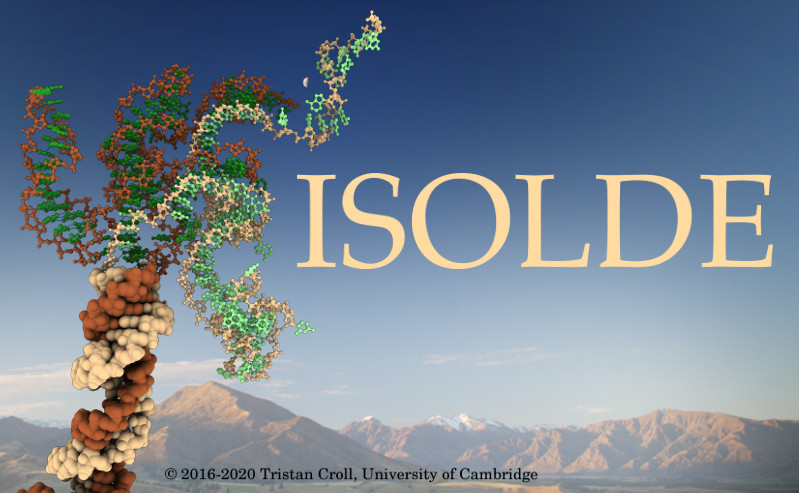

.. ISOLDE documentation master file, created by
   sphinx-quickstart on Sat Apr  7 22:06:03 2018.
   You can adapt this file completely to your liking, but it should at least
   contain the root `toctree` directive.

Interactive Structure Optimisation by Local Direct Exploration
--------------------------------------------------------------

.. toctree::
   :maxdepth: 2

   Home <self>
   tools/ISOLDE
   commands/isolde
   api/isolde
   tools/license
   tools/citing
   tools/contact

Indices and tables
==================

* :ref:`genindex`
* :ref:`modindex`
* :ref:`search`
