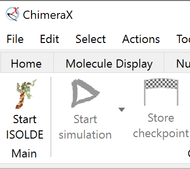
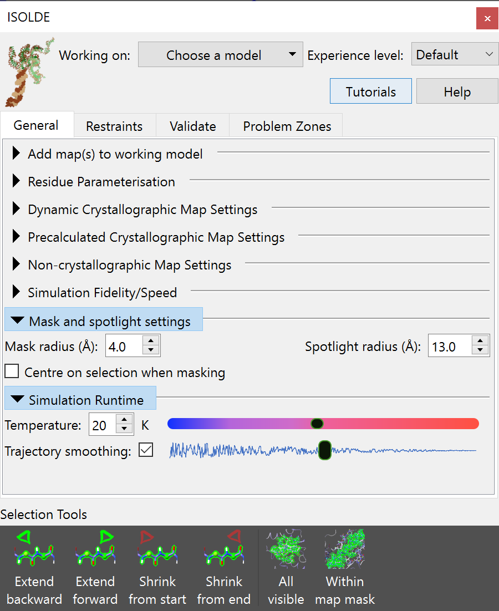
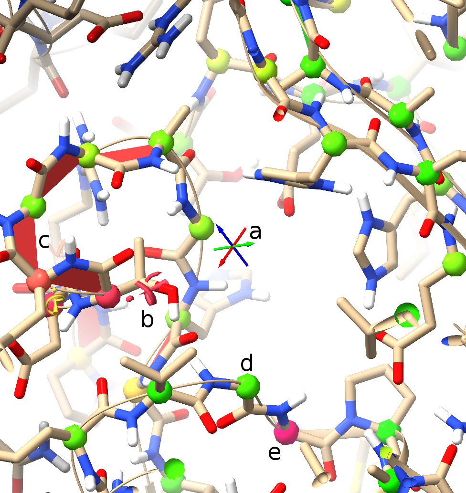
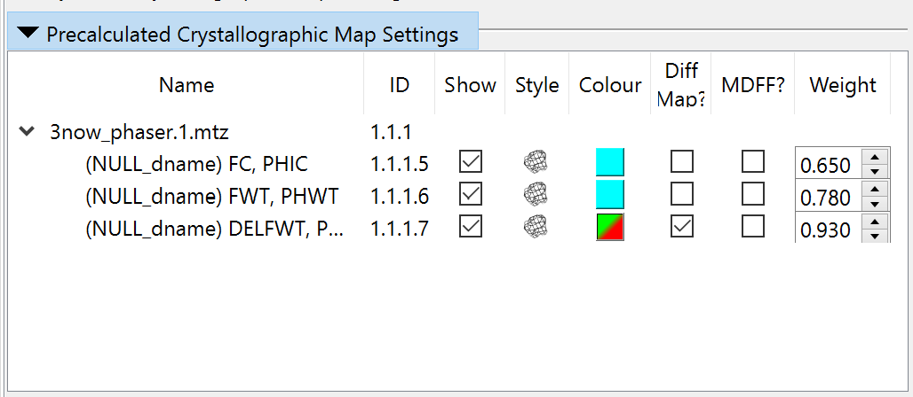
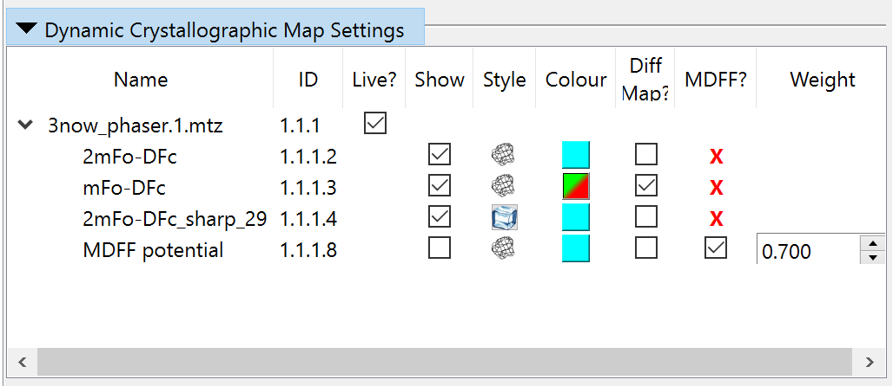

Getting Started
===============

.. toctree::
    :maxdepth: 2

.. contents::
    :local:
    :depth: 3

**(If you are reading this from within the ChimeraX Help browser,
you may prefer trying out the** :ref:`isolde_intro_tutorial` **interactive
tutorial.)**

Starting ISOLDE
---------------

Assuming you already have ISOLDE installed (if not, you can do so via
*Tools/More Tools...* in the ChimeraX menu), then you have three different 
ways to start it up:

* by typing ``isolde start`` in the command line;
* via the ChimeraX top menu: *Tools/General/ISOLDE*; or
* by clicking the "Start ISOLDE" button on the ISOLDE tab of the ChimeraX ribbon menu:

Whichever way you choose, the result should be a new floating panel looking 
something like this:

*(NOTE: the ISOLDE panel is designed to be similar in size to the ChimeraX Log
panel on most machines, and will "dock" there if dragged onto it. If working
with a single display this is highly recommended)*

ISOLDE is designed to only work on a single model at a time. You can choose 
the model to work on using the "Working on:" drop-down menu at the top of the 
ISOLDE panel, or using the ``isolde select`` command. Doing so will trigger a 
few changes. First, the model will be initialised into ISOLDE's default view 
scheme: a greatly-reduced ribbon representation, with a sphere of displayed 
atoms around the display centre. Second, ISOLDE's live geometry markup 
(highlighting suspicious protein backbone and sidechain conformations) will 
be added to the model:

    Basics of ISOLDE validation markup (*sans* map)

    +---+--------------------------------------------------------------+
    | a | Crosshairs denoting the pivot point (centre of rotation) of  |
    |   | the display. Red, green and blue point along the x, y and z  |
    |   | axes respectively. Under normal circumstances the centre of  |
    |   | rotation should remain in the middle of the screen - if for  |
    |   | any reason you find it stops behaving as expected, this      |
    |   | behaviour can be reinstated using the command                |
    |   | ``cofr center showpivot true``.                              |
    +---+--------------------------------------------------------------+
    | b | This exclamation mark/spiral motif denotes a rotamer outlier |
    |   | (that is, a sidechain in an unlikely conformation). The more |
    |   | unlikely the conformation, the larger and redder the         |
    |   | indicator becomes. Below and to the left you can see a less  |
    |   | severe "iffy" rotamer.                                       |
    +---+--------------------------------------------------------------+
    | c | The red trapezoids you see here are highlighting non-proline |
    |   | *cis* peptide bonds (where the amide hydrogen and carbonyl   |
    |   | oxygen are pointing in the same direction). In the real world|
    |   | these are vanishingly rare (around 3 per 10,000 amino acid   |
    |   | residues), and real ones tend to be heavily stabilised by    |
    |   | surrounding packing/H-bond interactions (and hence are       |
    |   | usually among the better-resolved sites in the molecule). A  |
    |   | string of non-proline *cis* bonds on a flexible loop as seen |
    |   | here is essentially impossible. The less-rare proline *cis*  |
    |   | bonds are similarly shown in green, and peptide bonds twisted|
    |   | more than 30 degrees from planar in yellow.                  |
    +---+--------------------------------------------------------------+
    |d,e| The protein backbone is not infinitely free to move, but has |
    |   | clearly preferred conformations that have been well          |
    |   | characterised by studying high-resolution structures. The    |
    |   | best-established method for characterising backbone          |
    |   | conformation is the Ramachandran plot, a plot of the *phi*   |
    |   | (C-N-CA-C) and *psi* (N-CA-C-N) dihedral angles against each |
    |   | other.                                                       |
    |   |                                                              |
    |   | The probabilities of finding different (*phi, psi*)          |
    |   | combinations have been mapped out in high detail for         |
    |   | `various groups of amino acids`__. While ISOLDE              |
    |   | also provides a Ramachandran plot, the current probability   |
    |   | score for each protein residue is mapped in real time to the |
    |   | colour of its alpha carbon (CA) atom as shown. Green denotes |
    |   | a "happy" residue, yellow is marginal (possible, but somewhat|
    |   | strained), and red is a serious outlier (still possible, but |
    |   | needs very strong support to justify it).                    |
    +---+--------------------------------------------------------------+

__ https://doi.org/10.1107/S0907444909042073

*(Note: The rotamer, peptide bond and Ramachandran markups described above
update automatically whenever the atomic coordinates change. As long as you have
ISOLDE installed, you can add them to any loaded model using the* ``rama`` *and*
``rota`` *commands)*

.. _preparing-a-model:

Preparing a model for simulation
--------------------------------

*(Note: if you just want to load up a model and maps ready to play with, use the
command* ``isolde demo crystal_intro`` *)*

While getting a clear picture of potential problems in a model is already
somewhat useful, what ISOLDE is really all about is *fixing* them. To do that,
it needs to be able to run molecular dynamics (MD) simulations. This in turn
imposes a few requirements:

  1.  It must consist of residues that the MD engine knows about

      That is, each residue must have a corresponding definition in the MD
      *forcefield* dictating all the details of bond lengths, angles, charges,
      atomic radii etc. The version of the AMBER forcefield built in to ISOLDE
      supports protein, nucleic acid, most common sugars, water, metal ions, and
      approx. 13,000 of the more common ligands in the Chemical Components
      Dictionary. If your ligand is not recognised, it may still be possible to 
      parameterise it in ISOLDE using the "Residue Parameterisation" widget on 
      ISOLDE's General tab (see below). Otherwise, if you are familiar with 
      MD parameterisation you can provide your own AMBER-compatible parameters 
      in the `OpenMM ffXML format`__ via the "Load residue parameters" button 
      in the same widget (this can also be used to load any parameters you 
      generated in a previous session).

      __ http://docs.openmm.org/7.0.0/userguide/application.html#creating-force-fields

      One important current limitation is that parameterisation of custom 
      ligands which covalently bind to one or more other residues is *not*
      supported.

  2.  Each individual residue must be complete, including all hydrogens

      (Yes, even water). In MD every atom plays a role - the engine needs every
      atom present to determine what sort of residue it's dealing with.
      Nevertheless, in keeping with the fact that ISOLDE is about model building
      and refinement rather than traditional equilibrium MD, a few artificial
      arrangements are allowed. In particular, it is *not* necessary to "cap"
      dangling N- and C-termini (or 5' and 3' termini in nucleic acids) at chain
      breaks:

      .. figure:: images/nterm.png
        :alt: Dangling N-terminal residue

        This dangling N-terminus is fine

      .. figure:: images/cterm.png
        :alt: Dangling C-terminal residue

        \.. as is this dangling C-terminus

      Additionally, for all protein residues other than proline, sidechain
      truncations to CA, CB, CG or CD are allowed. For truncations that 
      ISOLDE doesn't support, the "Unparameterised Residues" widget on 
      ISOLDE's Validation tab can be used to fill in the missing atoms.

      The most convenient way to add hydrogens (in a manner that follows the
      above rules) is by using the ChimeraX ``addh`` command. Type ``usage addh``
      in the ChimeraX command line for complete instructions, but in most cases
      the straightforward ``addh`` will give you the most desirable result.
    

      *(Note: if you have metal ions present and your geometry is not perfect,
      you may find* ``addh`` *refusing to protonate one or more nearby peptide
      nitrogens. The resulting incomplete residue will be flagged by ISOLDE's 
      Unparameterised Residues widget, which can be used to build in the missing
      hydrogen. Incorrect geometry on ligands is another common cause of*
      ``addh`` *errors. In these cases you can either correct them with 
      the Unparameterised Residues widget, or delete hydrogens and try again 
      with* ``addh template true`` *to tell ChimeraX to use the reference 
      geometry stored in the Chemical Components Dictionary to define 
      the chemistry.)*

      In general, I recommend adding sidechains wherever possible - even if
      there is minimal density to support them, in the MD environment the
      contributions from each sidechain generally help in maintaining the
      geometry of surrounding residues. Sidechains can be conveniently rebuilt
      using the `swapaa` mouse mode provided by ChimeraX and found in the "Right
      Mouse" tab in the menu ribbon above the  main GUI:

      .. figure:: images/swapaa.png
        :alt: SwapAA mouse mode icon

      Right-clicking on a protein atom and dragging up/down will iterate through
      building all standard amino acid residues. Using this tool to simply
      "mutate" the residue to its own identity will give you a complete
      sidechain.

      **(NOTE: You should not perform edits that add or remove atoms
      while a simulation is running.)**

  3.  Alternative conformations (altlocs - that is, the same atom in two or more
      different places) are not currently supported. This is usually not a
      problem, since at the resolutions ISOLDE can help the most altlocs aren't
      generally resolvable in the data anyway! Any defined altlocs remain with 
      the model and will be written to the output, but cannot be visualised. This 
      can of course be dangerous - any large rearrangement will act only on the 
      *current* altloc, leaving the other invisibly in its original position. 
      For this reason, ISOLDE checks for the presence of altlocs when initialising 
      a model, and offers to remove them if present.

.. _adding-maps:

Adding maps
-----------

The primary use of ISOLDE is of course the fitting and refinement of an atomic
model into one or more experimental maps. This is achieved via an interactive
implementation of `molecular dynamics flexible fitting (MDFF)`__. In brief, MDFF
converts your map into a field of potential energies overlaid on a molecular
dynamics simulation, with each atom feeling a force proportional to the energy
gradient at its current position. In effect, this causes atoms to "fall" into
the high-density regions of the map.

__ https://www.ncbi.nlm.nih.gov/pmc/articles/PMC2430731/

ISOLDE is designed with the aim of seamless operability between direct
real-space maps (e.g. as generated from cryo-EM experiments) and maps calculated
from reciprocal-space data (typically derived from x-ray crystallography).
Depending on your needs, three general types of maps are supported as described
below, and a model may be associated with any combination (and any number,
memory permitting) of these map types.

Real-space maps
~~~~~~~~~~~~~~~

**(NOTE: within ChimeraX, you may prefer to familiarise yourself with the
use of real-space maps in the interactive** :ref:`bulk_fitting_tutorial` 
**tutorial.)**

Any real-space map format recognised by ChimeraX can be used as a MDFF
potential by ISOLDE with a few simple steps. Simply load your map along 
with your model, e.g.

``open 6eyd; open 3983 from emdb``

If the model and map are not perfectly aligned, you can easily obtain an
optimised rigid-body fit using ChimeraX's ``fitmap`` command.

``fitmap #1 inMap #2``

**(NOTE: by default, fitmap fits the model by changing the rigid-body 
transform mapping model coordinates to scene coordinates, rather than 
changing the model coordinates themselves. ISOLDE, on the other hand,
for performance reasons expects the map(s) and model to be in the same 
absolute reference frame (with model coordinates identical to scene 
coordinates). For this reason, you should do any rigid-body fitting
BEFORE selecting the model for ISOLDE - upon initialisation the model 
coordinates will be updated to place the model in the same absolute 
frame as the map. If you have good reason to do a rigid-body shift 
AFTER initialising the model, adding the argument "moveWholeMolecules false"
will tell fitmap to update coordinates without changing the transform.)**

Once aligned, the map may be associated with the model either by using the
"Add map(s) to working model" widget on the ISOLDE General tab, or

``clipper associate #2 to #1``

This should change your view of the model and map from something like this:

.. figure:: images/6eyd_with_map_initial.png
    :alt: Default ChimeraX model/map view

to a visualisation mode similar to the traditional crystallographic view:

.. figure:: images/6eyd_with_map_clipper.png
    :alt: View after registering map with Clipper

    Default Clipper/ISOLDE "spotlight" model/map view. The map appears as a
    sphere of density around the centre of rotation. Residues with atoms within
    the spotlight radius have their atoms shown; the remainder of the molecule
    is shown as a minimalist cartoon. You can adjust the spotlight radius using
    the command ``clipper spotlight radius <radius>`` or using the "Mask and
    spotlight settings" widget on ISOLDE's General tab - but keep in mind that
    large radii will begin to cause noticeable lag in navigation.

Upon registration, ISOLDE automatically registers the map as a MDFF potential.
The coupling constant (defining how strongly the map "pulls" on atoms) is
automatically set by analysis of the gradients in the region close to the
atomic model.

X-ray maps (or other maps calculated from Fourier coefficients)
~~~~~~~~~~~~~~~~~~~~~~~~~~~~~~~~~~~~~~~~~~~~~~~~~~~~~~~~~~~~~~~

An x-ray crystallography experiment yields a set of measured intensities
corresponding to the amplitude component of the Fourier transform of the
electron density in the crystal environment. In order to generate a real-space
map, the amplitudes must be combined with a matching set of phases. The core
challenge in crystallography is that the original phase information is not
measurable, and hence estimates must be obtained by other means. Historically,
initial phases were typically obtained either by molecular replacement with the
conserved cores of close homologues, and/or anomalous scattering by one or more
types of heavy atom in the crystal. In the modern era of reliable protein
structure prediction, by far the most common method is molecular replacement
using the high-confidence components of predicted models. The initial phases are
then improved by building and refining your model into the map - as the quality
of the model improves, the quality of the map improves, allowing further
improvement to the model, etc..

Initial solution of the phase problem (e.g. with the aid of `Phaser`_) should 
have already happened before you load your model into ISOLDE. If the molecular 
replacement solution is marginal and/or highly incomplete, it would be a good 
idea to use an auto-building tool such as `phenix.autobuild`_ to extend it first. 
See :ref:`alphafold_mr_tutorial` to see how you can use the molecular replacement 
solution to relatively quickly fit a complete predicted model to the data.
  
.. _Phaser: https://scripts.iucr.org/cgi-bin/paper?he5368

.. _phenix.autobuild: https://phenix-online.org/documentation/reference/autobuild.html

When loading structure factors, you have two choices:

* Use "live" maps calculated directly from your model and the experimental
  amplitudes (preferred); or
* Use "static" maps derived from pre-calculated amplitudes and phases
  (e.g. as output from *Phaser*, `phenix.refine`_ or `phenix.maps`_).

.. _phenix.refine: https://phenix-online.org/documentation/reference/refinement.html

.. _phenix.maps: https://phenix-online.org/documentation/reference/maps.html

Both options have their own pros and cons, and are described in detail below.
In either case, the input is an MTZ file. ISOLDE will automatically generate
live or static maps (or a combination of both types) depending on what it
finds in the loaded file. Crystallographic maps may be added to the model
currently selected in ISOLDE using the "Add map(s) to working model" widget,
or added to any atomic model using a command such as:

``open reflections.mtz structureModel #1``

Multiple crystallographic datasets may be associated with a single model, as
long as the space group and cell dimensions match. Maps will be generated for
each data column recognised by the Clipper plugin. Any unwanted maps may be
safely closed via ChimeraX's model panel:

.. figure:: images/model_panel_complex_dataset.png
    :alt: A rather over-complicated map arrangement

    The ChimeraX model panel showing six crystallographic maps and one non-
    crystallographic map associated with an atomic model. The unwanted maps may
    be closed by selecting their entry in the tree then clicking the "Close"
    button at top right. You can close an entire crystallographic dataset by
    selecting the corresponding entry with name starting "Crystallographic maps".

Static (pre-calculated) crystallographic maps
^^^^^^^^^^^^^^^^^^^^^^^^^^^^^^^^^^^^^^^^^^^^^

**(WARNING: in many refinement packages (including Phenix) the default behaviour
is to include the free reflections when generating maps for visualisation and
manual model building. By Parseval's theorem this is equivalent in effect to
including these reflections when refining in reciprocal space. While this may be
OK when changing only a small fraction of the model, a typical MDFF session
re-fits every atom to the map. While there is still some argument as to the
final effect of this, using maps including the free set WILL render Rfree and
Rfree-Rwork unreliable as measures of the quality of fit. Unfortunately there
is no way to determine whether an arbitrary set of amplitudes and phases
includes the free set or not, so it is up to you to ensure that free reflections
are NOT included. A template for a suitable phenix.maps input file is provided
below. For the above reasons, all static maps will be disabled as MDFF
potentials by default, and must be explicitly enabled for simulation using the
controls in the "Precalculated Crystallographic Map Settings" widget.)**

The Clipper plugin uses some very simple name-based heuristics to decide whether a
given set of amplitudes and phases are normal (2Fo-Fc) or difference (Fo-Fc) maps.
If it gets this wrong, you can change it on the "Precalculated Crystallographic
Map Settings" widget (where you can also adjust display styles and colours): 

Live crystallographic maps
^^^^^^^^^^^^^^^^^^^^^^^^^^

**(NOTE: While ISOLDE's live crystallographic maps work well in the majority of 
cases, there is currently no handling of severe data pathologies such as twinning,
strong translational non-crystallographic symmetry, strong ice rings, etc.. In 
such cases your choices are to work with maps pre-calculated using a package 
designed to handle these, or to pre-process the F/sigF data elsewhere to reduce 
the effects of these problems.)**

If your MTZ file contains experimental intensities (I/sigI) or amplitudes
(F/sigF), then a set of live sigma-a weighted crystallographic maps will be
generated directly from the combination of these with phases calculated from the
atomic model. Unlike with the pre-calculated maps, any changes to the atomic
model automatically triggers a recalculation of all live maps. This happens in
the background, with minimal effect on graphical performance other than a slight
hitch when the visualisation of the new maps is loaded in.

*(NOTE: live updating for a given dataset can be toggled using the checkbox in 
the "Live?" column of the "Dynamic Crystallographic Map Settings" widget.)*

*(NOTE: live map updates do not update the MDFF potential - that is, the fitting
force the mobile atoms feel - while a simulation is running. The potential will
only change on starting a new simulation.)*

Besides the obvious advantage of providing near-real-time feedback on your model
improvement progress, working directly with the experimental data ensures that 
ISOLDE knows and controls exactly what goes into each map. Three maps will be 
generated for visualisation purposes:

* a standard 2mFo-DFc map
* a 2mFo-DFc map with a moderate amount of B-factor sharpening or
  smoothing applied (with the amount of sharpening/smoothing decided
  heuristically based on resolution)
* a mFo-DFc difference map

Each of the above maps is generated using the full set of reflections, and for
this reason is blocked from use as a MDFF potential. Instead, ISOLDE also
creates a special map (helpfully named "(LIVE) MDFF potential") optimised for
use as a MDFF potential (including exclusion of the free set). This map is
hidden by default, but can be displayed via the Model Panel or the "Dynamic
Crystallographic Map Settings" widget at any time.

`phenix.maps` template
^^^^^^^^^^^^^^^^^^^^^^

.. literalinclude:: maps.params
    :language: python
