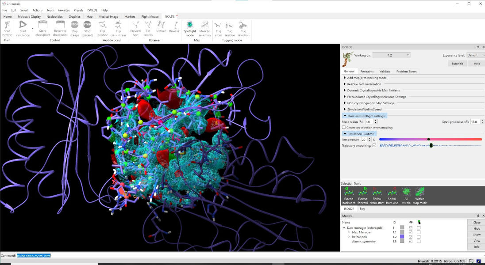

Visualisation and Navigation
============================

.. toctree::
    :maxdepth: 2

.. contents::
    :local:

**(NOTE: if you're viewing this from within ChimeraX, you may prefer using one
of the the interactive introductory** :ref:`isolde-tutorials` **to acquaint
yourself with ISOLDE's controls.)**

General layout
--------------

After loading a model and map (see :ref:`preparing-a-model`), your ChimeraX
display should look something like the screenshot below.

    A typical ISOLDE scene. The default background colour in ChimeraX is black
    like in this image, but personally I prefer white and will be using it for
    most of this tutorial. You can change background colour to black, white or
    grey using the square buttons near the middle of the ChimeraX display
    toolbar (top of the ChimeraX window), or ``set bgColor <color>`` in the
    ChimeraX command line if you're feeling adventurous.

*(Helpful hint: display of hydrogen atoms can be adjusted to your preference at
any time using the* ``show`` *and* ``hide`` *commands. For example,*
``show H`` *will show all hydrogens, and* ``hide HC`` *will hide only non-polar
hydrogens.)*

First, let's talk about what's changed in the model itself. Perhaps most
immediately obvious is the change in the appearance of the cartoon: it's now
much thinner than you're probably used to seeing. This is to ensure that it
doesn't get in the way of seeing the atoms themselves, while still providing
valuable information about overall topology and secondary structure.

Next (if you're working with a crystal structure) you might notice that your
model has been joined by one or more darker copies of itself. These are the
symmetry contacts in the crystal lattice. The symmetry atoms are non-interactive
"ghosts" - while they will update instantly when the "real" atoms change, you
cannot select or move them, and they won't contribute to simulations. However,
you can still do useful things with them. Hovering your mouse over one will
give you a popup telling you its name and symmetry operator:

.. figure:: images/symmetry_tooltip.png
    :alt: Symmetry tooltip

    Symmetry atoms know who they are

\... while double-clicking one will re-centre the view on its equivalent atom 
in the "real" model.

You'll also note that you can no longer see all of the atoms (nor all of the
map). By default atom display is restricted to residues approaching within 16Å
of the central pivot point, while the map is restricted to a 13Å sphere. You can
adjust the display radius at any time using the "Mask and Spotlight Settings" 
widget on ISOLDE's General tab:

\... or using the command ``clipper spotlight radius {value in Angstroms}``.
Other display options suited to isolating issues in low-resolution maps will be
discussed below.

Zooming and Panning
-------------------

Just like in the rest of ChimeraX, you can zoom in and out using your mouse
scroll wheel. There is, however, one key difference: you will find now that the
front and rear clipping planes move closer together when zooming in, and further
apart when zooming out. Where the standard ChimeraX zoom mode looks at the
molecule from outside (akin to looking through an ultra-powerful microscope),
this mode is designed to bring you *inside* the molecule to better focus on the
atomic details. You can adjust the distance between the clipping planes with
**shift-scroll**. Panning (that is, translating the display up-down and
left-right) is the ChimeraX standard **middle-click-and-drag**.

Adjusting the maps
------------------

Adjusting map contour levels is done using **alt-scroll**. The current contour
level along with the map being adjusted will appear in the status bar:

.. image:: images/map_scroll_status.png
    :alt: Status bar on map contour adjustment

To choose which map is re-contoured by scrolling, use **ctrl-scroll**. This will
cycle through the available maps, selecting (i.e. highlighting in green) the
current choice in the GUI window and showing its name in the status bar:

.. image:: images/map_contour_select.png
    :alt: Selecting which map is affected by scrolling

The last chosen map will be remembered for contouring purposes until the next
use of **ctrl-scroll**.

Options for visualisation of individual maps are available via the *Dynamic
Crystallographic Map Settings*, *Precalculated Crystallographic Map Settings*,
and *Non-crystallographic Map Settings* widgets on ISOLDE's *General* tab. These
widgets are very similar to each other; we'll just use the dynamic maps version 
for illustration here.

.. figure:: images/dynamic_maps_panel.png

============== =============================================================
Column         Function
============== =============================================================
Name           Provides both the name of each map, and (for crystallographic
                maps) the structure factor file they derive from.

ID             The identifier for each map/map set in the ChimeraX models 
                hierarchy. You can use this on the command-line when you 
                need to refer to specific maps.

Live?          (Specific to dynamic maps)
                Controls whether to automatically recalculate structure 
                factors and maps for this map group when the model changes.

Show           Controls the visibility of each map.

Style          Controls the representation of each map. Options are 
                wireframe (|mesh|), transparent surface (|trans|) or 
                opaque surface (|surf|).

Colour         Set the map colour(s) (one for a normal map,
                two for a difference map).

Diff map?      Choose whether this map should be shown as a normal map 
                (single contour) or difference map (+/- contours).

MDFF?          Control whether a map is to be used as a fitting potential.
                A red X in this column means the corresponding map is not 
                suitable for MDFF.

Weight         The coupling constant defining how strongly the map will 
                pull on model atoms (normalised to the overall map RMSD).
============== =============================================================
     

.. |trans| image:: images/icecube.png
          :width: 20

Selecting atoms
---------------

While ISOLDE is running, it makes a few changes to how mouse-based selection
works. Specifically, only atoms in ISOLDE's current working model will be
mouse-selectable. Further, while a simulation is running only the mobile atoms will
be mouse-selectable. Other than that, behaviour is quite similar to standard ChimeraX:

    * **ctrl-click (and drag)**: select an atom (group of atoms), discarding any
      previous selection. Modifiers:

        - **shift** : next selection adds to any existing selection
        - **alt**   : next selection is subtracted from any existing selection.

A very useful built-in ChimeraX feature allows you to grow and shrink your
selection using the keyboard. With some atoms selected, **up arrow** will expand
it first to whole residues, then to whole secondary structure elements, then
whole chains, then the whole model. **Down arrow** will progressively roll back
previous **up arrow** presses. I highly recommend familiarising yourself with
how this works.

Navigating and Masking
----------------------

While the default Spotlight Mode is useful for general "browsing" through your
model, it does not lend itself well to systematic exploration and
evaluation/diagnosis of errors. As the model gets larger and the resolution gets
lower, it gets easier and easier to get lost. Not only that, but it is fairly
common for systematic errors in lower resolution models to span anywhere up to
dozens of residues - trying to evaluate these using the spherical map view can
easily become a frustrating exercise in trying to see the forest through the
trees!

ISOLDE provides a number of different tools to ease these challenges. For 
systematic end-to-end exploration of a model there is the ``isolde step`` 
command which will take you residue-by-residue through all polymeric chains.
To isolate a complex region from the rest of the model and map, you can use 
the "Mask to selection" button on ISOLDE's top ribbon menu:

Select the atoms you want to isolate then click "Mask to selection" to show 
only those residues and their immediate neighbours, and mask the map to cover 
the selection:

The same funcionality is available through the ``clipper isolate`` command. 
Click the "Spotlight mode" button or enter the command ``clipper spotlight``
to return to the default visualisation behaviour.

Now that you know your way around, it's time to move on to
:ref:`starting-a-simulation`.
