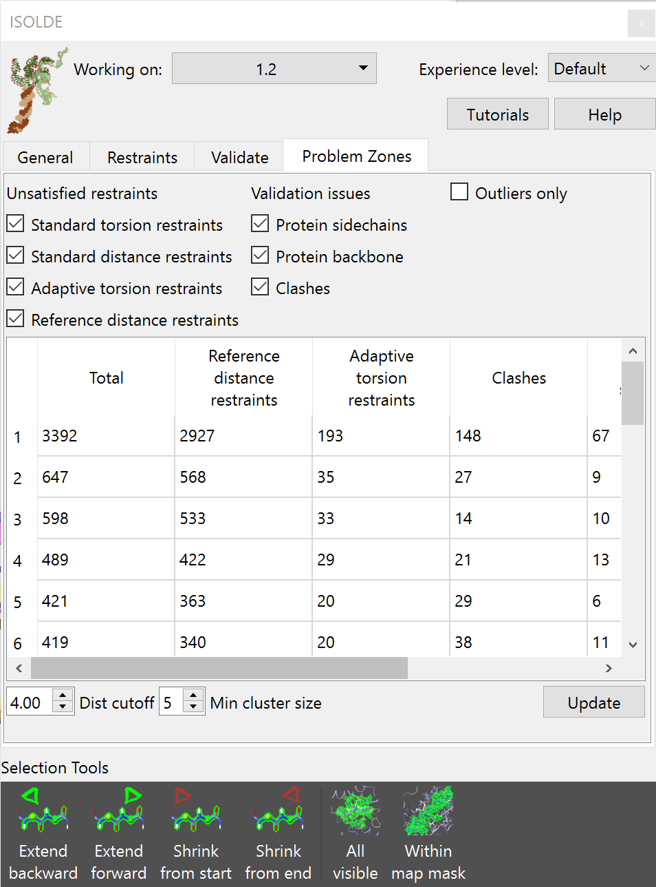

Identifying problem "hotspots"
==============================

.. toctree::
    :maxdepth: 2

.. contents::
    :local:

Overview
--------

At the early stages of model building where many things may be wrong with your
model, working through residue-by-residue is rarely the best use of your time.
Rather, you want to find and fix the biggest problems first - because once those
are sorted out, the remaining clean-up generally becomes much, much easier.
While one approach might be to browse through the Ramachandran and rotamer
validation tools to inspect outliers one-by-one, arguably a more productive
solution is to look for regions where many problems (whether they be geometry
outliers, clashes or violations of reference-model restraints) are clustered in
the same space. It is often the case that such clusters all share the same root
cause - fix that, and many other things will fix themselves. This is where the
*Problem Zones* tab comes in:

    A particularly populated problem zone tab from the
    :ref:`alphafold_reference_tutorial` tutorial.

Under the hood, this tool uses a spatial clustering algorithm known as
`DBSCAN`_. This has two controllable parameters (*Dist cutoff* and *Min cluster
size*) which you can adjust using the combo boxes underneath the table. The
algorithm works as follows:

For each "problem" point, a sphere with radius *dist cutoff* is searched for 
other problem points. If the resulting group (including the original point)
has at least *min cluster size* points, it is considered to be the start of 
a *cluster*. Otherwise, if the group has at least two members it is considered
an *edge*; otherwise it is disregarded as *noise*. Once all initial clusters 
are found, they are merged: any clusters that share at least one point become 
part of a new supercluster. Once all possible clusters are merged, edge groups 
are merged into nearby clusters on the same basis (i.e. if an edge shares at 
least one point with a cluster, it becomes part of that cluster). Each edge group
will only be assigned to one cluster - if it shares points with more than one,
the cluster it is assigned to will be random. 

The default values for *dist cutoff* and *min cluster size* tend to work well 
in the presence of reference model restraints due to the sheer number of restraints
typically involved. In the absence of those, you are encouraged to experiment with 
the values - increasing *dist cutoff* in particular is useful for identifying 
more sparsely-populated clusters.

In practice, this tool is at its most useful when working with reference-model restraints
and/or when your starting model is *very* rough. The check boxes at top allow you 
to fine-tune which problems to consider - in general I'd recommend leaving everything
in the first two columns checked. The "outliers only" check box affects only 
validation issues - as the name suggests, if checked only true outliers (typically 
\<0.05% prior probability) will be flagged; otherwise it will include disfavoured
(\<2%) cases as well. As ISOLDE adds new validation metrics to its arsenal they will
be added to this widget.

Clicking on any element in the table will update the main view to show the offending 
cluster and will select the corresponding atoms, so simply pressing the play button 
should start a simulation covering the appropriate region. If the table is visible 
on stopping a simulation it will automatically update at that point; otherwise just 
click the "Update" button whenever you like.

.. _DBSCAN: https://en.wikipedia.org/wiki/DBSCAN

