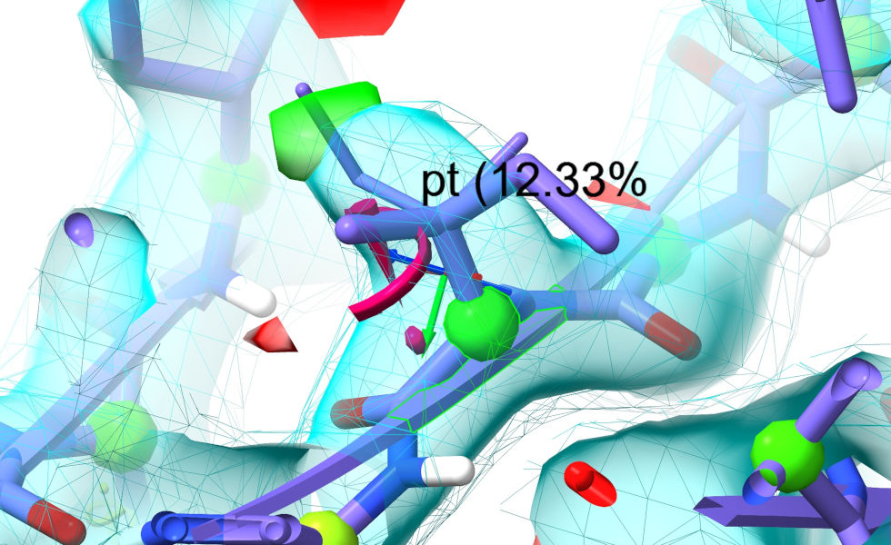
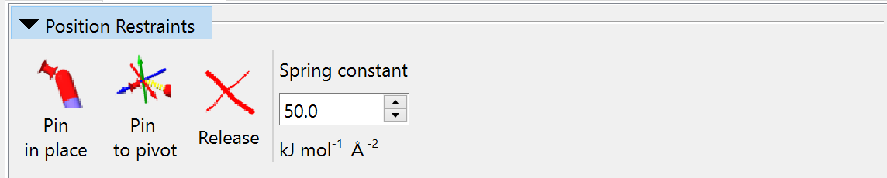
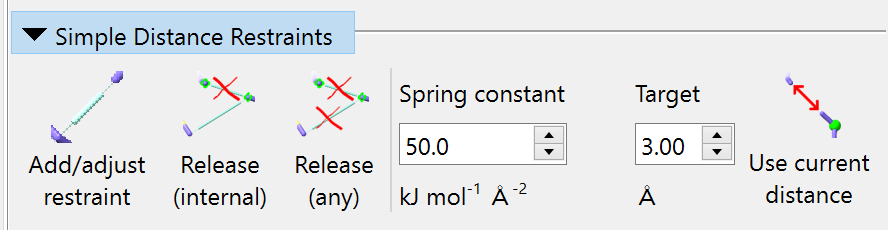
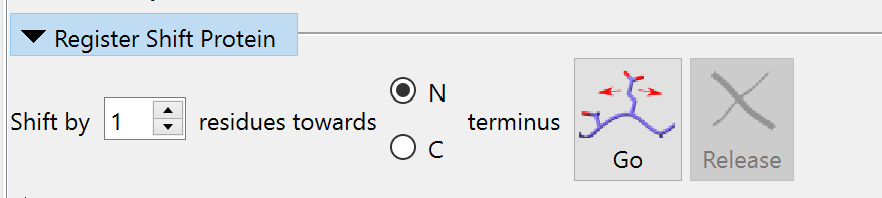

.. _manipulating-your-model:

Manipulating your model
=======================

.. toctree::
   :maxdepth: 2

.. contents::
   :local:

Overview
--------

Where simple tugging on atoms is insufficient to solve problems with your model,
ISOLDE provides various tools to help. Some of the most commonly used live up on 
the ribbon menu:

\... while the remainder are found in ISOLDE's Restraints tab. Let's start with the 
ribbon menu buttons.

Peptide flip and rotamer adjustment buttons
-------------------------------------------

The two "Flip" buttons will become active when you select a single amino acid
residue that isn't at the N-terminus of a fragment (that is, has another amino
acid bonded to its backbone nitrogen). The "Flip peptide" button uses temporary
torsion restraints on *phi* and *psi* to (attempt to) flip the N-terminal
peptide bond by 180 degrees. The "Flip cis<->trans" button, meanwhile, flips the
target of the always-present restraint on *omega* to switch from *cis* to
*trans* or vice versa. If no simulation is running, a small local one will be
automatically started to do the job.

The "Preview next" rotamer button, meanwhile, becomes active whenever you select 
a single rotameric amino acid residue. Clicking it once will create a preview of
the most common rotamer for that residue, overlaid on the model with a label 
giving its name and prevalence. Clicking again will give the next most common 
residue and so on:

When you have found what you believe to be the most suitable rotamer, you have two 
choices:

(a) click the "Set coords" button to tell ISOLDE to simply set the model coordinates
    to match the preview. If a simulation is running, this will automatically trigger 
    a quick energy minimisation before continuing. **(Do NOT use this option if the 
    preview coordinates clash severely with surrounding atoms. Instead, use option b)**

(b) click the "Restrain" button to add torsion restraints forcing the sidechain *chi* 
    torsions to match the preview. This approach is "safe" in that it will never 
    introduce severe clashes - but bulky sidechains will usually need a little help 
    via mouse tugging to make large changes.

All user-applied dihedral restraints (other than the always-on restraints on the
peptide bond *omega* dihedrals) are displayed on the model using a ring-and-post
motif as shown for this lysine rotamer:

.. figure:: images/dihedral_restraints.png
    :alt: Dihedral restraint visualisation

    The difference between the current dihedral angle and the target is
    indicated by the angle between the posts, and the level of satisfaction of
    the restraints is further indicated by colour. The thickness of each
    indicator is proportional to the strength of the restraint.

The final button ("Release") can be used to disable any torsion restraints added by 
choosing option (b).

.. _isolde-restraints-tab:

The Restraints tab
------------------

.. figure:: images/restraints_tab_overview.png

Position Restraints
~~~~~~~~~~~~~~~~~~~

The three buttons in this widget allow you to, in order:

- pin each heavy atom in the current selection to its current position;
- pin a single heavy atom to the current position of the pivot indicator; and
- release any existing position restraints on the current selection.

The applied restraint behaves for most purposes like a simple harmonic spring 
(that is, the applied force is proportional to distance), but transitions to 
a constant force at a maximum-force threshold to avoid instability. The spring 
constant for added restraints is set in the field on the right (changes affect 
only future restraints, not existing ones).

Simple Distance Restraints
~~~~~~~~~~~~~~~~~~~~~~~~~~

The first button is straightforward: it adds a harmonic distance restraint between
two selected heavy atoms, with the target distance and spring constant defined 
by the relevant input fields. The "Release (internal)" button will release all 
distance restraints for which **both** endpoint atoms are currently selected.
The "Release (any)" button releases distance restraints for which **either** 
endpoint atom is selected. Over on the right, the "Use current distance" button 
changes the "Target" field to the current distance between atoms when you have 
exactly two heavy atoms selected.

Simple distance restraints appear in the model as double-ended pistons:

.. figure:: images/distance_restraints.png
    :alt: Distance restraint visualisations

    The length of the central cylinder indicates the target distance, while its
    thickness indicates the strength of the restraint.

Secondary Structure
~~~~~~~~~~~~~~~~~~~

The first three buttons in this widget apply a combination of torsion and distance 
restraints to the current protein selection to guide the model towards your 
desired secondary structure. In brief:

- the selection is broken into contiguous fragments;
- within each fragment, torsion restraints are added to the *phi* and *psi* 
  dihedrals, and distance restraints between each O-(N+4) and CA-(CA+2) pair,
  with target values matching the desired secondary structure;
- for fragments assigned as beta strands, any backbone H-bonds to surrounding 
  strands are reinforced by distance restraints.

The first two buttons simply set everything in the selection to beta strand 
or alpha helix respectively. The third assigns restraints based on the current 
secondary structure annotation. *(NOTE: if this wasn't defined in your input 
file, ChimeraX automatically assigns secondary structure using the DSSP algorithm. 
This is sometimes a bit over-enthusiastic in what it considers to be a helix or 
strand - so if you use this button you may find yourself subsequently needing to 
release quite a few residues.)*

The final button will, of course, release all secondary structure restraints on 
the selected atoms.

Register Shift Protein
~~~~~~~~~~~~~~~~~~~~~~

In models built into low-resolution maps (particularly older "legacy" models
from the wwPDB) it is a reasonably common occurrence for part of the model
sequence to get out of step with the map - that is, while the overall fold
topology is correct, the wrong residue is at each site. The register shift 
tool is designed to help with that. Given a selection defining a single 
contiguous stretch of amino acid residues, it uses a set of moving position 
restraints on the N, CA, C and (where present) CB atoms to tug the backbone 
smoothly along splines fitted through these atoms' initial positions, 
shifting them by the number of residue positions you request. Shifting in 
this way avoids having to deal with the tangle of sidechain-sidechain clashes 
that can be the result of other methods. Once the shift is done, clicking the 
Release button will remove the position restraints.

Reference Models
~~~~~~~~~~~~~~~~

This widget allows you to use an existing model (experimental or predicted) as
reference for the assignment of ISOLDE's
`adaptive distance and torsion restraints`__. 

__ help:user/commands/isolde_restrain.html

After choosing a model in the "Reference model:" drop-down menu, the table
below will automatically populate with possible matches between each chain 
in the working model and each chain in the reference model. The reference model
(with colours shifted visually to distinguish it from the working model) 
will be aligned to the working model using `MatchMaker`__. If the reference 
model was generated by AlphaFold2 (or any other prediction method that 
produces a Predicted Aligned Error (PAE) matrix in the same format), you 
can load that using the button at top right to enable confidence-based 
assignment of distance restraint parameters. *(NOTE: to use a PAE matrix, 
the reference model must be the complete, unchanged prediction, with no 
residues added or removed.)*

__ help:user/commands/matchmaker.html

In the table, the "Chain" column will have an entry for each chain in your 
working model with at least one match (identity greater than 50%) in the 
reference model. Each potential match for that chain will be listed in the 
following rows, ordered by RMSD in the current alignment. The "Ref" column 
gives the chain ID of each refererence chain. The "Align" button allows you 
to re-align the reference model based on that (working chain):(reference chain)
combination. The checkboxes in the "Distances" and "Torsion" columns allow 
you to specify this reference chain for the corresponding restraints (of course,
you can only specify one reference chain for each working chain - while if you 
like you *can* choose different chains for torsion and distance restraints, 
but this is generally not a good idea). The final three columns provide 
important information about the relationship between working and reference 
chains: the fraction of the working sequence covered by the reference sequence;
the sequence identity within that fraction; and the C-alpha RMSD in the current 
alignment. The Apply buttons below will create restraints based on the currently
ticked checkboxes. The "Apply (selected residues only)" button, as the name 
suggests, will assign restraints only to those residues with atoms currently 
selected in the main ChimeraX window. *(NOTE: once the restraints are assigned,
they no longer rely on the reference model in any way. You can safely close it 
if you wish)*

By default, when using a multi-chain model as reference, inter-chain distance 
restraints will be generated to maintain protein-protein interfaces. This can
be disabled if desired via the Options widget (see below). Be sensible: this 
will only yield a reasonable result if each chosen reference chain has a 
low CA-RMSD in the current alignment. If the same chain is used as reference 
for two different working chains this option will be ignored, and inter-chain 
restraints will *not* be generated.

Options
^^^^^^^

This sub-widget allows you to adjust the assignment behaviour and properties 
of reference restraints before you apply them. *(NOTE: changes here do not 
affect any existing restraints.)* The left-hand column is dedicated to 
distance restraints and the right to torsion restraints.

Distance restraints
*******************

**Inter-chain restraints** checkbox: if checked, restraints will be created
across chain-chain interfaces if possible. Otherwise, only intra-chain 
restraints will be created.

**Adjust by PAE** checkbox: if checked and a valid PAE matrix has been assigned
to the reference model, then the properties of each distance restraint will be
adjusted according to the predicted aligned error between the residues containing
the restrained atoms. See the :ref:`isolde_restrain_distances_cmd` command for more 
detals.

**Use rigid-body matching** checkbox: if checked, restraints will be applied only 
to those parts of the working model which make a good rigid-body match to the 
reference model. This is recommended if you are not using a PAE matrix. If 
unchecked, only the sequence alignment will be used for restraint assignment. 

**Overall strength and Fuzziness** sliders: these allow you to adjust the
overall strength of the restraints, and how quickly their applied force falls
off with distance outside the harmonic region. The plot below gives you a
preview of the resulting force profile for a restraint with a target distance of
3 Angstroms and a "perfect" PAE value of 0.2.

Torsion restraints
******************

**Restrain sidechain** checkbox: uncheck this if you wish to restrain only the 
protein backbone, while leaving sidechains free to move.

**Adjust by pLDDT** checkbox: if checked, values in the B-factor column of the
reference model will be subjected to a basic sanity check to make sure they look
like pLDDT values (after some basic checks to see if (a) the values fall in the
range 0..1 or 0..100, and (b) values are identical for all atoms in each
residue, and (c) the median value for unstructured residues is lower than the
median for helix/strand residues). If this check fails a warning will pop up 
suggesting you disable this option before continuing. Otherwise, the parameters 
for each torsion restraint will be adjusted based on the pLDDT for that 
residue. See the :ref:`adaptive_dihedral_restraint_cmd` command for more details.

**Overall strength and Fuzziness** sliders: these allow you to adjust the
overall strength of the restraints, and how quickly their applied force falls
off with angle deviation outside the harmonic region. The plot below gives you a
preview of the resulting force profile for a restraint with pLDDT=100.

Manage/Release Adaptive Restraints
~~~~~~~~~~~~~~~~~~~~~~~~~~~~~~~~~~

.. figure:: images/manage_restraints_widget.png

This widget allows you to selectively release adaptive distance and/or torsion
restraints added via the Reference Models widget or via the ``isolde restrain``
commands. Additionally, here is where you can change their colour schemes to
your liking, and adjust the display threshold on distance restraints to show
only those restraints which are currently strained.

At present, the "Distance restraints group" drop-down menu is primarily a
future-proofing addition ahead of planned support for distance restraints from
other sources such as cross-linking/mass spectrometry experiments. If you really
wish to, you can use the ``isolde restrain distances`` command to create
multiple independent groups of reference-model difference restraints, but the
value of such an endeavour is unclear.

The "Colours" button displays the current colour scheme as three horizontal
stripes, with the "overly compressed" colour at bottom, the "optimally
satisfied" colour in the middle, and "overly stretched" at top. Clicking it will
bring up a series of three colour chooser dialogues, allowing you to choose new
colours in this order. The "Reset" button beside it resets the colour scheme to
the stored defaults.

Dragging the "Display threshold" slider to the right will progressively hide 
the most satisfied distance restraints to cut down on visual clutter. When the 
slider is all the way to the left, all distance restraints will be shown.

The four buttons below this offer different options for releasing restraints 
with varying levels of selectivity. The "Release all selected" button will 
release all restraints for which **at least one** endpoint atom is selected. "Release 
surrounding" will release restraints with **exactly one** endpoint atom selected. 
"Release internal" will release only restraints with **both** endpoint atoms 
selected. Finally, the "Remove all" button will remove **all** restraints in 
this group.

The remaining buttons apply to torsion restraints. The "Colours" button here 
behaves analogously to the one for distance restraints; clicking it allows you 
to pick the colours for severely strained, moderately strained, and satisfied 
restraints in that order.

Unlike the distance restraint release buttons, the torsion restraint equivalents
act on **whole residues** - every residue with at least one atom selected will be 
affected. As the names suggest, the buttons allow you to release either all 
restraints (*phi*, *psi* and *chi*:sub:`n`) or only sidechain restraints (*chi*:sub:`n`)
on the selected residues, or to delete all adaptive torsion restraints in the 
model.
