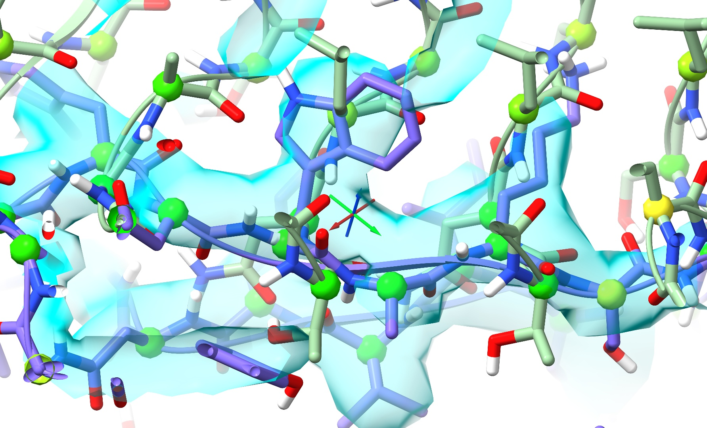
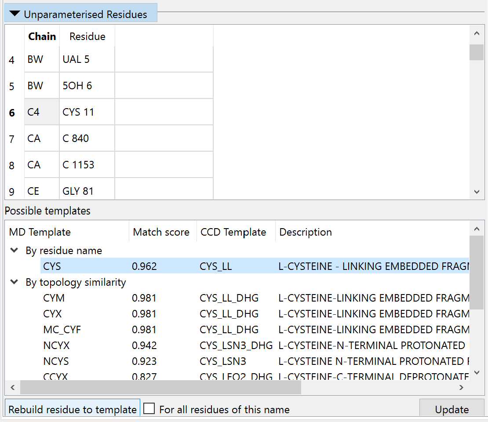
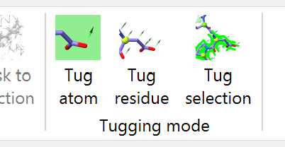

Basic simulation controls
=========================

.. toctree::
    :maxdepth: 2

.. contents::
    :local:

.. _starting-a-simulation:

Starting a simulation
---------------------

Assuming your model meets the requirements (that is, all residues are complete
with hydrogens and known to the MD forcefield), then starting a simulation is as
simple as making a selection of atoms in the main ChimeraX window and clicking
the play button on the left-hand side of the ISOLDE ribbon menu:

Your selection may be anything from a single atom to all atoms in the model.
ISOLDE will automatically expand this to give a soft "buffer zone" around your
region of interest. For the sake of performance your selection should be as
small as necessary to achieve the desired goal. Of course, the larger the
selection the slower the simulation.

The selection size you can make while still achieving reasonably interactive
performance is primarily dependent on your GPU (which does essentially all of
the hard work of running the simulation). On a modern Nvidia RTX GPU, you 
should be able to run simulations up to about 1000 mobile residues before 
performance becomes seriously constraining. Note that *graphics* performance
(that is, responsiveness of the display when rotating, translating, zooming
etc.) is only weakly affected by simulation size, and remains above 30 fps
under most circumstances. At the other end of the scale, small onboard GPUs
such as those found in pre-M1 MacBooks manage surprisingly well, providing 
usably interactive performance for a few dozen mobile residues. If you have 
good-quality data (better than about 3 Angstroms resolution), you can get 
significantly improved performance at the expense of less realistic 
electrostatic interactions by choosing the Lowest/Fastest option in 
the "Sim Fidelity/Speed" widget on ISOLDE's General tab.

The maximum sized model that will successfully run **non** interactively is a
function of the amount of RAM available to your GPU (built-in RAM in dedicated
GPUs; system RAM for on-motherboard GPUs). See :ref:`system_requirements` for
more details. *(NOTE: for extremely large models and/or low-end hardware, initial
energy minimisation of the entire model can take anywhere up to tens of minutes.
Please be patient - once you see the atoms start moving it is safe to stop the
simulation and continue working with more manageable selections)*

.. _dealing-with-clashes:

Dealing with severe clashes
---------------------------

Before you go ahead and start a simulation, it's generally a very good idea to 
do some basic sanity checks (if you skip these ISOLDE will generally back out 
gracefully if it runs into trouble, but it's best to get in ahead). The most 
important check is for severe clashes of the kind that cannot resolve gracefully.
As an example, a clash like this:

.. figure:: images/ok_clash.jpg

\... will generally be handled well, since there is a clear "downhill" path 
for the minimiser to push the clashing atoms apart. On the other hand, extreme 
clashes - particularly those with residues passing through each other like this:

    
\... will generally require some more careful treatment. Because there is no 
straightforward path out of the tangle, naive energy minimisation will generally 
lead to a ridiculous tangle akin to this:

Clashes can be found using the Clashes widget on ISOLDE's Validation tab:

.. figure:: images/clashes_widget.png

If your inspection does identify particularly severe clashes like the above 
(a particularly common hazard when starting from a model composed of multiple
independently rigid-body docked fragments), then the best approach is typically 
to:

- restrain with local distance and torsion restraints (see :ref:`reference_model_restraints`); 

- start a simulation encompassing a region large enough to allow the clashing 
  components to separate (i.e. if two domains are clashing, select at least the 
  entirety of one of the clashing domains);

- use the Nonbonded Potentials widget found on the General tab to gradually 
  reduce the strength of the van der Waals and electrostatic interactions until 
  the clashing atoms are able to slide past each other;

- if necessary, use the "tug selection" mouse mode to help the clashing regions
  separate;

- return the nonbonded potentials to their default strength and move on.

For a worked example of the above, see the interactive :ref:`isolde_clashes_tutorial` 
tutorial.

When faced with extremely large overlaps between domains, you might find it useful 
to start by using the ``isolde ignore {selection}`` command to temporarily exclude 
some residues from simulations, allowing you to move the others without resistance.
If you take that route, remember you can reinstate residues for future simulations
with ``isolde ~ignore``. For more information, see :ref:`ignore`.

.. _unrecognised_residues:

Dealing with unrecognised residues
----------------------------------

If ISOLDE encounters a residue it does not recognise while preparing a
simulation, a dialog box like the following will appear:

.. figure:: images/unrecognised_residue_error.png
    :alt: Unrecognised residue error dialog box

On clicking OK ISOLDE will open and populate the "Unparameterised Residues"
widget on its Validation tab:

Clicking on an entry in the top table will show the offending residue in the
main GUI, and bring up a list of known templates matching by name or similar
topology in the bottom table. In most cases where there is a matching entry in
the bottom table (typically where the residue has a known template but is
unrecognised simply due to missing atoms or incorrect hydrogenation) you can 
correct it by by simply clicking "Rebuild residue to template". If no template 
is found, that's not necessarily the end of the world: if your residue is:

- not covalently bound to any other residue; and
- composed only of the elements C, N, O, S, P, H, F, Cl, Br, and/or I; and
- not a radical
  
\... then you should be able to generate parameters using the "Residue 
Parameterisation" widget on ISOLDE's General tab:

.. figure:: images/param_widget.png

**(NOTE: It is critically important that you make sure the residue is correct 
including all hydrogens before you parameterise it)**

If you have existing AMBER-compatible parameters in the `OpenMM ffXML format`__
you can also load them here.

If your ligand/residue does not meet the above criteria but is already well-fitted in the 
density, you can still continue on by selecting it and entering the command 
``isolde ignore sel``. As far as ISOLDE's simulations are concerned it will no 
longer exist (any parameterised residues that covalently bind to it will exist but 
will be fixed in space). Note that this means there is nothing to stop surrounding 
atoms falling into its density - take extra care in this region. If it is *not* 
well fitted, it may be more sensible to delete it for now and add it back once the 
surroundings are correctly built and refined.

__ http://docs.openmm.org/7.0.0/userguide/application.html#creating-force-fields

.. _general-sim-controls:

General simulation controls
---------------------------

As mentioned at the top of this page, once your model meets all the requirements 
for successful simulation you can get things moving by clicking the "Start simulation"
button on ISOLDE's ribbon menu:

On successful start, this button will change to a pause button and the adjacent 
control buttons will become activated:

.. figure:: images/sim_control_buttons.png

The next two icons (the green and red chequered flags) to the right allow you to
save and restore, respectively, a snapshot of the model state. These are
generally used when you want to test a hypothesis - i.e. make a substantial
rearrangement where you're not sure if it will be successful. Click the green
button to store the current coordinates and the states of all relevant
restraints, try your rearrangement, and if it fails, click the red button to put
things back as they were. If you haven't clicked the green button, clicking the
red one will restore the simulation to the state it was in when you clicked
"Start simulation".

The final two icons (green and red stop signs) are your two choices for stopping
the simulation. The green icon keeps your work, and is the one that you should
be using almost all the time. The red icon discards everything you did in this
simulation, reverting the model to the way it was when you clicked "Start
simulation".

Basic interaction
-----------------

With your simulation running, **right-click-and-drag** on any heavy atom and
you should see it follow your mouse cursor, with a 3D green arrow showing the
direction of pull:

.. figure:: images/tugging.png
    :alt: Tugging on a single atom

    Interactive tugging forces are shown like this green arrow

ISOLDE offers two other tugging modes, which you can set during simulations
using buttons on the far right of ISOLDE's ribbon menu:

The "tug atom" mouse mode is set every time a simulation starts. You can still
use the buttons on the ChimeraX mouse modes toolbar to make the right mouse
button do other things, and come back to tugging using the above buttons. Just
avoid anything that actually adds or removes atoms while your simulation is
running - and **never** use these three mouse modes to move a model initialised
for ISOLDE:

Adjusting map weightings
------------------------

When any qualifying map is associated with the currently selected model, ISOLDE
automatically prepares it for MDFF and guesses a suitable weighting constant
(see :ref:`adding-maps`). The algorithm used for this assumes that at least a 
substantial portion of the model is correctly docked in the map, and is not strictly
deterministic:

    1. For each non-hydrogen atom in the model, a random position is chosen 
       near the atom centre (perturbed up to +/-0.25 Angstroms along each axis),
       and the map gradient at that point is calculated by trilinear interpolation.
    
    2. The resulting gradients are ranked in increasing order of magnitude, and 
       the 90th percentile gradient is found.

    3. The coupling constant is chosen such that (coupling constant) *
       (90th percentile gradient) = (a heuristically determined scaling
       constant).

The default weighting tends to work well for models with resolutions better than
about 3.5 Angstroms. Beyond that you may find it to be too strong (symptoms of
this are backbone atoms twisting out of stable secondary structure geometry,
and/or sidechains being "sucked" overly aggressively into the map). If you wish
to adjust the weighting, you can do so at any time using the relevant Map
Settings widget on ISOLDE's General tab.

Adjusting temperature and trajectory smoothing
----------------------------------------------

Molecular dynamics simulations are designed to closely replicate real-world
behaviour of molecules, including random thermal motion. The default simulation
temperature is 20 Kelvin - enough to give you a clear indication of motion and
help the model "rattle" itself into density, without being overwhelming. In order 
to reduce the "jittery" effect, ISOLDE performs continuous trajectory smoothing 
on the coordinates you see *(NOTE: the level of smoothing does not affect the 
simulation itself)*. You can adjust the simulation temperature and smoothing 
using the "Simulation Runtime" widget on ISOLDE's General tab:

.. figure:: images/sim_runtime_widget.png
    :alt: Temperature and trajectory smoothing controls

Once the model is very close to finished it is a good idea to reduce the temperature 
to zero Kelvin to remove thermal fluctuation and allow the local geometry to 
settle to equilibrium.

Anyway, once you are able to successfully start simulations, you 
can move on to :ref:`manipulating-your-model`.