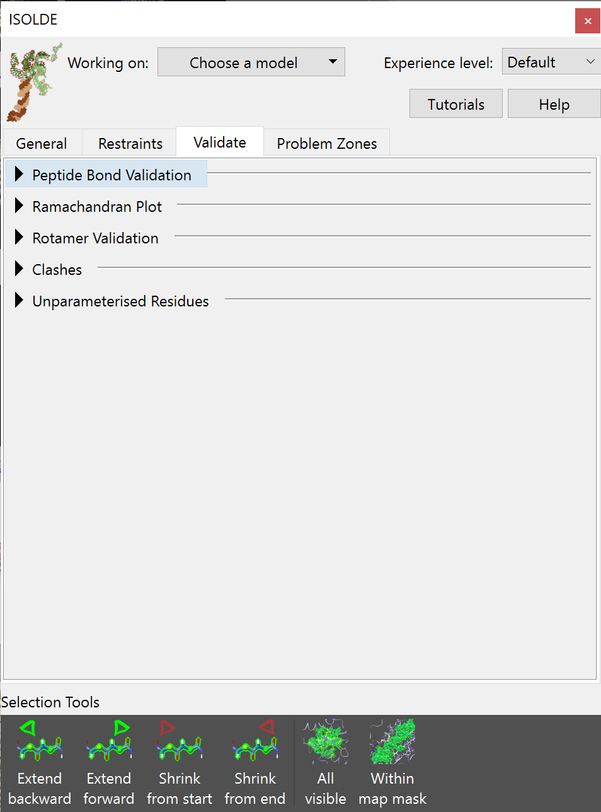
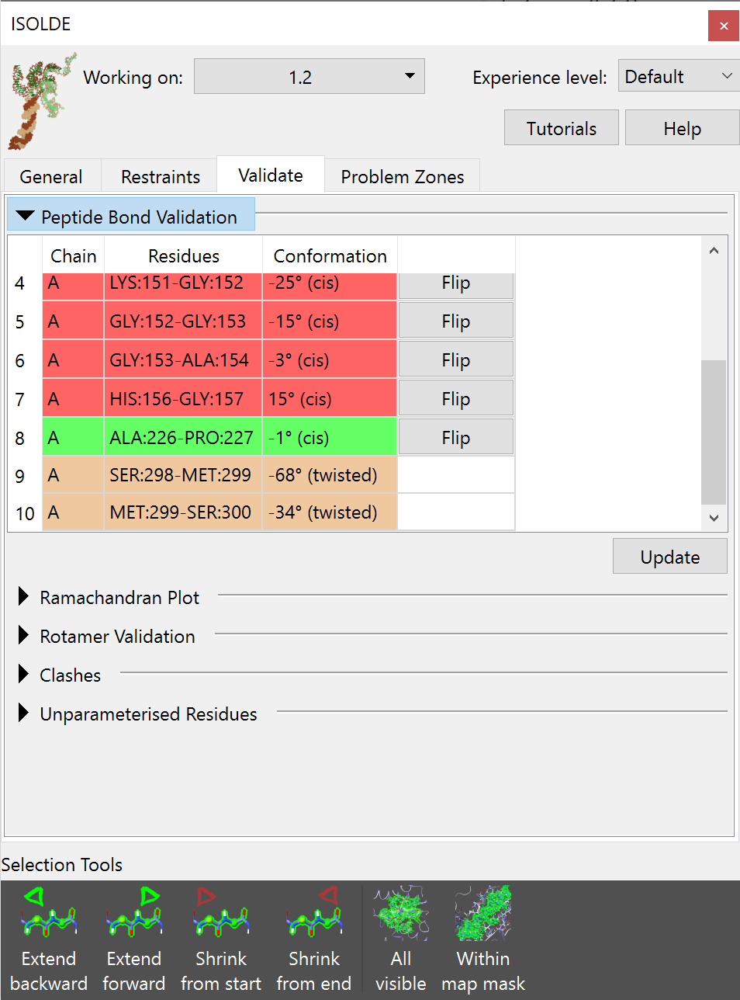
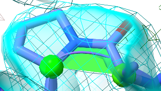
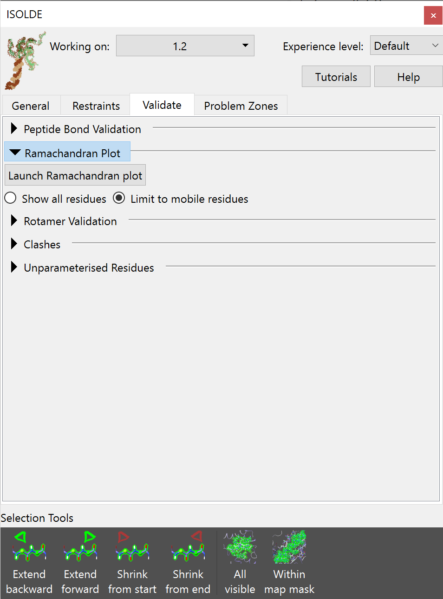
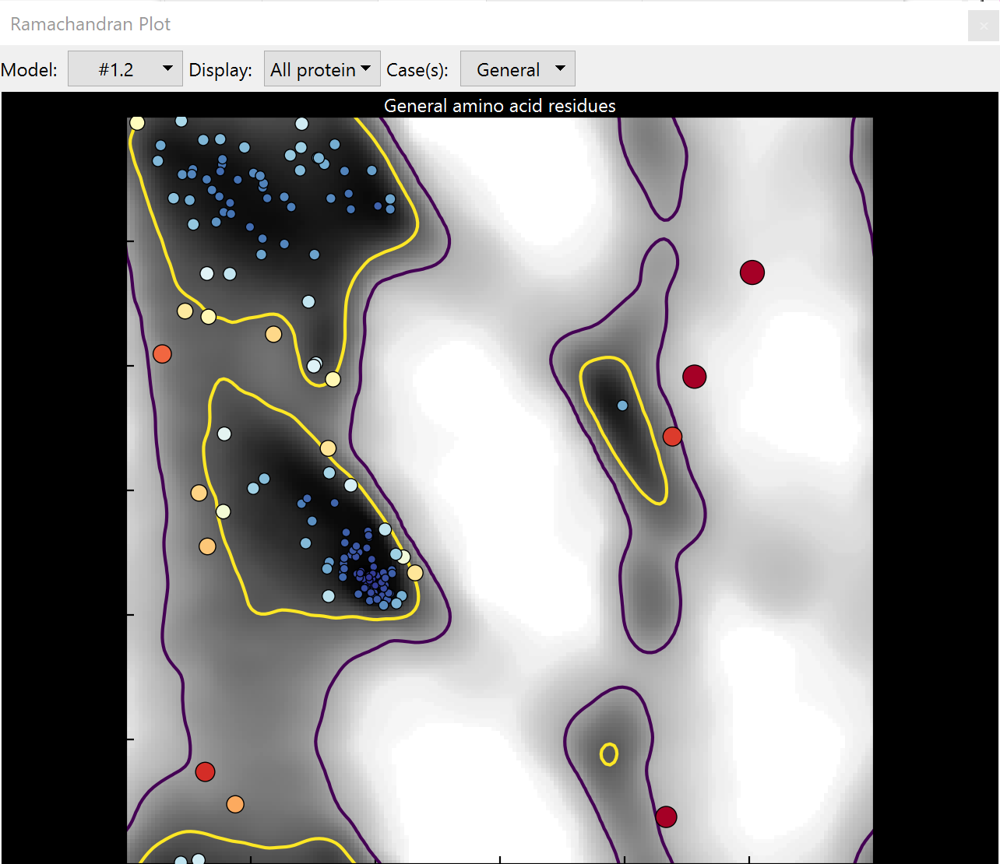
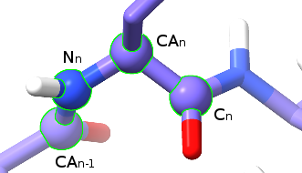
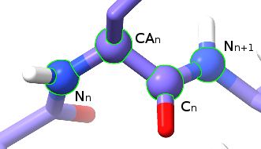
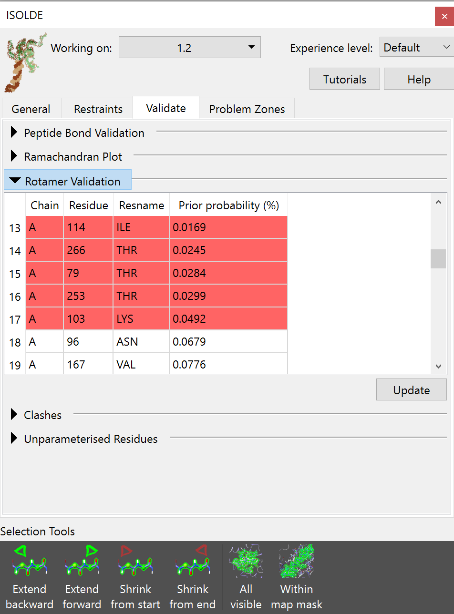
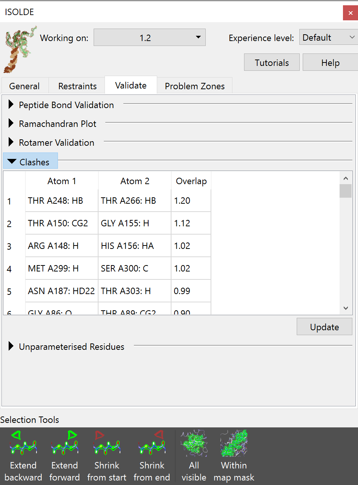
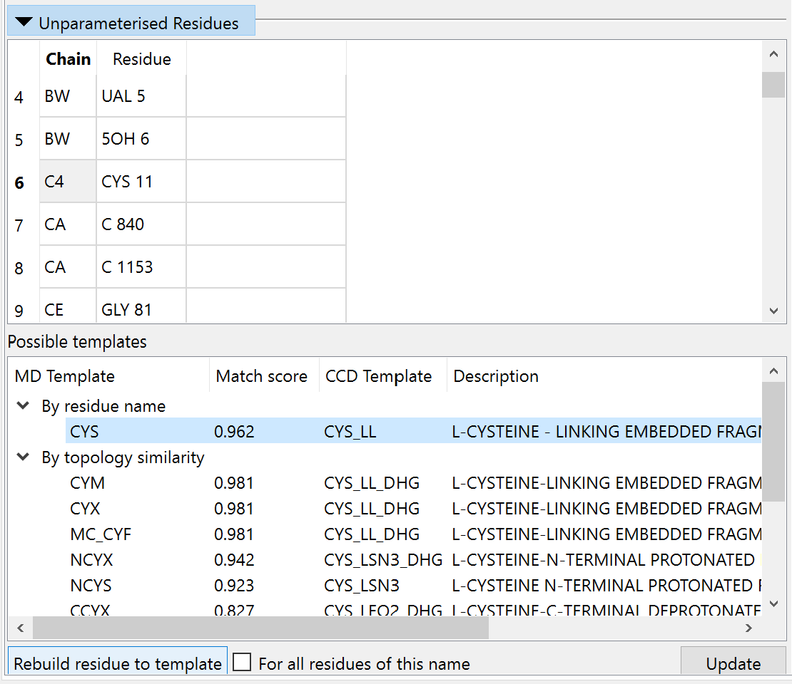

Monitoring the quality of your model
====================================

.. toctree::
    :maxdepth: 2

.. contents::
    :local:

While ISOLDE's live annotations help you see at a glance where likely problems
are in whatever part of the model you happen to be looking at, it is of course
still important to have access to a quick overview summary of potential
problems. This is handled on the `Validate` tab on the ISOLDE panel. If you
click there, you'll intially be greeted by this rather boring view:

    Expect the number of options to grow as ISOLDE develops further

Let's go through and look at what each of these buttons does.

Peptide Bond Validation
-----------------------

    Tabulated list of questionable peptide bonds

    Red: non-proline *cis* peptide bond
    Green: proline *cis* peptide bond
    Yellow: twisted peptide bond (more than 30° from planar)

Clicking on any entry in the list will select the residue in question and take
you to it in the main view.

In a peptide bond, the valence electrons are partially delocalised (think of it
as the carbon-nitrogen bond spending some fraction of its time as a double
bond), giving it a strong bias towards planarity. While in some rare, tightly
constrained conditions real peptide bonds have been observed to be twisted up to
30°, any twist beyond that is effectively unheard of.

The question of *trans* vs *cis* peptide bonds is less obvious. The vast
majority of all peptide bonds are found in *trans* (with the amide hydrogen
pointing in the opposite direction to the carbonyl oxygen):

.. image:: images/transpep.png
    :alt: a normal trans peptide

This occurs due to steric considerations: swapping to *cis* replaces the amide
hydrogen with the next alpha carbon, and carbon atoms are simply too big to
pack neatly together in this way. Forcing them to do so puts strain on the
intervening bonds, which requires energy. For this reason, for all residues
other than proline *cis* peptide bonds are vanishingly rare at about 3 per
10,000 residues - and when they *do* occur are strongly stabilised by
interactions with their surroundings, usually well-resolved, and almost always
functionally interesting.

.. figure:: images/cispep_loop.png
    :alt: a series of cis peptide bonds

    This should never happen.

    A loop like this, with four non-proline *cis* peptide bonds in a row and no
    stabilising influences whatsoever, is for all intents and purposes
    impossible.

.. figure:: images/real_cis_bond.png
    :alt: a real cis peptide bond

    This, on the other hand, is real.

    This non-proline *cis* bond is found in tissue transglutaminase (*TGM2*, see
    PDB ID 2q3z), and is stabilised by a disulphide bond between directly
    adjacent cysteine residues. It is part of a redox-switching mechanism: under
    certain circumstances the disulphide is reduced by thioredoxin, allowing
    the peptide bond to flip to *trans* and thereby shifting an inhibitory loop
    to activate the enzyme. It is also clearly resolved in the electron density.

If your site in question does not meet the above criteria, then in general
you should assume it to be *trans* (unless, of course, you have outside
evidence such as a higher-resolution structure of a closely-related protein).

Proline is a special case. Unlike the other amino acids, proline does not have
an amide hydrogen - instead the amide nitrogen links to the backbone delta
carbon. With both *cis* and *trans* conformers putting a carbon atom adjacent to
the alpha carbon, the drive towards the *trans* conformation is nowhere near as
strong, and about 5% of all proline residues appear in *cis*. With this in mind,
*cis* prolines are coloured in green to reflect their higher likelihood (but
keep in mind that they do still need to agree with the density map, as in the
below case).

    A happy-looking *cis*-proline.

The Ramachandran plot
---------------------

Expanding the *Ramachandran Plot* widget will expose a rather minimalist GUI -
just a button to launch the Ramachandran Plot widget and some options to 
control how it behaves during simulations:

Clicking the "Launch Ramachandran Plot" button will launch the plot as a separate 
widget (this is also available without starting ISOLDE via the ChimeraX menu: 
*Tools/Validation/Ramachandran Plot*):

    The Ramachandran plot for "general" amino acids

In brief, the Ramachandran plot plots the angle of the *phi* (φ) dihedral
"entering" the residue against that of the *psi* (ψ) dihedral "exiting" it.

    The four atoms making up the *phi* (φ) dihedral.

    The four atoms making up the *psi* (ψ) dihedral.

Since atoms are physical objects that *really* don't like to overlap with each
other, only some combinations of φ and ψ are possible (and only a much smaller
proportion of the range of possible combinations are *favourable*). That is
what the Ramachandran plot is telling you.

The yellow contour line represents  the 2% cut-off: 98% of all well-resolved
residues in very high-resolution  structures are found within these contours.
Unsurprisingly, they mostly  represent the well-defined secondary structures:
the big yellow blob in the top left corresonds to α-helices, while the slightly
smaller middle-left blob  corresponds to β-strands. Residues within these
contours are said to be in  "favoured" conformations.

The purple line, meanwhile, represents the boundary of the far more generous
"allowed" region. The precise value of this contour varies slightly depending on
the Ramachandran category, but for the general case only about 5 in 10,000
residues should be found outside it, in what is known as "outlier" space.

Note that as well as the given cut-off contours, the background is also shaded
according to probability. A residue outside the contour but still on a grey zone
may still be correct (but should be very carefully checked), but one sitting on
a white background is almost certainly wrong.

As you can see from the example image above, the size and colour of each point
scales with its probability, making outliers very difficult to ignore. Hovering
the mouse over any point in the plot will bring up a tooltip with its identity,
and clicking the point will take you to the corresponding residue in the main
window and select it.

The drop-down menus at the top of the Ramachandran Plot widget provide various
options allowing you to limit the view to an individual chain or a custom
selection, plot only disfavoured and/or outlier residues, and switch between 
individual residue classes (or show plots for all classes side-by-side). 

While the Ramachandran widget is active, any changes to model coordinates will 
automatically update the plot. Note that this comes with some performance cost
(particularly for very large models) - if that becomes problematic, you should 
close the plot widget during simulations.

Rotamer Validation
------------------

All non-favoured rotamers are listed in the table, ordered from worst to best.
As for the other validation tools, clicking on an entry will select and take you
to the offending residue.

Clashes
-------

This table lists any pairwise atomic clashes (that is, non-bonded atoms that are 
closer together than the sum of their van der Waals radii should allow).

    
Clicking on an entry in the table will select and focus the view on the
offending atom(s). Most minor clashes should be straightforwardly resolved by
energy minimisation, and once your model is successfully running in simulations
this table should be nearly empty. For particularly severe clashes where parts
of the model are entangled with each other, some work will be needed before you
can safely start simulations (see :ref:`dealing-with-clashes`).

Unparameterised Residues
------------------------

See :ref:`unrecognised_residues`.
