.. _alphafold_top_down_tutorial:

Top-Down Modelling with AlphaFold-DB Models
===========================================

**(NOTE: Most links on this page will only work correctly when the page is
loaded in ChimeraX's help viewer. You will also need to be connected to the
Internet. Please close any open models before starting this tutorial.)**

**(The instructions in the tutorial below assume you are using a wired mouse
with a scroll wheel doubling as the middle mouse button. While everything
should also work well on touchpads in Windows and Linux, support for Apple's
multi-touch touchpad is a work in progress. Known issues with the latter are
that clipping planes will not update when zooming, and recontouring of maps is
not possible.)**

Tutorial: Fitting emd_9118 using 6mhz and AlphaFold
---------------------------------------------------

.. toctree::
    :maxdepth: 2

**NOTE: This tutorial assumes that you are already familiar with the basic
operation of ISOLDE. If this is your first time using it, it is highly
recommended that you first work through the** :ref:`isolde_cryo_intro_tutorial`
**tutorial before starting this one.**

In the :ref:`bulk_fitting_tutorial` tutorial we used 6mhz_, the 4.1 Angstrom
structure of the ATP-bound *E. coli* LptB2FGC complex, to fit EMD-9118_, the 4.0
Angstrom map of the ATP-free, lipid-bound form. While quite achievable with
patience, this approach suffered from two key burdens: (1) unsurprisingly given
its resolution, the starting model contained numerous imperfections leading to
challenges fitting the details; and (2) like most structures, the starting model
was incomplete.

 .. _6mhz: https://www.rcsb.org/structure/6mhz
 .. _EMD-9118: https://www.emdataresource.org/EMD-9118

The advent of `AlphaFold 2`_ (and in particular their `online database`_ of
precomputed models) fundamentally and irrevocably changed the face of
experimental model building. As demonstrated in `their paper`_ and others
(including `our own`_), in most cases the accuracy of AlphaFold predictions for
well-structured regions approaches that of high-resolution experimental
structures, and dramatically improves upon most existing low-resolution
structures (at least, those for which there was no high-resolution reference
model at the time of building and deposition). Even better, AlphaFold turns out
to be very, very good at predicting just *how* accurate its predictions are,
both at a per-residue level via its predicted local distance difference test
(pLDDT) scoring, and in its estimate of the distance error between each pair of
residues via the predicted aligned error (PAE) matrix (more on those measures
later). This promises to dramatically ease the "average" model-building task:
where previously it was commonly necessary to build residue-by-residue into
density by some combination of automatic and manual methods, in most cases it is
now both easier and less error-prone to take a "top-down" approach, starting
from near-complete models comprising the high-confidence regions of AlphaFold
predictions for each chain and flexibly fitting into your new map.

.. _their paper: `AlphaFold 2`_
.. _online database: https://alphafold.ebi.ac.uk/
.. _AlphaFold 2: https://www.nature.com/articles/s41586-021-03819-2
.. _our own: https://www.biorxiv.org/content/10.1101/2021.09.26.461876v1

In this tutorial, we're going to revisit the 6mhz/EMD-9118 case, but this time
we're going to replace 6mhz with the AlphaFold predictions for each of its chains 
first. As you'll see, this makes the modelling task substantially easier - not
just because the starting model is better, but because ISOLDE's restraint schemes
can take advantage of AlphaFold's confidence scores to more intelligently adjust their 
properties to avoid over-restraining to low-confidence predictions.

To avoid re-treading old ground, we'll start at the point of the bulk fitting 
tutorial where chains A and G are already rigid-body fitted into the map. 

`Click here`_ to set that up.

.. _Click here: cxcmd:open\ 6mhz;open\ 9118\ from\ emdb;hide;cartoon;color\ bych;
    color\ byhet;volume\ \#2\ level\ 0.1; 
    view\ initial\ \#1;\ view\ matrix\ model\ \#1,0.198,-0.674,0.699,86.9,0.821,0.511,0.260,-63.7,-0.534,0.522,0.655,53.6;
    fitmap\ \#1/A,G\ inMap\ \#2

Your ChimeraX display should now look something like this, with chains A and G 
rigid-body fitted and chains B and F well out of density:

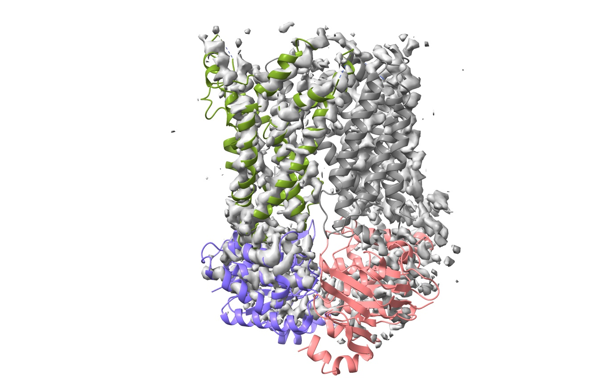

Now, this is where we really start to deviate from the original tutorial. We're 
not going to use this model directly - instead, we're going to use it to set the 
positions of the AlphaFold models for each chain. If you haven't already, let's 
start ISOLDE:

`isolde start`__

__ cxcmd:isolde\ start

Next, fetch the AlphaFold models for each chain. When your existing model (a) is
fetched directly from the wwPDB, and (b) is covered by the pre-calculated models
in the AlphaFold database, that's really easy. *(Note: you can see the list of
organisms whose complete proteomes are currently covered* `here`_ *)*. Just do
the following:

.. _here: https://alphafold.ebi.ac.uk/download

`alphafold match #1 trim false`__

__ cxcmd:alphafold\ match\ \#1\ trim\ false

Your display should now look something like this:

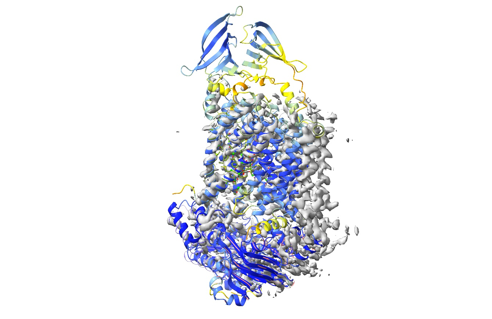

Each AlphaFold model has been overlaid and had its chain ID reassigned to match
its corresponding chain in the original model. The cartoon is coloured to
reflect AlphaFold's confidence in its prediction for each residue (`pLDDT
scores`_), scaling from red (pLDDT=0) through orange (pLDDT=50), yellow
(pLDDT=70), light blue (pLDDT=90) to dark blue (pLDDT=100). By default, the
model is trimmed to match the sequence in the mmCIF file (reflecting what was in
the experiment, not just what was originally modelled), but here we've specified 
"trim false" to fetch each complete chain. That will be important later, since 
weighting of distance restraints by confidence requires the complete original model. 

**(IMPORTANT NOTE:
residues with pLDDT scores less than about 50 are generally junk and their
coordinates should not be interpreted in any way. Nevertheless, it may on
occasion be useful to keep them present to start with, to act as raw material
for the fitting process. Once the model is fitted it is best to inspect and cull
these on a case-by-case basis.)**

.. _pLDDT scores: https://alphafold.ebi.ac.uk/faq#faq-5

One thing you might immediately notice is that the AlphaFold models for chains F
and G each have an extra domain at the top that wasn't modelled in 6mhz.
Nevertheless, if we reduce the map contour level substantially:

`volume #2 sdLevel 3.5`__

__ cxcmd:volume\ \#2\ sdLevel\ 3.5

\... then it becomes pretty clear that they are present, just very weakly resolved:

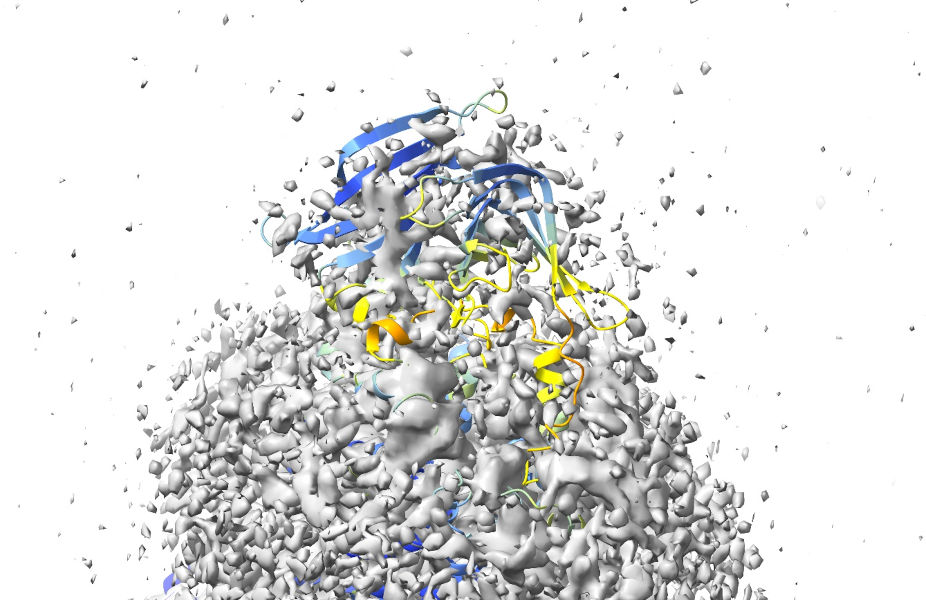

Considering that the AlphaFold predictions for their geometry are quite
confident, it makes sense to keep these in for now - we can always decide
whether or not to remove them once we're done refitting. For now, let's pull the
map contour back to a reasonable level:

`volume #2 sdLevel 6`__

__ cxcmd:volume\ \#2\ sdLevel\ 6

Now, before we go ahead and start refitting with ISOLDE, there's a few things we
must do. First, the "alphafold match" command collected each chain as its own
model - for ISOLDE's purposes we need to combine them all into a *single* model:

`combine #3`__

__ cxcmd:combine\ \#3

You may be forgiven for thinking that this did absolutely nothing, but if you
take a closer look at the bottom of the Models panel you'll see a brand new
entry:

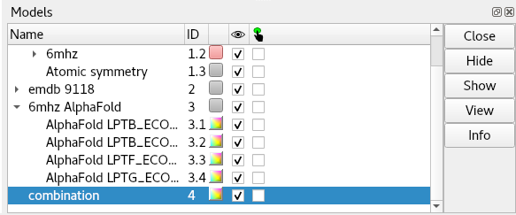

This is the one we're going to actually work on from here. 

First, we may as well close the original 6mhz:

`close #1`__

__ cxcmd:close\ \#1

Now, go to the "Working on:" drop-down menu at the top of the ISOLDE panel, and
choose "4. combination". Or, just click the following command:

`isolde select #4`__

__ cxcmd:isolde\ select\ \#4

(*Note: since we just freed up the model #1 space by closing 6mhz, the working model 
will become the new model #1*)

\... and to make life easier, let's hide the original individual models from
AlphaFold **(DON'T close these yet - we're still going to need them in a bit.)**

`hide #3 models`__

__ cxcmd:hide\ \#3\ models

Now, associate the map with the working model, either using the "Add map(s)
to working model" widget or, equivalently:

`clipper assoc #2 to #1`__

__ cxcmd:clipper\ assoc\ \#2\ to\ \#1

For a map at this sort of resolution, you might want to increase the spotlight
radius from the default 12 to around 20 Angstroms. You can do this interactively
using the "Spotlight radius" box on ISOLDE's General tab, or using the
command:

`clipper spotlight #1 radius 20`__

__ cxcmd:clipper\ spot\ \#1\ radius\ 20

Things should now look something like this:

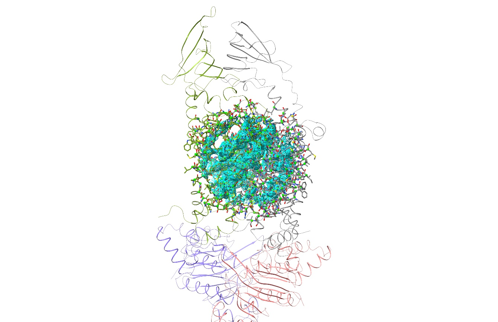

There are still two problems to overcome before we can get properly started. The
first is actually fairly minor: the fact that chains A and G are a long way from
correctly fitted. We *could* in fact get fairly straightforwardly to a good
result starting from here if that was the only issue (after all, that's how
things go in the original :ref:`bulk_fitting_tutorial` tutorial) - but the much
bigger issue is that we have a very serious clash between those newly-added
domains at top. To take a look, do:

`view #1/F:149`__

__ cxcmd:view\ \#1\/F:149

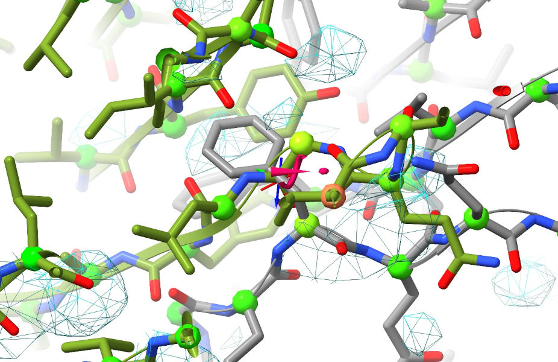

Yuck. Now, we *could* still get around this while still starting from these
coordinates by first doing "isolde ignore /F" to temporarily exclude chain F
from simulations while we refit chains A and G - but there's a much easier
solution that addresses both of the above problems simultaneously. First, zoom
out so the whole model is visible, go to ISOLDE's Sim settings tab and set the
"Mask radius" box to 12.0. Then, select the whole model with `sel #1`_ and click
ISOLDE's mask to selection button in the top ribbon menu. You'll also
probably find this next bit easier if you switch the map view from wireframe to
transparent surface (using the "Non-crystallographic Map Settings" widget). 
Your view should now look like this:

.. _sel #1: cxcmd:sel\ \#1

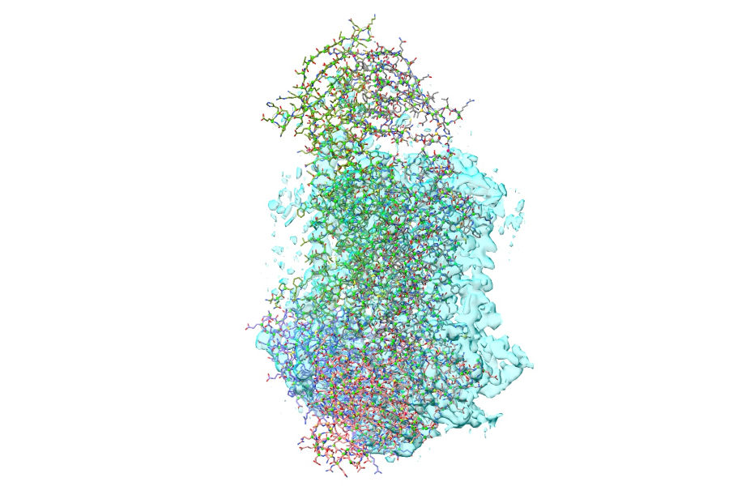

Now, select chains B and F:

`sel #1/B,F`__

__ cxcmd:sel\ \#1\/B,F

Then, go to the "Right Mouse" tab on the ChimeraX top ribbon menu, and choose
the "Move atoms" button in the "Movement" section. **(WARNING: Be VERY careful
with this mouse mode. Right-click-and-drag will move all selected atoms, and
there is NO undo for this step. Make absolutely sure you've selected what you
think you've selected, and when in doubt save your work first.)**

To make things easier to see, you might also want to reduce to showing only the
ribbon:

`hide`__

__ cxcmd:hide

Then, zoom in a bit and line up your view so dragging will take you to
approximately where you want to be:

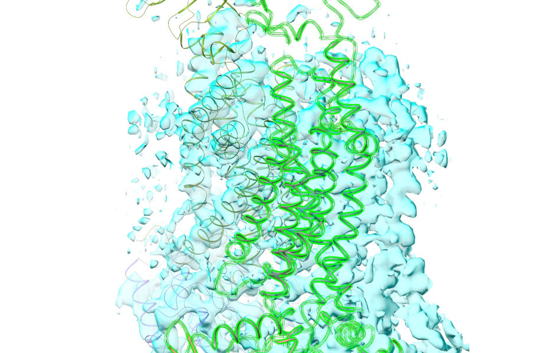

\... right-click-and-drag to get it approximately fitting (if you need to, you
can hold shift to switch from dragging to rotating):

.. figure:: images/during_rigid_fitting.jpg

\... and get it the rest of the way with the command:

`fit sel in #1 moveWholeMolecules false`__

__ cxcmd:fit\ sel\ in\ \#1\ moveWhole\ f

Now would also be a good time to bring the full atom view back:

`show #1`__

__ cxcmd:show\ \#1

If all has gone well, your view should now look something like this:

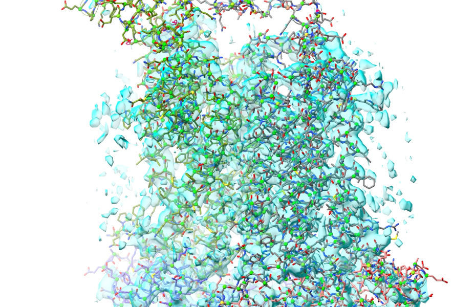

So, that deals with our biggest issues. There are just two more things to take
care of before we get started. First, the easy one: add hydrogens.

`addh #1`__

__ cxcmd:addh\ \#1

\... and before we forget, set the mask radius back to 4 Angstroms using the 
spinbox on ISOLDE's General tab.

Now, we need to restrain the model to make sure the local geometry remains
sensible while refitting (remember, at any site where the model remains well out
of step with the map, naive unrestrained fitting is likely to mess things up
badly). This is why we needed to keep those unmerged AlphaFold models around.

First, a bit of explanation on what's about to happen. As I mentioned at the
start, AlphaFold provides two key measures of confidence in its predictions. One
you've already met: the pLDDT value, provided on a scale of 0 to 100 in the
B-factor column of each model. Since it's a measure of how well AlphaFold
believes its prediction matches the immediate environment for a given residue,
this is a natural metric by which to weight the similarly-local torsion
restraints. The other is a little more complicated. The predicted aligned error
(PAE) matrix encodes the confidence AlphaFold has in the distance between every
single residue pair in the model (technically, each point [i,j] is the expected
error in the position of residue i if the predicted and true structures were
aligned on residue j). This is a rich source of information to control the
weighting of atom-atom distance restraints in ISOLDE. As an example, the PAE
matrix for chain G looks like this on the `page for its AlphaFold DB entry`__:

__ https://alphafold.ebi.ac.uk/entry/P0ADC6

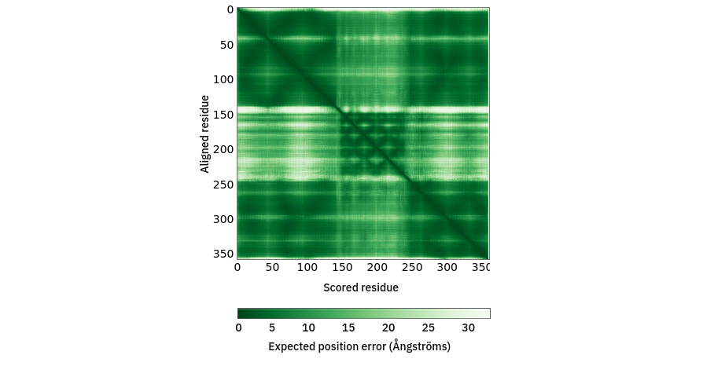

Since ISOLDE 1.3, it has been possible to tell ISOLDE to automatically adjust
the parameters of each torsion and distance restraint based on AlphaFold's
confidence in its prediction of the local geometry. This can be achieved via the
"Reference Models" widget on ISOLDE's Restraints tab, or via the optional
"adjustForConfidence" argument to the "isolde restrain distances" and "isolde
restrain torsions" commands. In the torsion case, the adjustment is performed
based on pLDDT *(NOTE: this assumes the B-factors in the reference model are
actually pLDDT values. If this is not the case, you will get nonsensical
results)*. The adjustments to the restraints are somewhat heuristic and are
plotted below. Qualitatively, a given restraint gets weaker (lower spring
constant), falls off more quickly outside its harmonic well (lower alpha), and
gets a narrower harmonic well (increased kappa) as the pLDDT reduces (see
:ref:`adaptive_dihedral_restraint_cmd` for the meaning of these terms). Residues
for which the template pLDDT value is less than 50 are *not* restrained. The
plots shown below are the result of the command with default parameters - if you
specify custom angleRange, alpha and/or springConstant values, these will set
the maximum values of those parameters upon which the scaling acts. In general
the defaults should work well, but feel free to experiment when you're done with
this tutorial.

.. figure:: images/torsion_restraint_plddt_adjustments.png

In a similar manner, distance restraints are reweighted based on the PAE matrix
- see :ref:`isolde_restrain_distances_cmd`. As the PAE between residues for a
given atom pair increases, the restraint strength (kappa) decreases, the
flat-bottom tolerance increases, and the rate of fall-off outside the (harmonic
+ flat bottom) region increases. As for the torsion restraints, the default
profiles (below) may be tweaked by setting custom kappa, tolerance and fallOff
terms.   

.. figure:: images/distance_restraint_pae_adjustments.png

**(REMINDER: The 'adjustForConfidence true' argument for 'isolde restrain
distances' requires the reference model to be the unmodified original output from 
AlphaFold - that is, with no residues added or removed)**

To understand how these will be used, let's first take a closer look at that PAE matrix for 
chain G. Note the color scale - dark green is an expected error of zero (in reality, the 
minimum value is 0.2), and white is a whopping 32 angstroms! I hope you'll agree that a 32
angstrom margin of error isn't particularly useful for (near-) atomic resolution modelling...
when "adjustForConfidence True" is used, ISOLDE will avoid creating *any* distance restraints 
for atom pairs whose PAE is greater than 4 Angstroms. Here's what that same PAE matrix looks 
like with the colours scaled to that range:

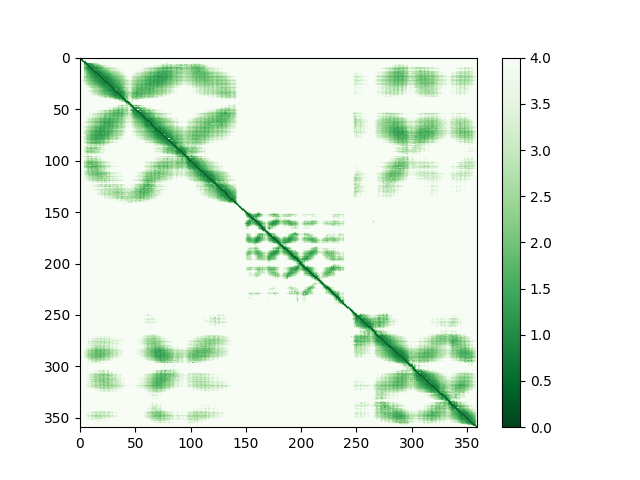

If you prefer to work via the GUI, the Options section of the Reference Models 
widget provides sliders allowing you to interactively adjust the nominal strength
and "fuzziness" of the restraints prior to applying them, and gives a preview of 
what the resulting potential would look like for a restraint with perfect confidence:

.. figure:: images/reference_model_options_panel.png

Anyway, let's go ahead and apply those restraints. First, let's show the reference models 
again:

`show #3 models`__

__ cxcmd:show\ #3\ models

Now, switch to ISOLDE's Restraints tab and expand the Reference Models widget.
Choose "3.1: AlphaFold LPTB_ECOLI chain A" in the "Reference model:" drop-down
menu. Because this reference model was downloaded from the EBI AlphaFold
database, ISOLDE already knows where to find its PAE matrix and will load it. If
in future you want to use a prediction you've generated yourself, you can use
the "Load PAE matrix" to load it from the .json file you should have received
alongside the predicted model. Check the "Distances" and "Torsions" checkboxes
restraining model chain A to template chain A. The widget should now look like
this:

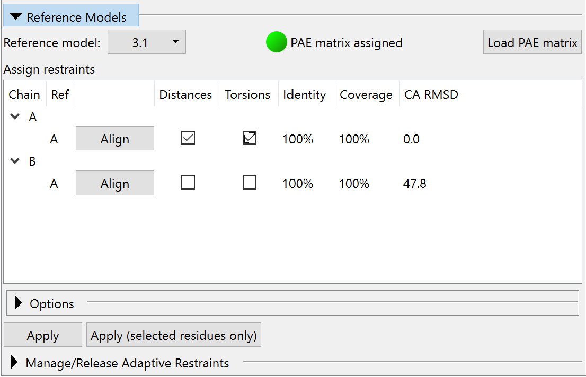

In this case, where the four reference chains are independent models, this step
needs to be repeated for each model chain/reference chain combination. If you
have a multi-chain reference model generated using AlphaFold-multimer, this
widget will allow you to restrain multiple chains simultaneously (see
:ref:`alphafold_multimer_cryoem_tutorial`). On each application of restraints, the 
equivalent command(s) will be echoed to the log. These look like this:

`isolde restrain torsions #1/A template #3/A adjustForConfidence true`__

__ cxcmd: isolde\ restrain\ torsions\ \#1\/A\ template\ \#3\/A\ adjustForConfidence\ true

`isolde restrain torsions #1/B template #3/B adjustForConfidence true`__

__ cxcmd: isolde\ restrain\ torsions\ \#1\/B\ template\ \#3\/B\ adjustForConfidence\ true

`isolde restrain torsions #1/F template #3/F adjustForConfidence true`__

__ cxcmd: isolde\ restrain\ torsions\ \#1\/F\ template\ \#3\/F\ adjustForConfidence\ true

`isolde restrain torsions #1/G template #3/G adjustForConfidence true`__

__ cxcmd: isolde\ restrain\ torsions\ \#1\/G\ template\ \#3\/G\ adjustForConfidence\ true

\... and the distance restraints:

`isolde restrain distances #1/A template #3/A adjustForConfidence true`__

__ cxcmd: isolde\ restrain\ dist\ \#1\/A\ template\ \#3\/A\ adj\ t

`isolde restrain distances #1/B template #3/B adjustForConfidence true`__

__ cxcmd: isolde\ restrain\ dist\ \#1\/B\ template\ \#3\/B\ adj\ t

`isolde restrain distances #1/F template #3/F adjustForConfidence true`__

__ cxcmd: isolde\ restrain\ dist\ \#1\/F\ template\ \#3\/F\ adj\ t

`isolde restrain distances #1/G template #3/G adjustForConfidence true`__

__ cxcmd: isolde\ restrain\ dist\ \#1\/G\ template\ \#3\/G\ adj\ t

We no longer need the reference models, so we can go ahead and close them:

`close #3`__

__ cxcmd:close\ #3

Now your model should look something like this:

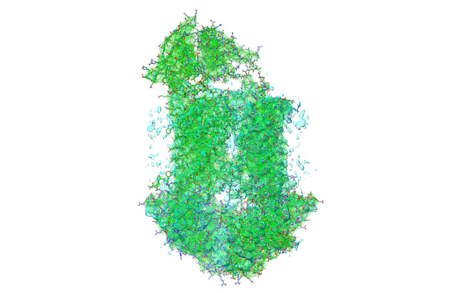

\... or zoomed in:

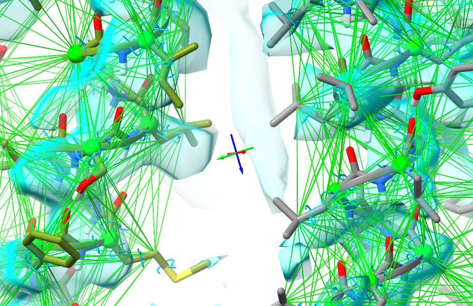

Of course, right now all the restraints look completely satisfied - because of
course they are, since the working and reference models are identical. That's
about to change. Zoom out so you can see the whole model, and switch back to
spotlight mode (using the button on the ISOLDE ribbon menu). Now, select the
whole model:

`sel #1`__

__ cxcmd:sel\ \#1

\... and you're ready to start a simulation running. If you're not running on a
machine with a high-end GPU (ideally, a GTX 1060 or better), you might want to
set the "Sim Fidelity" mode to "Quick" using the "Simulation Fidelity/Speed"
widget on the General tab first. This makes some simplifications to the MD
environment to speed it up substantially at the expense of some fine detail -
but remember that (a) everything is now quite tightly restrained, and (b) we can
always go back to high-fidelity mode to clean up the details once this initial
fitting is done. Anyway, go ahead and start the simulation, either by pressing
the play button, or using:

`isolde sim start sel`__

__ cxcmd:isolde\ sim\ start\ sel

The first thing you'll probably want to do is simplify the view by reducing it to a 
C-alpha trace *(Note: it's often preferable to do this after you start a simulation - 
that way it will revert automatically to the standard all-atom display when you stop 
it)*.

`hide ~@CA`__

__ cxcmd:hide\ ~@CA

Now, for the time being you can just sit back and watch the show - if you've followed the
instructions above almost no interactive fitting should be needed in the well-resolved regions.
Just keep an eye on it, and stop the simulation when it appears no further bulk shifts are 
happening (typically 30-60 seconds on a GTX 1080 GPU). Now, let's first hide all the satisfied
distance restraints:

`isolde adjust distances #1 displayThreshold 0.5`__

__ cxcmd:isolde\ adj\ dist\ \#1\ disp\ 0.5

\... and take a look at a few notable sites. First, the cleft between the 124-139 and 169-186 
helices on chain A:

`view #1/A:124-139,169-186`__

__ cxcmd:view\ \#1\/A:123-139,169-186

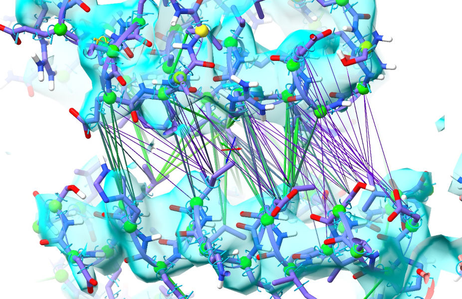

As we saw in the previous tutorial, this is adjacent to the ATP binding site and closes 
substantially on ATP binding. As it happens the AlphaFold model was closest to the ATP-bound
conformation, but this site has opened up readily as guided by the density. While the restraints in 
purple are weakened, they are still biasing the model towards a conformation that is clearly wrong -
so it would be best to release them. This can be done with the "isolde release distances" command,
with varying options to decide the level of specificity you want. At the simplest end,
"isolde release distances sel" will release *all* distance restraints on a given selection. Adding 
the option "externalOnly true" will cause ISOLDE to release only those restraints leading to atoms
*outside* the selection. The argument "strainedOnly true" will release any strongly deviating 
restraints involving at least one selected atom  For maximum specificity, however, you can use the 
"to" argument to specify a second set of atoms; this will release only those restraints between the
main selection and the "to" selection. For example:

`isolde release distances #1/A:164-186 to #1/A:124-126,139-154`__

__ cxcmd:isolde\ release\ distances\ \#1\/A:164-186\ to\ \#1\/A:124-126,139-154

\... should selectively release the restraints across this gap.

Now, you'll probably agree that the above command is a bit wordy. To cut down on
typing, you can activate ISOLDE's shorthand:

`isolde shorthand`__

__ cxcmd:isolde\ shorthand

This creates a series of short aliases for common commands - you'll see a complete list of these 
printed to the log:

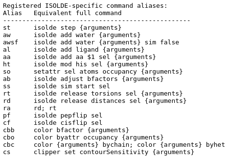

The ones we want here are "rd" (release distances), "rt" (release torsions), and
"ra" (release all). Unlike the full command, these will act on the
currently-selected atoms - "rd" will release all distance restraints on selected
atoms, "rt" will release all torsion restraints for residues with at least one
atom selected. The optional arguments to the full commands are still valid, so
e.g. "rd ext t" will preserve distance restraints where *both* atoms are
currently selected; "rt backbone f" will release only the torsion restraints on
sidechains. So, if you first select residues 164-186 of chain A in whichever way 
you prefer, the above "isolde release distances" command reduces to:

`rd to #1/A:124-126,139-154`__

__ cxcmd:rd\ to\ #1/A:124-126,139-154

The "Manage/Release Adaptive Restraints" widget on ISOLDE's Restraints tab also allows you 
to selectively release restraints without any typing needed.

Now, on to a site that was previously challenging but has become straightforward. The loop from 
300-306 of chain G, along with most of the following helix, typically came out one residue out 
of register when starting from the original 6mhz, and required quite a bit of manual intervention
to fix. Let's take a look at it here:

`sel #1/G:300-306; view sel`__

__ cxcmd:sel\ \#1\/G:300-306;view\ sel

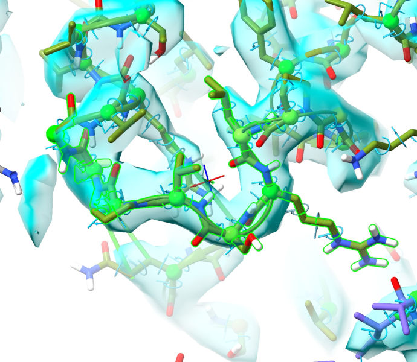

Where previously it was difficult-but-tractable to rebuild this manually into the density, now it 
looks practically perfect as-is! One minor caveat is Pro299 - if you'll recall, in the 
:ref:`bulk_fitting_tutorial` I ultimately concluded it was probably in *cis*, but AlphaFold thinks 
it should be *trans*. It's honestly hard to say for certain at this resolution - and even in the 
significantly higher resolution `6s8n`__ (3.1 Angstroms, released about 6 months after 6mhz) it's 
still quite ambiguous, with both *cis* and *trans* conformations looking a bit strained. All in 
all, probably best to go with AlphaFold on this one.

__ https://www.rcsb.org/structure/6S8N

**(NOTE: this region is right on the edge of what can be described as "resolved"
in this map, and the question of whether it should be modelled at all really
depends on your goals. In a real-world scenario where you are responsible for
generating the maps themselves from original particle images, it would be a very
good idea to look at options such as masked or focused reconstruction to get a
clearer picture of this site, and/or methods such as CryoDRGN which attempt to
extract a continuous representation of the flexibility seen in the particles.
But in this case this map is all we have, so let's try to make the best of
it.)**

First, let's see if we can get a somewhat better view of this region through the
high-resolution noise. A trick that is often helpful in regions where the local
resolution is substantially lower than the average is to generate a blurred map.
Here, "blurring" refers to the act of emphasizing the low-resolution components
of the map in Fourier space; the result is often good at showing connectivity
and the overall "envelope" where a more sharpened map just looks like noise.
Let's go ahead and do this. First:

`volume gaussian #1 bfactor 300`__

__ cxcmd:vol\ gaus\ \#1\ bfactor\ 300

\... and associate it with your model for ISOLDE's purposes:

`clipper assoc #2 to #1`__

__ cxcmd:clipper\ assoc\ \#2\ to\ \#1

Now, focus your view around the region we're interested in:

`view #1/F:209`__

__ cxcmd:view\ \#1\/F:209

\... and adjust your map contour levels for both maps to around 3.6 sigma
(remember: alt-scroll to adjust contours, ctrl-scroll to select which map is to
be contoured. To save your scroll wheel, you can adjust the sensitivity with
another piece of handy shorthand - `cs 0.25`__ will set the level change per
"click" of the scroll wheel to 0.25 sigma). The result should look something
like this:

__ cxcmd:cs\ 0.25

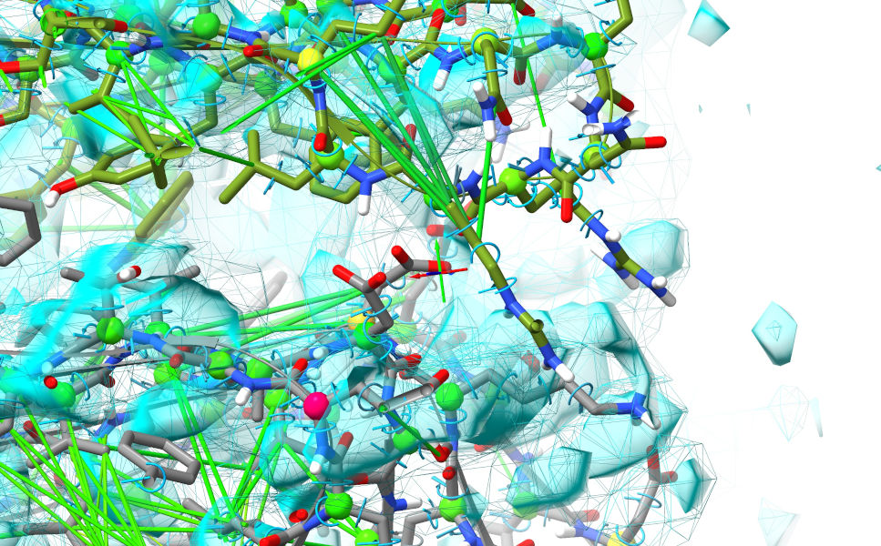

Still far from great, but there's enough there to suggest pretty strongly that
the bottom domain (chain F, grey) needs to shift quite a bit to the right. That
suspicion should be strengthened when you look more closely at the residues
along the edge - note in particular the line of acidic residues on chain F which
look like they want to form a complex salt bridge with a line of basic residues
on chain G:

.. figure:: images/blurred_map_contour_potential_salt_bridges.jpg

So... let's see if we can make this happen, and if the result makes more sense.
First, start a suitable simulation. You can do this by interactively building a
selection encompassing those two head domains with a combination of ctrl-click,
ctrl-shift-click and the up/down arrow keys, or make a suitable selection using
commands:

`sel /F:134-257|/G:141-253; isolde sim start sel`__

__ cxcmd:sel\ \/F:134-257|\/G:141-253;isolde\ sim\ start\ sel

Now, make sure your view is lined up in about the same way as in the image
above. What we're going to do now is use ISOLDE's "tug selection" mouse mode
(the button third from bottom left of the ISOLDE panel) to induce a bulk shift.
Click that button. Now, perhaps the hardest thing about using this mode is
defining a reasonable selection that includes what you want to tug and excludes
what you don't. In this case it can be done fairly easily with the combination
of mouse selection and a little Boolean logic. First, pause the simulation, then
reduce the view to a C-alpha trace:

`hide ~@CA`__

__ cxcmd:hide\ ~@CA

\... and ctrl-click-and-drag to make a box encompassing the face of chain F
contacting chain G (don't worry if you get a few chain-G residues in - we'll
weed them out in a minute). The result should look something like this (selected
residues highlighted in bright green). 

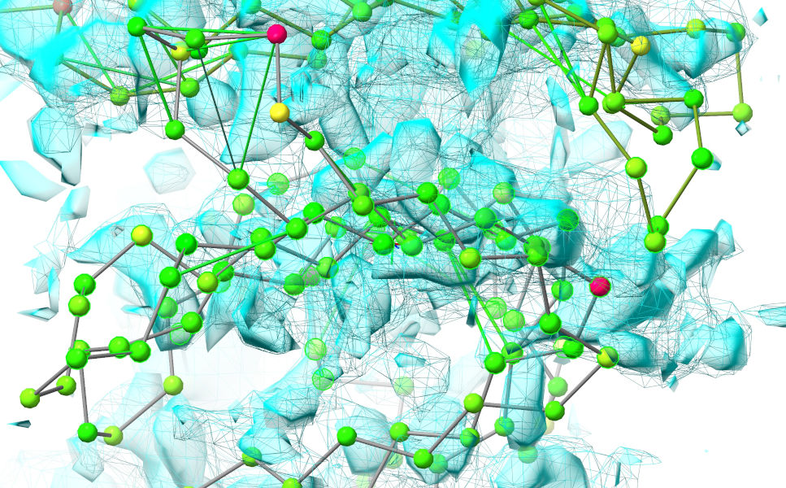

Now, we'll reduce this selection to only the residues from chain F we're
interested in:

`sel sel&/F:145-240`__

__ cxcmd:sel\ sel&\/F:145-240

Now, let's get the all-atom view back:

`show ~HC`__

__ cxcmd:show\ ~HC

\... resume the simulation, and start *gently* tugging to the right. You should
pretty quickly get to something looking a bit like this (minus the labels):

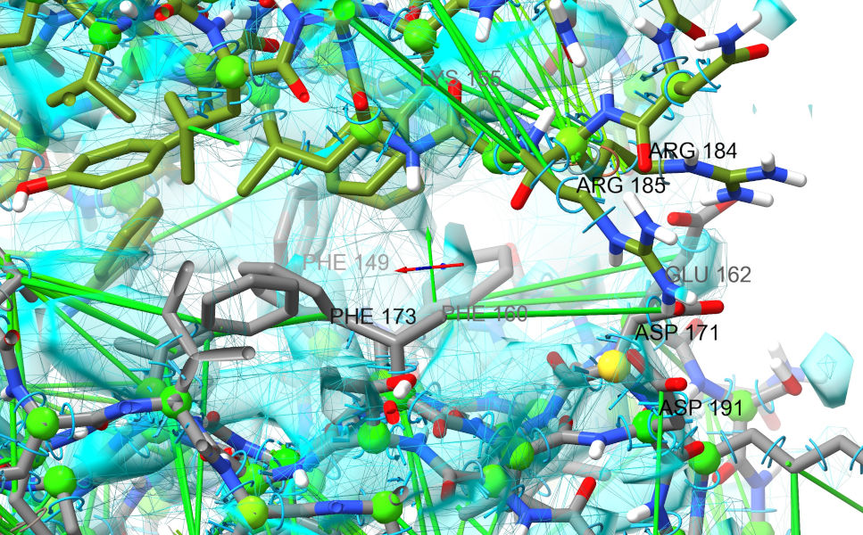

As well as the acids and basic residues lining up better, notice the cluster of
three phenylalanines on chain F which all now sit in reasonable density and
stack nicely against aromatic residues from chain G. A good sign that we're on
the right track... Now would be a good time to stop and do another overall
settle of the complete model.

`isolde sim stop`__

__ cxcmd:isolde\ sim\ stop

`isolde sim start #1`__

__ cxcmd:isolde\ sim\ start\ \#1

Let that settle for a minute or so, then stop.

While there is of course more that can (and should) be done with this model
before downstream use, that's where we'll leave this tutorial. The next
advisable step would be a thorough residue-by-residue checkup *(hint: you can go
to the first residue in the model with* `st first`__ *and step through from
there with repeated* `st`__ *commands)*, releasing restraints where they don't
agree with the map and making adjustments in short sims as necessary. Given the
poor residue around those top domains there's not a whole lot more ISOLDE can do
to help there - but the result is at least good enough to help guide further
experiments in future. Another thing that ISOLDE can't yet do (at least not
without a lot of effort first) is help with modelling the bound
lipopolysaccharide - while in theory this could certainly be parameterised for
MD, in practice using current tools this would be a very challenging project in
its own right. This is, however, something that is likely to change in the
reasonably near future - watch this space!

__ cxcmd:st\ first

__ cxcmd:st
