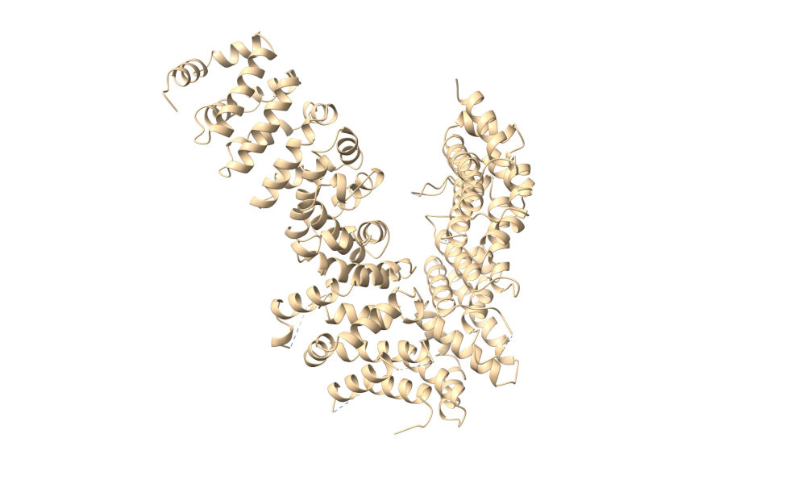
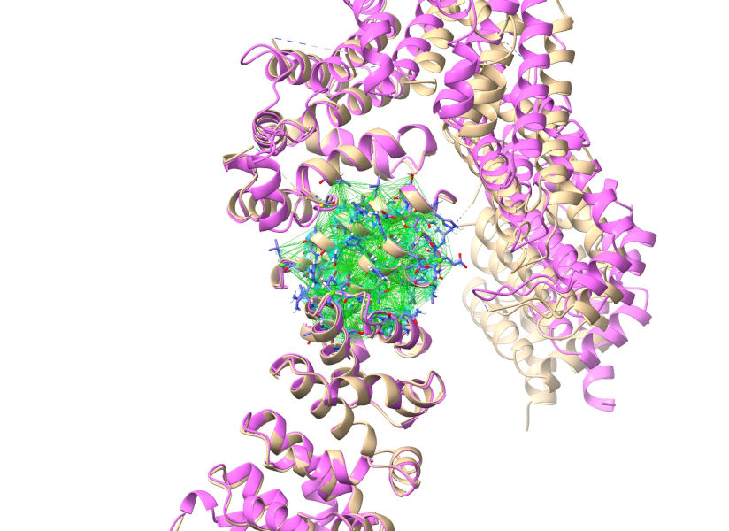
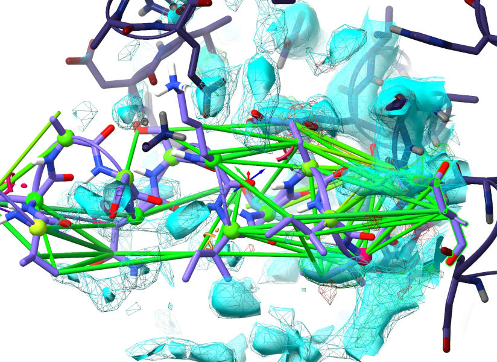
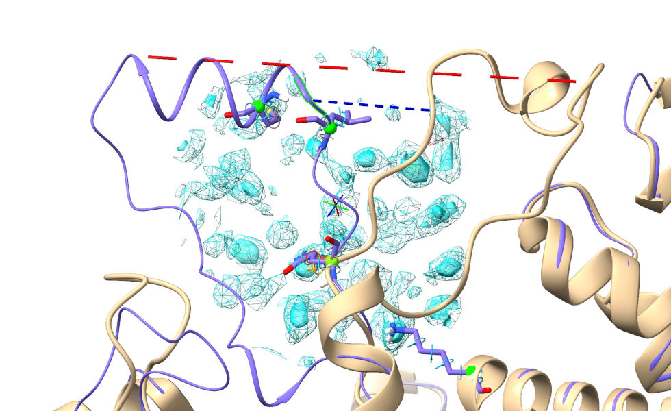
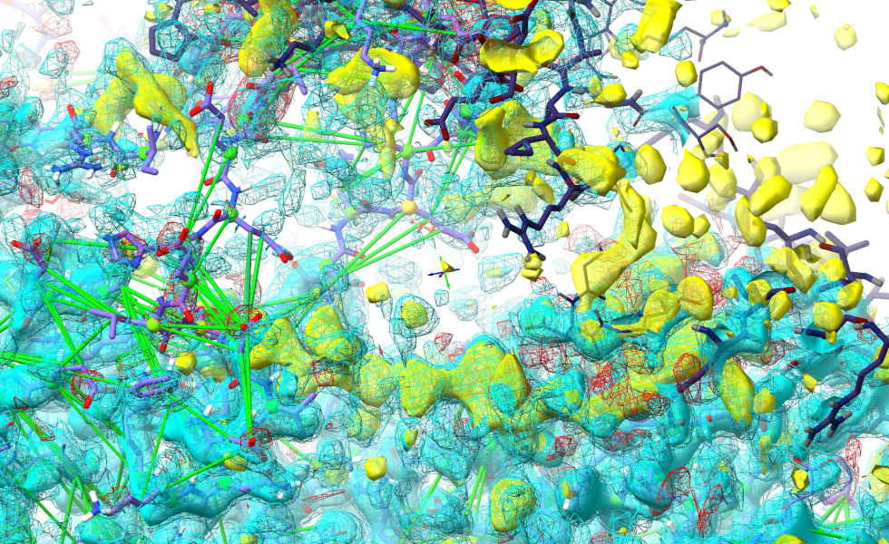
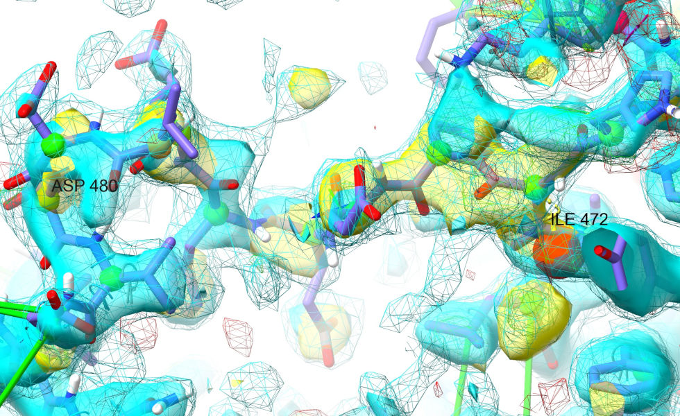

.. _alphafold_mr_tutorial:

Starting From a Molecular Replacement Solution for a Flexible Protein
=====================================================================

**NOTE: Most links on this page will only work correctly when the page is
loaded in ChimeraX's help viewer. Unless the necessary files have been
pre-fetched you will also need to be connected to the Internet. Please close any
open models before starting this tutorial.**

**The instructions in the tutorial below assume you are using a wired mouse
with a scroll wheel doubling as the middle mouse button. While everything
should also work well on touchpads in Windows and Linux, support for Apple's
multi-touch touchpad is a work in progress. Known issues with the latter are
that clipping planes will not update when zooming, and recontouring of maps is
not possible.**

If you wish to leave this tutorial part-way through and return to it later, you
can save the state (all open models, maps, restraints etc.) to a ChimeraX session 
file via the File/Save menu option or with the command:

*save tutorial_session.cxs*

You can of course also save the working model to PDB or mmCIF - again, via the 
menu or with your choice of the below commands:

*save model.pdb #1*

*save model.cif #1*

To save without hydrogens, instead do:

*sel ~H; save {your choice of filename and extension} selectedOnly true*

The above commands will save to your current working directory. They are not 
provided as links here because that would save them to the directory containing
this tutorial file, which is probably *not* what you want.

Tutorial: Flexibly fitting an AlphaFold model to match a molecular replacement solution
---------------------------------------------------------------------------------------

*Level: Moderate to Hard*

.. toctree::
    :maxdepth: 2

**This tutorial will write a number of files to your current working directory.
To avoid clutter and confusion it is best if you create and change to a fresh
directory first.**

`Click here to choose a directory and populate it with tutorial data`__

__ cxcmd:cd\ browse;isolde\ tut\ prep\ alphafold_mr

Solving a crystallographic dataset by molecular replacement differs from fitting into
cryo-EM density in two important ways. First, there is the fact that the quality of 
a crystallographic map is dependent on both the quality and completeness of the atomic
model: too many missing ordered atoms, or two many atoms far out of position, and the 
map degrades to the point of uninterpretability. Second, the crystallographic model is 
one repeat unit in a continuous array of contacting copies - out-of-position atoms will 
commonly end up overlapping with neighbouring repeat units.

The problem is that the vast majority of proteins like to *move* at various scales, from
sidechains and loops to large-scale interdomain rearrangements. In these cases, successful
molecular replacement relies on first breaking down your search model into rigid fragments,
including trimming away mobile loops. It is common for 10-50% of protein residues to be 
discarded in this process, which can be a real shame when your search model is actually 
good quality, just in a different conformation. Historically, the standard approach has 
been to extend from the MR solution by iteratively tracing as much of the residual density
as possible (manually or via various automatic tools) interspersed with rebuilding and 
refining. Depending on the quality of the dataset this can be quite slow, painful and 
error-prone.

In this tutorial we will explore a way to short-circuit this task - instead of building out
from the MR solution, we will use it (and to start with, the initial map generated from it)
as a guide to refit the *complete* original model (in this case an AlphaFold model, but 
essentially the same procedure could be used with an existing experimental model if you 
have one). As our example, we'll be recapitulating `3now`_, the 3 Angstrom structure of 
*Drosophila* UNC-45. This largely alpha-helical structure forms a lopsided "V", and 
AlphaFold models disagree with the experimental structure primarily in the tightness of 
the central angle allowing rigid overlay of only one leg at a time:

.. _3now: https://www.rcsb.org/structure/3NOW

.. figure:: images/3now_vs_colabfold.jpg

    Experimental structure in green, `ColabFold`_ model in purple.

.. _ColabFold: https://colab.research.google.com/github/sokrypton/ColabFold/blob/main/AlphaFold2.ipynb

As described above, the sensible approach here is to break the predicted model into two 
domains for molecular replacement. For this tutorial, I've done that using 
`phenix.process_predicted_model`__, which does three things:

__ https://phenix-online.org/version_docs/dev-4380/reference/process_predicted_model.html

* Converts the pLDDT values in the model to estimated B-factors,
* Breaks the model into domains based on analysis of the PAE matrix, and
* Trims off low-confidence loops and tails.

From there, I've run molecular replacement with `Phaser`__, leading to a very high-confidence
solution (Log-Likelihood Gain 2331, translation function Z-score 47). That's where we're going
to start. 

__ https://scripts.iucr.org/cgi-bin/paper?he5368

First, use the ChimeraX **File/Open** dialog to open the file 3now_phaser.1.pdb. You should see 
something like this:

Now, open the predicted model (3now_662d5_unrelaxed_rank_1_model_2.pdb), then align it to the 
C-terminal region of the MR solution with:

`match #2 to #1:400-900`__

__ cxcmd:match\ #2\ to\ #1:400-900

This second model is going to become our working model. If you haven't already started ISOLDE,
launch it now:

`isolde start`__

__ cxcmd:isolde\ start

\... and tell it to focus on the second model either by using the "Working on:" drop-down menu, or via
the command:

`isolde select #2`__

__ cxcmd:isolde\ select\ #2

Before we actually load the MTZ file, there's one very important thing we need to do. Since this 
is an AlphaFold model the B-factor column is currently filled with pLDDT values, which are no good 
for crystallographic calculations. Luckily, as described in the supplementary information of 
`the original RoseTTAFold manuscript`__, there's a fairly strong relationship between pLDDT and 
experimental B-factors, allowing us to estimate the latter. On the top ChimeraX menu, go to 
**ISOLDE/Prep/Convert pLDDTs to B-factors** to make this conversion.

__ https://doi.org/10.1126/science.abj8754

Once that's done, we can go ahead and open the MTZ file provided by Phaser. The easiest way to 
do that is via the "Add map(s) to working model" widget on the ISOLDE GUI:

.. figure:: images/add_maps_widget.png

Click the "From crystallographic dataset" button and choose 3now_phaser.1.mtz.

*(NOTE: Because the Phaser MTZ file does not contain free flags, ISOLDE will choose a new set at this 
point.)*

Your display should now look something like this:

.. figure:: images/mtz_loaded.jpg

The R-factors calculated from the experimental structure factors should appear
briefly in the bottom right corner (don't worry if you don't see them yet -
they'll pop up again once we add hydrogens). They're currently hovering around
0.6 - telling us that (due to the n-terminal portion of the model being way out
of position) the maps being generated by ISOLDE itself are currently far from
useful. That's OK, since the MTZ file also contains a "static" map
pre-calculated by Phaser from the MR solution (well, actually it contains three,
but we're only interested in one). Open the "Precalculated Crystallographic Map
Settings" widget on ISOLDE's General tab to take a look:

The three maps here are, in order:

================== =========================================================
Name               Meaning
================== =========================================================
FC, PHIC           Structure factors calculated from the MR model. This 
                   map will *always* look like the starting model, and is
                   not useful for our purposes.

FWT, PHWT          The 2mFo-DFc structure factors (Two times the observed 
                   amplitudes minus the calculated amplitudes combined with 
                   phases from the calculated map; the "m" and "D" are 
                   weighting factors). This is the map we want to work 
                   with.

DELFWT, PHDELWT    The mFo-DFc map. Not enormously useful to us in this 
                   case.
================== =========================================================

Let's delete the maps we don't need:

`close #2.1.1.5|#2.1.1.7`__

__ cxcmd:close\ #2.1.1.5|#2.1.1.7

\... and enable the remaining map for fitting by checking the MDFF checkbox. 
This will pop up a warning message:

In general you should pay close attention to this message: if for any reason 
you choose to do the majority of your fitting with a precalculated map rather 
than ISOLDE's own live maps, it is up to you to make sure that map was 
calculated without free reflections included. In this case, though, we'll 
only be using this map fairly briefly for initial fitting, so there's very
little risk here. Go ahead and click OK.

Personally, I also prefer to switch from mesh to transparent surface visualisation
here, but that's up to you.

Now, collapse the precalculated maps widget and open the "Dynamic Crystallographic
Maps" widget above it. It should look like this:

Since these aren't much use to us just yet, we should disable MDFF here and 
hide all the maps to reduce visual confusion:

.. figure:: images/dynamic_maps_hidden.png

Now you can collapse that widget if you like. We're almost ready to start now - 
we just need to add hydrogens:

`addh #2`__

__ cxcmd:addh\ #2

\... and add some restraints to reinforce the model during this initial fitting
(without these, models this far out of density tend to get pretty mangled). For
the restraint reference, let's open a copy of the reference model
(**File/Open**, and choose 3now_662d5_unrelaxed_rank_1_model_2.pdb).

Switch to ISOLDE's Restraints tab, and expand the "Reference Models" widget.
Choose the model you just opened in the "Reference model:" drop-down menu. The
widget should now look like this:

.. figure:: images/reference_model_no_PAE.png

Click the "Load PAE matrix" button, choose the file
3now_662d5_unrelaxed_rank_1_model_2_scores.json, and click OK. In the "Assign
restraints" window, check the checkboxes under Distances and Torsions. The
widget should now look like this:

.. figure:: images/reference_model_with_PAE.png

Feel free to expand the Options and play around with the settings, but when
you're done, make sure to leave it looking like this before continuing:

.. figure:: images/reference_model_options_widget.png

Click the Apply button to add distance and torsion restraints to your working
model. The main window should now look like this:

With the restraints applied, we no longer need to keep the reference model around. 
Go ahead and close it:

`close #3`__

__ cxcmd:close\ #3

One last thing: with the default mask radius of 4 Angstroms (applied when starting
a simulation) the N-terminal portion of the map is too far from our working model 
to be shown. Increase it to 9 Angstroms (On ISOLDE's General tab).

**(NOTE: very large mask radius values can significantly impact on simulation 
performance, particularly when working with live maps. Don't forget to set it back
to a smaller value once this bulk fitting task is done.)**

Now, go ahead and start a simulation. Select the model and press the play button 
on the left of ISOLDE's ribbon menu, or:

`sel #2; isolde sim start sel`__

__ cxcmd:sel\ #2;isolde\ sim\ start\ sel

Click the pause button once the simulation starts. Now, for big bulk-movement tasks 
like this the default all-atom view can make it a bit hard to see the forest through 
the trees:

.. figure:: images/sim_started.jpg

\... so I'd recommend reducing to a C-alpha trace by hiding all other atoms:

`hide ~@CA`__

__ cxcmd:hide\ ~@CA

.. figure:: images/ca_trace.jpg

Now, select the first 300 residues:

`sel #2:1-300`__

__ cxcmd:sel\ #2:1-300

\... and choose the "Tug selection" mouse mode on ISOLDE's ribbon menu:

.. figure:: images/tug_selection_mode.png

Your *right-click-and-drag* tugging actions will now be distributed across all selected 
atoms. Resume the simulation, and use this to help the N-terminal domain into place.
It's generally best to use a series of short tugs with breaks in between rather than 
one aggressive action - your goal is to "help" the model into place, not force-fit it.
It should only take 3-4 such short tugs for it to fall into place.

Before:

After:

.. figure:: images/tug_selection_end.jpg

Once your simulation looks like the latter image, hit the green stop button. Take a look 
at the bottom right of the ChimeraX window - the R-factors, previously hovering around 
0.6, should now be down to the vicinity of 0.4. Don't worry if the R-work is above R-free
(hinting at overfitting) at this stage - we're about to drop the Phaser map and switch 
to ISOLDE's live potential - which strictly excludes the free set - for all further rebuilding,
which will rapidly wipe out any model bias.

.. figure:: images/r_factors_after_bulk_fit.png

So let's go ahead and make that switch-over. Disable MDFF on Phaser's FWT,PHWT map, and hide 
it:

.. figure:: images/disable_precalc_mdff.png

Actually, if you prefer you can just close it entirely - it's not needed from here on:

`close #2.1.1.6`__

__ cxcmd:close\ #2.1.1.6

\... display all dynamic maps except the MDFF potential, and enable MDFF on the latter.

.. figure:: images/enable_dynamic_mdff.png

If you wanted to, you *could* display the MDFF potential as well, but in general it's not 
that useful. It differs only from the 2mFo-DFc map you see in that it excludes the free
reflections - the displayed maps should be slightly more informative since they include all 
reflections.

You'll probably want to re-contour the maps - after a big rearrangement like this the map 
sigma values can change quite substantially. Remember, *alt-scroll* to adjust the contour 
of a map, and *ctrl-scroll* to select the map to contour. I'd suggest setting the mFo-DFc 
map to +/- 3 sigma, the sharpened 2mFo-DFc map to 1.5 sigma, and the unsharpened 2mFo-DFc 
to 1 sigma (approximately - the exact values don't matter).

At this stage we can also close the original MR model:

`close #1`__

__ cxcmd:close\ #1

Before we start our next simulation, if you're like me you'll probably be finding that cobweb
of distance restraints a bit hard to see through. To cut down on the clutter, we can tell 
ISOLDE to only show those that are stretched away from their target values. You can do this 
on ISOLDE's "Manage/Release Adaptive Restraints" widget on the Restraints tab - just drag 
the "Display threshold" slider to the right:

This widget also contains some useful tools for selectively releasing distance and torsion 
restraints - we'll be needing these in a bit, because there are various sites where the 
AlphaFold model disagrees with the experimental density. Some of these disagreements are 
probably simply due to the slightly different overall conformation and the lack of crystal 
contacts - but some do look like true errors on AlphaFold's part. Before we get into looking
through all that in detail, let's first run a quick simulation in the new map.

First, remember to reduce the mask radius to 4 Angstroms. When you've done that, start a new 
whole-model simulation.

`sel #2; isolde sim start sel`__

__ cxcmd:sel\ #2;isolde\ sim\ start\ sel

Let it settle for a minute or so, then stop the simulation.

`isolde sim stop`__

__ cxcmd:isolde\ sim\ stop

Now, time to get into the detailed rebuilding. Before getting started on that, just browse
around a bit. You'll see quite a few places where the model disagrees quite substantially 
with the map. While some of these are probably examples of real conformational variability,
others are probably errors made by AlphaFold - remember, while it's an *amazingly* good 
structure prediction tool, it's not perfect. In these sites, what we'll need to do is 
selectively release the local reference restraints, and rebuild using small local simulations.

Before starting that, though, it's worth taking a look at the N- and C-termini to see if there
are any unstructured tail residues that should be culled. To cut down on typing, let's first 
activate ISOLDE's shorthand commands:

`isolde shorthand`__

__ cxcmd:isolde\ shorthand

\... which, among other things, creates the command "st" as an alias for "isolde stepTo". To go 
to the N-terminus, do:

`st first`__

__ cxcmd:st\ first

.. figure:: images/st_first.jpg

I hope you'll agree that looks pretty good (allowing for some minor rearrangement of the N-terminal 
residue). Let's take a look at the other end:

`st last`__

__ cxcmd:st\ last

That, on the other hand, looks terrible. Work your way backwards until you find something in good 
density (either by simply zooming out and panning along the chain, or by repeated use of `st`__ -
the "st last" command automatically set the step direction to backwards; you can also explicitly 
set the direction with "st next" or "st prev").

__ cxcmd:st

The last residue I find that looks reasonably good is Tyr 783:

There is density for a few more residues beyond that (but they're out of position), and then nothing
- this tail is probably unstructured, and should be removed. Let's get rid of it:

`del #2/A:787-810`__

__ cxcmd:del\ #2/A:787-810

\... and we may as well fix some of the local issues while we're at it. It looks to me like the 
remaining C-terminal residues should actually be alpha-helical, and the Phe747/Met752 sidechains 
are clearly wrong:

Select these residues, either by *ctrl-click* and *ctrl-shift-click*, or:

`sel :747,752,781-786`__

__ cxcmd:sel\ :747,752,781-786

\... and start a simulation. Shorthand for "isolde sim start sel" is:

`ss`__

__ cxcmd:ss

Let's take care of those sidechains first. Select them:

`sel :747,752`__

__ cxcmd:sel\ :747,752

\... and use the two "Release all selected" buttons on ISOLDE's "Manage/Release Adaptive Restraints"
widget to release their distance and torsion restraints. If you prefer, you can also 
do this using shorthand commands:

`rd`__

__ cxcmd:rd

to release all distance restraints on the selected atoms;

`rt`__

__ cxcmd:rt

to release all torsion restraints on the selected *residues*; or

`ra`__

__ cxcmd:ra

to release both distances *and* torsions.

The Phe is close enough to fall into density on its own once released, but the Met will 
need some help - I'd recommend just tugging it into position with the right mouse button.
They should now look something like this:

Now for that C-terminus. First, release the restraints on the tail residues:

`sel :783-786;ra`__

__ cxcmd:sel\ :783-786;ra

Now, to make things easier let's add some restraints driving this segment towards 
alpha-helix. Expand the "Secondary Structure" widget on ISOLDE's restraints tab. 
Extend the selection by 4-5 residues towards the N-terminus using the "Extend backward"
button in the "Selection Tools" bar at the bottom of the ISOLDE panel. Then click 
the "Alpha helix" button in the Secondary Structure widget. The resulting restraints 
almost certainly won't be able to converge on their own from this wildly different 
conformation, but a little helpful tugging should get you there:

Once you get there, go ahead and stop your simulation.

From here, there are many ways you can attack the remaining rebuilding tasks. 
Perhaps the best way at this early stage is to use ISOLDE's "Problem Zones" 
widget, which looks for the largest spatial clusters of unsatisfied restraints,
clashes, and geometry outliers. Switch to that tab now and click the Update 
button at bottom right. Click the top entry that appears in the table. The 
result should look something like this (although the precise numbers will 
of course differ):

.. figure:: images/problem_zones.png

The atoms associated with the problems in the cluster are selected and the view 
is centred on them, so all you have to do is click play or:

`ss`__

__ cxcmd:ss

\... to start working on it. Now, this region might look a little ugly and 
daunting at first, but it's actually one of the easiest cases to deal with: 
spend a little time looking around in it, and you'll realise that the vast 
majority of the issues are simply due to the restraints disagreeing slightly
with the density (this is actually the interface between the two legs of the "V",
which of course shifted quite a bit in our first step). Given that the density 
here is nice and strong, simply releasing the distance restraints on the 
mobile selection should solve most of our problems. If you've cleared the 
selection, click the "Within map mask" button at the bottom of the ISOLDE window
to select all atoms currently in the map. Then, go to the "Manage/Release 
Adaptive Restraints" widget on ISOLDE's Restraints tab, and click the 
"Release all selected" button in the distance restraints (top) section:

\... or just use the command:

`rd`__

__ cxcmd:rd

For this site, you shouldn't need to do much more than let it settle for a 
little bit. While a handful of sidechains are clearly out of position, it's 
up to you whether to handle them now - saving them for the later detailed 
cleanup is an entirely valid strategy. When the simulation shows no more 
sign of concerted bulk movement, stop it. 

`isolde sim stop`__

__ cxcmd:isolde\ sim\ stop

Let's move on to something slightly more challenging. Just outside this region,
the 179-184 loop is badly out:

`sel :179-184; view sel`__

__ cxcmd:sel\ :179-184;view\ sel

*(NOTE: this is the same site tackled at the end of the video accompanying our - 
not published at the time of ISOLDE 1.4's release - 2022 CCP4 Study Weekend manuscript,
but that used the pre-existing AlphaFold-EBI model for UNIPROT sequence Q9VHW4, where 
3now is actually Q960B1. The difference between the two sequences is only two fairly innocuous 
point mutations, but for whatever reason this loop is actually substantially better in 
the newer model. In the AlphaFold-EBI model Trp185 (right hand side of the above image) 
and Leu150 had rotamers assigned which placed them on the opposite "side" of each other,
and the loop itself was in a dramatically different conformation. The job here is 
much easier by comparison.)*

By now you probably know what to do. Start a simulation:

`ss`__

__ cxcmd:ss

\... then release the restraints and rebuild. It should come out looking like this:

Now, let's try something a bit more... ok, *much* more challenging. Residues 455-479 
are modelled as a short alpha-helix out on the end of a clearly highly-flexible arm. 
In the deposited model *(comparing to the known solution is cheating a bit, I know - 
but bear with me for teaching purposes)* this is in a dramatically different position,
packed into a crystallographic interface:

    Short blue and long red dashed lines connect equivalent N- and C-terminal residues 
    respectively.

Now, the biggest problem when modelling a big change like this is that the map is masked 
around where the atoms are *now*, not where you want them to be. While you *could* 
increase the mask radius substantially, that comes at a big performance cost. There's a 
neat trick you can use, though. First, focus on the region containing the unfilled density 
where this loop should go:

`view :636 pad 0.5`__

__ cxcmd:view\ :636\ 0.5

\... Hmm. Actually, hold that thought. At the top of this image, it's clear that some 
symmetry atoms are poking out into the density we want to fit. Let's take care of that 
first. *Double-click* on any symmetry atom to recentre the view on its equivalent 
real atom.

Not the greatest fit in the world here! By now you know the drill: explore along the 
chain in one direction until the model is back in register with the density, take note,
then explore in the other direction for the same. Select the stretch in between and 
start a simulation:

`sel :356-374; ss`__

__ cxcmd:sel\ :356-374;ss

Release the local restraints:

`ra`__

__ cxcmd:ra

\... and rebuild, starting from one end. Don't expect perfection yet - due to the
surrounding messiness this region is legitimately difficult. You'll probably find 
it easy enough to rebuild the first few residues from each end, but things will 
get more confusing from there. It would be quite a reasonable strategy to just 
delete the worst residues for now and build them back later, but it is possible to
get there without resorting to that. Anyway, once you've done your best, stop 
the sim.

Back to what we were doing:

`view :636`__

__ cxcmd:view\ :636

The restraints on this side are *also* fighting the density, so do a little more 
light rebuilding:

`sel :634-640; ss`__

__ cxcmd:sel\ :634-640;ss

`ra`__

__ cxcmd:ra

In my case, only Asp635 needed a little extra help. When done, stop your simulation.

Now, centre the view roughly in between His 636 and the symmetry copy of Asp362, 
and expand the spotlight radius out to 25 Angstroms using the spinbox on ISOLDE's
General tab or:

`clipper spotlight radius 25`__

__ cxcmd:clipper\ spotlight\ radius\ 25

The aim here is to get all the density corresponding to our unfitted loop visible at 
once:

Now, what we're going to do is take a snapshot of this segment of difference 
density. Look at the "Dynamic Crystallographic Map Settings" widget to get the model 
ID of the mFo-DFc map (2.1.1.3). Then:

`vol copy #2.1.1.3; show #2.1.1.3 model`__

__ cxcmd: vol\ copy\ #2.1.1.3;show\ #2.1.1.3\ model

The copy will appear in the Models panel as model #1, and will have exactly the 
same style and contour as your existing mFo-DFc map making it effectively invisible. 
We're also only really interested in the positive contour in this case. Let's
make some adjustments to get it to stand out:

`vol #1 style surface transparency 0.5 sdLevel 2 color yellow`__

__ cxcmd: vol\ #1\ style\ surface\ transparency\ 0.5\ sdLevel\ 2\ color\ yellow

Set the spotlight radius back to 15:

`clipper spot radius 15`__

__ cxcmd:clipper\ spot\ rad\ 15

The point of this map is to give you a temporary visual guide for the rearrangement -
since it isn't associated with the model it isn't clipped by the spotlight, and 
doesn't play any physical role in the simulation.

Now, before starting a simulation for a very large rearrangement like this, it 
is very important to select not only the atoms you want to *move*, but also those 
that they will be *contacting* once moved into the target position. Remember, in order 
to keep simulations as responsive as possible, ISOLDE only simulates a small region 
around your selection - if ISOLDE hides a residue when starting a simulation, the 
simulation doesn't actually know that residue exists at all! It's easy enough to make
the selection manually with *ctrl-click*, *ctrl-shift-click*, ChimeraX's up/down key 
selection promotion/demotion mechanism, and/or ISOLDE's selection manipulation buttons.
Otherwise, just use the command below:

`sel :454-480,590-600,634-638;ss`__

__ cxcmd:sel\ :454-480,590-600,634-638;ss

When things start moving, pause the simulation:

`isolde sim pause`__

__ cxcmd:isolde\ sim\ pause

This is still a very messy view, with the loop protruding way out into the symmetry 
atoms and effectively hidden. To make life easier, we can temporarily hide those:

`hide #2.3 model`__

__ cxcmd:hide\ #2.3\ model

\... and also hide our live maps for the time being:

`hide #!2.1 model`__

__ cxcmd:hide\ #!2.1\ model

*(NOTE: if you haven't seen it before, the "#!" operator tells ChimeraX to set the 
hide flag only on model 2.1, while leaving the flags on its sub-models unchanged. 
That makes sure that when we reinstate it, the current hide/show state of all the 
maps will be retained.)*

.. figure:: images/loop_sim_less_messy.jpg

This gives us something a little easier to start from. The first thing we'll want to 
do is release most of the clearly-wrong restraints. Let's leave the restraints in the 
helix in place for now, and release the flanking coil segments:

`sel :454-460,470-480; ra`__

__ cxcmd:sel\ :454-460,470-480;ra

The next step will be easier if we first do a little detective work. Look along the 
density corresponding to the loop, looking for bulky sidechains. Here, I've marked 
the biggest ones using the "Point" right-mouse mode on ChimeraX's Markers tab:

A good place to start would be the stretch of density in the foreground below, which 
from the way it connects in the vicinity of Asp480 clearly corresponds to the 
C-terminal arm of the loop (show/hide the Map Manager (model 2.1) on the Models
panel to convince yourself of this).

Trace along the strand to this until you get to the first sidechain blob I've marked 
(between Leu596 and Tyr638). The pocket this projects into looks very hydrophobic 
(surrounded primarily by carbon atoms), and the shape is very "Ile-like":

Go back to Asp480, and trace along the protein chain looking for a match (from the 
distance, we want something around 6-10 residues from Asp480). Ile472 looks like a 
strong contender. *ctrl-click* its C-beta atom (the first carbon of the sidechain) 
to select:

Now, move back to the target density. Place the crosshairs about where you'd expect 
the C-beta to sit in the density. Go to the "Position Restraints" widget on ISOLDE's 
Restraints tab, and click the "Pin to pivot" button. Your view should now look like 
this:

    Pardon the yellow-on-yellow colour scheme here - I didn't think quite this far 
    ahead when choosing the map colour!

Let's see if this makes sense. Resume the simulation:

`isolde sim resume`__

__ cxcmd:isolde\ sim\ resume

You'll probably need to give the Ile a little help to get all the way into position
(if like me you placed markers, don't forget to switch the right mouse button back to
tugging mode on the ribbon menu or with `ui mousemode right "isolde tug atom"`__ first!).
Once it's there, reinstate the view of ISOLDE's live maps and symmetry atoms with:

__ cxcmd:ui\ mousemode\ right\ "isolde\ tug\ atom"

`show #2.3|#!2.1 models`__

__ cxcmd:show\ #2.3|#!2.1\ models

Don't worry about the helix just yet - a good sanity-check would be to see how well you 
can get the stretch between Ile472 and Asp480 to fit the density. Here's where I got 
to after some playing:

I think that clearly shows we're on the right track! That's reassuring... now would 
be a very good time to take a checkpoint. 

Now, move back to Ile472 and start rebuilding N-terminal to it *(you'll need to release 
some restraints on the helix - turns most of it isn't strictly helical in this case after 
all)*. Whenever you feel the temporary map is no longer needed, go ahead and close it with:

`close #1`__

__ cxcmd:close\ #1

With the exception of the N-terminal arm, the density here is very strong - keep at it
and you should progress fairly straightforwardly. In places where tugging feels a bit 
confusing or imprecise, try using temporary position restraints like the one we applied 
to Ile472 to help. Here's where I ended up (the labelled residues correspond to the
bulky sidechain densities I originally marked in the temporary map).

If you've managed to get this far, congratulations! You've just tackled what is 
arguably the hardest part of this case study. While there is still quite a bit of 
work needed to bring this model to "final" quality, most of it is quite 
straightforward using the toolkit you've just learned. My general strategy 
from here would be to keep working through the "Problem Zones" widget until 
it finds no more clusters. At that point I'd run a refinement (you can prepare 
input for *phenix.refine* with the `isolde write phenixRefineInput`__ command)
to improve the model B-factors while I take a coffee break. Starting a fresh 
ISOLDE session with the resulting model should give you better-quality maps for 
the final end-to-end polish (just `st`__ through from first to last residue, 
starting little micro-sims to explore/correct any issues you find). After that,
I'd save and run what in most cases would be the final refinement (in some 
particularly challenging datasets you might need another round or two).

__ help:user/commands/isolde.html#write-phenixRefineInput

__ cxcmd:st

