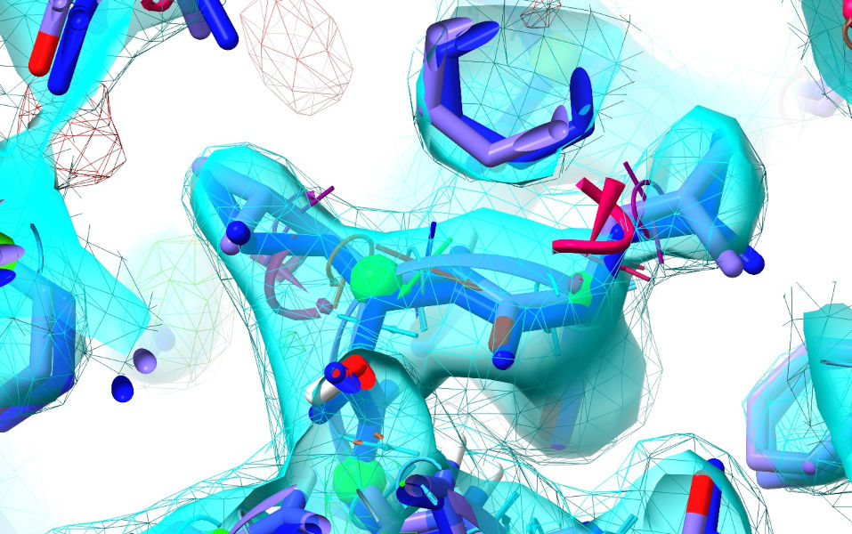
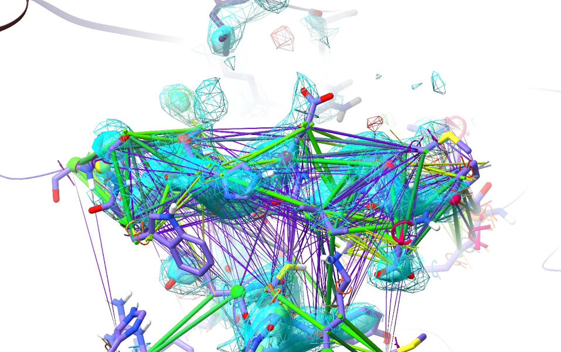
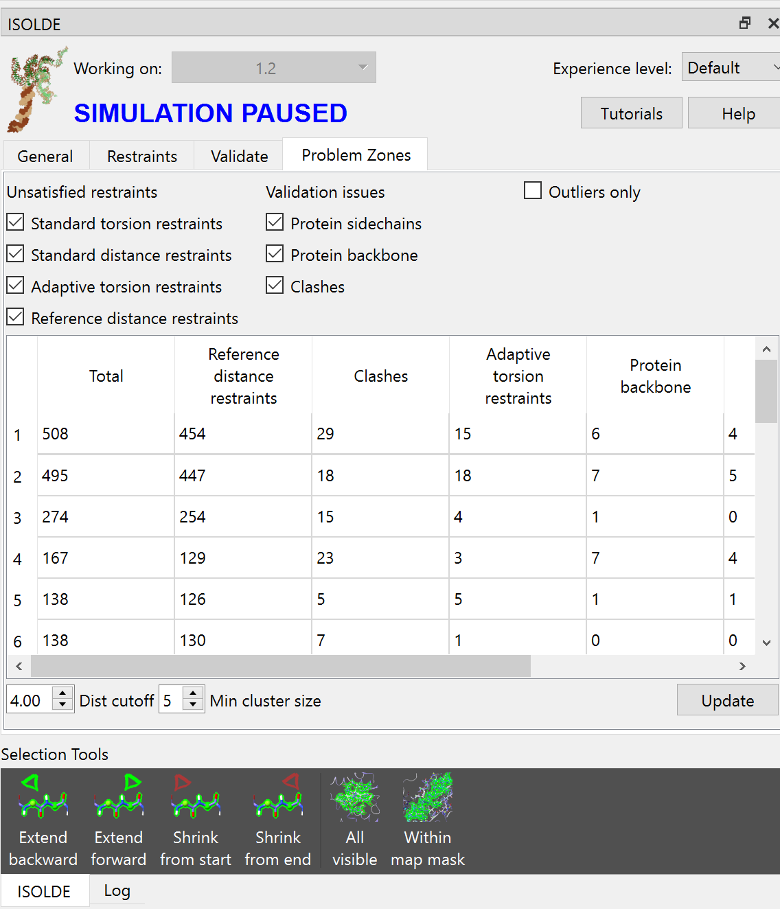
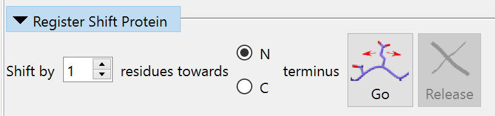

.. _alphafold_reference_tutorial:

Improving Legacy Models Using AlphaFold 
=======================================

**(NOTE: Most links on this page will only work correctly when the page is
loaded in ChimeraX's help viewer. You will also need to be connected to the
Internet. Please close ISOLDE and any open models before starting this
tutorial.)**

**(The instructions in the tutorial below assume you are using a wired mouse
with a scroll wheel doubling as the middle mouse button. While everything should
also work well on touchpads in Windows and Linux, support for Apple's
multi-touch touchpad is a work in progress. Known issues with the latter are
that clipping planes will not update when zooming, and recontouring of maps is
not possible.)**

Tutorial: Quickly improving 2rd0 with AlphaFold reference restraints
--------------------------------------------------------------------

.. toctree::
    :maxdepth: 2

**NOTE: This tutorial assumes that you are already familiar with the basic
operation of ISOLDE. If this is your first time using it, it is highly
recommended that you first work through at least the**
:ref:`isolde_intro_tutorial` **tutorial before starting this one.**

It is no big secret that models built into lower-resolution datasets have
historically been fraught with errors, but it can often be surprising to the
uninitiated just how big these errors can get. In the introductory tutorial we
looked at rebuilding a small 3.0 angstrom model, 3io0, in ISOLDE using only the
information available to us from the experimental data. While that case was
fairly straightforward, for larger structures, lower-resolution and/or
poorer-quality starting models this approach still becomes quite time-consuming
and occasionally frustrating. Luckily, with the advent of AlphaFold and its
high-quality models of most well-structured regions of proteins, we now have a
much better way to quickly and automatically fix most of the problems in legacy
models, reducing the interactive component to the (typically few) sites where
the AlphaFold model disagrees with the data, and/or the reference restraints
need a little help steering the experimental model to the new conformation.

As our example, we're going to take a look at `2rd0`_, a 3.05 angstrom structure
of the human p110alpha/p85alpha complex. Published back in 2007 as the first
structure of p110alpha (aka PI3Kalpha), given the resolution and state of the
art at the time it was inevitable that it would contain some errors. Indeed,
like most structures of similar resolution and time period its "headline"
validation statistics look quite poor by modern standards:

.. _2rd0: https://www.rcsb.org/structure/2RD0

Let's just take a moment to appreciate the scale of what these values mean. 2rd0
contains 9365 atoms in 1136 amino acid residues. A clashscore of 22 indicates
22/1000, or 206 atoms, are clashing - that is, overlapping in a non-physical way
with at least one other atom (in a well-refined structure this should be almost
zero). Eighty-two residues are in disallowed Ramachandran space (i.e. their
backbones are severely strained) - for a structure this size we'd expect to see
0-2 such cases. It's not shown in the graphic above, but a further 159 residues
(14%) are in the "Allowed" region of the Ramachandran plot where about 2% are
actually expected to sit - so in total, that's at least about 220 residues in
need of fixing according to Ramachandran statistics. Finally, 15.4% of
sidechains (161 residues) are in non-rotameric conformations - we expect no more
than 1-2%.

The point of the above is that there is a *lot* to be fixed here. While it's
certainly possible to get there in ISOLDE in the absence of any external
information, optimistically it would take at least a full working day - and
likely quite a bit more. So, let's explore how we can get there much more
quickly.

First, go ahead and open the model and its structure factors. To make the maps a
little smoother, we're going to oversample at a rate of two times the Nyquist
frequency rather than the default 1.5.

`open 2rd0 structurefactors true oversampling 2`__

__ cxcmd:open\ 2rd0\ structurefactors\ true\ oversampling\ 2

That should give you an initial view looking something like this:

Zoom in *(scroll wheel)* and adjust the map contours to your liking
*(ctrl-scroll to select the map to adjust, alt-scroll to actually adjust it.
Sigma values will be shown on the status bar at lower left)*. I'd suggest
setting the sharpened map *(transparent cyan)* to about 2 sigma and the
unsharpened one *(cyan wireframe)* to 1 sigma. Leave the difference map
*(red/green wireframe)* at the default +/-3 sigma. In the well-resolved core
that should look roughly like this:

Remember, you can re-adjust contours whenever you need to.

Now, go ahead and start ISOLDE:

`isolde start`__

__ cxcmd:isolde\ start

\... and add hydrogens:

`addh`__

__ cxcmd:addh

Before we get started properly, take a quick browse through the Ramachandran
plots *(on the Validate tab)*. Click on a few outliers to see them in context,
and try to picture what needs to be done to correct them.

Now, have a look at what happens if we start a simulation *without* any
reference restraints:

`isolde sim start #1`__

__ cxcmd:isolde\ sim\ start\ \#1

After things start moving, take another look at the Ramachandran plots:

Some clear improvements there. In my session, it's down to 40 outliers and 89
allowed (from 82/159) - and rotamer outliers are down to 34 (from 161). But
there's still a lot to be done, and of course just because something is no
longer an outlier doesn't mean it's necessarily correct - it's always important
to see for yourself against the actual experimental map.

Also take a look at the R-factors (on the status bar at bottom right of the
ChimeraX window). In my session this simulation increased them slightly from
Rwork/Rfree of 0.308/0.352 to 0.317/0.354 *(your numbers will almost certainly
differ a bit - don't worry, that's normal)*. That's pretty typical of what
happens in ISOLDE for models like this: while regions that were *almost* right
tend to fall into place (and thus improve R-factors), sites that were very wrong
and over-fitted will be pushed out of density to resolve energetically
unfavourable states (driving the R-factors up, but generally making the problems
easier to diagnose and fix).   

Anyway, let's throw out what we just did and revert to the initial state of the
model. Hit the big red stop button, or equivalently:

`isolde sim stop discardTo start`__

__ cxcmd:isolde\ sim\ stop\ discardTo\ start

Now, let's go ahead and fetch the AlphaFold models for our two chains. *(Note:
this is only possible for proteins from organisms currently covered by the
AlphaFold database - you can see the list of organisms* `here`_ *)*:

.. _here: https://alphafold.ebi.ac.uk/download

`alphafold match #1 trim false`__

__ cxcmd:alphafold\ match\ \#1\ trim\ false

The optional "trim" argument tells ChimeraX whether or not to automatically trim the
predicted models to include only those residues present in the experimental
construct according to the sequences stored in the mmCIF file. In order for 
confidence-based weighting of reference distance restraints to work correctly, this
**must** be set to false. Your display should now look like this:

The AlphaFold model is displayed as a ribbon and coloured according to its
confidence in its prediction (the predicted local distance difference test, or
`pLDDT score`_) for each individual residue (orange = least confident, dark blue
= most confident). **(IMPORTANT NOTE: residues with pLDDT scores less than about
50 are generally junk and their coordinates should not be interpreted in any
way. Nevertheless, it may on occasion be useful to keep them present to start
with, to act as raw material for the fitting process. Once the model is fitted
it is best to inspect and cull these on a case-by-case basis.)**

.. _pLDDT score: https://alphafold.ebi.ac.uk/faq#faq-5

AlphaFold actually provides *two* different measures of confidence in its
predictions, each of which is really useful in its own way. The pLDDT score, a
measure of confidence in the conformation and immediate local environment of a
residue, is a fairly natural measure to use to adjust the weights of
torsion-space reference model restraints. This is achieved with the argument
"adjustForConfidence true" of the "isolde restrain torsions" command. The
overall effect of the adjustment scheme is shown below - qualitatively speaking,
reducing pLDDT will lead to both weaker and "fuzzier" restraints on the matching
residue. Residues for which the reference model pLDDT values are less than 50
will *not* be restrained.

So let's go ahead and apply these. You can do this chain-by-chain with the Reference
Models widget on ISOLDE's Restraints tab:

\... or using the commands:

`isolde restrain torsions #1/A template #2/A adjustForConfidence true`__

__ cxcmd:isolde\ restrain\ torsions\ \#\1/A\ templ\ \#2\/A\ adjustForConfidence\ true

`isolde restrain torsions #1/B template #2/B adjustForConfidence true`__

__ cxcmd:isolde\ restrain\ torsions\ \#\1/B\ templ\ \#2\/B\ adjustForConfidence\ true

Let's take a quick look at the effect of this. First, let's show all atoms and
hide the cartoon for the reference model:

`show #2; ~cartoon #2`__

__ cxcmd:show\ \#2;~cartoon\ \#2

\... and zoom in on Leucine 687 of chain A:

`view #1/A:687`__

__ cxcmd:view\ \#1\/A:687

The two leucine residues here are good examples of the types of subtle errors
that often creep in to low resolution models. Both of them are modelled
backwards (rotated ~180 degrees around the outermost chi dihedral) - a severely
outlying, strained geometry, but one that appears to fit low-resolution density
like this almost as well as the correct state. AlphaFold appears to have gotten
it right in both cases, and from the colour we can see it's very confident about
its predictions - this will lead to very strong and wide-ranging restraints
here.

Now, let's move on to distance restraints. Here we have *two* new arguments
added to the "isolde restrain distance" commands. The first,
"adjustForConfidence true" is analogous to the torsion restraint case, except
that instead of pLDDT it uses the predicted aligned error (PAE) matrix for the
prediction to adjust each restraint. 

The PAE matrix encodes the confidence AlphaFold has in the distance between
every single residue pair in the model (technically, each point [i,j] is the
expected error in the position of residue i if the predicted and true structures
were aligned on residue j). This is what it looks like for chain A:

\... well, that's how it's displayed on the website, anyway. But note the color
scale - I'm sure you'll agree that distances with estimated errors of 30
angstroms aren't particularly useful for restraint purposes! In fact, ISOLDE
only restrains distances for residue pairs with a mutual PAE of 4 angstroms or
better. Let's see what that matrix looks like rescaled to that range:

Distance restraints will only be applied on a given pair of atoms if their
reference positions are less than 8 Angstroms apart **and** the PAE between
their parent residues is less than or equal to 4 angstroms (i.e. where they
correspond to a green dot on the above plot). For residues meeting those
criteria, representative plots of the restraint potentials are shown below.

.. figure:: images/distance_restraint_pae_adjustments.png

The second new option for the "isolde restrain distances" command is
"useCoordinateAlignment false". This affects how ISOLDE compares the reference
and working models in order to assign distance restraints. The default is to do
it by a series of rigid-body alignments: find the largest piece that aligns
well, assign restraints to those residues; find the next largest piece... and
repeat until there is nothing left to align. That generally works well when the
reference model is an experimental structure (and particularly when its sequence
isn't identical to the working model), because it avoids generating spurious
restraints between domains that have shifted substantially - but it has the
drawback that residues that are substantially out of register will typically not
be given restraints to their correct interaction partners. With
"adjustForConfidence true" the problem of spurious restraints is generally
avoided, making the progressive decomposition largely unnecessary. The
"useCoordinateAlignment false" command tells ISOLDE to instead assign
model/template residue pairs strictly based on sequence alignment only, which
makes sure that restraints between confidently-predicted atoms are assigned no
matter how badly placed they are in the working model.  

Anyway, let's make it happen. Again, you can do this via the Reference Models
widget:

\... or via commands:

`isolde restrain distances #1/A template #2/A adjustForConfidence true
useCoordinateAlignment false`__

__ cxcmd:isolde\ restrain\ distances\ \#1\/A\ template\ \#2\/A\ adjustForConfidence\ true\ useCoordinateAlignment\ false

`isolde restr dist #1/B templ #2/B adj t useCoord f`__

__ cxcmd:isolde\ restr\ dist\ \#1\/B\ templ\ \#2\/B\ adj\ t\ useCoord\ f

Let's take a look at what that's done. Hide the AlphaFold models:

`hide #!2 models`__

__ cxcmd:hide\ \#!2\ models

\... select your working model:

`sel #1`__

__ cxcmd:sel\ #1

\... and expand the map to cover it using the "Mask to selection" button on ISOLDE's
ribbon menu, or:

`clipper isolate sel`__

__ cxcmd:clipper\ isolate\ sel

To get a closer look at an overview of the distance restraints, let's turn off
the map view:

`hide #!1.1 model`__

__ cxcmd:hide\ \#!1.1\ model

*(Note: the exclamation mark in "#!1.1" here tells ChimeraX to change the
display setting of only the top-level "container" model for the maps, without
changing the display settings of the maps themselves. This is important to make
it easy to get back exactly the same view as we had before)*

Also, let's hide all the restraints that are close to satisfied via the Manage/Release
Adaptive Restraints widget, or:

`isolde adjust distances #1 displayThreshold 0.5`__

__ cxcmd:isolde\ adj\ dist\ \#1\ disp\ 0.5

Browse around a bit. You'll see a *lot* of purple indicating pairs of atoms that
are much further apart than AlphaFold thinks they should be. Let's focus in on
one of these, and bring our maps back:

`view #1/A:490-498; show #!1.1 model; clipper spot`__

__ cxcmd:view\ \#1\/A:490-498;show\ \#!1.1\ model;clipper\ spot

The forest of purple restraints you see here are a telltale giveaway that this
helix is probably out of register. Indeed, a close look at the fit to density
reveals a lot of red flags: Trp498 has no appreciable density around its
sidechain, while there's a large green difference blob of about the right shape
on the other side of the helix; Glu494 is in density much too large for its
sidechain (and pointing at Asp578 - not impossible, but something that's
generally only stable at low pH); Met489 is pointing into space while Asp488
protrudes into a hydrophobic cavity.

Now bring up the AlphaFold model for comparision:

`show #2 models`__

__ cxcmd:show\ \#2\ models

Now, I know this image is getting a bit crowded, but a bit of inspection
suggests it will solve the above problems. Trp498 goes into that nice difference
blob; Glu494 is replaced by His495; Met489 takes the place of Asp488.

\... but before we actually fix all that, it's time to settle the model under
the influence of these restraints. First, hide the AlphaFold models for clarity,
then start a simulation and wait a while for it to settle, without tugging
anything.

`hide #2 models`__

__ cxcmd:hide\ \#2\ models

`isolde sim start #1`__

__ cxcmd:isolde\ sim\ start\ \#1

If you're still watching this site, you'll notice from the still-stretched
distance restraints that ISOLDE is unable to fix it automatically.

That's alright. We'll get to fixing that in a bit. First, though, let's take a
quick inventory of what ISOLDE *has* been able to do with the aid of these
restraints. Stop the simulation:

`isolde sim stop`__

__ cxcmd:isolde\ sim\ stop

\... and take another look at the Ramachandran plots:

Now we're getting somewhere! We're clearly still not done yet, but the
statistics are starting to look much more like a real-world protein. We're down
to 14 Ramachandran outliers (1.2%) and 36 allowed (3.2%); rotamer outliers are
down to 5. Most importantly, this time the R-factors have tightened
substantially (0.326/0.344 vs. the original 0.308/0.352) suggesting we've both
improved the true fit to the map and reduced a bunch of model bias.

Clearly, there's still a bunch to be done - but now we're not going to be
shooting in the dark quite as much as we would have been without the help of
AlphaFold. The next obvious thing to do is start working through the biggest
"problem sites" - mainly those shown up by large clusters of unsatisfied
distance restraints. Now, you could do this by simply browsing visually through
the structure, but ISOLDE's problem site aggregator lets you do things a bit
more systematically. It looks for all instances of different restraint
violations and validation issues and identifies regions where many problems are
clustered together - the idea being that such clusters are often the result of a
single root cause, so tackling the biggest ones first is likely to give you the
fastest overall improvement.

Switch to the "Problem Zones" tab and click the "Update" button at bottom right.
You should see something like this (your numbers will almost certainly vary
somewhat - don't worry).

Click on the top row of the table. All atoms associated with problems found in
the cluster are selected, and the view is updated to show them:

*(NOTE: Depending on how your initial run went, the top cluster may be around
either the A355-375 beta-hairpin, or the A488-499 helix. If your top cluster is
the helix, choose the second cluster here.)*

Click ISOLDE's play button, or

`isolde sim start sel`__

__ cxcmd:isolde\ sim\ start\ sel

Zoom in, and you should see something like this:

Now, I'll admit that looks somewhat daunting up-front - but don't worry, in most
cases it just comes down to tugging atoms in the direction of the purple
connections, combined with a little common sense and/or help from the reference
model. If you spend a little time inspecting *without* the aid of the AlphaFold
model first, I think you'll agree that 355-362 look solid in their density as do
384-392 - so it's mainly just that middle 366-378 strand that's out. See if you
can figure out *how* it's out - then when you're ready, `show the AlphaFold
model`__ to see if it agrees with your assessment.

__ cxcmd:show\ #2\ models

Spoiler: it's out by 1, with everything needing to move one residue back towards
the N-terminus. This is hard to achieve via simple linear distance restraints
like this - atoms that want to go one way around the backbone end up battling
atoms that want to go the other - which is why we need to give it a bit of help.

If you find the display too busy, `hide the AlphaFold model`__ again. Now, let's
try the simplest (and often fastest) approach - just directly helping out with a
bit of right-mouse tugging. 

__ cxcmd:hide\ #!2\ model

A good place to start might be `Asn 372`__, buried in the hydrophobic core when
it wants to be exposed to solvent. Rotate your view so you're looking along the
chain (allowing you to easily tug around the backbone) - if the view gets too
busy for you, remember you can *shift-scroll* to tighten the clipping planes.
Grab one of the outermost sidechain atoms, and tug it towards the Val371
sidechain. When tugging, try to steer *around* the backbone rather than taking
the most direct path:

__ cxcmd:view\ #1\/A:372

This may take a little playing around - if it's not cooperating release the atom
and try tugging in a slightly different direction. The aim is to "tip" the
geometry over the barrier allowing the surrounding restraints to start
cooperating - in my case, tugging just this one atom triggered all the
N-terminal residues of the strand to fall into place:

Play around with the rest of the strand - a good next move might be to pull
Arg375 outwards. When you're done, hit the red checkered flag to revert to the
original bad geometry and we'll try using the register shifter instead (this
widget on the Restraints tab):

The aim of the register shifter is to provide a somewhat smarter way of applying
these large, concerted many-residue shifts. Rather than using distance
restraints, it applies a set of moving *position* restraints to tug the N, C, CA
and CB atoms along smooth splines fitted through the positions of their
counterparts along the chain. This is a natural way to overcome that problem of
distance restraints "fighting" each other. Now, in the past the direction and
size of the register shift would have needed to be worked out (or guessed) by
careful inspection of fit to density and local interactions; in this case we
already know from the AlphaFold model that it's 1 residue towards the
N-terminus. So, select the residues you want to shift:

`sel #1/A:367-378`__

__ cxcmd:sel\ #1\/A:367-378

\... dial up the desired shift in the register shifter, then click its button.
When it's done (it should only take a few seconds), click its red 'X' to release
the position restraints. While Arg375 might still need a little manual help, the
rest should just fall into place. Take a little time to clean up the
surroundings *(hint: Ile351 should really point into the core)*, and when you're
ready click the green STOP button to stop the simulation and commit the results.

If you're on the "Problem Zones" tab when you stop the simulation the table will
automatically update; otherwise, switch there and click the Update button now.
Clicking the top row should now take you to the A488-499 helix. Use what you've
learned from the previous example to see what you can do with this *(Hint: the
helix is out by 1-2 residues)*.

Continue on in this manner, updating the table after each simulation and moving
on to the next biggest cluster. After these two, most of the rest get
progressively simpler - but you will also start to run into a few sites where
the restraints disagree because the *AlphaFold* model is wrong (or in a
"correct"-but-different conformation to what's in this crystal). A small example
is the region around Met772 and Arg777:

Probably not coincidentally, these are right beside a crystallographic
interface. Not knowing anything about that, AlphaFold confidently predicts this
region with a somewhat-different conformation:

Met772 and Arg777 are predicted with significantly different rotamers, and the
772-777 loop in general doesn't line up with the density. The best thing to do
here is release the local reference restraints and let the density combined with
ISOLDE's force field do the work. Now, you *could* do this with the "isolde
release distances" and "isolde release torsions" commands - but those are a bit
long-winded. This is where isolde's shorthand commands come in really useful. If
you enter the command:

`isolde shorthand`__

__ cxcmd:isolde\ shorthand

\... it will enable a series of 2-4 character mini-commands corresponding to
common ISOLDE tasks, and print a cheat-sheet to the log:

.. figure:: images/isolde_shorthand.png

*(HINT: If you go to Favorites/Settings in the ChimeraX menu and then go to the
Startup tab, you can make ChimeraX automatically run this command every time it
starts)*

The ones we're most interested in here are "rd" (release distance restraints on
the selected atoms), "rt" (release torsion restraints on selected residues) and
"ra" (release both distance and torsion restraints on the selection). Given that
the density here is really strong and at least some of the torsion restraints
are wrong alongside the distances, we may as well release both. With a
simulation running...

`isolde sim start #1/A:770-780,720-730`__

__ cxcmd:isolde\ sim\ start\ #1\/A:770-780,720-730

\... select the offending loop:

`sel #1/A:772-777`__

__ cxcmd:sel\ #1\/A:772-777

\... and release the restraints:

`ra`__

__ cxcmd:ra

You'll want to do a little manual tweaking of the Met772 and Ser774 sidechains
(AlphaFold has the latter pointing into symmetry density - swing it around to
H-bond to the Lys776 H). 

The A217-250 alpha hairpin is another region where the AlphaFold restraints are
a bit counterproductive - AlphaFold has the relative disposition of the two
helices slightly off compared to the strong local density, and the turn at the
top is *completely* wrong (albeit only predicted with low confidence):

As with the previous case, you'll want to go ahead and release these restraints.
While remodelling this area, you'll probably also notice a few symmetry clashes.
If you want to fix these (and it's clear that it's the symmetry-related atoms
that are wrong), stop your simulation then double-click on one of the offending
symmetry atoms to select and centre the view on its "real" equivalent, allowing 
you to start a local simulation to fix it before moving on. Don't be afraid
to use a few judicious position restraints if the local density is poor.

Anyway, keep on working your way through until the table is empty. This
*doesn't* mean that there are no issues left, just that there's nothing left
meeting the definition of a "cluster". This is the point where, if you were
planning on depositing this model to the wwPDB or using it in any downstream
application, you'd want to give it a final detailed residue-by-residue
inspection to be absolutely certain. (*HINT: you can get to the first polymeric
residue in your structure with "st first" and continue stepping through by
repeating the "st" command)* But before doing that, it would be a *very* good 
idea to run a refinement at this point to make sure you're working with the 
best possible maps. To write input ready for *phenix.refine*, first navigate 
to a suitable directory with the command:

cd browse

\... then do:

isolde write phenixRefineInput #1 numProcessors 6

*(NOTE: due to the way these interactive tutorials are implemented, you will need
to type - or copy/paste - these commands into the command line yourself, otherwise 
the files will be written to the wrong directory.)*

This will write a snapshot of your current model (without hydrogens unless you 
use the optional "includeHydrogens true" argument) along with an MTZ file and 
a *phenix.refine* settings file (refine.eff). To run a refinement, navigate to
the working directory in a separate operating system terminal window with the 
Phenix environment activated, and do:

phenix.refine refine.eff.

\... then load the results in a fresh ChimeraX session and continue with your 
final inspection and tweaking. At this resolution, after refinement you should 
be able to continue on without further use of the AlphaFold restraints.

Here's what the validation statistics for my model looked like after that 
refinement step compared to the original deposited structure:

=======================  ==============  =================== 
Validation measure       Original model  Rebuilt and refined 
=======================  ==============  ===================
R-work                   0.291           0.238
R-free                   0.338           0.273
Clashscore               22.64           1.50
Ramachandran outliers    7.33%           0.00%
Ramachandran allowed     14.22%          1.98%
Ramachandran favoured    78.44%          98.02%
Ramachandran Z-score     -5.60           0.55
Rotamer outliers         17.15%          0.38%
C-beta deviations        1.10%           0.00%
Twisted peptides         0.93%           0.00
=======================  ==============  =================== 

Not a bad improvement, I think!

