.. _bulk_fitting_tutorial:

Bulk Flexible Fitting
=====================

**(NOTE: Most links on this page will only work correctly when the page is
loaded in ChimeraX's help viewer. You will also need to be connected to the
Internet. Please close ISOLDE and any open models before starting this
tutorial.)**

**(The instructions in the tutorial below assume you are using a wired mouse
with a scroll wheel doubling as the middle mouse button. While everything
should also work well on touchpads in Windows and Linux, support for Apple's
multi-touch touchpad is a work in progress. Known issues with the latter are
that clipping planes will not update when zooming, and recontouring of maps is
not possible.)**

Tutorial: Fitting 6mhz into emd_9118
------------------------------------

.. toctree::
    :maxdepth: 2

**NOTE: This tutorial assumes that you are already familiar with the basic
operation of ISOLDE. If this is your first time using it, it is highly
recommended that you first work through the** :ref:`isolde_cryo_intro_tutorial`
**tutorial before attempting this one.**

The *E. coli* LptB2FGC complex is responsible for extracting lipopolysaccharide
(LPS) out of the inner membrane, as part of the transport chain bringing it to
its final location in the outer membrane. What makes it an interesting tutorial
case is that this heterotetrameric complex undergoes a large conformational
change between its ATP-bound/LPS-free and LPS-bound/ATP-free states.

These two states have been captured using cryo-EM at 4.1 and 4.0 Angstrom
resolutions as 6mhz_ / EMD-1924_ and 6mhu_ / EMD-9118_ respectively. These are
representative of a fairly common challenge in cryo-EM: you've captured a
structure in multiple conformations, and would like to be able to refit the one
model into each state with minimal fuss. In this tutorial, we'll be using
ISOLDE's adaptive distance restraints to maintain the local geometry of the
model from 6mhz as we interactively re-fit it into the map from 6mhu.

 .. _6mhz: https://www.rcsb.org/structure/6mhz
 .. _EMD-1924: https://www.emdataresource.org/EMD-9124
 .. _6mhu:  https://www.rcsb.org/structure/6mhu
 .. _EMD-9118: https://www.emdataresource.org/EMD-9118

Preliminaries
~~~~~~~~~~~~~

Open the model and map:

`open 6mhz; open 9118 from emdb`__

__ cxcmd:open\ 6mhz;\ open\ 9118\ from\ emdb

(optionally) adjust your graphics settings:

`lighting simple; set bgColor white; set silhouettes true`__

__ cxcmd:lighting\ simple;\ set\ bgColor\ white;\ set\ silhouettes\ true

... and hide your atoms for the time being (leaving only the cartoon displayed):

`hide; cartoon; color bychain; color byhetero`__

__ cxcmd:hide;\ cartoon;\ color\ bychain;\ color\ byhetero

Set a useful contour on the map. You can do this using the
`Volume Viewer`__ which automatically appears when loading a new model - or, if
you know your map well, using the command line:

`volume #2 level 0.1`__

__ help:user/tools/volumeviewer.html
__ cxcmd:volume\ \#2\ level\ 0.1

At this point, if you've followed all the above instructions you should be able
to rotate your view to look something like this:

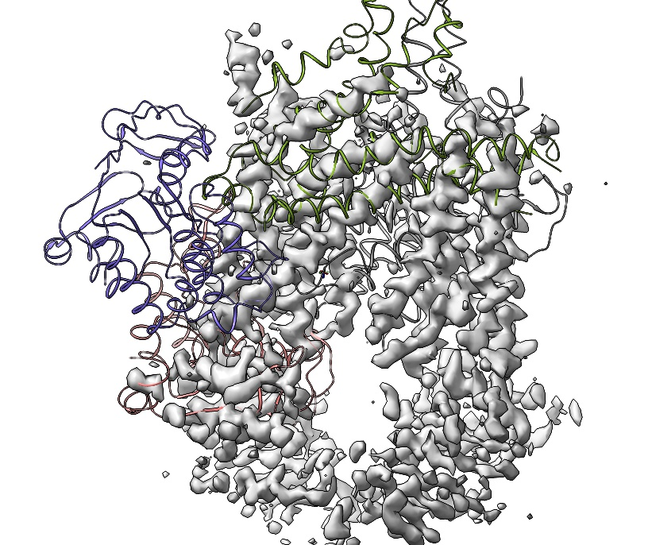

Before going further, we're going to do an initial rigid-body fit of chains A
and G to the map. In a real-world scenario you may want to do this externally
using a tool designed for global docking such as *phenix.dock_in_map*, but in a
reasonably straightforward case like this we can just do some manual
rearrangement followed by local optimisation using FitMap_. Since FitMap is
designed to optimise an already-reasonably-close fit, we're going to need to
give it some help first.

.. _FitMap: help:user/commands/fitmap.html

First, select chains A and G:

`select #1/A,G`__

__ cxcmd:select\ \#1/A,G

Now, you'll want to make use of two different right mouse button modes from
ChimeraX's left-hand-side toolbar, "translate selected models" and "rotate
selected models". The icons look like this:

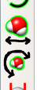

**(NOTE: each of these modes moves each *whole* model that has at least some
part selected.)**

In the starting configuration, chain G is overlapping its target density, but
rotated about 45 degrees and shifted 10-20 Angstroms in the (-z) direction from
its best fit. Use the rotate and translate tools to get it chains A and G
*reasonably* close to their density. If you're having trouble lining things up,
use the below commands to get the model close enough for the next step:

`view initial #1; view matrix model #1,0.198,-0.674,0.699,86.9,0.821,0.511,0.260,-63.7,-0.534,0.522,0.655,53.6`__

__ cxcmd:view\ initial\ \#1;\ view\ matrix\ model\ \#1,0.198,-0.674,0.699,86.9,0.821,0.511,0.260,-63.7,-0.534,0.522,0.655,53.6

Then, to optimise the rigid-body fit:

`fitmap #1/A,G inMap #2`__

__ cxcmd:fitmap\ \#1/A,G\ inMap\ \#2

... which should yield a fit looking something like this:

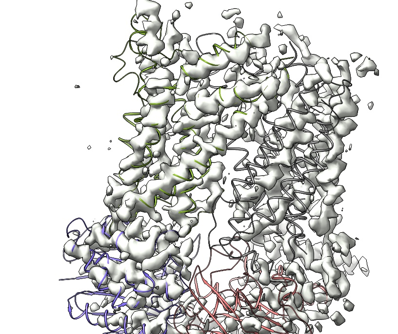

Restrained flexible fitting
~~~~~~~~~~~~~~~~~~~~~~~~~~~

Now, go ahead and start isolde:

`isolde start`__

__ cxcmd:isolde\ start

To use your map for fitting in ISOLDE, it must be "associated" with the model.
You can do this using the "Associate real-space map with current model" button
on the ISOLDE GUI, or the command:

`clipper assoc #2 to #1`__

__ cxcmd:clipper\ assoc\ \#2\ to\ \#1

At this stage you'll probably want to turn the silhouettes off:

`set silhouettes false`__

__ cxcmd:set\ silhouettes\ false

I generally prefer to set the map to a transparent surface using the buttons
under ISOLDE's "Show map settings dialog":

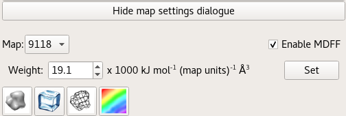

... but that's a matter of personal  preference. If you do so, your view should
now look something like this:

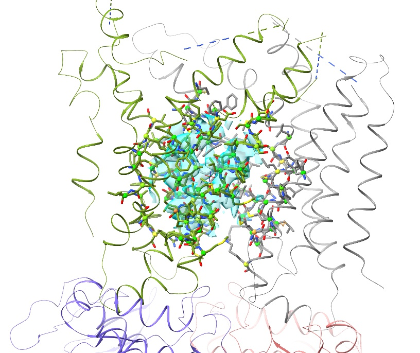

You can go ahead and close the Volume Viewer panel now if you like - you won't
be needing it from this point on.

If you were paying attention during the rigid-body fitting, you'll have noticed
that we still have some rather large shifts to do. To make sure we can see
all the map, we'll need to increase the mask radius (using the "Mask radius"
spin box on ISOLDE's "Sim settings" tab). Go ahead and increase this to 16.

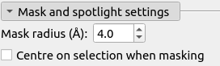

We have a little more housekeeping to do before we're ready to start the
flexible fitting. First-up, this model still has an ATP analogue bound - we
won't be needing that, since we're fitting into the ATP-free state. Let's go
ahead and delete it:

`delete ~protein`__

__ cxcmd:delete\ ~protein

We'll also need to add hydrogens:

`addh`__

__ cxcmd:addh

I prefer to hide the non-polar hydrogen atoms to reduce clutter:

`hide HC`__

__ cxcmd:hide\ HC

To get a good picture of the task ahead, let's expand the map mask to cover the
whole model. Select all atoms:

`select  #1`__

__ cxcmd:select\ \#1

... and either click the "mask to selection button" on the bottom right of
the ISOLDE GUI:

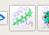

... or use the following command:

`clipper isolate #1 mask 16`__

__ cxcmd:clipper\ isolate\ \#1\ mask\ 16

Temporarily hiding_ the atoms might give you a better picture of things,
revealing just how far chains B and F still need to move:

.. _hiding: cxcmd:hide

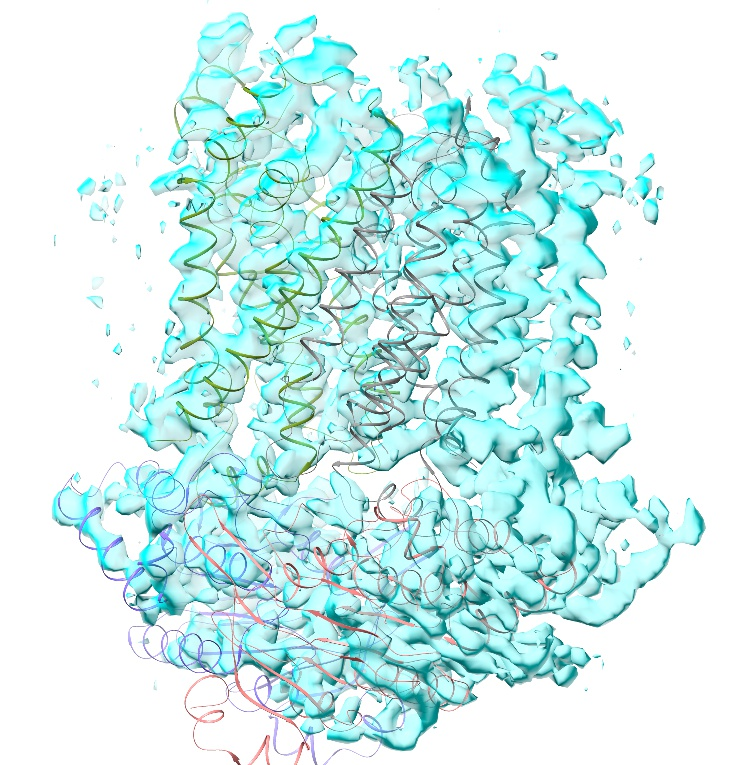

Now, the challenge of flexible fitting over such long distances is that between
your starting and target configuration is a very convoluted landscape, with many
local minima to get trapped in. A naive implementation is almost certain to get
trapped and/or ruin the model, depending upon the weighting of the map. The
answer is to use some restraint scheme that biases local geometry to a known
target, while still maintaining the flexibility to allow large conformational
changes where necessary. There are many possible such schemes; ISOLDE's is based
upon a generalised form (`courtesy of our benevolent overlords at Google`__)
that effectively acts as a superset of the most common ones. These "adaptive"
distance restraints can adopt a wide range of energy profiles such as these:

__ https://arxiv.org/pdf/1701.03077.pdf

.. figure:: images/adaptive_energy_function.png

This shows the normalised energy profiles for a set of distance restraints,
each with a target of 10 Angstroms, a flat bottom (that is, no restraint)
within +/- 0.5 Angstroms of the target, and a "well half width" of 1 Angstrom.
Within the well, all restraints act like a standard flat-bottomed harmonic
restraint (essentially, a simple spring). Outside the well, the energy profile
flattens out at a rate defined by the parameter alpha. Since the applied force
is proportional to the energy gradient, this means that for large negative
values of alpha the restraints effectively stop pulling once the distance
deviates far enough from the target. An extra parameter, kappa, acts as a simple
multiplier to define the overall depth of the energy well.

While there are many parameters to play around with here, for the time being you
shouldn't need to worry about them: ISOLDE's defaults tend to work quite well.

If you take a bit of a look around the model, you'll notice that it seems that
while chains B and F need to move substantially relative to A and G, the A/G
and B/F interfaces look like they probably won't change that much. So, let's
restrain things that way.

First, let's show our atoms again so we can see what's happening:

`show ~HC`__

__ cxcmd:show\ ~HC

`isolde restrain distances "#1/A,G"`__

__ cxcmd:isolde\ restrain\ distances\ \"\#1/A,G\"

`isolde restrain distances "#1/B,F"`__

__ cxcmd:isolde\ restrain\ distances\ \"\#1/B,F\"

This will give you an extensive cobweb of adaptive distance restraints linking
key atoms:

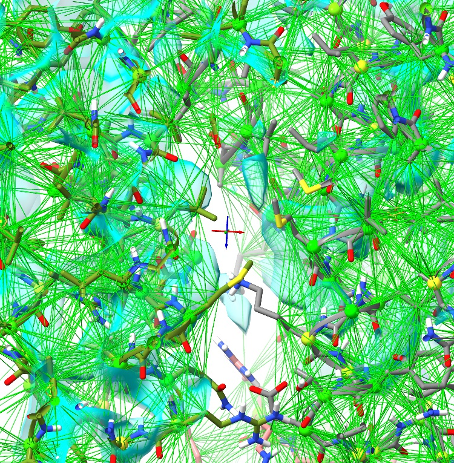

Reminder: you can see the full set of options for this command using

`usage isolde restrain`__

__ cxcmd:usage\ isolde\ restrain

... which will print a short synopsis to the ChimeraX Log window, with a link to
`more extensive documentation`__.

__ help:user/commands/isolde_restrain.html

Here we're trusting the starting model to be essentially correct (always a
somewhat brave assumption when its resolution is 4.1 Angstroms!) - but as you'll
see, it doesn't need to be perfect. Nevertheless, if you have a high-resolution
template (of the same or a homologous structure), the *isolde restrain* command
can also cater to that.

Anyway, let's go ahead and fire up our simulation (unless you're running on a
workstation with a strong GPU, I'm afraid this will be a little slow):

`select #1; isolde sim start sel`__

__ cxcmd:select\ \#1;\ isolde\ sim\ start\ sel

Remember, you can use the pause/resume button on the ISOLDE panel any time to
take stock of the situation. Before going ahead with any interactive fitting,
just watch for a little while and observe how things behave. In places where the
starting conformation disagrees substantially with the map, you should see
something like this start to happen:

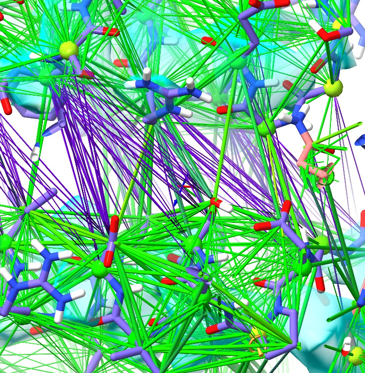

For each displayed restraint, the radius of the depiction scales with applied
force, while the colour changes according to how stretched or compressed it is.
The thin, purple bonds here have been stretched to the point where they are
applying almost no force - they have "given way" to the conformational change
imposed by the map - but importantly, the local conformation is still imposed
by the restraints coloured in green.

If you find this display to be overwhelming, you can limit drawing to only those
restraints strained beyond a threshold, e.g.

`isolde adjust distances #1 displayThreshold 0.5`__

__ cxcmd:isolde\ adjust\ distances\ \#1\ displayThreshold\ 0.5

... where the threshold is a fraction of the well half-width.

For this initial fitting, you might also find it useful to hide sidechains:

`hide sideonly`__

__ cxcmd:hide\ sideonly

... or reduce the display even further to a C-alpha trace:

`hide ~@CA`__

__ cxcmd:hide\ ~@CA

(of course, this should only ever be used while doing this level of bulk
fitting, and you will need to carefully inspect with sidechains displayed later.)

Our main job is getting chains B and F fitted - and it's quite clear  they won't
make it on their own. This is where ISOLDE's "tug selection" mouse mode becomes
useful:

.. figure:: images/tug_selection_button.png

As the name suggests, when this mode is selected right-click-and-drag will apply
a force to all currently-selected atoms. As a start, I'd suggest selecting all
alpha carbons of chains B and F:

`select /B,F@CA`__

__ cxcmd:select\ /B,F@CA

With this mode it is advisable to limit tugging to short bursts, allowing time
for the model to relax in between.

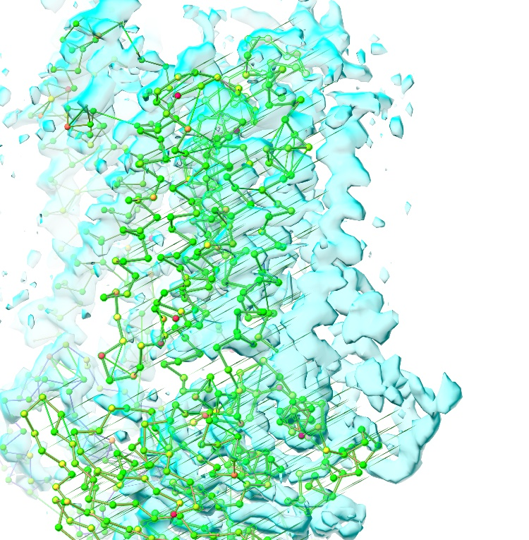

Your aim here is to let the map do as much of the work as possible - get "close
enough" and you should see the majority suddenly "fall" into place:

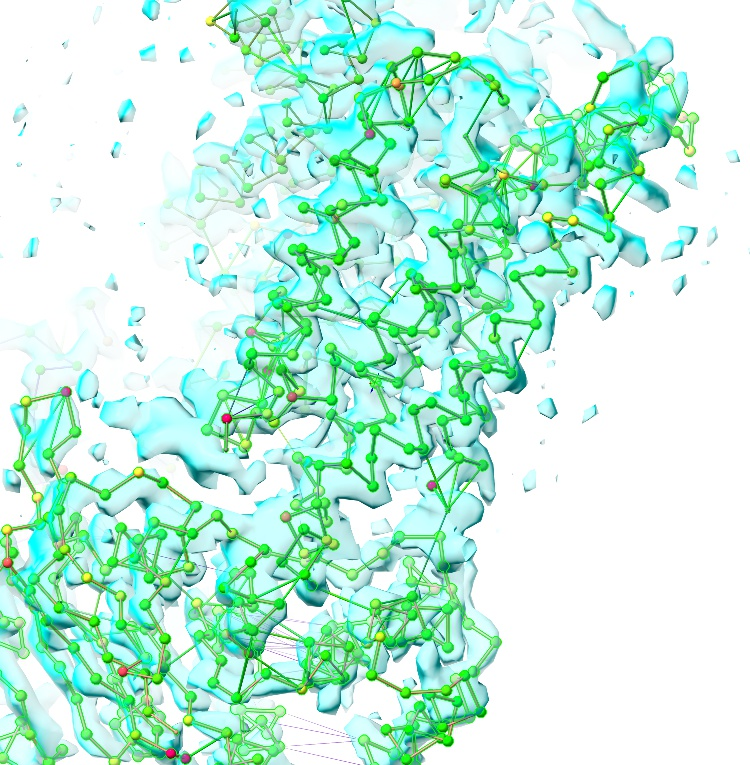

While the bulk is now more-or-less right, a closer inspection will reveal
various details still in need of help. Most obviously, if your simulation ran
like mine you'll see that the helices at the interface of chains F and G
(approx. residues 23-55 of chain F and 298-354 of chain G) are still quite
badly out:

`cview /F:23-55|/G:298-354`__

__ cxcmd:view\ /F:23-55|/G:298-354

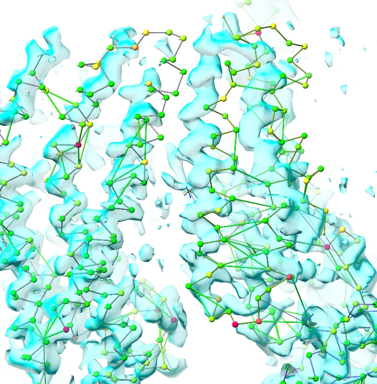

Particularly if you're on a slower machine, this would be a good time to stop
the simulation - not only to save your progress and take stock, but to allow
you to set up a smaller localised simulation for better performance. Click
ISOLDE's green stop button, or run:

`isolde sim stop`__

__ cxcmd:isolde\ sim\ stop

This automatically reverts to the default all-atom display.

Looking closely at the offending region of chain G reveals part of the problem:
while the two helices spanning residues 304-354 don't appear to change
conformation much relative to each other, they clearly shift quite substantially
relative to the *rest of* the protein as evidenced by a large number of
strained restraints. Further, the loop from 298-304 is completely different in
this map compared to the starting model. Time to start selectively removing
restraints.

The *isolde release distances* command offers a range of flexible options here.
First up, the restraints on residues 298-304 clearly make no real sense at all,
so let's release them entirely (with an extra residue padding either side):

`select /G:297-305`__

__ cxcmd:select\ /G:297-305

`cview sel`__

__ cxcmd:cview\ sel

`isolde release distances sel`__

__ cxcmd:isolde\ release\ distances\ sel

Then, for residues 306-354, we'll keep all restraints between atoms in these
residues but release all restraints to their surroundings:

`isolde release distances /G:306-354 externalOnly true`__

__ cxcmd:isolde\ release\ distances\ /G:306-354\ externalOnly\ true

**(NOTE: restraints may also be added, adjusted and released during simulations,
but adding will incur a short delay)**

Now, let's start up a new simulation:

`select /F:23-55|/G:298-354; isolde sim start sel`__

__ cxcmd:select\ /F:23-55|/G:298-354;\ isolde\ sim\ start\ sel

On my machine, the G305-354 helices fell into place almost immediately on
starting this fresh simulation - but it's pretty clear that the Phe319 is badly
placed, pointing to the wrong side of the facing helix and generally getting in
the way (from the distance restraints, it looks like this may be an error in the
original coordinates):

`cview /G:319`__

__ cxcmd:view\ /G:319

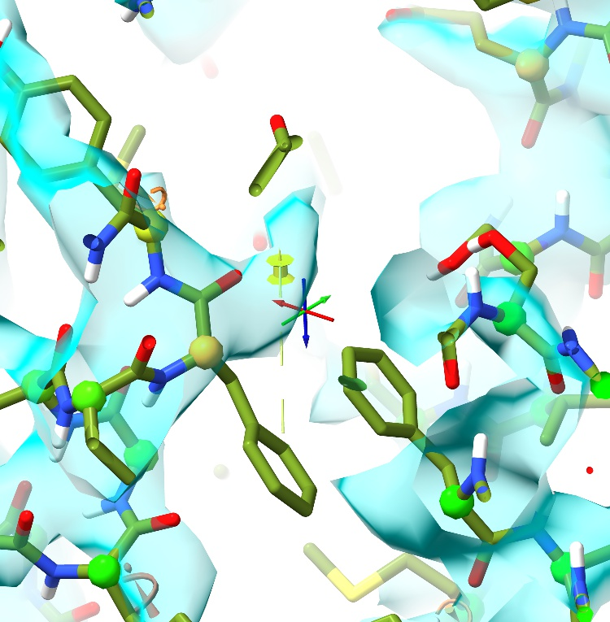

    Pin shows approximate true target for sidechain. Distance restraints
    omitted for clarity.

Looking around, we can still see quite a few other strained restraints. Since
the overall fold is now quite closely fitted into the map, it should be quite
safe to release these wholesale:

`isolde release distances #1 strainedOnly true stretchLimit 1.2 compressionLimit 0.8`__

__ cxcmd:isolde\ release\ distances\ \#1\ strainedOnly\ true\ stretchLimit\ 1.2\ compressionLimit\ 0.8

... will release all restraints that are stretched or compressed by more than
20% from their target values (after allowing for tolerances).

It's also a good idea to once again show all restraints, so we know exactly what
we're dealing with:

`isolde adjust distances #1 displayThreshold 0`__

__ cxcmd:isolde\ adjust\ distances\ \#1\ displayThreshold\ 0

`Looking at the fit of residues 303-321 to the density`__, it's fairly clear that
something is wrong - it looks like these residues need to shift one step in
register towards the C-terminus. This is quite straightforward:

__ cxcmd:cview\ /G:303-321

`select /G:303-321`__

__ cxcmd:select\ /G:303-321

`isolde release distances selAtoms`__

__ cxcmd:isolde\ release\ distances\ selAtoms

Now, switch to ISOLDE's "Rebuild" tab, set the register shifter widget to 1 and
click its start button:

... and resume the simulation:

`isolde sim pause`__

__ cxcmd:isolde\ sim\ pause

Watch the register shifter work its magic:

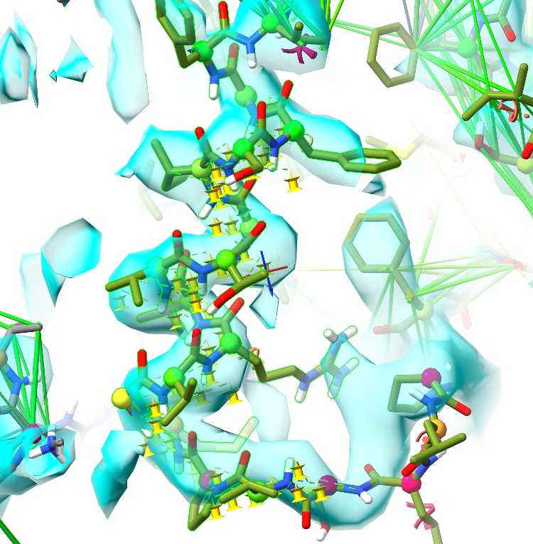

... then click its red 'X' button to release its restraints (you may find you
need to manually adjust some of the bulkier sidechains). While the helix now
looks good, the 298-304 loop still needs a little work:

`cview /G:297-303`__

__ cxcmd:cview\ /G:297-303

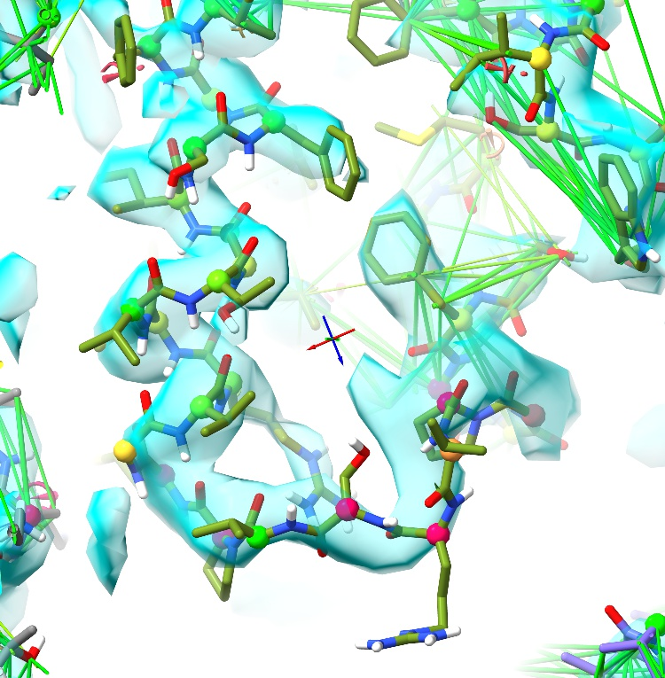

... but fits readily and convincingly after a little work with mouse tugging and
the tools on ISOLDE's rebuild tab:

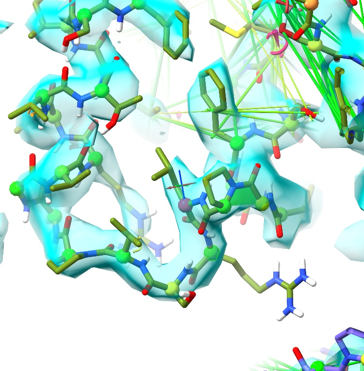

Now, the rest is up to you. Have a look around and see what else you can find
*(hint: the helix from 171-185 on chain A may need some help, and F23-55 is
probably still wrong)*. Once you think you're ready, you can go ahead and
release all the adaptive restraints using:

`isolde release distances #1`__

__ cxcmd:isolde\ release\ distances\ \#1

... and move on to the finer details.

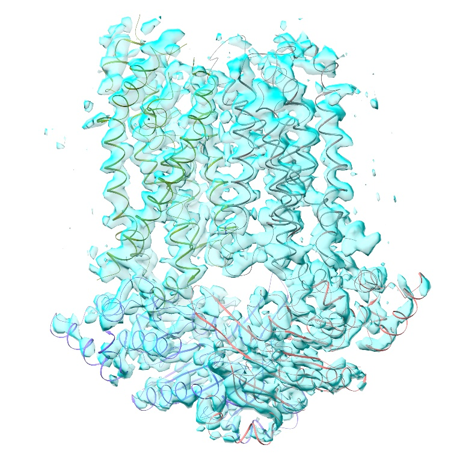
