.. _isolde_clashes_tutorial:

Dealing with severe clashes
===========================

**(NOTE: Most links on this page will only work correctly when the page is
loaded in ChimeraX's help viewer. You will also need to be connected to the
Internet. Please close any open models before starting this tutorial.)**

.. toctree::
    :maxdepth: 2

There are two general approaches to starting the process of model building in 
a new dataset:

(a) "Ground-up" - tracing the protein backbone through the density starting 
    either from nothing (typically only possible in cryo-EM maps) or from 
    docked fragments representing the rigid cores of individual domains 
    (the typical approach with molecular replacement in crystallography);

(b) "Top-down" - docking an entire complex or multiple individual chains 
    to give the best rigid-body fit(s), and then working to flexibly re-fit
    the result into the map. 

Given the wealth of high-quality structures (both experimental and predicted)
now available, the latter approach has become far more feasible than it 
once was, and in many cases can be much faster than the ground-up approach.
See :ref:`alphafold_top_down_tutorial`, :ref:`alphafold_multimer_cryoem_tutorial` 
and :ref:`alphafold_mr_tutorial` for worked examples of top-down model building
in ISOLDE.

One very common problem encountered in top-down building is the introduction of
severe clashes (like those pictured below) when independently rigid-body docking
multiple chains. This of course is not surprising, since the majority of
proteins have at least *some* internal flexibility - life would be quite boring
if they didn't! 

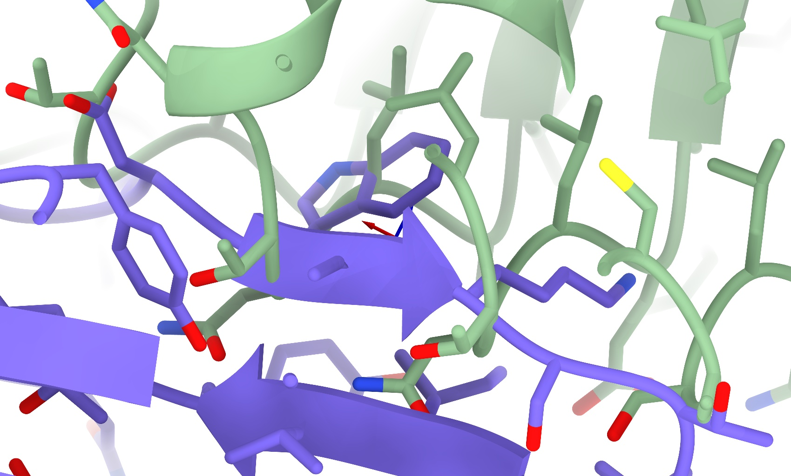

In a traditional classical molecular dynamics forcefield, really severe clashes
like these are catastrophic. The main culprit is the Lennard-Jones potential
(pictured below). A nice, simple (and computationally cheap) mathematical
formula giving a good representation of real-world van der Waals interactions
when atoms are *not* badly clashing, for small distances (below the sum of van
der Waals radii of the two atoms) the interaction energy quickly shoots towards
infinity, inversely proportional to distance to the 12th power - which means
that the applied force is proportional to 1/distance to the *13th* power!

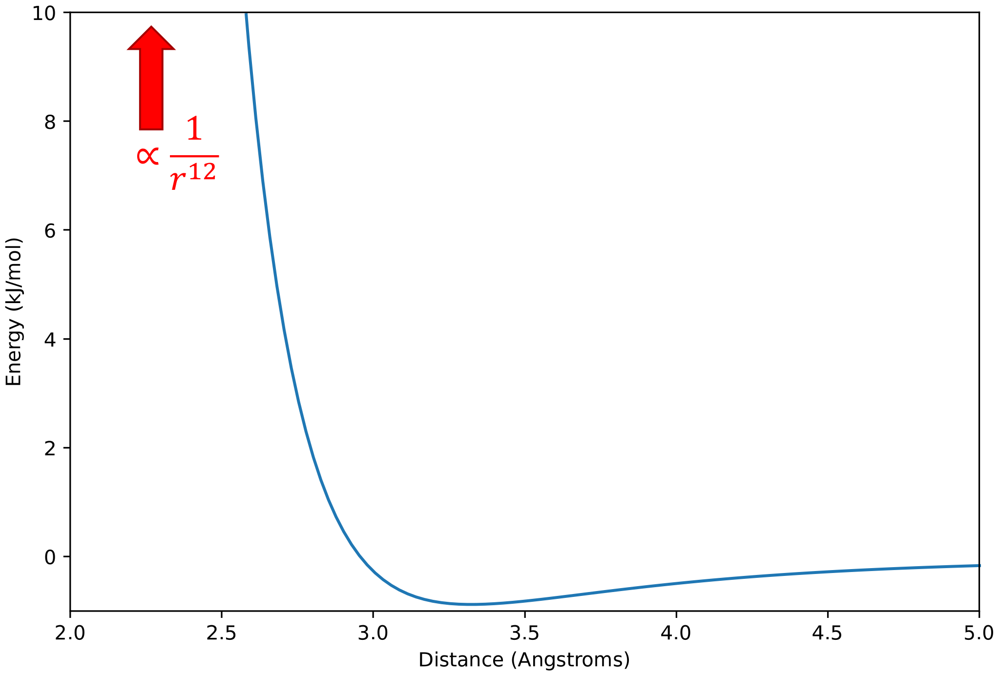

To give you an idea of the scale of the problem, if we tried to simply start
dynamics with, say, a pair of oxygen atoms placed with a center-to-center
spacing of 0.5 Angstroms, then after the first 1 femtosecond time step they
would be flying apart at about 160 times the speed of light! A physical
impossibility, of course - but remember that classical MD knows only about
Newton's laws, and nothing of relativity.

The above explains why we always run a quick energy minimisation before starting
dynamics, carefully moving atoms to find a local minimum stable enough so things
won't explode. But here we often run into a new problem: GPUs, while extremely
powerful, are generally only designed to work fast with single-precision
(32-bit) values - and the forces generated by bad clashes can easily exceed the
range of what can be represented in this format. When that happens, the energy
minimiser is left with no gradients to interpret, and gets stuck. Prior to
ISOLDE 1.6, that's what would lead to this dreaded scenario:

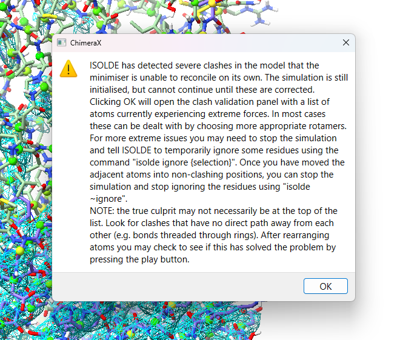

The solution to both these problems is to replace the problematic functional
form with a so-called "soft-core" potential that removes the problematic
infinity at *r=0*. Starting with version 1.6, ISOLDE uses the soft-core van der
Waals implementation described in `Pham and Shirts (2011)`__, replacing the
standard Lennard-Jones potential:

__ https://aip.scitation.org/doi/10.1063/1.3607597

.. math::
    E_{\text{VDW}} = 4 \epsilon_{ij}\left [ \left ( \tfrac{\sigma_{ij}}{r_{ij}} \right )^{12} - \left ( \tfrac{\sigma_{ij}}{r_{ij}} \right )^{6} \right ]

with the somewhat more complex but significantly more flexible:

.. math::
    E_{\text{VDW}} = 4 \epsilon_{ij} \lambda^{\frac{1}{a}}  \left [ \left ( \tfrac{1}{\alpha(1-\lambda)^b + (r_{ij}/\sigma_{ij})^c} \right )^{12/c} - \left ( \tfrac{1}{\alpha(1-\lambda)^b + (r_{ij}/\sigma_{ij})^c} \right )^{6/c} \right ] 

\... where :math:`\epsilon_{ij}` and :math:`\sigma_{ij}` are parameters defined
by the force field for each atom pair *i,j*. Of the newly added terms (*a*, *b*,
*c*, *α* and *λ*), only the *λ* parameter is important for day to day use,
controlling the overall "softness" - *λ* = 1 recapitulates the standard
Lennard-Jones potential, while *λ* = 0 turns off nonbonded interactions entirely
(not generally recommended). For the record, the standard values for the other
parameters used in ISOLDE are *a* = 1, *b* = 2, *c* = 6, and *α* = 0.2. 

While generally much less of a problem except in the most extreme clashes,
charge interaction energies also approach ±infinity proportional to 1/distance.
In ISOLDE the standard Coulombic potential:

.. math:: 
    E_{\text{Coul}} = \frac{1}{4 \pi \varepsilon_0} \frac{Q_iQ_j}{r_{ij}}

is replaced with:

.. math::
    E_{\text{Coul}} = \frac{1}{4 \pi \varepsilon_0} Q_iQ_j * \left ( \frac{1}{\alpha (1-\lambda)^{4b} + r_{ij}^c} \right )^{1/c}

\... where :math:`\varepsilon_0` is a physical constant known as the permittivity
of free space, and *b*, *c*, *α* and *λ* have the same values as those used in
the soft-core van der Waals potential.

*(Note: corresponding changes are also made to the implicit solvent force terms.
That's too much to get into here, but suffice to say that this correction fades
towards zero - i.e. towards a vacuum environment - with decreasing λ.)*

So that's the underlying theory. Here's what the resulting potentials look like
for a few different values of *λ*, for a pair of oxygen atoms each with a
partial charge of -0.25:

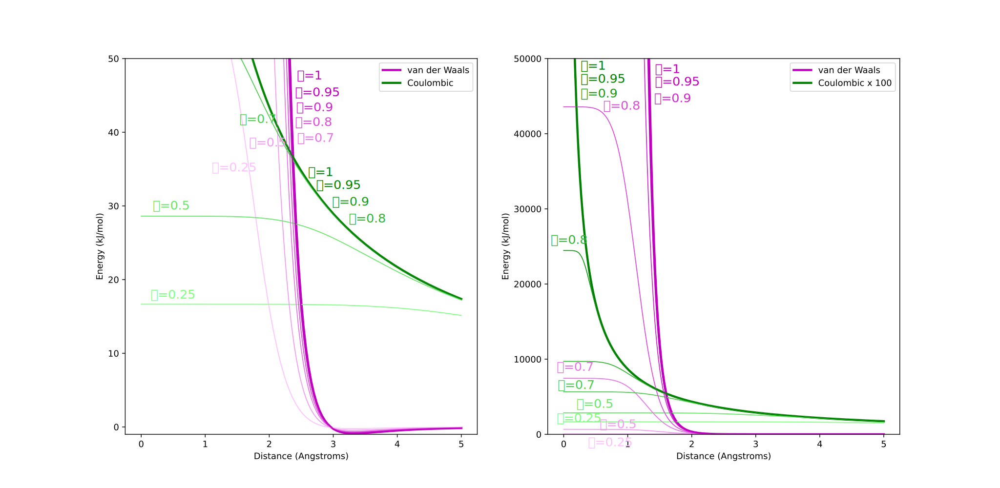

The upshot here is that for values of *λ* greater than about 0.8, the van der
Waals and Coulombic potentials are essentially identical to the unmodified forms
within the "normal" regime, only diverging at very high energies. Lower values
become increasingly unphysical and are not recommended for day-to-day use - but
as we'll see, temporarily reducing *λ* can be extremely useful for escaping
severe entanglements like the one pictured above.

So, let's get in to that. The example we're going to work with is `7w3v`__ (EMDB ID 32294).

__ https://rcsb.org/structure/7W3V

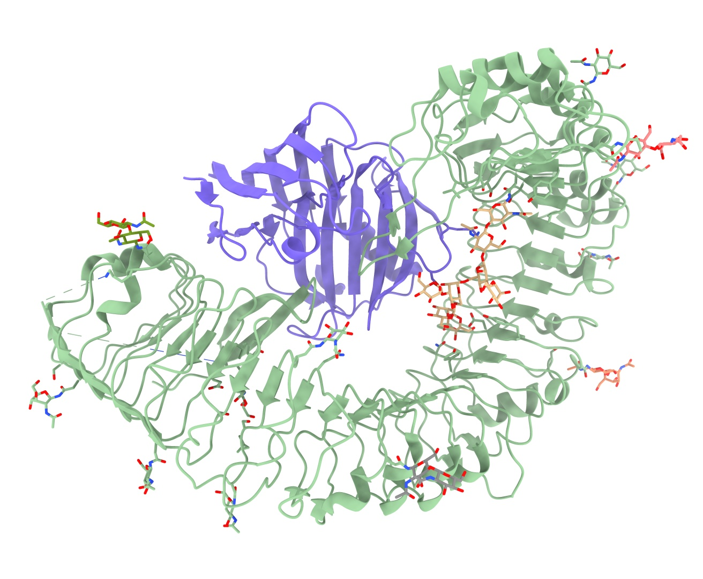

We're not going to work with the actual deposited model, however - that's
already in quite good shape. Rather, we're going to start from docked AlphaFold
models of the two chains. This complex makes a good case study because it
highlights one of the weaknesses of AlphaFold: while it's (usually) very good at
predicting *short-range* conformations, it's not so great at long-range order -
predictions for long thin proteins like the "C" shaped leucine-rich repeat seen
here will almost never match the experimental structure over their entire length
(sometimes because of natural flexibility, sometimes because AlphaFold simply
gets lost).

You might be asking, "why not just use AlphaFold-multimer to predict the complex
directly?". That's a good question, and in many cases that might be a viable 
strategy. In this case, however, that's not possible: this is a complex between 
a plant immune receptor and a protein from a microbial pathogen. Currently, 
AlphaFold-multimer and its relatives are only able to make predictions for 
(some) *intra*-species complexes, since their implementations are unable to 
detect coevolution signals *between* species. 

One more answer to the above question is simply, "time". Multimer prediction is
currently somewhat hit-and-miss, and takes on the order of an hour or two per
run. When a freely and instantly accessible database of predictions for almost
all existing monomeric structures `already exists`__ and your map is of good
quality, in many cases it will prove much faster to simply start from the
individual monomers.

__ https://alphafold.ebi.ac.uk/

Clicking the following link will load the docked (and trimmed) AlphaFold models 
and the cryo-EM map and prep them for ISOLDE, and also load the full-length
AlphaFold models from the `AlphaFold database`__:

__ https://alphafold.ebi.ac.uk/

`isolde demo clashes_intro`__

__ cxcmd:isolde\ demo\ clashes_intro

*(Remember, if you - like me - prefer the transparent surface map representation 
over wireframe, you can switch to that style using the "Noncrystallographic Map 
Settings" widget.)*

Go to ISOLDE's Validate tab and expand the Clashes widget:

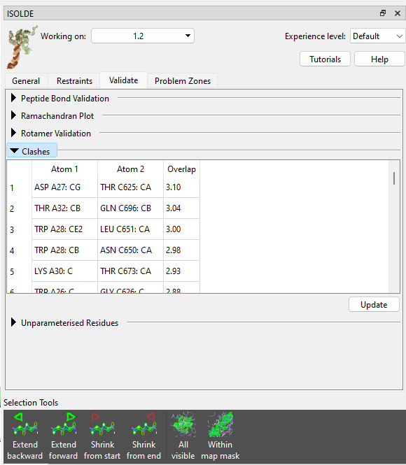

Hmm... not what you generally want to see - given that the radius of a carbon 
atom is about 1.7 Angstroms, a 3.1 Angstrom clash is getting very close to as 
bad as it can be (3.4 Angstroms, with the atoms exactly on top of each other).
No matter - we can still sort this out fairly straightforwardly. But first, 
let's have a look at how this happened. Click on the top entry in the table to 
focus the view on it, then zoom out a bit. Let's also open the deposited structure 
to compare:

`open 7w3v; color #4/A orange; color #4/C brown`__

__ cxcmd:open\ 7w3v;color\ #4\/A\ orange; color\ #4\/C\ brown

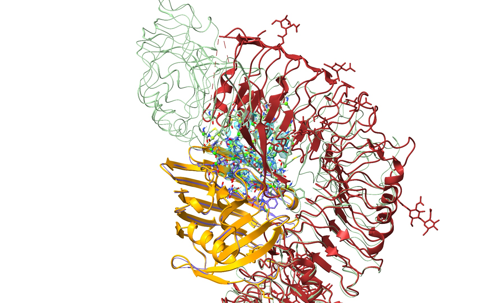

True to form, AlphaFold appears to have gotten the big leucine-rich repeat 
domain generally correct locally, but has pulled a bit too tight in the 
long-range curvature - creating a severe overlap with chain A. Prior to ISOLDE 
1.6 the approach to a problem like this would have been to fit each chain 
individually before combining them into one model and painstakingly 
checking/reducing any remaining clashes before moving forward. Nowadays it's
much easier. Let's close the deposited model and start experimenting.

`close #4`__

__ cxcmd:close\ #4

First, let's just confirm what would happen if you tried to start this simulation
without softcore potentials. Go to the Nonbonded Potentials widget on ISOLDE's
General tab, and uncheck the "Use softcore nonbonded potentials" box.

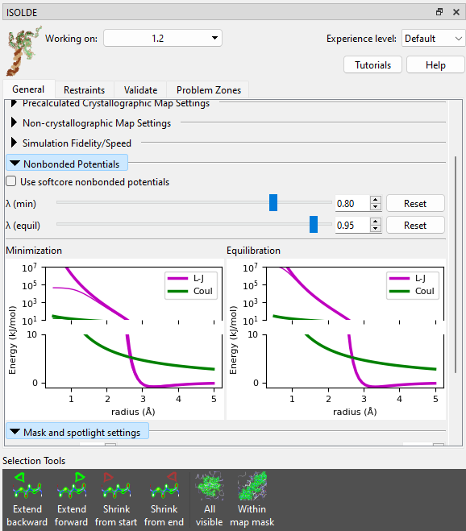

**(NOTE: if you are using a machine without a high-end Nvidia GPU or generally 
find simulations running too slow for your liking, try switching the "Simulation 
Fidelity/Speed" to "Lowest/Fastest" on ISOLDE's General tab before starting a 
new simulation.)**

Now try to start a simulation. Select the model and click ISOLDE's play button, or:

`isolde sim start #1`__

__ cxcmd:isolde\ sim\ start\ #1

The minimiser will spend some time trying and failing to find a way out of the
mess, before bringing up the clashes popup menu and (after you click OK) opening
the clashes widget. There's really not much to be done in this state, and we'll
need to start a new simulation to introduce the softcore potentials. Close the
clashes widget, and click either ISOLDE's red stop button or the link below to
throw out this simulation.

`isolde sim stop discardTo start`__

__ cxcmd:isolde\ sim\ stop\ discardTo\ start

Now, check the "Use softcore nonbonded potentials" checkbox and try again.

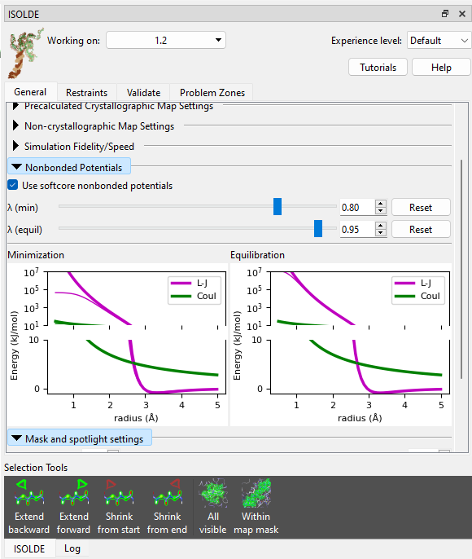

`isolde sim start #1`__

__ cxcmd:isolde\ sim\ start\ #1

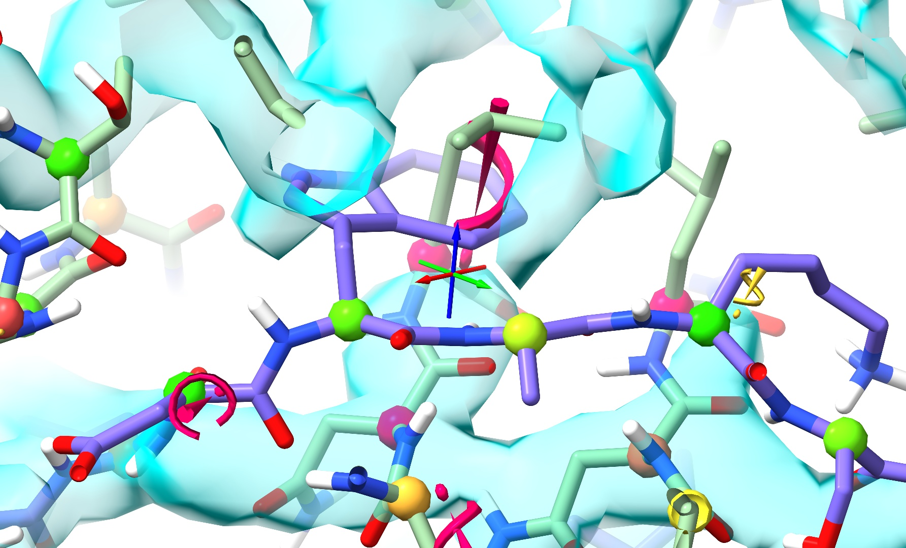

Well... at least it started this time - but I'm sure you'll agree that this 
result isn't particularly great either. Let's throw out this simulation and talk
strategy.

`isolde sim stop discardTo start`__

__ cxcmd:isolde\ sim\ stop\ discardTo\ start

There are two key problems we need to overcome here:

(a) The nonbonded potentials are still too strong to let the trapped atoms escape; and

(b) Even if we weaken them further, the interactions in the entangled region are 
still going to badly mess up the local structure.

Let's tackle the second problem first. The local starting geometry of each individual 
chain is generally very good, so let's go ahead and restrain them using local distance
and torsion restraints (see :ref:`reference_model_restraints`). Expand the 
Reference Models widget on ISOLDE's Restraints tab, click the "Reference model:" 
drop-down menu and click "2: AlphaFold Q30BZ2". This will be automatically identified
as corresponding to chain A, and aligned to the working model accordingly. Check both 
the "Distances" and "Torsions" checkboxes, then click "Apply".

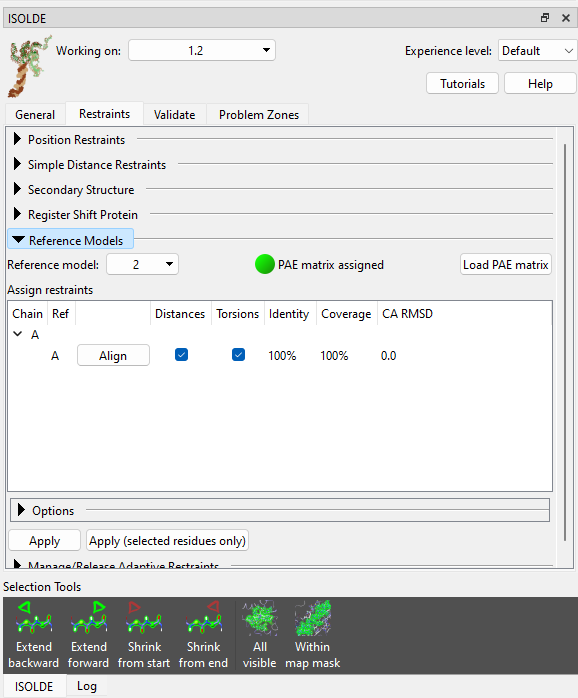

Now choose "3: AlphaFold A0A2I8B6R1" and apply restraints to chain C in the same way.
This time you'll get a pop-up warning message looking like this:

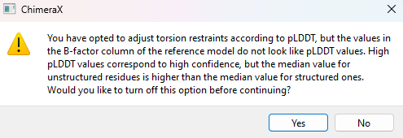

Since you know this is actually an AlphaFold model, this warning can be safely
ignored (click "No"). The essential problem here is that the "pLDDT" values used
by AlphaFold to denote confidence are stored in the B-factor column, but aren't
actually B-factors. In fact, they're inversely related - in general, high pLDDT
values should correspond to low B-factors and vice versa. Since ISOLDE's
reference model tools aren't meant just for AlphaFold models, it uses some
simple sanity-check heuristics to decide if a model's B factors actually "look
like" pLDDT values. One of these is based on the idea that on average, alpha
helices and beta strands have lower B-factors (and higher pLDDT) than other
residues. But there are exceptions to every rule - in this chain, helices and
strands make up just 43% of residues according to dssp, and their average pLDDT 
(86.1) is ever so slightly lower than the average for the remainder (87.4).
Such is life - no method is entirely foolproof.

*(NOTE: while it's already been done for you here, you can download the
pre-calculated model for almost any protein in the UniProt database with
"alphafold fetch {uniprot ID}".)*

That's all we need those AlphaFold models for, so you can go ahead and close 
them now:

`close #2,3`__

__ cxcmd:close\ #2,3

Zooming in should now reveal a somewhat cobwebby view like this:

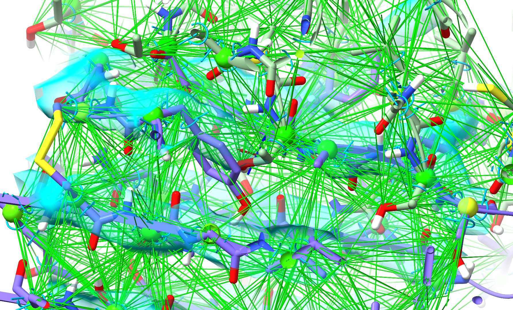

Let's tidy that up a bit by telling ISOLDE to show only strained distance 
restraints. Collapse the Reference Models widget, and open the 
Manage/Release Adaptive Restraints widget underneath it. Drag the "Display 
Threshold" slider a little to the right:

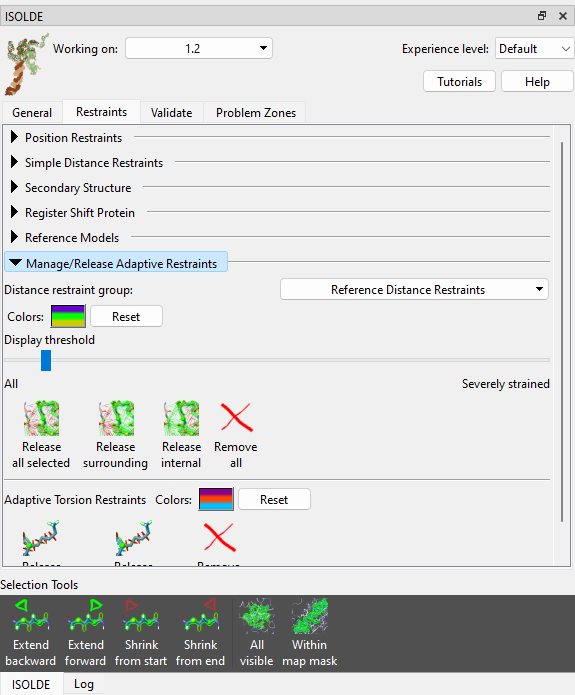

All the distance restraint markup will disappear from the model. They're not
gone, though - any restraint that deviates beyond the display threshold will
automatically appear.

Now switch back to the General tab, and take a closer look at the Nonbonded
Potentials widget.

You'll notice there are **two** *λ* sliders. The top one controls the softness
during energy minimisation (a generally non-interactive step that happens at 
the start of each simulation; when coordinates are changed in a 
non-simulation-driven way - e.g. by setting a sidechain to the rotamer preview
coordinates; or in the rare situation when ISOLDE detects one or more atoms 
moving at an excessive velocity). Under most circumstances you shouldn't need 
to change the default value of this, but feel free to experiment.

The bottom slider controls the softness during actual interactive dynamics.
Drag that one back and forth and watch what it does to the plot underneath 
(note that the bottom half of the plot is on a linear scale to show the details
in the region important to equlibrium behaviour, while the top half is on a 
log scale). When you're done, hit the "Reset" button to the right of the slider
to return to the default value of 0.95.

Now, let's start a new simulation and see what happens:

`isolde sim start #1`__

__ cxcmd:isolde\ sim\ start\ #1

After a few seconds it should start looking something like this:

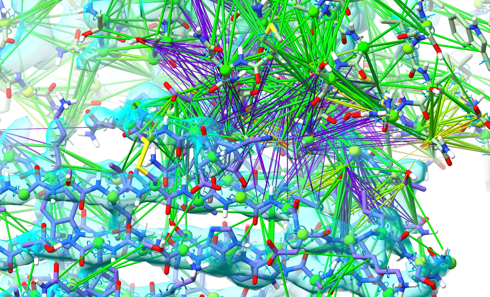

The extra "reinforcement" provided by the restraints is helping chain C settle
correctly towards its density, but atoms in the clash zone are still trapped 
by their nonbonded interactions. Now, **without** pausing the simulation, 
try gradually dragging the *λ* (equil) slider to the left. As the value approaches
about 0.5 you should start to see some new movement, and at around 0.25 you 
should hit the point where the van der Waals potential barriers drop far enough
to be overcome by standard covalent bonds and reference model restraints. If things
have gone correctly, the problem region should now look something like this:

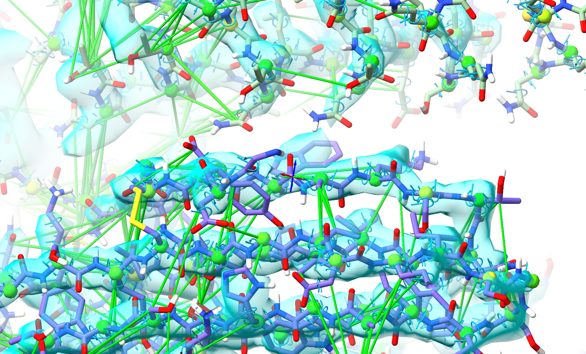

When it does, hit the "Reset" button beside the *λ* (equil) to return to the 
default potential setting, then go ahead and stop your simulation.

If you have a browse around through the model, you'll see that the overall fit is 
now much improved - but there remain numerous local imperfections. Some (perhaps 
most) look to be attributable to conformational changes induced by binding 
(assuming that the AlphaFold model for each chain is most representative of the 
unbound state), but others are probably due to mistakes made by AlphaFold itself - 
always remember: while it's usually very good, it's by no means perfect.

However, fixing model/map discrepancies and errors like these is already covered in 
some detail in the :ref:`alphafold_top_down_tutorial`, :ref:`alphafold_multimer_cryoem_tutorial` 
and :ref:`alphafold_mr_tutorial` tutorials, so I won't rehash that here. Suffice 
to say that with this model and map, you're now at about the state where those 
tutorials begin. 

