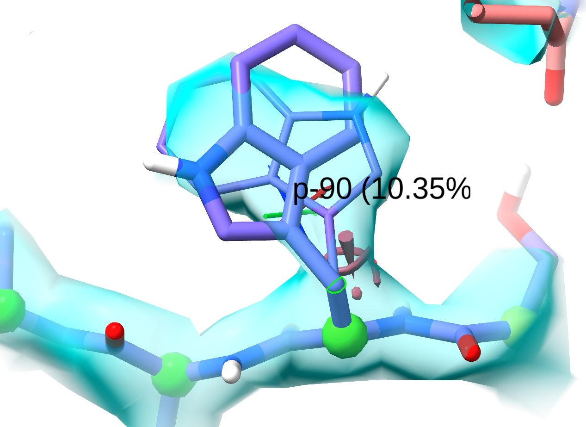
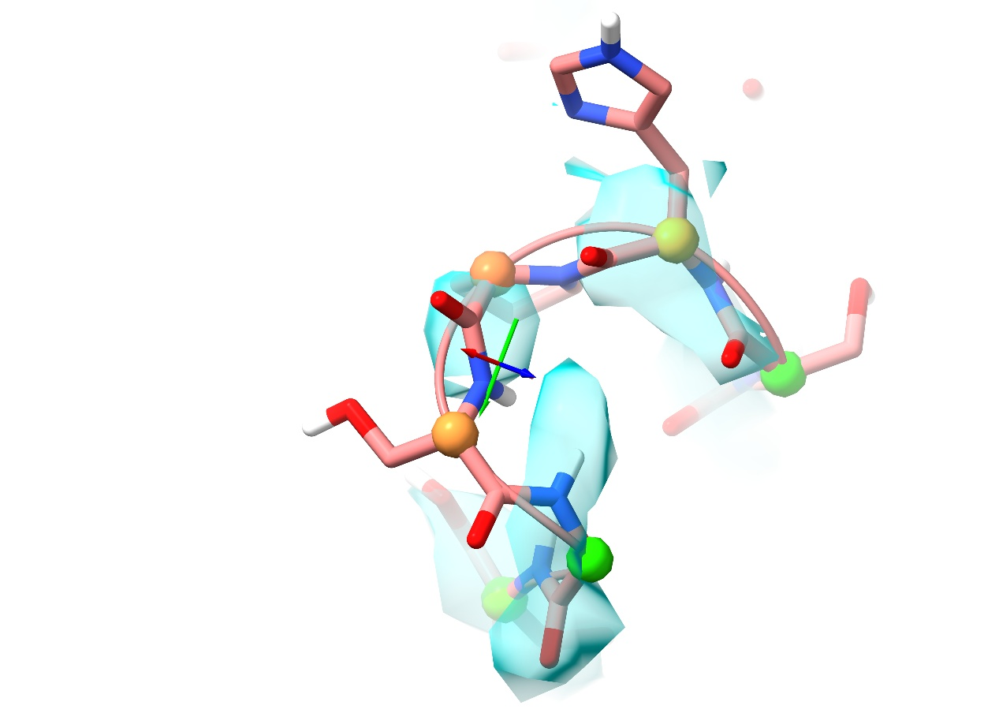

.. _isolde_cryo_intro_tutorial:

Introduction to cryo-EM model rebuilding in ISOLDE
==================================================

**(NOTE: Most links on this page will only work correctly when the page is
loaded in ChimeraX's help viewer. You will also need to be connected to the
Internet. Please close ISOLDE and any open models before starting this
tutorial.)**

**(The instructions in the tutorial below assume you are using a wired mouse
with a scroll wheel doubling as the middle mouse button. While everything
should also work well on touchpads in Windows and Linux, support for Apple's
multi-touch touchpad is a work in progress. Known issues with the latter are
that clipping planes will not update when zooming, and recontouring of maps is
not possible.)**

Tutorial: Diagnosing and rebuilding errors in a high-resolution cryo-EM model
-----------------------------------------------------------------------------

.. toctree::
    :maxdepth: 2

With the advent of the "resolution revolution" in electron cryo-microscopy,
maps derived from this method went from fuzzy blobs only suitable for
rigid-body docking or very tightly restrained flexible fitting to near-atomic
resolutions amenable to *ab initio* model building methods. With (in the best
cases) nearly every sidechain clearly and unambiguously resolved and no
crystallographic phase problem to solve, it is easy to see why cryo-EM
rapidly gained in popularity - particularly for handling of challenging targets
previously intractable to crystallisation. Perhaps the biggest feature setting
cryo-EM apart from crystallography is that cryo-EM maps are independent of the
atomic model, making model-building and refinement somewhat more
straightforward. Nevertheless, even in the highest-resolution cryo-EM maps there
remain challenges and pitfalls.

For this tutorial, we'll be looking at 6out, the 2.6Å structure of a human
norovirus capsid protein VP1. Looking at the `PDB entry`__ for this model you
might be forgiven for thinking that there's nothing more to be done here - that
the model is effectively perfect:

__ https://www.rcsb.org/structure/6out

.. figure:: images/6out_multipercentile_validation.png

However, as we shall see appearances can be deceptive. This is particularly true
in cryo-EM, where to date most models have been refined with the use of
Ramachandran (protein backbone conformation) and rotamer (sidechain
conformation) restraints. These often have unintended (and unfortunate)
consequences: faced with an outlier, they tend to push the conformation into
the *nearest* "favoured" region, rather than searching for the *correct* one
(a computationally **much** more demanding task). This can lead to models which
*look* great by Ramachandran and sidechain metrics, but in fact still contain
various errors which can bias downstream analyses.

Most of the errors in this model are not particularly serious in the grand
scheme of things - but it is important to keep in mind that the "seriousness" of
any given error is strongly dependent upon what you want to use the model *for*.
When analysing the static structure (i.e. elucidation of the catalytic centre of
an enzyme, defining a potential drug-binding pocket or resolving a bound ligand)
then one might argue that everything outside the site of interest is essentially
irrelevant. On the other hand, if your goal is to study the *dynamics* of a
protein, then essentially *everything* matters - with the possible exception of
highly flexible loops, every mistake both removes one or more natural
interactions and adds *unnatural* ones, adding subtle biases causing model's
behaviour to diverge from that of the real-world molecule.

In addition to the above, I would also like to add the disclaimer that the
analysis below should not be construed as any form of critique of the *authors*
of this model. At the time this tutorial was originally written, 6out was in fact among the best models in
the world for its resolution range (whether crystallographic or cryo-EM),
produced by a highly-experienced team using state-of-the-art methods. In fact,
using the same tools and techniques as the authors of this model I am quite
certain that I could not have done a better job! Rather, the key take-home
message is one that those experienced in the field already know well: as the
resolution of a map gets worse, the amount of prior information needed steadily
increases. In ISOLDE's case, this information is encoded in the AMBER molecular
dynamics forcefield used for interactive simulations, and the statistical
understanding of thousands of very-high-resolution protein structures captured
in the live Ramachandran and rotamer validation.

Anyway, let's go ahead and get started. While we *could* fetch the model direct
from the PDB using the command "open 6out", we'd find that the coordinates have
been updated since this tutorial was written. Instead, we'll open a locally
cached version of the model as it was at the time I first looked at it. We won't
start ISOLDE itself just yet.

`isolde demo cryo_em_intro modelOnly true startIsolde false`__

__ cxcmd:isolde\ demo\ cryo_em\ modelOnly\ true\ startIsolde\ false

... and fetch the map from the EMDB:

`open 20205 from emdb`__

__ cxcmd:open\ 20205\ from\ emdb

This should give you a scene looking something like this:

.. figure:: images/6out_initial_open.png

This view is great for an overview of your model, but when model building we
really want to get down amongst the weeds - that is, navigating *inside* the
model at the atom-to-residue scale. This requires a specialised view mode. Try
using the following command:

`clipper assoc #2 to #1`__

__ cxcmd:clipper\ assoc\ #2\ to\ #1

This achieves two things. Most obviously, it sets up a new viewing mode:

.. figure:: images/clipper_assoc.png

What is *not* immediately obvious is that this also rearranges the model and
map in the Models layout, to tell ISOLDE that we want to be fitting the former
into the latter. *(NOTE: if ISOLDE is already open you can achieve the same
effect using the "Add map(s) to working model" widget on ISOLDE's General tab)*.

To get a feel for this mode, try scrolling in using the mouse scroll wheel:

.. figure:: images/zoomed_in.jpg

The crossed arrows at the centre of your screen form the pivot indicator,
marking the current centre of rotation and additionally indicating the x, y and
z axes (as red, green and blue respectively). As well as a handy visual
reference point, this will become important later when it comes to adding
position targets to atoms.

Now, try panning around by clicking and dragging with the *middle mouse button*
(if you are using a two-button mouse or touchpad, you can also use *shift-left
click* for this). You will see that the sphere of density follows you, along with
a slightly wider sphere of visible atoms. Outside of this sphere, the display
is reduced to a thin cartoon as an unobtrusive indicator of the overall
structure. You can also move the pivot point in the Z direction (that is,
towards and away from you) by clicking and dragging with *ctrl-middle mouse
button*.

If you find yourself having to peer through a "forest" of atoms to see the
detail you're interested in, you can adjust the width of the clipping slab using
*shift-scroll*:

.. figure:: images/thick_slab.jpg

.. figure:: images/thin_slab.jpg

If you wish, you can adjust the contour level of the map with *alt-scroll*.
When you have more than one map open, you can choose the map to contour using
*ctrl-scroll* (the name of the selected map will appear briefly in the status
bar at bottom left).

This model is beautiful! What could possibly be left to fix?
~~~~~~~~~~~~~~~~~~~~~~~~~~~~~~~~~~~~~~~~~~~~~~~~~~~~~~~~~~~~

A very good question, and indeed when simply browsing around it is not at all
easy to find any signs of trouble. For that, we're going to need more
information. Now would be a good time to start ISOLDE. This can be done via the
menu (Tools/General/ISOLDE) or via a command:

`isolde start`__

__ cxcmd:isolde\ start

At this stage you should have the ISOLDE panel floating on the left, and the
Log, Models and Volume Viewer widgets in the panel to the right. To keep things
neat I like to rearrange these so they're all stacked as tabs in the right
panel. Click and drag on the title bar of the Models panel to tear it away,
then drag it over the Log panel until the latter turns grey/blue. Let go and
the Models widget should dock as a tab on top of the Log. Now do the same for
the Volume Viewer and ISOLDE widgets. Your ChimeraX window should now look like
this:

.. figure:: images/docked_widgets.png

If you prefer, you can also keep the ISOLDE panel "floating". If so, I'd
recommend making it non-dockable by right-clicking anywhere in the panel and
un-checking the "Dockable Tool" option.

You may also have noticed that on starting ISOLDE, the model's alpha carbon
atoms all suddenly turned into green spheres. This is ISOLDE's real-time
geometry validation in action. The colour of each sphere represents the status
of that residue on the Ramachandran plot - as the backbone conformation becomes
more and more unlikely the colour will shade from green (favoured) through
yellow (marginal) to hot pink (outlier). While this model currently contains no
Ramachandran outliers, it is important to note that in general your target is
not to have *zero* outliers, but rather to only have outliers where they are
strongly supported by the data (that is, clearly resolved in the density and
stabilised by interactions with their surroundings). Around 0.1% of residues
will naturally be real outliers - where these exist they are often functionally
important.

At this stage, my personal preference is to change the display background to
white and the map to a surface representation. Whether you choose to do the same
is up to you. You can change the display background colour via buttons on
the ChimeraX Home or Graphics tabs, or via the command:

`set bgColor white`__

__ cxcmd:set\ bgColor\ white

Map representations, meanwhile, can be adjusted either via ChimeraX's Map tab
(use caution: these buttons will act on any selected maps, or all maps if no
maps are explicitly selected), via the Volume Viewer, or via the "Non-crystallographic
Map Settings" button on ISOLDE's "General" tab. Let's look at what the
latter gives you:

.. figure:: images/map_settings_dialog.png

As well as allowing map-by-map control over visualisation style and colour, this
is where you tell ISOLDE whether to use a map as a molecular dynamics flexible
fitting (MDFF) potential and if so, how strongly it should pull on the atoms.

*(Note: only maps that have been associated with the model via the "clipper
assoc" command or the "Add map(s) to working model" widget will appear in this
drop-down menu)*

All real-space (i.e. non-crystallographic) maps are enabled for MDFF by default,
and ISOLDE chooses a reasonable weight based on the map gradients in the
vicinity of the model atoms. You may wish to adjust this in some cases (e.g. if
your starting model conformation is a long way from matching the map - see
:ref:`bulk_fitting_tutorial` for a more advanced tutorial on this topic - or you
choose to have multiple maps pulling on your atoms at once). For now, we'll just
leave the weight at the default value.

Preliminaries - adding hydrogens
~~~~~~~~~~~~~~~~~~~~~~~~~~~~~~~~

ISOLDE is, at its heart, an interactive molecular dynamics package (using the
AMBER forcefield, for the record) and as such requires your model to include
hydrogen atoms. For the most part, residues should also have all their heavy
atoms. Some concessions to these rules are made to allow for the fact that
ISOLDE is designed for *building* models rather than simulating them at
equilibrium: common sidechain truncations to CA, CB or CG are allowed (except
where this would break a ring - no truncation of prolines, for example!), as are
"dangling" N-H and C=O backbone groups at chain breaks. In most cases involving
simple protein/water models like this one, you can add hydrogens simply by using
the ChimeraX command:

`addh`__

__ cxcmd:addh

While important to the MD force field, most non-polar hydrogens are fairly
uninteresting for model building purposes and only serve to clutter up the
display. Hence, they are hidden by default. 

Restraining waters
~~~~~~~~~~~~~~~~~~

This model contains a number of water molecules placed into somewhat weak
(but apparently real) density. This combination of small ligand plus weak
density can pose a problem for ISOLDE: since during fitting it is explicitly
modelling the physics of the molecule, any overly-enthusiastic tugging on
nearby atoms can easily bump a water hard enough to send it flying off towards
infinity, never to be seen again. For this reason, it is usually advisable to
restrain them to their surroundings in some way. The command:

`isolde restrain ligands #1`__

__ cxcmd:isolde\ restrain\ ligands\ #1

... will do this automatically for you:

.. figure:: images/restrained_waters.jpg

For each ligand with three or fewer heavy atoms, distance restraints will be
added to surrounding heavy polar atoms within 3Å. If fewer than three distance
restraints are created, the ligand will additionally be pinned to its current
position. These restraints are quite "soft" - just enough to prevent the ligand
from flying  away, while still allowing substantial flexibility in case the
starting geometry is poor. Restraints on individual ligands can be readily
adjusted or removed  via ISOLDE's Rebuild tab (which we'll visit in earnest
later).

Before we go ahead and start a simulation, let's take a quick look at ISOLDE's
Validate tab. First, show the Ramachandran plot:

At first glance this looks great, with almost all residues clustered inside the
"favoured" region of the plot. Appearances can be deceptive, however. Notice how
in both the beta-strand (top left) and alpha helix (middle left) regions the
clustering of residues doesn't really match the distribution suggested by the
contours: there is an unpopulated vertical strip around phi=-60, and a
disproportionate number of residues clustering right on the border of the
"favoured" region cut-off (the yellow line, denoting the 2% probability
contour). These are some of the artefacts introduced by Ramachandran restraints,
which can obscure the true picture of the model.

While we're here, also have a look at the "Rotamer Validation" panel. While there is a
short list of 32 marginal rotamers, none are flagged as true *outliers* - that
is, with a prior probability of less than 0.05%.

Close the Rotamer Validation panel, switch back to the Ramachandran plot and set it to
view the "Isoleucine or valine residues" subset, and let's watch what happens
when we go ahead and start a simulation. First, select the  whole model:

`select #1`__

__ cxcmd:select\ #1

\... and get a simulation started by either clicking ISOLDE's blue play button 
(in the ISOLDE tab on the ribbon menu at the top of the ChimeraX screen) or
using the command:

`isolde sim start sel`__

__ cxcmd:isolde\ sim\ start\ sel

Note that under most circumstances you only really need to simulate the *entire*
model twice: once at the start to allow the energy minimiser to alleviate
clashes, and once at the end to settle it prior to writing coordinates for final
refinement. For everything else you will want to work with smaller, more
localised simulations.

Anyway, back to the task at hand. Once the model starts moving, you should see
the Ramachandran plot quickly go from this:

... to something like this, with two brand new outliers (the two large red
points):

.. figure:: images/rama_ile_val_mobile.png

Where ISOLDE's blue play button was, there should now be a red pause button.
Click that to pause the simulation. Hovering the mouse over the outliers on the
plot will tell you their identities (residue 57 on chains A and C). Clicking on
them will centre the view on one of these two residues, but which one ISOLDE
chooses will be somewhat random. To specify exactly which residue to view, use
ChimeraX's command line:

`view /A:57`__

__ cxcmd:view\ \/A:57

.. figure:: images/A57_rama_outlier.jpg

This is an example of the sort of problem that traditional restraints and
refinement struggle with. The root cause is fairly simple: the peptide bond
between Ile57 and Asn58 (on the right) has been modelled the wrong way around,
with the backbone oxygen pointing towards the backbone oxygen of Pro210 above.
Since traditional restraints know nothing of electrostatics and are relatively
tolerant towards clashes, refinement was able to find a seemingly-reasonable
conformation just on the edge of favoured Ramachandran space. On starting a
simulation, however, the oxygens repel each other creating a telltale outlier.
In this case we can also see that the Ile57-Asn58 oxygen does not fit
particularly well into the density, so the most obvious solution is to try
flipping it using the "Flip peptide" button on the ISOLDE ribbon menu.

If you're working on a machine with a strong GPU you could quite readily do this
in the current whole-model simulation, but for better performance it's advisable
to stop this one and start a more localised simulation encompassing just the
problem area. Clicking ISOLDE's green "STOP" button will terminate the
simulation while keeping the current coordinates (the red one will revert the 
model to the state it was in when you started the simulation).

Click the green "STOP" button, then *ctrl-click* on an atom in Ile57. Now click
the play button. This will trigger ISOLDE to start a highly localised simulation
consisting of this residue, its neighbours forward and backward along the chain,
a further surrounding "soft buffer" region of mobile residues, and a shell of
fixed residues beyond that. This serves two purposes: allowing a much faster
simulation rate to increase interactivity; and ensuring that the remainder of
the model remains unaffected by whatever you do here.

Before we actually go ahead and flip the bond, there is some minor housekeeping
we need to do. The nitrogen in the Ile57-Asn58 peptide bond is involved in a
distance restraint to a nearby water molecule (A662, for the record). This will
no longer be valid once the bond is flipped, so it's best we remove it. Switch
to ISOLDE's Restraints tab, expand the "Simple Distance Restraints" widget, and
*ctrl-click* on the nitrogen. Click the "Release (any)" button - this will
release all distance restraints involving any selected atoms. In this case we
have just one atom selected with a single distance restraint, so it will do the
job. For finer control where an atom is involved in multiple distance
restraints, you can *ctrl-shift-click* on the atom at the other end of the
restraint then click the "Release (internal)" button - this selectively 
disables only restraints where both enpoint atoms are selected.

Now it's time to flip that bond. ISOLDE uses a simple rule to decide which
peptide bond will be flipped: each residue "owns" the peptide bond attached to
its N-terminus. An easy way to remember is that if you select an alpha carbon,
the directly-attached nitrogen is the one that will flip. *Ctrl-click* on the
C-alpha atom of Asn58. The button we want now is the one labelled "Flip peptide"
in the "Peptide bond" section of the top ribbon menu:

Go ahead and click it, and take a look at the result:

.. figure:: images/ile57-asn58_flipped.jpg

Not only do we see an improved fit to the backbone density, but other favourable
interactions have been formed in the process. Where the backbone oxygen was
clashing with Pro210 we now have a lovely hydrogen bond, and as a bonus the
flip has allowed the Asn sidechain to move up to associate with Arg108.

Click the green stop button, and let's move on. *(NOTE: as an exercise you might
consider applying the same correction to chains B and C.)*

For another simple problem with a simple fix, hide the Ramachandran plot and
show the Rotamer Validation widget. While before the simulation started there
were no outliers listed here, now you should see around a dozen. Scroll down
until you find Trp A375 *(Since MD simulation involves some randomness, this may
be some way down the list, and may not be highlighted in red)*. Click on that
row to take a closer look.

.. figure:: images/trp_a375.jpg

This is a classic and surprisingly easy-to-make mistake with tryptophan
residues. This residue has been fitted with its sidechain "backward" -
approximately 180 degrees away from its true conformation. Note the pink marker
adjacent to the CA-CB bond. This (an exclamation mark surrounded by a spiral
when viewed side-on) is your visual indicator on the model that this sidechain
is in a disfavoured conformation. Like the Ramachandran indicators, it will
change in real time as the model is adjusted.

With this residue selected, go ahead and click "Start simulation". Now,
*ctrl-click* on any atom in the residue to select it. This will enable the 
"Preview next" button in the Rotamer section of ISOLDE's ribbon menu:

As the name suggests, this button creates a preview of ideal rotamer coordinates for 
the selected residue. Each click will bring up a new preview, in order from most 
to least common. Keep clicking until you come to this near-perfect fit to the density:

Now, look at the two buttons to the right of "Preview next". The second sets the
atomic coordinates to exactly match the preview, triggering a brief energy minimisation
before the simulation moves on. *(NOTE: use this with care: do not click if the
preview will introduce a severe clash - use the following button instead)* The
third button sets restraints on the sidechain *chi* torsions to steer it
smoothly towards the preview conformation. The final button in this panel 
can be used to release those restraints later. In this case we're perfectly safe to 
use the "Set coords" button, so do that now.

If you zoom out a little, you'll see that the sidechain of His329 is stacked
against that of Trp375 - but if you think about hydrogen bonding you'll see that
it appears to be pointing the wrong way: flipping it will allow it to H-bond to
Asp344:

.. figure:: images/his_329.jpg

In the original model this sidechain was placed with the delta nitrogen
H-bonding to the backbone oxygen of Asp327 - a seemingly-reasonable conformation
consistent with the density, but the AMBER forcefield says it's not stable that
way. Note that in its existing conformation it's not an outlier (ISOLDE
identifies it as the *m90* rotamer with a prevalence of around 13% in
high-resolution structures), but nevertheless it looks wrong. Flip it so the
sidechain NH points towards Asp344 - you can do this using the rotamer tool or
simply dragging with the mouse. After flipping you should find that not only do
you now have the H-bond, but the sidechain ring is nicely parallel to the Trp
and the conformation is now the most common of all histidine rotamers (*m-70*,
31.73%).

.. figure:: images/his_a329_flipped.jpg

Cases like this (not an outlier by any standard metric, yet still wrong) are
some of the hardest modelling issues to catch, often only being found by manual
inspection and a practised eye: while one can get a long way by simply working
through the current list of outliers, ultimately there is still no substitute
for careful inspection of each residue in context with its density and
surroundings.

Before we move on, don't forget to take a look at the equivalent residues on
chains B and C!

If you still have a simulation running, stop it now:

`isolde sim stop`__

__ cxcmd:isolde\ sim\ stop

Switch back to the Validate tab, and re-launch the Ramachandran plot. Have a look 
at the "General" plot. That cluster of marginal/outlying residues on the
left looks suspicious. Let's take a closer look.

.. figure:: images/Rama_general_383.png

This cluster corresponds to a somewhat weakly-resolved loop found on each of the
three chains in the model. Of the three, the density around chain B seems the
strongest, so let's focus on that one:

`view /B:383`__

__ view\ \/B:383

*(Note: in some subsequent run-throughs of this tutorial scenario, by the time
I got to here the simulation had already rattled Ser383 in to place on its own.
Don't be surprised if your model doesn't look exactly like the above)*

The density here is rather weak and patchy, but good enough as it stands to show
that this loop is probably mis-modelled (remember, you can adjust your contours
with *alt-scroll*). While it *is* possible to remodel using just this map, this
provides us with the opportunity to try out a neat trick that often works well
with cryo-EM density. Many such maps are either somewhat over-sharpened or
sharpened to optimise the well-resolved regions at the expense of sites like
this (although examples do exist of badly *under*-sharpened maps as well).
Maps with a judicious amount of smoothing (or "blurring", if you prefer) are
often better at showing the connectivity in weakly-resolved regions, where
strongly sharpened maps break down into uninterpretable noise. If
you wish you can use external tools like *phenix.auto_sharpen* or *LocScale* to
optimise the map sharpening, but ChimeraX provides a tool to smooth or sharpen
the map to your specification:

`volume gaussian #1 bfactor 150`__

__ cxcmd:volume\ gaussian\ #1\ bfactor\ 150

This will generate a new smoothed map (mathematically, the convolution of the 
existing map with a Gaussian function). Specifically, the B-factor is related to
the variance of the Gaussian as: :math:`B=8 \pi^2 \frac{\text{variance}}{3}`.
This is identical to the formalism describing atomic B-factors: in real space it
describes how "blurred" they are; in reciprocal space it describes how quickly
the Fourier amplitudes drop off with increasing resolution. 

You'll find that this command has also automatically hidden the existing map.
Show it again by clicking the "closed-eye" icon in the top left of the Volume
Viewer:

.. figure:: images/volume_hidden.png

\... and associate the new map with the model using either ISOLDE's "Add map(s) to
working mode" widget or

`clipper assoc #2 to #1`__

__ cxcmd:clipper\ assoc\ #2\ to\ #1

The new map will appear as a wireframe - which, if you're displaying the
original as a transparent surface, is ideal for our purposes. *Ctrl-scroll* to
select it, then *alt-scroll* down to a suitable contour (around 1.6 sigma
seems to work well in this region). This gives us the best of both worlds:
details shown by the sharper map at a moderately high contour, while the overall
envelope is shown by the smoothed map at a low contour.

.. figure:: images/sharp_and_smooth.jpg

Now *ctrl-click* on an atom from Pro382 (at the tip of the loop). Use the selection 
tools from the bottom of the ISOLDE panel: 

.. figure:: images/selection_extension.png

\... to extend the selection by two residues either side, and press play. The
first and most obvious problem is that the Ser383 sidechain is pointing in the
wrong direction (the pivot indicator is placed where it *should* be):

.. figure:: images/ser383_wrong_side.jpg

Now, you *can* simply pull it over by *right-click and dragging* on the
sidechain oxygen. If you're uncomfortable with that or on a slower machine, you
may find it more useful to do this with a temporary position restraint.  Pause
the simulation, *ctrl-click* on the serine sidechain oxygen, then move the pivot
indicator to  where you want it to go (don't worry about being too accurate -
the restraint  will be quite soft, and we'll be removing it once it's settled
anyway). Now, expand the "Position Restraints" widget at the top of ISOLDE's 
Restraints tab, and click the button labelled "Pin to pivot". The result should
look like this:

.. figure:: images/position_restraint.png

The oxygen is now connected by a dashed line to a yellow "pin" indicating the
target position. Press play to continue the simulation and see the result.

.. figure:: images/position_restraint_settled.jpg

Now, click the red X in the position restraint panel to release the restraint
(if you deselected the oxygen, you'll need to select it again first).

.. figure:: images/pro382_trans.jpg

Hmm. That's better, but I'm still not happy. The serine sidechain fits, but the
residue is still marginal on the Ramachandran plot for no good reason, and if
we look back one residue we see the oxygen from the His381-Pro382 peptide bond
is sticking *way* out of density. The His381 sidechain is also poorly fitting
the density.

Now, while peptide bonds to non-proline residues are found in *cis* (that is,
with the oxygen pointing in the same direction as the hydrogen) only vanishingly
rarely, about 5% of proline residues are found in this conformation (that is,
with the C=O bond pointing in the same direction as the bond between the peptide
nitrogen and the sidechain CD atom). While they are slightly less energetically
favourable than the *trans* conformation and thus require some stabilisation
from their local environment, this can be quite subtle. Let's go ahead and see
if the *cis* conformation works better here. *Ctrl-click* to select the proline
CA atom, then click the "Flip cis\<-\>trans" button on ISOLDE's ribbon menu:

Give it a little time to settle (feel free to help with a little judicious
tugging of atoms if you like, but in my case it was unnecessary), and...

.. figure:: images/pro382_cis.jpg

Voilá! Not only are we now free of outliers here, but backbone and sidechains
are making a perfect fit to the density. Feel free to repeat on the other two
chains to confirm the result for yourself (with a little practice, this can be
done in well under a minute per chain).

Don't stop your simulation just yet. Before we conclude the scripted portion of
this tutorial, let's look at one more handy feature designed to let you "play"
with tricky parts of the model without fear of causing irrevocable damage. Have
a closer look at the left hand side of ISOLDE's ribbon menu:

We know what the play/pause and stop buttons do, but what are the others for?
However, the buttons we're most interested in are the green and red chequered
flags. Click the green one now. This saves a *checkpoint* - an instantaneous
snapshot of the current simulation as it is right now, including the states of
any interactively-applied restraints. Now, do something horrible to your model -
just grab an atom with the right mouse button, and tug it hard out into empty
space like this:

.. figure:: images/gratuitous_violence.jpg

Now, click the red flag to put everything back into order. When dealing with
poorer-quality density in particular, you will inevitably come across regions
where the solution to a problem is not immediately obvious, and the only real
option is to start testing alternative hypotheses. These buttons give you a
convenient way to do so - just save a checkpoint, try an adjustment, and if it
doesn't work out, come back and try something else. *(NOTES: a checkpoint is
automatically saved upon starting a simulation. Checkpoints are only valid for
the duration of the simulation they are created in.)*

This concludes the scripted portion of this tutorial, covering the basic tools
you'll find yourself using most in ISOLDE. There are others (in particular the
secondary structure restraint and register shifting tools), but these only
typically come into play when your map is much lower resolution and/or your
model is much more preliminary then this one. The scenario in the
:ref:`bulk_fitting_tutorial` tutorial is a good example where these are useful.

There are still various other small issues worth addressing in this model, but
why not have a browse through (either via the validation tab, or following
a chain through end-to-end) and see what you can find for yourself?  If you want
to take the latter approach (which is ultimately the best if you really want to
be sure to find *everything*) try starting with the command:

`isolde stepTo first`__

__ cxcmd:isolde\ step\ first

\... which, as the name might suggest, takes you to the first polymeric residue 
in your model. Then, each successive `isolde step`__ command takes you to the 
next residue along. ISOLDE will remember the last residue you stepped to, so don't
be afraid to wander away if you need to.

__ cxcmd:isolde\ step

An extra tip: to cut down on typing some of the more long-winded commands, try 
first using the command:

`isolde shorthand`__

__ cxcmd:isolde\ shorthand

\... and checking the log for a list of new 2-4 character command aliases this 
enables. Once you've done this, for the remainder of the session you can replace those
"isolde step" commands with

`st first`__

__ cxcmd:st\ first

and 

`st`__

__ cxcmd:st

respectively.

While going through, remember the very important rule: not every outlier is
wrong, and *not* being an outlier doesn't make something *correct*. The ultimate
arbiter is the combination of the map and physics: you're looking for
combinations that both fit the map and are supported by favourable interactions
with their surroundings. Anyway, have a browse through for a while, then when
you're ready scroll down so we can compare notes. The list below covers
everything I found on chain A - if you're feeling adventurous, try working on
chains B or C to see if you find anything new.

.

.

.

Ok, here are some of the things I found:

- a fairly trivial but nevertheless clear incorrect rotamer at Asn A73 (was
  *m-40*, should be *m110*)
- incorrect rotamer at Asn A101 (*t160* H-bonding to Glu A225 sidechain, should be
  *t0* H-bonding to Pro C130 backbone oxygen)
- incorrect rotamer at Asn A106 (*m110* with sidechain NH2 clashing with Asp
  A164 backbone NH, should be *m-40*)
- incorrect rotamer at Ile A139 (~*pp* with long arm pointing out of
  density, better fit as ~*tp* with long arm buried)
- inconsistency between His A88 and Arg A175. In reality there are probably
  multiple conformations here, but this looks to be a mixture of two mutually
  incompatible ones - the highly-charged arginine guanidinium hydrogens pointing
  directly at the essentially-uncharged histidine hydrogens is quite
  unrealistic. If we remodel the arginine from its current *mtt90* to *mtp-110*
  we get a conformation that looks more consistent with both the density *and*
  the physics.
- a problematic loop at A193-199. Ultimately it doesn't look like there's much
  to be done here - you will always find regions where the density breaks down
  to the point where your choices are to either model something *reasonable*
  (just try to make sure it's in a relaxed, physically-plausible conformation)
  or leave it out entirely. Just make sure that the well-resolved residues
  flanking the loop are correctly modelled.
- incorrect rotamer at Val A277. Modelled as *t*, happiest as *m*.
- marginal Ramachandran at Gly A324. In cases like this it can sometimes be
  difficult to decide which peptide bond(s) (if any) need to move.
  Some general things to keep in mind:

    * charge: hydrogens are positive, oxygens and nitrogens are negative. Look
      for orientations that will line up positive to negative (remembering that
      hydrogen bonds generally like to be quite linear - for example, a
      N-H--O hydrogen bond should have all three atoms in a nearly straight
      line)
    * bulk: hydrogens are *much* smaller than oxygens. If you see two oxygens
      bunched up together, chances are that one of them needs to flip away.
      Similarly, oxygens generally prefer to point to the outside of any turn.

  Here, what appears to be needed is a ~45 degree outward turn of the Gly325
  oxygen. I'm actually rather surprised that this didn't happen on its own
  (don't be surprised if it did in your case), but a simple tug with the right
  mouse button gets it sitting stably. Note also the beautifully resolved but
  unmodelled water site here - you can add one if you like with the command 
  `isolde add water`_ or shorthand `aw`_ with no simulation running. 
- incorrect rotamer at Ile A330 (*tt*, should be *mt*).
- flipped peptide bond between His A337 and Ser A338
- probably-incorrect rotamer at Thr A341 (modelled *p* conformation is favoured,
  but oxygens don't like pointing into hydrophobic cavities like this). The *t*
  conformation points the oxygen outward and gives a better fit to the density.
- marginal rotamer at Val A345 (*t*, but *p* fits more comfortably)
- marginal rotamer at Val A353 (*t* clashes with Leu356, *m* fits happily)
- incorrect rotamer at Ile A364. This is somewhat misleading at first as the
  sidechain *appears* to fit the density well in the modelled *pt* conformation,
  but the sidechain is out of density. Rearranging to *tt* gives the sidechain
  the necessary freedom to settle into position.
- another very marginal/unresolved loop at A397-402. Like the last one there is
  no "perfect" answer here, but try to ensure that whatever you model (if you
  choose to model anything at all) is relaxed and consistent with whatever
  density *is* present. In this case, the density suggests with reasonable
  confidence that this loop is pointed to the wrong side of its symmetry
  equivalent on chain C (you can see this particularly clearly if you make a
  temporary highly- smoothed map: `volume gaussian #1.1.1.1 sDev 1.5`__ - no
  real need to add this as an MDFF potential, just close it and re-display the
  original map once  you're done looking).
- probably-wrong rotamer at Val A409 (*m*, fits better as *t*)
- you may be tempted to flip the Pro A412-Gly413 peptide bond to "correct" the
  near-Ramachandran outlier on Pro412, but in my opinion this would be a
  mistake. While the flipped conformation looks better on the Ramachandran plot,
  the as-modelled conformation gives a better fit to the density, and has a
  solid rationale: in this orientation, the peptide NH hydrogen-bonds to the
  Glu416 sidechain.
- Glu A448-Gln449 peptide bond in bad conformation, stabilised by an
  auto-generated distance restraint between the Glu448 oxygan and water A611.
  Remove this restraint, and the peptide falls neatly into place on its own.

That's everything I found on chain A. You might find the size of this list
surprising given the stellar validation statistics for the starting model (*I*
found it surprising, to be honest). But ultimately, this highlights the reason
ISOLDE exists: atomic model building is a difficult challenge even in quite
good density, and overcoming it requires as much information as we can get: a
strong representation of the underlying physics, and fast feedback to tell us
where things are wrong.

__ cxcmd:volume\ gaussian\ #1.1.1.1\ sDev\ 1.5

.. _isolde add water: cxcmd:isolde\ add\ water

.. _aw: cxcmd:aw
