.. _isolde_intro_tutorial:

Introduction to crystallographic model rebuilding in ISOLDE
===========================================================

**(NOTE: Most links on this page will only work correctly when the page is
loaded in ChimeraX's help viewer. You will also need to be connected to the
Internet. Please close any open models before starting this tutorial.)**

**(The instructions in the tutorial below assume you are using a wired mouse
with a scroll wheel doubling as the middle mouse button. While everything
should also work well on touchpads in Windows and Linux, support for Apple's
multi-touch touchpad is a work in progress. Known issues with the latter are
that clipping planes will not update when zooming, and recontouring of maps is
not possible.)**

Tutorial: Diagnosing and rebuilding errors in a 3Å crystal structure
--------------------------------------------------------------------

.. toctree::
    :maxdepth: 2

Building models into low-resolution crystallographic density maps has
traditionally been a difficult and often frustrating task. To illustrate why,
let's look at what happens to the density as resolution decreases. You can also
use this as an opportunity to familiarise yourself with the controls.

Let's start by looking at a small, high-resolution (1.1Å) model, 1a0m. The
Clipper plugin allows you to fetch this directly from the wwPDB along with its
structure factors using the  ChimeraX command line:

`open 1a0m structureFactors true`__

__ cxcmd:open\ 1a0m\ structureFactors\ true

After running this command, check the ChimeraX log. You should see a warning
message similar to that below:

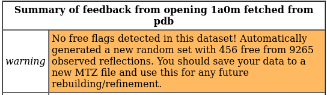

In crystallographic model building it is standard practice to leave a random
selection of measured reflections (typically 5% or 2000 reflections, whichever
is lower) as a guard against overfitting (see `Brunger, 1992`__). While it is
now standard practice for structure factors deposited to the wwPDB to include
the free reflections used by the original modellers, this was not always the
case. When no free flags are found a fresh set will be created for you - in
such cases you should follow the advice in this warning and immediately save
a fresh MTZ file incorporating these:

__ https://www.nature.com/articles/355472a0

`save ~/Desktop/1a0m.mtz #1`__

__ cxcmd:save\ ~/Desktop/1a0m.mtz\ #1

*(OPTIONAL: personally I prefer to work with a white background. If you're
the same, you can change it using ChimeraX's icons in the "Home" tab at top,
or with the following command. You can also change it permanently using 
Favorites/Settings on the ChimeraX menu.)*

`set bgColor white`__

__ cxcmd:set\ bgColor\ white

Now, zoom in by **scrolling** the mouse, and let's go ahead and look at the
model you just opened.

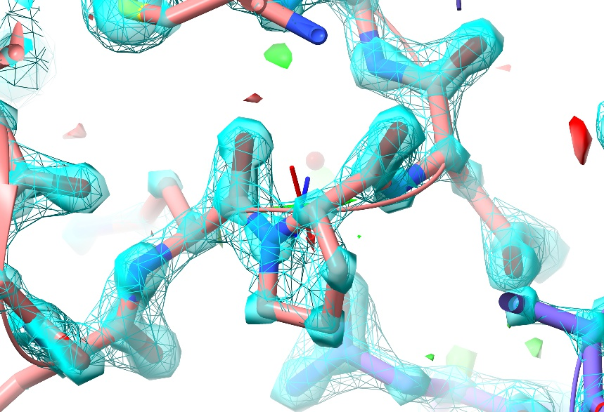

As you can see, at this resolution (almost) every non-hydrogen atom has its own
distinct, clearly-differentiated "blob" of density - that is, the map shows you
precisely where each individual atom belongs, and any errors in the model tend
to be quite clear (and have equally clear solutions).

In this particular case, there **are** no real errors in the model - as one
would hope given the resolution! While ultra-high-resolution models like this
aren't really what ISOLDE was designed for, this one makes for a nice "toy" to
play with while learning the controls.

Getting around
~~~~~~~~~~~~~~

While zoomed in, you'll notice a small set of axes displayed in the middle of
the screen:

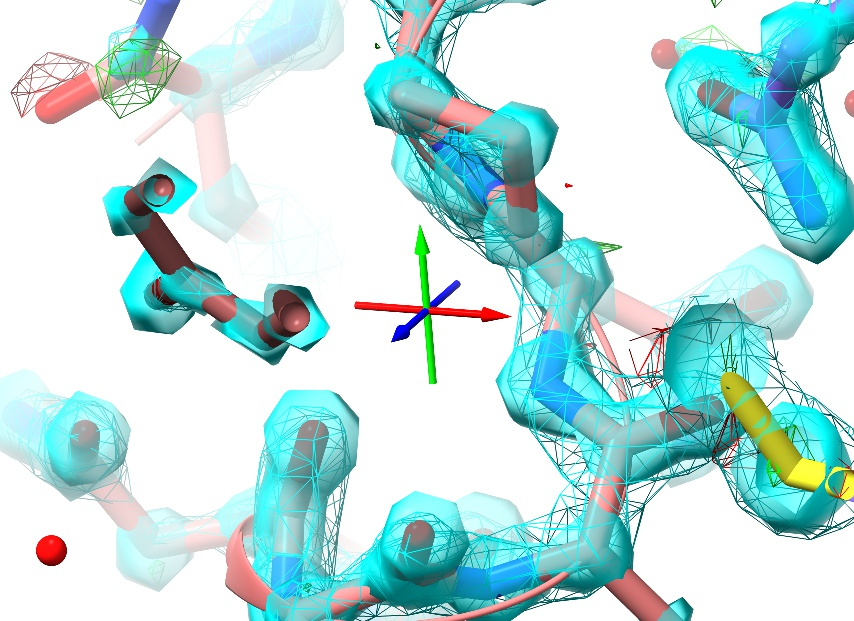

This is the pivot indicator marking the centre of rotation, and is useful as a
reference point for certain tasks. The colours represent the three primary axes:
red=x, green=y, blue=z.

When you zoom, the distance between the near and far clipping planes
automatically grows and shrinks to provide depth cueing and reduce distracting
clutter. If you need to adjust this, you can do so with **shift-scroll**.

Now, scroll out to a comfortable distance, and try panning. You have two options
here: if you are using a wired mouse, just **click and drag with the middle
mouse button**. For touchpad users without a middle-button equivalent, use
**shift-left-click-and-drag**. To move the centre of rotation in the Z direction
(that is, towards or away from you) use **ctrl-middle-click-and-drag**.

You'll hopefully notice a few things:

1. Wherever you go, you're surrounded by a sphere of density and displayed
   atoms. This is the default navigation mode in ISOLDE. The radius of the
   sphere can be controlled using the ISOLDE GUI (more on that in a bit) or
   using a command like `clipper spotlight radius 15`__

__ cxcmd:clipper\ spotlight\ radius\ 15

2. Zoom out until you have a clear border all around the displayed atoms, then
   pan the mouse to the left. As you go, you'll see a single cartoon start to stand out
   from the rest:

   .. figure:: images/separate_asu.jpg

   This is the **actual** model, which is always displayed in this mode -
   everything else is "ghost" drawings of the symmetry atoms (identifiable by
   their darker colour relative to the primary model). While you can't interact
   directly with these, hovering over any symmetry atom will bring up a tool-tip
   giving its identity and symmetry operator, and double-clicking on one will 
   re-centre your view on the equivalent "real" atom. 

Adjusting your maps
~~~~~~~~~~~~~~~~~~~

When you load a model with structure factors, the Clipper plugin generates three
maps: a standard 2mFo-DFc map; a second 2mFo-DFc map with either sharpening or
smoothing applied depending on resolution (maps better than 2.5Å are smoothed,
lower resolutions are sharpened); and a mFo-DFc map. The sharpest of the
2mFo-DFc maps is displayed as a transparent cyan surface, and the other as cyan
wireframe. The sharper map gives the best detail in the well-resolved portions of
the model, while the smoother one is better at revealing connectivity in poorly-
resolved regions where sharp maps are often dominated by noise and difficult to
interpret.

The difference map is shown as green and red wireframes for the
positive and negative contours respectively.

On loading, contour levels are automatically chosen that are generally good for
visualising the majority of the model - but you will of course need to adjust
them from time to time. You can contour a given map using **alt-scroll**, and
choose the map you wish to contour using **ctrl-scroll**.

In many cases (particularly when working in low-resolution maps) you may wish
to focus on some extended selection, where the default "sphere of density" view
becomes impractical. You can expand and mask the map to cover any arbitrary
selection using the **clipper isolate** command. For example:

`clipper isolate #1/A&protein`__

__ cxcmd:clipper\ isolate\ #1/A&protein

... should give you something like this:

.. figure:: images/isolate_A.jpg

More specific selections can be specified using ChimeraX's very powerful
`atomspec`__ syntax.

__ help:user/commands/atomspec.html

You can further tweak the results using various optional arguments. To see the
available options, use `usage clipper isolate`__ and check the Log window.

__ cxcmd:usage\ clipper\ isolate

Once you're done, go back to the scrolling-sphere mode using `clipper spotlight`__.

__ cxcmd:clipper\ spotlight

Running your first simulation
~~~~~~~~~~~~~~~~~~~~~~~~~~~~~

Let's go ahead and start ISOLDE. You can do this from the menu
(**Tools/General/ISOLDE**) or by simply running the command `isolde start`__.

__ cxcmd:isolde\ start

A dialog box will pop up, notifying you that this model contains alternate conformers,
and asking if you wish to remove them. In most of ISOLDE's current use cases (where you 
may be making large changes to parts of the model) it is advisable to do so - 
currently there is no visible indicator of their presence, and ISOLDE will make **no**
attempt to ensure that a given region remains structurally sensible relative to an 
alternate.

The next thing you may notice that all the C-alpha atoms in the model have suddenly turned
into green spheres:

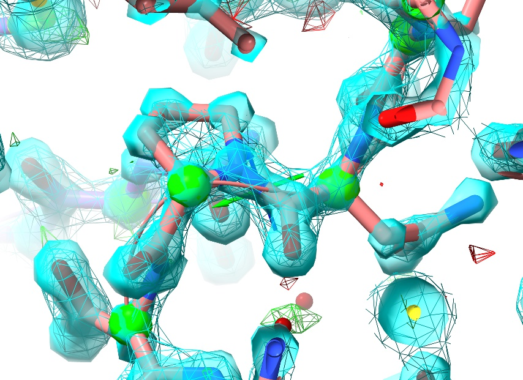

This is one example of ISOLDE's real-time model validation, indicating each
residue's Ramachandran score (that is, the prior probability of the backbone
"twist"  around that residue). You can read more about this `here`__.

__ ../../../tools/gui/getting_started.html

If for any reason you wish to turn off display of any of ISOLDE's validation
or restraint markup, you can do so via the Models panel:

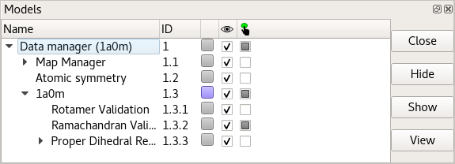

Just expand the drop-down list under the atomic model, and click the relevant
checkbox under the eye icon. I would recommend against this in most cases,
though: the information provided by the validation markup becomes very useful in
guiding rebuilding, and there is nothing quite as frustrating as fighting
against what turns out to be a restraint that you've hidden! If you wish, you
can tell ISOLDE to show Ramachandran C-alpha markup for only non-favoured
residues using the command:

`rama showFavored false`__

__ cxcmd:rama\ showFavored\ false

... but personally, I prefer to keep them present. If you're the same, put them
back with:

`rama showFavored true`__

__ cxcmd:rama\ showFavored\ true

Before we actually get things moving, it's worth considering some of the
strengths and pitfalls of molecular dynamics methods. Unlike minimisation using
`traditional Engh and Huber restraints`__, molecular dynamics attempts to
realistically model **all** atomic interactions (including the van der Waals and
electrostatic forces between non-bonded atoms) according to Newton's laws of
motion. In most ways this is extremely useful (as we will see), but the results
can be problematic when it comes to very small ligands such as water molecules
and monoatomic ions. In the absence of any explicit bonds to their neighbours,
they can be prone to "wandering". For this reason, ISOLDE provides a command
allowing you to add explicit restraints to all small ligands in the model:

__ http://journals.iucr.org/a/issues/1991/04/00/li0061/

`isolde restrain ligands #1`__

__ cxcmd:isolde\ restrain\ ligands\ #1

.. figure::images/restrain_ligands.jpg

**(NOTE: Validation and restraint markups are only drawn for real atoms, not
their symmetry ghosts.)**

By default, polar ligand atoms will receive distance restraints (represented by
a cyan bar) to all other polar atoms within 4Å, and ligand residues with fewer
than four distance restraints will be supplemented with position restraints
(represented by a yellow pin). Note that these restraints are defined by the
starting geometry (that is, they make no attempt to impose ideal geometry on the
model), but are soft enough to allow substantial relaxation. Individual
restraints can also be added, adjusted or removed using tools on ISOLDE's
"Rebuild" tab.

There is one more task we need to do before starting our first simulation:
adding hydrogens. Like most molecular dynamics methods, ISOLDE requires residues
to be chemically complete (with a few exceptions: "bare" N- and C-termini and
sidechain truncations are permitted). ChimeraX's *AddH* command typically does a
great job of adding hydrogens. Just run:

`addh`__

__ cxcmd:addh

By default, non-polar atoms are hidden, since these generally aren't very interesting
and tend to clutter up what is already quite a complex scene. If you really want to 
show them at any time, you can use:

`show HC`__

__ cxcmd:show\ HC

\... and hide them again with:

`hide HC`__

__ cxcmd:hide\ HC

If you forget to add hydrogens before attempting to run a simulation, it's not the
end of the world. ISOLDE will bring up an error dialog like this:

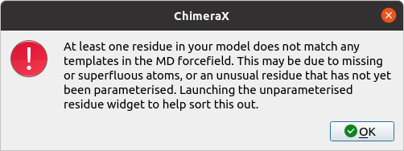

\... and then, after clicking OK:

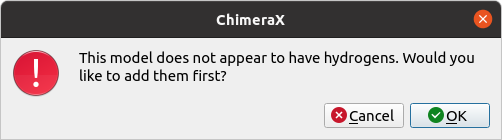

If you receive this error **after** adding hydrogens, stop and carefully inspect
the offending residue with the aid of the Unparameterised Residues widget. Let's 
force the issue, by deliberately deleting the hydrogens from a single residue:

`del /A:11&H`__

__ cxcmd:del\ /A:11&H

Go to ISOLDE's Validate tab, click the "Unparameterised Residues" button to expand the
widget, and click "Update" at the bottom right. Click on the entry that appears in the 
top table. The result should look something like this:

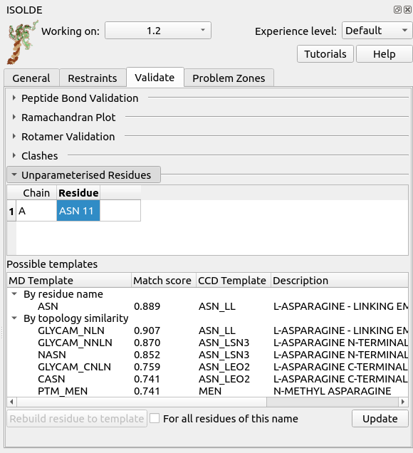

Here, the top table lists the problematic residues, while the bottom table lists 
all the MD templates ISOLDE thinks might match the currently-selected residue 
either due to name or to similar topology. In this case, the correct match is of 
course "ASN" - click that, then click "Rebuild residue to template" to fix the problem.

If there are no entries in the Possible Templates table, or no entries make sense to 
you, then it is likely that you are working with a new chemical species that ISOLDE 
doesn't know about. In this case, all is not necessarily lost - if your problem ligand
is (a) not covalently bound to anything else, and (b) made up only of the elements 
C, H, N, O, S, P, F, Cl, Br, and/or I, then you should be able to parameterise it using 
the "Residue Paramterisation" tool on ISOLDE's General tab. We won't talk further about 
that here, other than to say that when using this tool it is up to you to make sure the 
ligand is chemically correct first (all hydrogens present and in the right places, paying 
particular attention to protonation states of acidic and basic groups).

If you have a ligand or residue in your model which *doesn't* fit the above description,
then I'm afraid that handling it is currently outside the scope of ISOLDE's capabilities.
That shouldn't necessarily stop you, though - this is one of the scenarios the
`isolde ignore`__ command was made for, allowing you to exclude some portions of your 
model from simulations.

__ help:user/commands/isolde.html#ignore

Anyway, in this case the simple **addh** command "just works" - so let's go
ahead and get the simulation moving. First, select the whole model:

`select #1`__

__ cxcmd:select\ #1

\... and either click ISOLDE's blue "play" button (at the left of ISOLDE's ribbon 
menu at the top of the ChimeraX screen) or use the command:

`isolde sim start sel`__

__ cxcmd:isolde\ sim\ start\ sel

**(NOTE: you do not HAVE to select the entire model to start a simulation in
ISOLDE. As long as you have at least one atom selected, it will create a
simulation with sufficient scope to encompass your region of interest surrounded
by a soft "buffer zone" giving it freedom to work. In large models you should
expect to spend most of your time in such "mini-simulations", but - particularly
at low resolutions - you should always run at least one "whole model" simulation
to give any clashes and other very-high-energy states a chance to relax.)**

After a few seconds, you should see your atoms start jiggling and the maps begin
to regularly update. When working with crystallographic structure factors in
ISOLDE, every change to the atomic coordinates, B-factors or occupancies
triggers an automatic recalculation of structure factors, maps and R-factors.
A running summary of the current R-factors is provided in the status bar at
bottom right.

Interacting with the model
~~~~~~~~~~~~~~~~~~~~~~~~~~

Now, try tugging on an atom using the right mouse button.

.. figure:: images/tugging.jpg

*(NOTE: Non-polar hydrogens are not tuggable in ISOLDE. Polar hydrogens may be
tugged, but in order to avoid instability the applied force will be much weaker
than that applied to heavy atoms. While tugging on a hydrogen can be useful for
adjusting the H-bonding of a hydroxyl group or water (for example), to make any
larger changes you should choose a heavier atom to pull.)*

This should result in something like the above. There are a few things to note
here:

* The change in the maps (the large red blob around the sulphur atom, and the
  green blob where it **used** to be) is clearly telling you this is wrong
  (quite apart from the R-factors, which in this case have spiked from about
  0.19 to around 0.26);
* Tugging on the sulphur has had a knock-on effect on the adjacent Asn sidechain
  (top) - to re-iterate, in ISOLDE, all atoms feel each other.

You might wonder how the changes you see in the map affect the forces felt by the 
model. In short: every time the instantaneous R-work drops below the previous best 
value seen in the current simulation, the corresponding map is automatically 
used to update the fitting potential. 

Unless you've done something particularly drastic, upon releasing the tugging
force the model should snap back into place. In my case, here's the model ~5
seconds later, with Rwork/Rfree back at 0.185/0.194:

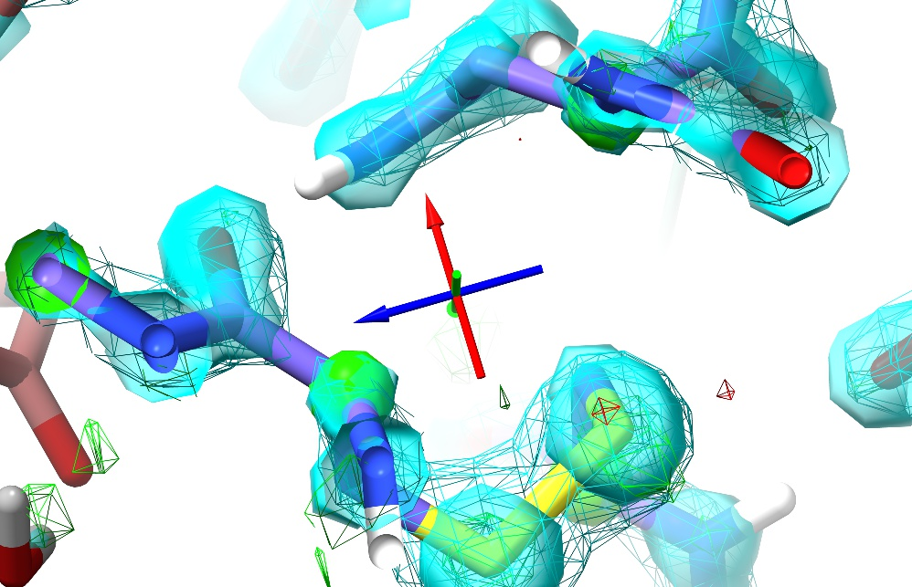

The right mouse button is automatically mapped to this "tug single atom" mode
every time a simulation is started. At the right of ISOLDE's ribbon menu you
will find three buttons allowing you to switch between this and "tug residue" or
"tug selection". These modes are primarily useful at much lower resolutions than
this model.

General model controls
~~~~~~~~~~~~~~~~~~~~~~

You may have noticed that ISOLDE's blue play button has changed into a red pause
symbol. Go ahead and click this to pause the simulation while we explore some of
the other available controls.

First, go to ISOLDE's General tab and click the "Dynamic Crystallographic Map Settings"
button to expand that widget:

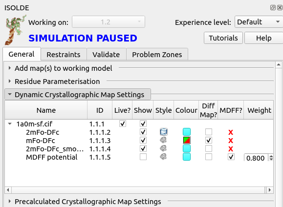

This gives you a listing of all "dynamic" maps (that is, those that are actively 
recalculated from the experimental reflection data) associated with the model, 
along with tools to adjust their behaviour. To get more information about each 
column, hover your mouse over the column title to bring up a brief tooltip.

Notice at the bottom, the map called "MDFF potential". This defines the potential 
actually used for fitting in simulations, and is hidden by default. If you were to 
show it, it would actually look very similar to the displayed 2mFo-DFc maps, but 
there is one crucial difference: this map does not include contributions from the 
free reflections. That is very important, and is the reason why setting the other 
maps as MDFF potentials is not permitted - including the free reflections in the 
fitting potential would invalidate Rfree as a safeguard against overfitting.

On the far right of the MDFF potential line, you'll see a number under the
heading "Weight". As the name suggests, this defines how strongly the potential
pulls on atoms. When loading a new map, ISOLDE automatically chooses a suitable
weighting based on the steepness of the gradients in the voxels immediately
around the model atoms. The chosen weighting is usually quite sensible, but you
may find you want to adjust it at times. This is where you can do that. Click
the play button to get the model moving again, then change the weight to 0.1 and
press return. You should see an immediate change in the model's behaviour: the
atoms will move much more "loosely", more red and green will appear in the
difference map, and the R-factors should increase to 0.24-0.26.

Injection of random positional error like this is one valid way to reduce the
incidence of model bias that may arise due to the fact that we are not using the
original free set. Note that since the fitting potential in a running simulation
is only updated when the R-work drops to a new low, in this case you'll have to
stop the current simulation for the changes to take effect. Clicking the green
"STOP" button at bottom right will stop the simulation and save the
instantaneous coordinates. Now, set the weight back to 0.8, `select the model`__
and start a fresh simulation. You should see the R-factors quickly drop back to
the vicinity of 0.19-0.21. Now, drop the temperature to zero using the slider
near the bottom of the General tab. Wait for the R-factors to settle to constant
values, and hit the green STOP button. 

__ cxcmd:select\ #1

You may choose to continue with the temperature set to zero if you like, but
personally I always prefer to have at least a little thermal motion happening -
if for no other reason that it makes it easy to tell at a glance when a
simulation is actually running! I'd suggest setting the temperature to 20-30K
before continuing.

Now, let's explore the other simulation control buttons. To the
right of the play/pause button you'll see two buttons with a green and red
chequered flag respectively. These are the "checkpoint" controls. Clicking the
green flag will save an instantaneous snapshot of the model as it is right now:
not just the atomic positions, but all currently-active restraints. Go ahead and
click it. Now, do something horrible to your model - just grab an atom and pull
as hard as you can. You should see the map explode into a kaleidoscope of red
and green, and the R-factors shoot up into the 0.4-0.6 range:

.. figure:: images/big_mess.jpg

  Whoops.

Click the red chequered flag to put everything back as it was. This is designed
for the not-uncommon situation where the solution to a particular problem isn't
clear, allowing you to try out various hypotheses without the risk of permanent
damage to the model.

To the right of the chequered flag you'll find two different "STOP" buttons. The
green one you've already used - it stops the simulation and keeps the current
state. The red one discards the simulation entirely, returning the model to the
state it was in at the moment the play button was pressed.

Rebuilding
~~~~~~~~~~

While 1a0m is a useful model for learning to find your way around in ISOLDE,
being very high-resolution and close to error-free means there is not really
anything much to rebuild. So, let's close it and move on to a more real-world
task. Make sure you stop you simulation if you haven't already:

`isolde sim stop`__

__ cxcmd:isolde\ sim\ stop

... then close the model:

`close #1`__

__ cxcmd:close\ #1

The model we'll be looking at now is 3io0_, a 3Å model of a small bacterial
shell protein. This is discussed in more detail (including a video covering the
whole rebuilding process) as a case study `on the ISOLDE website`__.

__ https://isolde.cimr.cam.ac.uk/case-studies/case-study-3io0/

.. _3io0: https://www.rcsb.org/structure/3io0

To load these coordinates you could use "open 3io0 structureFactors true" as we
did for 1a0m, but ISOLDE also keeps a locally cached version with hydrogens
already added and an extraneous water molecule removed. To load it, click `here`__.

__ cxcmd:isolde\ demo\ crystal_intro

First, just have a browse around and compare the general appearance of the
density to what you saw in 1a0m. For example, look at residue ASN187:

`view /A:187`__

__ cxcmd:view\ /A:187

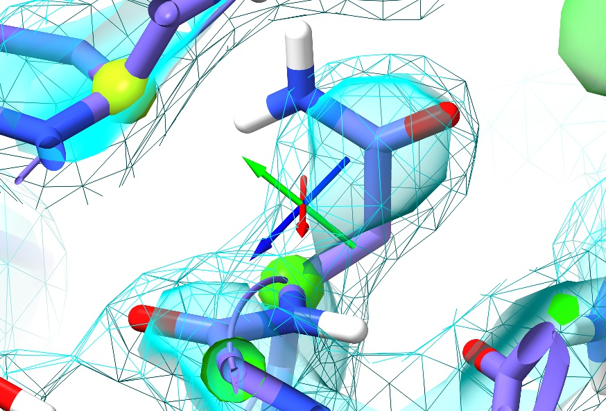

For the sake of comparison, here's an asparagine in a similar environment in
1a0m (residue A9):

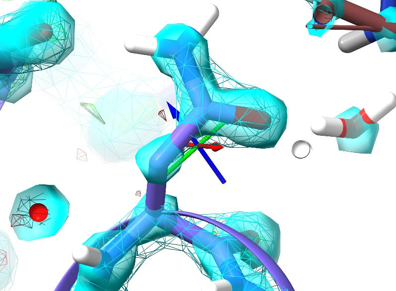

In the high-resolution model, not only is every non-hydrogen atom clearly
resolved but the density even clearly shows the larger atomic radius of the
oxygen compared to the nitrogen. In 3Å density, on the other hand, this detail
is lost: the whole sidechain is reduced to an essentially featureless blob. The
challenge such density poses given traditional restraint schemes is immense:
with only weak guidance from the density itself and none from the non-bonded
interactions with surroundings, finding the *correct* conformation out of all
the possible *incorrect* conformations is, quite simply, hard. It is not
surprising then that models of this resolution have historically been quite
error-prone, and this one is no exception. In fact, a close look at Asn187 in
context with its surroundings suggests it has been built backwards (with the
oxygen occupying the space of the nitrogen and vice versa - look at the
interactions with the peptide bond of Thr303 and the sidechain of Gln199 to see
why).

Anyway, now is a good time to have a look at ISOLDE's "Validate" tab. First,
open up the Ramachandran plot, choose 'All' on the Case(s) drop-down menu, and 
take a look.

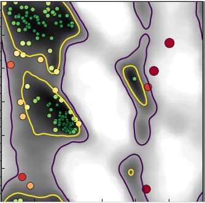

Mostly, this seems quite good, with only 3 outliers in the general case and one
in "Residues preceding proline". Hovering over any point in the plot will pop up
a label with the residue ID, and clicking on it will centre the view on that
residue. Find the outlier at Thr A84 (top right of the General plot) and click
on it.

.. figure:: images/3io0_Thr84.jpg

Hmm. Not only is this a Ramachandran outlier, but the red filled-in "cup"
between adjacent alpha carbons highlights that it's also a non-proline *cis*
peptide bond. These are exceedingly rare in real life, and only occur in
tightly-constrained, well-supported environments (which this isn't). It will
need to be fixed.

\... But first, let's go through the other validation tools. Close the
Ramachandran plot, and show the "Peptide Bond Validation" widget. This provides
a list with all questionable (*cis* or twisted) peptide bonds in the model. In
this case we have seven non-proline *cis* bonds, two severely twisted peptide
bonds, and one *cis* proline (unlike the non-proline case these are actually
reasonably common at about 5% of proline residues). Click through the list and
have a look - while the *cis*-pro looks happy, the rest appear unsupportable and
will have to go.

Next, close the peptide bond widget and open the "Rotamer Validation" widget. Click on
the first outlier in the list (Leu289).

.. figure:: images/3io0_Leu289.jpg

Just like with the backbone Ramachandran conformation, sidechain rotamer
outliers are marked up in real time. Problematic sidechains get the exclamation
mark/spiral motif you see here. The size and colour of the marker will change
depending on severity: a large, pink one like this denotes a severe outlier,
whereas a marginal sidechain will show as a smaller yellow version.

Finally, close the rotamer widget and open the "Clashes" one. Once a simulation
has started (provided that all atoms are mobile) the molecular dynamics
forcefield ensures that clashes become effectively impossible - but the presence
of any severe clashes in the starting coordinates should be a warning sign
suggesting it would be best to run a simulation of the entire model at least
once to resolve them before using more localised simulations to correct the
errors we found above.

Let's go ahead and do that:

`isolde sim start #1`__

__ cxcmd:isolde\ sim\ start\ #1

If you're on a machine with a powerful GPU, this should only take a few seconds,
and a simulation running the entire model will likely be fast enough to work
with, without the need to stop and restart with smaller selections. On slower
hardware, just wait until you see the atoms start moving regularly - this
indicates that the minimisation is complete and clashes are resolved. Once you
hit the green stop button, it will be safe to start a simulation from any
smaller selection. The remainder of the tutorial will assume you're taking the
latter approach - if you are lucky enough to be working with a fast GPU, just
omit the stop/start steps.

Now, let's take care of those *cis* bonds - since these are the most
"unusual" conformations in the model, they seem like a sensible place to start.
If you re-open the "Peptide bond geometry" widget and scroll to the bottom,
you'll see that the twisted peptides have taken care of themselves during the
energy minimisation - ISOLDE assumes that any peptide bond twisted more than 30
degrees from *cis* should probably actually be *trans*, and restrains it as
such.

Click on the top entry in the table. This will select the residue C-terminal to 
the offending bond and focus the display on it. Selecting a single amino acid 
like this also activates the "Peptide Bond" and "Rotamer" sections of ISOLDE's 
ribbon menu. The "Flip cis\<-\>trans" button up there can be used to correct the 
*cis* bond - but more conveniently, the table itself provides a "Flip" button for 
each cis bond it finds. Use whichever option you prefer. If you're not currently 
running a simulation, ISOLDE will automatically start a small local one to do the 
job.

**(NOTE: Most buttons in ISOLDE are only enabled under circumstances where it is
sensible (and safe) to use them. The two different peptide flip buttons, for
example, are only available when your selected atoms are from a single amino
acid residue with a peptide bond N-terminal to it. Similarly, the rotamer
selection buttons are only available when you have selected a non-truncated
amino acid residue with at least one sidechain chi angle.)**

Quite quickly, you should see something like this: 

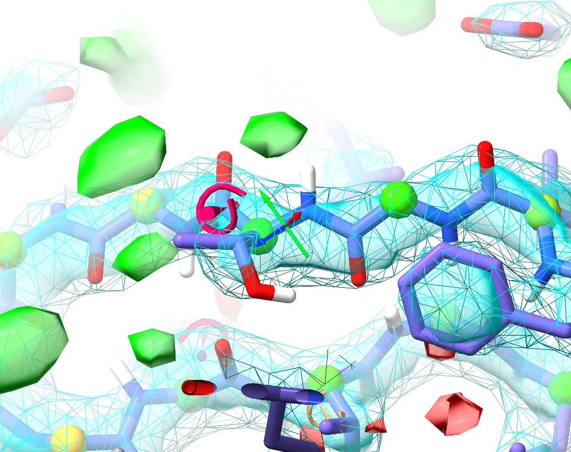

Voila! Not only is the *cis* peptide bond gone, but we've also corrected the
Ramachandran outlier that was here into the bargain. On the other hand, now the
sidechain is showing up as a severe rotamer outlier. Not to worry.

If you've deselected the residue, **ctrl-click** on an atom to select it again.
Find and click the "Preview next" rotamer button in ISOLDE's ribbon menu. This 
will create a preview of the most common rotamer for this residue overlaid on 
the existing coordinates, and show a lable with its name and statistical 
prevalence. Pressing it again will show the next most common rotamer, etc. - but
in this case the first option looks good, with the hydroxyl pointing towards solvent,
the methy pointing into the hydrophobic interface, and agreeing well with the 
density. The two buttons to the right allow you to either directly set the coordinates
of the residue to match the preview, or add torsion restraints to force it towards 
the new conformation from its current state. The former option is fine in the 
majority of cases, but if there's a chance the new conformation will clash with 
surrounding atoms it's best to take the restraints option allowing it to more 
gently "push" its way into position. If you take the latter approach, the final 
("Release") button will, as the name suggests, release the torsion restraints.

Click the "Update" button in the Peptide Bond Validation widget, and click the new
top entry. If you look around a little, you'll see that there are actually *six* non-proline
*cis* bonds in the vicinity, four of which are in tandem in one loop.

.. figure:: images/multi_cis_loop.jpg

Let's make a simulation selection that will cover all of them in one go. There
are a few ways to go about this:

1. **ctrl-shift-click** on any atom to add it to the selection. Keep in mind
   that for each protein atom selected, when starting a simulation ISOLDE will
   automatically expand the selection to encompass its whole residue plus three
   residues forward and back along the chain.

2. Simply take advantage of ChimeraX's selection promotion framework. If you
   have individual atoms selected, pressing the up arrow once will expand the
   selection to whole residues, and up again will further expand it to whole
   secondary structure elements (helices, strands or unstructured stretches).
   Pressing the down arrow will reverse the process. In this case, after
   clicking on the entry in the Peptide bond geometry table the offending
   residue is selected. Make sure the focus is on the main GUI window by left-
   clicking anywhere on the molecule, then press up once to select the whole
   loop with all six *cis* bonds.

3. Use the "Selection Tools" buttons at the bottom of the ISOLDE panel to grow/shrink
   selections by one residue at a time from their ends, or select all currently-
   visible atoms.

Once your selection is to your satisfaction, go ahead and click play to correct
them. A handy way to remember which peptide bond will flip when you click the
ribbon-menu button is to keep in mind that if you've selected an alpha carbon,
the flip will be applied to the nitrogen directly bonded to it. If you
accidentally flip one you didn't mean to, it's typically no big deal - just flip
it right back.

Once these flips are done, You will also most likely find that you need to
adjust the sidechains of Thr150 and Lys151 (although in some cases these correct
themselves once the *cis* bonds are fixed). Also keep in mind that the peptide
oxygen of Gly153 should end up pointing at the Arg148 sidechain - if this isn't
the case in your simulation, try using the "flip peptide bond" button (remember,
it's to the left of the *cis<-->trans* button).

**(NOTE: this form of peptide bond flip can also be applied using the command
"isolde pepflip sel". Both "isolde pepflip" and "isolde cisflip" should be used
with caution: while flipping every peptide bond in your model can certainly be
entertaining, it's not so much fun if you do so by accident.)**

Once you're done, the loop should look something like this:

.. figure:: images/multi_cis_loop_fixed.jpg

The remaining Ramachandran outlier (pink C-alpha) at Asp149 appears to be a
great example of the truism that not all Ramachandran outliers are wrong. In
this case, the conformation not only fits well to the density, but makes perfect
physical sense: the backbone twist is stabilised by charge interactions between
the carbonyl oxygens and two nearby arginine residues (Arg148 in the same chain
and Arg148 in the (y,z,x) symmetry copy), while the Asp149 sidechain is
salt-bridged to Arg120 and further stabilised by two hydrogen bonds. This is
what a Ramachandran outlier *should* look like: lots of energetically-favourable
interactions overcoming the energy penalty associated with the unusual backbone
twist.

You may have noticed some positive (green) difference density in the channel to
the right of this loop (when oriented like the image above), as well. This seems
quite persistent throughout refinement, and may represent some low-occupancy
ligand carried through during purification. At this resolution, though, it seems
impossible to identify without further experimental knowledge.

Anyway, click the "Update" button in the Peptide Bond Validation widget to confirm
that all the non-proline *cis* peptides are gone (if any still remain, fix them). 
Then, hide the "Peptide bond geometry" widget and we can move on.

From here, you could move on to working through the list of rotamer outliers in
a similar manner, but it remains the case that in experimental model building,
human eyes should see each residue in context with its density at least once.
After all, it is entirely possible (and, in fact, quite common) for a model to
find an incorrect conformation that is *not* an outlier by any standard metric
but is nevertheless wrong.

The "isolde stepTo" command makes this easy, allowing you to systematically work 
through your model end-to-end. To make things even easier, let's first run the 
command:

`isolde shorthand`__

__ cxcmd:isolde\ shorthand

\... and take a look at the log. This command defines a number of 2-4 character 
aliases for commands commonly used in ISOLDE. Once you've run it once, you can do:

`st first`__

__ cxcmd:st\ first

\... to jump to the first polymeric residue in your model, followed by simply

`st`__

__ cxcmd:st

\... to move to the next. Try this out for a while, stopping at any questionable
residue (with yellow or pink validation markup, or poor fit to density) to see
if you can improve it. One example I particularly want to highlight is at the
first turn (between Gly87 and Asp88):

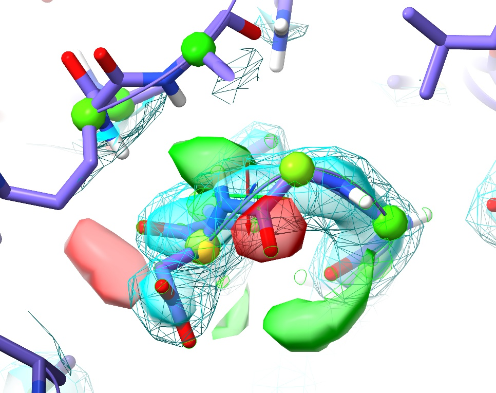

This is a perfect example of why it's important to visually inspect the model.
Here we have no sidechain nor Ramachandran outliers, yet the telltale paired
red and green difference density blobs associated with the peptide oxygen and
nitrogen say that this conformation is unquestionably wrong. Perhaps more
concerning, in the original coordinates before energy minimisation in ISOLDE
there was not even any sign of trouble in the difference density, and only a
practised eye would notice the chemically-infeasible juxtaposition of the
peptide hydrogen with those of Arg120 and Val121:

.. figure:: images/pep_flip_needed_original_coords.jpg

This highlights what I consider to be one of the strengths of the approach
underlying ISOLDE: since the molecular dynamics forcefield is designed to
closely replicate the physical reality of the molecule, it is much less likely
to "fool you" in ways like this. Upon starting a simulation, the electrostatic
repulsion between these positively charged groups pushes the incorrectly
modelled peptide bond out of density, creating a clear red flag indicating
something is wrong. In this case, the remedy is clear: a simple peptide flip
creates two nice hydrogen bonds with the adjacent backbone (visualised here
using ChimeraX's H-bonds tool):

`hbonds #1`__

__ cxcmd:hbonds\ #1

.. figure:: images/pep_flipped.jpg

In addition, it places the backbone back in density (no more difference blobs),
and as a bonus converts the slightly-marginal Ramachandran case at Asp88 into a
favoured one. Don't forget to hide the H-bonds display:

`~hbonds`__

__ cxcmd:~hbonds

This covers most of the "workhorse" tools you're likely to use for day-to-day
work with models in medium-low resolution density with ISOLDE. Continue on
through the rest of the model at your leisure. After some practice, I've found
that I can improve this model to a MolProbity score below 1.0 in under 20
minutes (you can check for yourself using the MolProbity server_ or, if you have
it installed, *phenix.molprobity*). If you want to refine and/or check your work
using another package (recommended for any serious work: for a start, ISOLDE
currently does not attempt to refine atomic B-factors), you can save your model 
and data at any time using the following commands.

.. _server: http://molprobity.biochem.duke.edu/

`save ~/Desktop/isolde_tutorial.pdb #1`__

__ cxcmd:save\ ~/Desktop/isolde_tutorial.pdb\ #1

`save ~/Desktop/isolde_tutorial.mtz #1`__

__ cxcmd:save\ ~/Desktop/isolde_tutorial.mtz\ #1

If you have Phenix installed, you can prepare input files for it with my recommended
refinement settings with:

*isolde write phenixRef #1*

This is not a clickable command in the tutorial, since that would write the resulting 
files into the **tutorial** directory rather than your current working directory. The 
command provides various extra options - do

`usage isolde write`__

__ cxcmd:usage\ isolde\ write

\... for more details.

